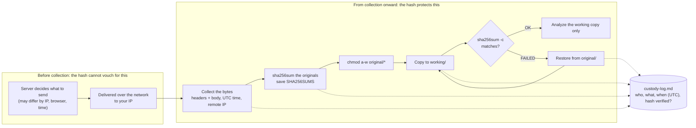

# Day 2: Evidence discipline, from collection to custody log

Phase: 1. Foundations · Track goal: Collect a piece of digital evidence so that anyone can later confirm what you collected, when, from where, and that it has not changed since.

## Concept
Digital evidence is easy to copy and easy to alter, and a copy is indistinguishable from the original unless you recorded something about it at the moment you collected it. Evidence discipline is the habit of recording that something every time.

Four things go into the record. A cryptographic hash (SHA-256) is a fingerprint of the exact bytes; if one byte changes, the hash changes completely. A UTC timestamp fixes when you collected it; local time is ambiguous across time zones and daylight-saving changes, and two investigators in different cities will otherwise disagree about the order of events. The source says where the bytes came from (the URL, the device, the export screen) and how you obtained them. The custody log records every person and system that handled the item afterwards.

Be precise about what a hash proves. It proves the file you hold today is identical to the file you hashed at collection time. It does not prove the server sent you truthful content, and it does not prove the content was never edited before you got it. Phishing kits routinely serve different pages to different visitors, so your capture shows what the server sent to you, at that time, from your IP address and browser. Write your conclusions to match.

Order matters too. RFC 3227 describes collecting in order of volatility: capture what disappears first (memory, live network connections, a web page that could be taken down in an hour) before what persists (a disk, an archived log). Never work on your only copy. Hash the original, make a working copy, confirm the working copy has the same hash, and analyze the copy.

A screenshot alone is weak evidence. It is an image of a rendering, with no headers, no source HTML, and nothing in it that a court or a colleague can verify against the server. Take screenshots for your report, but collect the underlying bytes as well.

The hash protects everything from the collection step onward and says nothing about what happened before it. Every step after collection also writes a line to the custody log.



## Resources
- [RFC 3227: Guidelines for Evidence Collection and Archiving](https://www.rfc-editor.org/rfc/rfc3227). Section 2.1 (order of volatility) and section 2.4 (legal considerations) are the parts to read.
- [NIST SP 800-86: Guide to Integrating Forensic Techniques into Incident Response](https://csrc.nist.gov/pubs/sp/800/86/final). Read section 3 on the collection, examination, analysis, and reporting phases.
- [GNU coreutils: sha256sum](https://www.gnu.org/software/coreutils/manual/html_node/sha2-utilities.html) and [PowerShell Get-FileHash](https://learn.microsoft.com/en-us/powershell/module/microsoft.powershell.utility/get-filehash) for the command on each platform.
- [Internet Archive Save Page Now](https://web.archive.org/save): an independent third-party capture you can cite alongside your own.

## Practical: curl and sha256sum, producing an evidence folder and a completed custody log
You will collect a public web page from a public organization (use `https://www.iana.org/help/example-domains`, which IANA publishes for exactly this kind of exercise) and document it as if it were case evidence.

**Your checklist for today.** Work through these in order, and check each one off as you finish it:

- [ ] Step 1: set up the case folder
- [ ] Step 2: collect headers and body in one request
- [ ] Step 3: hash the originals and lock them
- [ ] Step 4: make the working copy and prove it matches
- [ ] Step 5: corroborate with a third party
- [ ] Step 6: fill in the custody log
- [ ] Step 7: test the tripwire

### Step 1: set up the case folder
```bash
mkdir -p ~/cases/P1-D02/{original,working,notes}
cd ~/cases/P1-D02
```

### Step 2: collect headers and body in one request
```bash
date -u +%Y-%m-%dT%H:%M:%SZ | tee notes/collection-start.txt
curl -sS -L \
  -A "Mozilla/5.0 (X11; Linux x86_64) evidence-collection/P1-D02" \
  -D original/headers.txt \
  -o original/page.html \
  -w 'final_url=%{url_effective}\nhttp_code=%{http_code}\nremote_ip=%{remote_ip}\nsize=%{size_download}\n' \
  https://www.iana.org/help/example-domains | tee notes/transfer.txt
```
`-D` saves every response header, `-w` records the final URL, status code, and the server IP you actually connected to, and `-A` labels your requests so they are identifiable in the server's logs.

Illustrative output (your IP and size will differ):
```
2026-03-10T14:22:07Z
final_url=https://www.iana.org/help/example-domains
http_code=200
remote_ip=192.0.2.80
size=7431
```

If you have `wget` installed, you can also save a WARC file, the archival format the Internet Archive uses, which stores requests and responses together:
```bash
wget --warc-file=original/page --page-requisites --no-verbose \
  -P original/wget https://www.iana.org/help/example-domains
```

### Step 3: hash the originals and lock them
```bash
cd original
sha256sum headers.txt page.html > ../notes/SHA256SUMS      # Linux
# macOS:   shasum -a 256 headers.txt page.html > ../notes/SHA256SUMS
# Windows: Get-FileHash -Algorithm SHA256 .\headers.txt, .\page.html
cd ..
chmod a-w original/*
cat notes/SHA256SUMS
```
Illustrative output:
```
4f1c0d6e8a...e21b  headers.txt
9b7a33c1f0...0c4d  page.html
```

### Step 4: make the working copy and prove it matches
```bash
cp original/* working/
cd working && sha256sum -c ../notes/SHA256SUMS && cd ..
```
You should see `headers.txt: OK` and `page.html: OK`. From here on you only open files in `working/`.

### Step 5: corroborate with a third party
Submit the same URL to `https://web.archive.org/save`. Copy the resulting snapshot URL (it has the form `https://web.archive.org/web/20260310142301/https://www.iana.org/help/example-domains`) into your notes. An archive capture made by someone other than you is useful corroboration when your own capture is questioned.

### Step 6: fill in the custody log
Create `notes/custody-log.md`:

```markdown
# Evidence custody log: P1-D02

| Item | Description | Source | Collected (UTC) | Collected by | Method | SHA-256 | Stored at |
|---|---|---|---|---|---|---|---|
| E1 | HTTP response headers | https://www.iana.org/help/example-domains (remote IP from transfer.txt) | | | curl 8.x, command in notes/ | | original/headers.txt |
| E2 | Page HTML | same | | | same | | original/page.html |
| E3 | Third-party capture | Wayback Machine | | Internet Archive | Save Page Now | n/a (URL recorded) | notes/wayback.txt |

## Handling events
| Time (UTC) | Item | Action | By | Hash verified? |
|---|---|---|---|---|
| | E1, E2 | Collected, hashed, set read-only | | yes |
| | E1, E2 | Copied to working/ | | yes (sha256sum -c OK) |
```

Fill in every blank from your own terminal output. Do not round times or retype hashes by hand; paste them.

### Step 7: test the tripwire
Open `working/page.html`, change one character, save, and run `sha256sum -c ../notes/SHA256SUMS` from `working/` again. You should see `page.html: FAILED`. Restore the working copy from `original/` and record both events in the handling table.

## Checkpoint
Your artifact is the `~/cases/P1-D02` folder. It passes when:

- Every file in `original/` is read-only.
- The hashes of the files in `original/` match `notes/SHA256SUMS` exactly.
- `notes/custody-log.md` has no empty cells.
- Every time in `notes/custody-log.md` is UTC with a trailing `Z`.
- The handling table includes the deliberate tamper test.
- The handling table includes the restore.
- `notes/transfer.txt` records the remote IP, so you can say which server answered.
- You can explain in two sentences what the hash proves and what it does not prove about the page.
