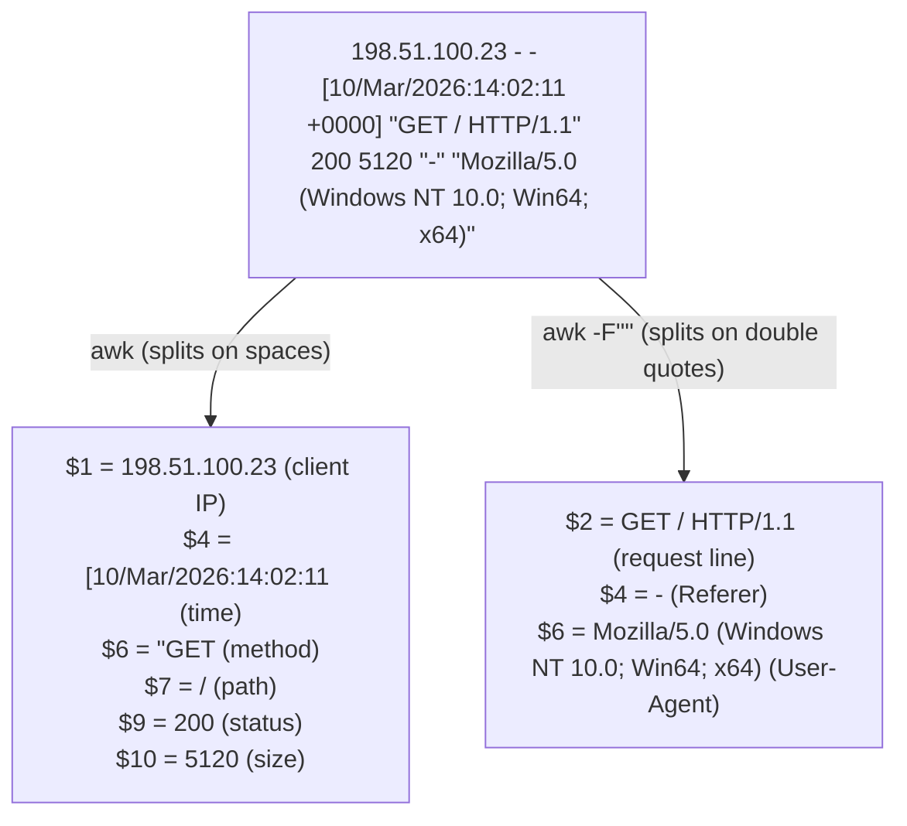
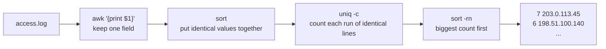
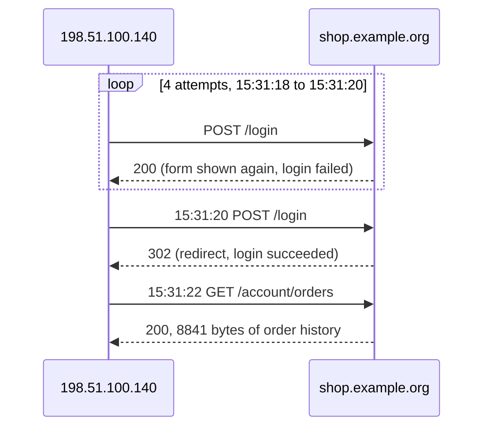

# Day 11: Web log triage with grep, awk, and sed

Phase: 1. Foundations · Track goal: Take a raw web server access log and, in under fifteen minutes, produce a ranked summary of who did what, when, and which lines deserve a closer look.

## Concept
Web server access logs are among the most common evidence you will be handed, and they often arrive as a plain text file with no tooling around it. `grep`, `awk`, `sed`, `sort`, and `uniq` are installed on every Linux and macOS machine, run on files of any size, and leave the original untouched. Learn them before any log platform, because the platform will not always be available.

Apache and nginx both default to the "combined" log format:
```
198.51.100.23 - - [10/Mar/2026:14:02:11 +0000] "GET / HTTP/1.1" 200 5120 "-" "Mozilla/5.0 (Windows NT 10.0; Win64; x64)"
```
Split on spaces, the fields `awk` sees are: `$1` client IP, `$4` the timestamp with a leading `[`, `$6` the method with a leading quote, `$7` the path, `$9` the status code, `$10` the response size. Split on double quotes instead (`awk -F'"'`), `$2` is the whole request line, `$4` the Referer, and `$6` the User-Agent. Knowing both splits covers most questions.

The same line, split both ways:



Each tool has its own job. `grep` selects lines. `awk` selects fields and does arithmetic and conditions. `sed` rewrites text, usually to extract one piece of a line. `sort | uniq -c | sort -rn` is the idiom for "count and rank," and you will type it hundreds of times.

Each stage of that idiom does one small job:



In triage you are looking for shapes, not reading every line. A single IP hitting many paths that return `404` in a few seconds is automated discovery. Paths containing `../` or its URL-encoded form `%2e%2e%2f` are path-traversal attempts. Repeated `POST /login` from one source, ending in a `302` redirect, can be a password guess that finally worked. A sudden burst of `500` errors can mean something broke, or that someone found input that breaks it. A non-browser User-Agent such as `python-requests` or `curl` marks a script, though attackers can set any User-Agent they like, so the absence of one proves nothing.

The client IP in these logs is whatever connected to the web server. If a CDN, load balancer, or reverse proxy sits in front of it, `$1` is the proxy's address and the real client is in a header such as `X-Forwarded-For`, but only if the server was configured to log it. Check which situation you are in before you draw any conclusion about sources.

## Resources
- [Apache HTTP Server: Log Files](https://httpd.apache.org/docs/2.4/logs.html), the definition of the combined format and its `%` codes.
- [nginx: ngx_http_log_module](https://nginx.org/en/docs/http/ngx_http_log_module.html).
- [The GNU Awk User's Guide](https://www.gnu.org/software/gawk/manual/gawk.html), chapters 4 (reading input and fields) and 7 (patterns and actions).
- [Sed, An Introduction and Tutorial](https://www.grymoire.com/Unix/Sed.html) by Bruce Barnett.
- [OWASP: Path Traversal](https://owasp.org/www-community/attacks/Path_Traversal), for what the traversal lines are trying to do.

## Practical: grep, awk, and sed, producing a web log triage sheet with an hourly activity histogram

**Your checklist for today.** Work through these in order, and check each one off as you finish it:

- [ ] Step 1: save the sample log
- [ ] Step 2: the first five questions
- [ ] Step 3: the login question
- [ ] Step 4: reshape lines with sed
- [ ] Step 5: the hourly histogram
- [ ] Step 6: fill the triage sheet

### Step 1: save the sample log
Create `~/lab/day11/access.log` with the following. It is a fictional shop at `shop.example.org`, and every client address is from a documentation range.
```
198.51.100.23 - - [10/Mar/2026:14:02:11 +0000] "GET / HTTP/1.1" 200 5120 "-" "Mozilla/5.0 (Windows NT 10.0; Win64; x64)"
198.51.100.23 - - [10/Mar/2026:14:02:12 +0000] "GET /static/app.css HTTP/1.1" 200 1834 "https://shop.example.org/" "Mozilla/5.0 (Windows NT 10.0; Win64; x64)"
192.0.2.77 - - [10/Mar/2026:14:05:40 +0000] "GET /login HTTP/1.1" 200 2210 "-" "Mozilla/5.0 (Macintosh; Intel Mac OS X 14_4)"
192.0.2.77 - - [10/Mar/2026:14:05:52 +0000] "POST /login HTTP/1.1" 302 0 "https://shop.example.org/login" "Mozilla/5.0 (Macintosh; Intel Mac OS X 14_4)"
203.0.113.45 - - [10/Mar/2026:15:10:03 +0000] "GET /wp-login.php HTTP/1.1" 404 512 "-" "python-requests/2.31.0"
203.0.113.45 - - [10/Mar/2026:15:10:03 +0000] "GET /.env HTTP/1.1" 404 512 "-" "python-requests/2.31.0"
203.0.113.45 - - [10/Mar/2026:15:10:04 +0000] "GET /admin/config.php HTTP/1.1" 404 512 "-" "python-requests/2.31.0"
203.0.113.45 - - [10/Mar/2026:15:10:04 +0000] "GET /index.php?page=../../../../etc/passwd HTTP/1.1" 400 312 "-" "python-requests/2.31.0"
203.0.113.45 - - [10/Mar/2026:15:10:05 +0000] "GET /index.php?page=%2e%2e%2f%2e%2e%2fetc%2fpasswd HTTP/1.1" 400 312 "-" "python-requests/2.31.0"
203.0.113.45 - - [10/Mar/2026:15:10:05 +0000] "GET /.git/config HTTP/1.1" 403 290 "-" "python-requests/2.31.0"
198.51.100.140 - - [10/Mar/2026:15:31:18 +0000] "POST /login HTTP/1.1" 200 2290 "-" "Mozilla/5.0 (X11; Linux x86_64)"
198.51.100.140 - - [10/Mar/2026:15:31:19 +0000] "POST /login HTTP/1.1" 200 2290 "-" "Mozilla/5.0 (X11; Linux x86_64)"
198.51.100.140 - - [10/Mar/2026:15:31:19 +0000] "POST /login HTTP/1.1" 200 2290 "-" "Mozilla/5.0 (X11; Linux x86_64)"
198.51.100.140 - - [10/Mar/2026:15:31:20 +0000] "POST /login HTTP/1.1" 200 2290 "-" "Mozilla/5.0 (X11; Linux x86_64)"
198.51.100.140 - - [10/Mar/2026:15:31:20 +0000] "POST /login HTTP/1.1" 302 0 "-" "Mozilla/5.0 (X11; Linux x86_64)"
198.51.100.140 - - [10/Mar/2026:15:31:22 +0000] "GET /account/orders HTTP/1.1" 200 8841 "-" "Mozilla/5.0 (X11; Linux x86_64)"
198.51.100.23 - - [10/Mar/2026:16:44:09 +0000] "GET /products/42 HTTP/1.1" 200 6021 "https://shop.example.org/" "Mozilla/5.0 (Windows NT 10.0; Win64; x64)"
192.0.2.77 - - [10/Mar/2026:16:50:31 +0000] "GET /account/orders HTTP/1.1" 200 8120 "https://shop.example.org/" "Mozilla/5.0 (Macintosh; Intel Mac OS X 14_4)"
203.0.113.45 - - [10/Mar/2026:17:02:44 +0000] "GET /server-status HTTP/1.1" 403 290 "-" "python-requests/2.31.0"
198.51.100.23 - - [10/Mar/2026:17:15:00 +0000] "GET /cart HTTP/1.1" 500 1024 "https://shop.example.org/products/42" "Mozilla/5.0 (Windows NT 10.0; Win64; x64)"
```
Hash it (`sha256sum access.log`) and make a working copy. The outputs below come from running each command against this exact file.

### Step 2: the first five questions
Who is busiest?
```bash
awk '{print $1}' access.log | sort | uniq -c | sort -rn
```
```
   7 203.0.113.45
   6 198.51.100.140
   4 198.51.100.23
   3 192.0.2.77
```
What status codes came back?
```bash
awk '{print $9}' access.log | sort | uniq -c | sort -rn
```
```
  10 200
   3 404
   2 403
   2 400
   2 302
   1 500
```
What clients are claimed?
```bash
awk -F'"' '{print $6}' access.log | sort | uniq -c | sort -rn
```
```
   7 python-requests/2.31.0
   6 Mozilla/5.0 (X11; Linux x86_64)
   4 Mozilla/5.0 (Windows NT 10.0; Win64; x64)
   3 Mozilla/5.0 (Macintosh; Intel Mac OS X 14_4)
```
Every client error, with time, source, and path:
```bash
awk '$9 ~ /^4/ {print $4, $1, $9, $7}' access.log | tr -d '['
```
```
10/Mar/2026:15:10:03 203.0.113.45 404 /wp-login.php
10/Mar/2026:15:10:03 203.0.113.45 404 /.env
10/Mar/2026:15:10:04 203.0.113.45 404 /admin/config.php
10/Mar/2026:15:10:04 203.0.113.45 400 /index.php?page=../../../../etc/passwd
10/Mar/2026:15:10:05 203.0.113.45 400 /index.php?page=%2e%2e%2f%2e%2e%2fetc%2fpasswd
10/Mar/2026:15:10:05 203.0.113.45 403 /.git/config
10/Mar/2026:17:02:44 203.0.113.45 403 /server-status
```
Path traversal, in plain and URL-encoded form (`-i` makes it case-insensitive, since `%2E` and `%2e` are equivalent):
```bash
grep -Ei '(\.\./|%2e%2e)' access.log | awk '{print $1, $7}'
```
```
203.0.113.45 /index.php?page=../../../../etc/passwd
203.0.113.45 /index.php?page=%2e%2e%2f%2e%2e%2fetc%2fpasswd
```

### Step 3: the login question
```bash
awk '$6=="\"POST" && $7=="/login" {print $1, $9}' access.log | sort | uniq -c
```
```
   1 192.0.2.77 302
   4 198.51.100.140 200
   1 198.51.100.140 302
```
Laid out in time order, the six lines from `198.51.100.140` read like this:



On this application, a failed login re-renders the form (`200`) and a successful one redirects (`302`). So `198.51.100.140` failed four times in two seconds, succeeded on the fifth attempt, and two seconds later opened `/account/orders`. Five attempts in two seconds is faster than a person types, which points to an automated password guess (or a credential-stuffing tool) that worked. Confirm the success-by-redirect behaviour with the site owner before you rely on it.

### Step 4: reshape lines with sed
Pull out just time, IP, method, path, and status in one pass, which is handy for pasting into a timeline:
```bash
sed -E 's/^([^ ]+) .*\[([^]]+)\] "([A-Z]+) ([^ ]+).*" ([0-9]{3}) .*/\2 \1 \3 \4 \5/' access.log | head -3
```
```
10/Mar/2026:14:02:11 +0000 198.51.100.23 GET / 200
10/Mar/2026:14:02:12 +0000 198.51.100.23 GET /static/app.css 200
10/Mar/2026:14:05:40 +0000 192.0.2.77 GET /login 200
```

### Step 5: the hourly histogram
```bash
awk -F'[][]' '{split($2, t, ":"); print t[1], t[2] ":00"}' access.log \
  | sort | uniq -c \
  | awk '{bar=""; for (i = 0; i < $1; i++) bar = bar "#"; printf "%s %s %3d %s\n", $2, $3, $1, bar}'
```
```
10/Mar/2026 14:00   4 ####
10/Mar/2026 15:00  12 ############
10/Mar/2026 16:00   2 ##
10/Mar/2026 17:00   2 ##
```
`-F'[][]'` splits on either square bracket, so `$2` is the timestamp. Splitting that on `:` gives the date in `t[1]` and the hour in `t[2]`. The 15:00 spike holds both the scanner and the login attack. On a real log covering weeks, the same command becomes a quick activity heatmap by day and hour.

### Step 6: fill the triage sheet
Create `day11-triage.md`:

```markdown
# Web log triage: shop.example.org access.log
Source file SHA-256:
Time range covered (UTC):
Total requests: | Unique client IPs:
Proxy/CDN in front? (is $1 the real client?):

## Ranked findings
| Rank | Source IP | Time range (UTC) | Behaviour | Evidence (command + count) | Confidence | Next step |
|---|---|---|---|---|---|---|

## Hourly activity
(paste the histogram)

## Benign baseline
(which IPs look like ordinary customers, and why)
```
Rank the successful automated login above the scanner. The scanner received only errors; the login attacker reached an account page.

## Checkpoint
Your artifact is `day11-triage.md`. It passes when:

- `day11-triage.md` records the source hash, matching what your commands printed.
- `day11-triage.md` records the time range, matching what your commands printed.
- `day11-triage.md` records the total and unique counts, each matching what your commands printed.
- The ranked findings put `198.51.100.140` first with the evidence "4 × 200 then 1 × 302 on POST /login within 2 s, followed by /account/orders".
- The ranked findings put `203.0.113.45` second with its discovery and traversal paths.
- Each finding names the exact one-liner that produced it, so another analyst can rerun it.
- The benign baseline names `198.51.100.23` and `192.0.2.77`.
- The benign baseline explains why a `500` from an ordinary customer's cart is not, on this evidence, an attack.
