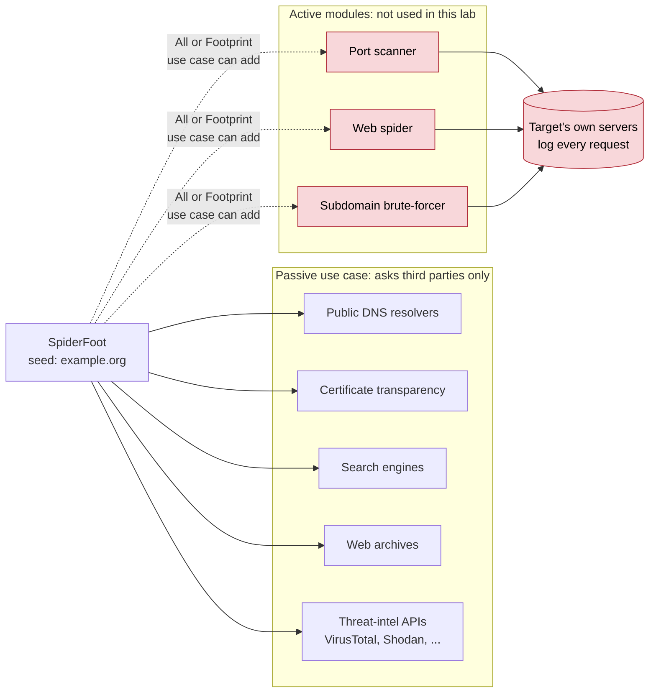
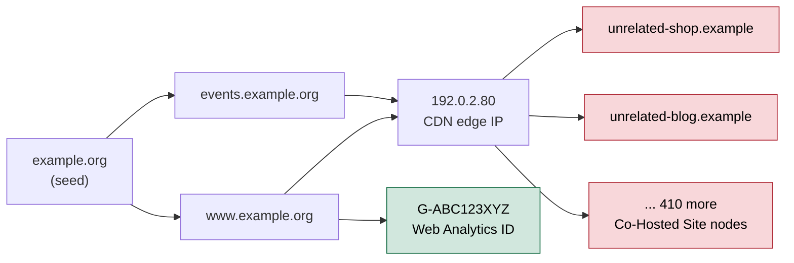

# Day 20: The OSINT cycle, part 2: automated passive collection with SpiderFoot

Phase: 2. OSINT and digital footprint · Track goal: Run an automated, passive-only collection against your Day 19 subject, export it as a graph, and learn to separate real relationships from noise before you trust any of it.

## Concept
Manual collection does not scale past a few dozen data points. Automation tools such as SpiderFoot run many small lookups (DNS, certificate transparency, search engines, archives, threat-intelligence feeds) and chain them: each result becomes the input for the next round. One seed domain can produce several hundred data points in twenty minutes.

That speed has two costs. The first is contact with the target. Some SpiderFoot modules talk directly to the target's servers: port scanners, web spiders, subdomain brute-forcers. That is active reconnaissance, and against a system you are not authorized to test it can breach computer-misuse law and will certainly show up in the target's logs. The scan profile you choose decides this, so you choose it deliberately.



The second cost is noise. Automated chaining follows every edge, including meaningless ones. If the organization's site sits behind a large CDN, "co-hosted sites" returns thousands of unrelated domains that happen to share an edge IP. An analyst who imports that without filtering will report a hub that is really just Cloudflare or Akamai.

Here is how that happens, in miniature. Two real hostnames resolve to one CDN edge IP, and the "co-hosted" module then hangs every other customer of that IP off it. The red nodes are what you will delete in Step 7. The green node is small and specific, which is what a real lead usually looks like.



This day sits between "collect" and "process" in the cycle. SpiderFoot collects; the export and the false-positive pass are processing. The graph you build today feeds the analysis on Day 22.

## Resources
- [SpiderFoot on GitHub](https://github.com/smicallef/spiderfoot) is the open-source version (MIT license). The commercial SpiderFoot HX is a different product; you do not need it.
- [SpiderFoot on Kali](https://www.kali.org/tools/spiderfoot/) ships as a package, the easiest install if you already run Kali.
- [Gephi](https://gephi.org/) is free, open-source graph software that opens SpiderFoot's GEXF export.
- [Gephi quick start (PDF)](https://gephi.org/users/quick-start/) covers the layout, statistics, and appearance panels you will use.

## Practical: SpiderFoot passive scan exported to Gephi: a colored infrastructure graph
**Your checklist for today.** Work through these in order, and check each one off as you finish it:

- [ ] Step 1: install and start SpiderFoot.
- [ ] Step 2: add free API keys (optional).
- [ ] Step 3: configure and run a passive scan.
- [ ] Step 4: read the Summary tab.
- [ ] Step 5: review the Graph tab.
- [ ] Step 6: export the scan as GEXF and CSV.
- [ ] Step 7: build the filtered graph in Gephi.
- [ ] Step 8: write the false-positive table.
- [ ] Step 9: confirm the scan stayed passive.

Step 1: install and start SpiderFoot.

```bash
git clone https://github.com/smicallef/spiderfoot.git
cd spiderfoot
python3 -m venv .venv && source .venv/bin/activate
pip install -r requirements.txt
python3 ./sf.py -l 127.0.0.1:5001
```

On Kali, `sudo apt install spiderfoot` and then `spiderfoot -l 127.0.0.1:5001`. Open `http://127.0.0.1:5001`. Bind to `127.0.0.1`, never `0.0.0.0`: the web UI has no login by default, and anyone on your network could otherwise use it. If dependencies fail on a very new Python release, use the Kali package or an older Python in the virtual environment.

Step 2: add free API keys (optional but worthwhile). Settings lists every module. Several useful ones work only with a key, and many providers offer a free tier: VirusTotal, SecurityTrails, Shodan, AbuseIPDB. Paste each key into its module's settings and click Save Changes. Scans run without keys, with fewer results.

Step 3: configure a passive scan. Click New Scan. Scan Name: `P2-ORG-passive-01`. Scan Target: your Day 19 domain. Under the By Use Case tab choose Passive. SpiderFoot describes Passive as gathering information without touching the target, so it avoids the port scanner and spider modules. Do not choose All or Footprint for this lab: both can include modules that contact the target directly. Click Run Scan Now.

The same scan from the command line, if you prefer to script it:

```bash
python3 ./sf.py -s example.org -u passive -o csv > exports/sf-passive-01.csv
```

`-s` is the target, `-u passive` selects the use case, `-o csv` sets the output format (`tab` and `json` also work).

Step 4: read the Summary tab. When the scan finishes (10 to 40 minutes is typical), the Summary tab lists counts per data element type. Illustrative, for a mid-sized public body:

```
Internet Name                         64
Domain Name                           11
IP Address                            23
Co-Hosted Site                       412
Email Address                          9
SSL Certificate - Issued to           38
Web Analytics ID                       2
Similar Domain                        57
```

Two lines deserve suspicion before you look further. "Co-Hosted Site" at 412 almost always means shared CDN or shared hosting. "Similar Domain" lists look-alike registrations (typosquats and unrelated businesses with similar names); it is useful in a phishing investigation and noise in a footprint of the organization itself. "Web Analytics ID", by contrast, is small and specific, and on Day 22 it may turn out to be a bridge between clusters.

Step 5: the Graph tab. Open the Graph tab in the scan results. It draws every data element as a node, linked to the element that produced it. At this size it is a hairball. Use it to spot where the 412 co-hosted sites attach (usually to one or two IPs), then move to Gephi, where you can filter.

Step 6: export. In the scan results, use the Export control and choose GEXF. Save it as `exports/sf-passive-01.gexf`. Export CSV as well; you will pivot it tomorrow.

Step 7: build the graph in Gephi.

1. File > Open > `sf-passive-01.gexf`. Accept the import report as an undirected graph.
2. Filter the noise. In Data Laboratory, sort nodes by type and delete Co-Hosted Site and Similar Domain nodes (keep a note of how many you removed and why; that note is part of your processing record).
3. Statistics panel > Modularity > Run (default resolution 1.0). This assigns each node a community.
4. Appearance panel > Nodes > Color > Partition > Modularity Class > Apply.
5. Appearance panel > Nodes > Size > Ranking > Degree, min 10, max 60 > Apply.
6. Layout panel > ForceAtlas 2 > Run. Tick Prevent Overlap once the layout settles, then Stop.
7. Switch to Preview, tick Show Labels, Refresh, and export to PNG.

Step 8: write a false-positive table in your recon log:

| Node or group removed | Count | Reason |
|---|---|---|
| Co-Hosted Site | 412 | All attach to two CDN edge IPs; shared hosting, not ownership |
| Similar Domain | 57 | Look-alike registrations, no evidence of common control |
| `mail.example-partner.com` | 1 | Appeared via an SPF include; belongs to the email provider |

Step 9: confirm the scan stayed passive. Open the scan's Log tab in SpiderFoot and search for any module that made a direct HTTP request to the target domain. If one did, you picked the wrong use case; note it in the recon log and rerun.

The artifact is `exports/sf-passive-01.png`: a Gephi graph of the filtered scan, nodes colored by modularity class and sized by degree, plus the false-positive table.

## Checkpoint
- The labels in your PNG can be read at normal zoom.
- The filtered graph has at most roughly 150 nodes.
- The false-positive table has a row for every node type you removed.
- Every row in the false-positive table has a count.
- Every row in the false-positive table has a reason.
- No module in your SpiderFoot Log tab made a direct HTTP request to the target domain.
- Without notes, you can explain why a "Co-Hosted Site" count in the hundreds almost always points to shared CDN or shared hosting rather than ownership.
