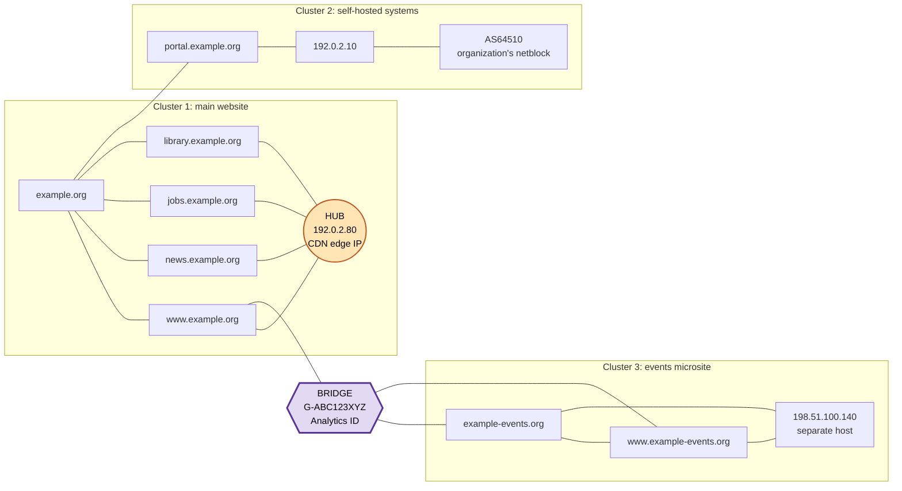
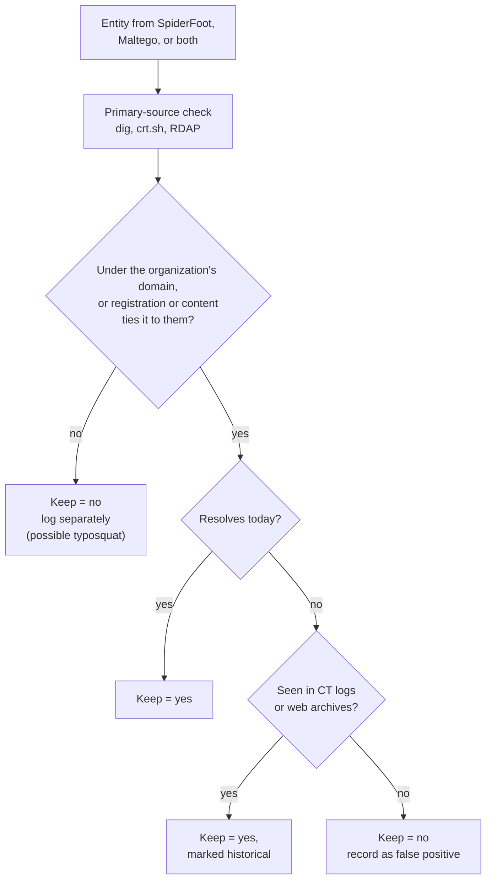

# Day 22: The OSINT cycle, part 4: analyzing a link graph and reporting it

Phase: 2. OSINT and digital footprint · Track goal: Read the graphs from Days 20 and 21 for hubs, clusters, and bridges, reconcile what the two tools disagree on, and write a finding whose confidence matches its evidence.

## Concept
A list of fifteen facts about a domain is data. A graph that shows which of those facts share infrastructure, which group together, and which single item joins two groups that otherwise look separate is the start of analysis. You read a graph for three structures.

A hub is a node with many more connections than its neighbors. Hubs attract attention and are often misleading. A CDN edge IP, a large email provider's MX host, or a registrar's name server connects to thousands of unrelated domains. A hub means something only when you can say why it connects to everything, and "they all use the same popular service" usually means it does not.

A cluster is a group of nodes densely linked to each other and sparsely linked to the rest. In a footprint, a cluster is often one system or one project: a campaign microsite with its own subdomains, certificate, and hosting.

A bridge is a node whose removal would split the graph into pieces. Bridges are frequently the finding. In fraud work the classic bridge is one shared identifier (an analytics measurement ID, an ad-network publisher ID, a registrant email, a phone number) tying two operations that present as unrelated. Gephi measures this as betweenness centrality: how often a node lies on the shortest path between other nodes.

Here are all three in one illustrative footprint, built from the reserved names used since Day 19. The orange circle is a hub, the three boxes are clusters, and the purple hexagon is a bridge.

Try the removal test on it. Cover the CDN node with your thumb: every hostname still reaches `example.org` directly, so nothing falls off. That is a hub with high degree and low betweenness, matching the `192.0.2.80` row in Step 2's table. Now cover `G-ABC123XYZ`: the whole events cluster is cut off from everything else. That is a bridge, and it is why Step 1 resizes nodes by betweenness instead of degree.

One caution when you do this on your own graph: the seed domain will usually score high on betweenness too, because every hop started from it. That comes from how you collected the data, so it is not a finding.

Two tools that collect differently will disagree. Treat disagreement as a lead. A domain SpiderFoot found and Maltego did not may come from a source Maltego's free plan cannot reach, or it may be a SpiderFoot false positive. You settle it by going to the primary source (DNS, certificate log, registry record), not by majority vote.

The report stage then has one rule: the confidence word in your final sentence must match the analysis table in your recon log.

## Resources
- [Gephi](https://gephi.org/) for the centrality statistics below.
- [Maltego Graph layouts and views](https://docs.maltego.com/) (search the docs for "layouts"): Centrality layout places high-betweenness entities in the middle.
- [ICD 203, Analytic Standards](https://www.dni.gov/files/documents/ICD/ICD-203.pdf) from the US Office of the Director of National Intelligence. Read section D.6.e.(2), the tradecraft standard on expressing uncertainty (the likelihood table is D.6.e.(2)(a)); it is the source of the standard estimative-language scale many analysts use.
- [Wayback Machine](https://web.archive.org/) for checking historical state of any node that looks recently changed.

## Practical: Gephi and Maltego: an annotated analysis graph and a one-page finding
**Your checklist for today.** Work through these in order, and check each one off as you finish it:

- [ ] Step 1: compute centrality in Gephi.
- [ ] Step 2: classify the top nodes by degree and betweenness.
- [ ] Step 3: find and name the clusters.
- [ ] Step 4: reconcile the two tools' findings.
- [ ] Step 5: mark hubs and bridges on the Maltego graph.
- [ ] Step 6: fill in the Analysis and Report sections.

Step 1: compute centrality in Gephi. Open your Day 20 Gephi project (or re-import the filtered GEXF).

1. Statistics panel > Average Degree > Run.
2. Statistics panel > Network Diameter > Run. This computes betweenness centrality, closeness centrality, and eccentricity for every node.
3. Data Laboratory > sort by Betweenness Centrality, descending. Copy the top five rows into your notes.
4. Appearance > Nodes > Size > Ranking > Betweenness Centrality > Apply. Bridges now look bigger than hubs, which is the point.

Step 2: classify the top nodes. For each of the top five by degree and the top five by betweenness, write one line: what it is, why it has that score, and whether that is meaningful. Illustrative (reserved names and documentation IPs):

| Node | Degree | Betweenness | Reading |
|---|---|---|---|
| `192.0.2.80` | 31 | 0.02 | Hub. CDN edge IP (AS64500). Shared by many unrelated sites; not evidence of common ownership. |
| `ns1.dnshost.example` | 12 | 0.05 | Hub. Commercial DNS host. Same reasoning. |
| `G-ABC123XYZ` (Web Analytics ID) | 3 | 0.41 | Bridge. The only link between the main-site cluster and the `example-events.org` cluster. |
| `portal.example.org` | 4 | 0.11 | Sits in the organization's own netblock; anchor of the self-hosted cluster. |

The analytics ID is the kind of bridge that matters. A measurement ID belongs to one analytics property, so two sites reporting to the same one are very likely run by the same people. Confirm it from the primary source: view the source of both sites (Ctrl+U) and search for the ID. Capture both pages with SingleFile and hash them as on Day 19.

Step 3: find the clusters. Your Day 20 modularity colors give the clusters. Name each one in plain words ("main website and CMS", "email and DNS providers", "events microsite") and count its nodes. Add the node that anchors each cluster and what, if anything, connects it to the others. Illustrative, extending the diagram in the Concept section with the email and DNS cluster it leaves out for readability:

| Modularity class | Plain-words name | Nodes | Anchor node | Connects to other clusters through |
|---|---|---|---|---|
| 0 | Main website and CMS | 38 | `192.0.2.80` (CDN hub) | `example.org` |
| 1 | Self-hosted systems | 6 | `portal.example.org` | `example.org` |
| 2 | Events microsite | 9 | `example-events.org` | `G-ABC123XYZ` only |
| 3 | Email and DNS providers | 11 | `ns1.dnshost.example` | `example.org` |

A cluster whose last column names a single identifier hangs on a bridge. Confirm that identifier from the primary source, as in Step 2, before it goes into a finding.

Step 4: reconcile the two tools. Build a table of every domain and DNS name that appears in either graph:

| Entity | SpiderFoot | Maltego | Primary-source check | Keep? |
|---|---|---|---|---|
| `events.example.org` | yes | yes | `dig +short` resolves | yes |
| `old.example.org` | yes | no | In crt.sh (2019 cert), no longer resolves | yes, marked historical |
| `examp1e.org` | yes (Similar Domain) | no | RDAP: different registrar, registered 2025 | no; possible typosquat, note separately |

Each row goes through the same checks. Which tool found the entity only decides that you check it; the primary source decides the Keep column:

Step 5: mark the Maltego graph. Open `P2-ORG.mtgl`. Switch to the Centrality layout. Use Maltego's bookmark colors (the star icon on an entity) to mark hubs in one color and bridges in another, and add a note on each bridge stating the primary-source check. Export the image.

Step 6: fill the Analysis and Report sections of your recon log. Each finding gets a confidence word from one scale and at least one source. Use the ICD 203 terms or a simpler three-level scale (confirmed / likely / possible), but pick one and stay with it.

A finished finding looks like this (illustrative):

> `example.org` and `example-events.org` are very likely operated by the same organization. Both pages load the same Google Analytics measurement ID, `G-ABC123XYZ` (page source captured 2026-10-02, SHA-256 in log rows 21 and 22), and the events site's privacy policy names the main organization as data controller (log row 3). The two sites share no hosting: the main site is behind a CDN and the events site is on a separate provider, so hosting overlap is not part of this conclusion.

If your graph has no bridge, say so in the report; that is a valid finding.

The artifact is two images (the Gephi graph sized by betweenness, and the Maltego graph in Centrality layout with hubs and bridges marked), the reconciliation table, and a Report section of no more than one page.

Keep `P2-recon-log.md` open. Days 23 to 30 each add rows to it.

## Checkpoint
- Every sentence in the report that states a fact cites a log row.
- Every confidence word in the report matches the Analysis table exactly.
- The report names at least one hub.
- The report states whether that hub's connections are meaningful, with the reason.
- The report names at least one bridge, or states that the graph has no bridge.
- Every bridge named in the report has a primary-source confirmation.
- Without notes, you can explain the difference between a hub and a bridge, and which Gephi measure (degree or betweenness centrality) picks out each.
