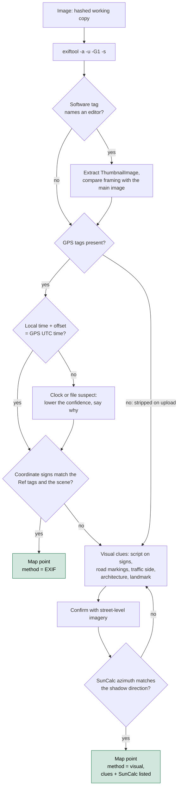

# Day 27: Metadata forensics, part 1: images and geolocation

Phase: 2. OSINT and digital footprint · Track goal: Extract and interpret image metadata with `exiftool`, know which fields can be trusted and which cannot, and geolocate five images (by metadata or by visual evidence) onto a sourced map.

## Concept
A photo from a phone or camera carries EXIF, and often XMP, metadata: the capture time, the device make and model, lens, exposure settings, the editing software, and when location services are on, GPS coordinates. For an investigator these fields answer where and when, and sometimes with which device.

Each field has a failure mode. `DateTimeOriginal` is the camera's local clock with no timezone unless the device also wrote `OffsetTimeOriginal`; a camera whose clock was never set can be off by years. GPS timestamps (`GPSDateStamp`, `GPSTimeStamp`) are UTC from the satellite fix, so they are a useful cross-check on the local time. `Software` reveals editing: a value such as an image editor's name means the file you have is not the original. Some cameras write a `SerialNumber`, which can tie several images to one physical camera. An embedded `ThumbnailImage` is sometimes left over from before an edit, so a cropped photo can still carry a small uncropped preview.

Everything in metadata can be edited with the same tool you use to read it. Metadata is a lead, strong when it agrees with the visual content and other sources, weak when it stands alone.

Most large social platforms strip EXIF, including GPS, from images on upload, so a photo downloaded from a typical social feed rarely has any. Sites that serve the original file (some photo-sharing sites, Wikimedia Commons, press-kit downloads, email attachments) often keep it. When metadata is gone, visual geolocation takes over: signs, shopfronts, road markings, terrain, and the sun's angle, matched against maps and street-level imagery.

Every image in today's lab goes through this path, and every point on your map records which branch it came out of:



Treat evidence files as read-only. `exiftool` writes a `_original` backup when it edits, but you should never be editing evidence at all. Work on a hashed copy.

## Resources
- [ExifTool by Phil Harvey](https://exiftool.org/), the reference tool, with the full tag name documentation under "Tag Names".
- [exif-samples](https://github.com/ianare/exif-samples) is a public (archived) GitHub repository of sample images; `jpg/gps/` contains photos with GPS tags.
- [SunCalc](https://www.suncalc.org/) shows sun azimuth and elevation for any place and time, for checking shadows.
- [uMap](https://umap.openstreetmap.fr/) makes OpenStreetMap-based maps and imports CSV with coordinate columns. Free, no Google account.
- [Bellingcat's first steps to geolocating images](https://www.bellingcat.com/resources/how-tos/) (search "geolocation") are worked examples from published investigations.

## Practical: `exiftool`, SunCalc, and uMap: a five-point sourced geolocation map
Install exiftool: `brew install exiftool` (macOS), `sudo apt install libimage-exiftool-perl` (Debian, Ubuntu, Kali), or the Windows executable from exiftool.org.

Choose five images, all from sources you are entitled to use: at least two photos you took yourself with location enabled, two from `exif-samples/jpg/gps/`, and one image with no GPS that shows a public place (your own photo with location disabled, or a published landmark photo from the Day 19 organization's press page). No photos of private individuals' homes, and no images of people as the subject.

**Your checklist for today.** Work through these in order, and check each one off as you finish it:

- [ ] Step 1: copy, hash, and read the metadata of every image.
- [ ] Step 2: pull the key fields for every image.
- [ ] Step 3: export coordinates as decimal degrees to CSV.
- [ ] Step 4: check for a leftover thumbnail on edited images.
- [ ] Step 5: geolocate the image with no GPS visually.
- [ ] Step 6: build the five-point map in uMap.
- [ ] Step 7: cross-check the EXIF times against GPS UTC.

Step 1: copy, hash, and read everything.

```bash
mkdir -p ~/cases/geo/{orig,work} && cd ~/cases/geo
cp /path/to/images/* orig/ && chmod a-w orig/*
cp orig/* work/
shasum -a 256 orig/* > hashes.txt
exiftool -a -u -G1 -s work/IMG_4821.HEIC | less
```

`-a` shows duplicate tags, `-u` shows unknown tags, `-G1` prefixes each tag with its group (so you can tell EXIF from XMP from maker notes), `-s` prints tag names instead of descriptions. Illustrative output, trimmed:

```
[IFD0]          Make                            : Apple
[IFD0]          Model                           : iPhone 13
[IFD0]          Software                        : 17.5.1
[ExifIFD]       DateTimeOriginal                : 2024:06:14 17:42:08
[ExifIFD]       OffsetTimeOriginal              : -04:00
[GPS]           GPSLatitude                     : 43 deg 38' 32.40" N
[GPS]           GPSLongitude                    : 79 deg 23' 13.20" W
[GPS]           GPSTimeStamp                    : 21:42:07
[GPS]           GPSDateStamp                    : 2024:06:14
[GPS]           GPSHPositioningError            : 4.8 m
```

Local 17:42:08 at offset -04:00 is 21:42:08 UTC, and the GPS clock says 21:42:07 UTC. The two agree, which raises confidence in the time. `GPSHPositioningError` of 4.8 m tells you the fix quality.

Step 2: pull the fields that matter for every image.

```bash
exiftool -G1 -s -DateTimeOriginal -OffsetTimeOriginal -GPSDateStamp -GPSTimeStamp \
  -Make -Model -SerialNumber -Software -ImageWidth -ImageHeight work/
```

Step 3: export coordinates as decimal degrees in a CSV.

```bash
exiftool -n -csv -GPSLatitude -GPSLongitude -DateTimeOriginal -Model work/ > points.csv
```

`-n` prints raw numbers, so latitude and longitude come out as signed decimals (west and south are negative), which mapping tools need. Check the signs: a longitude of `79.387` without a minus sign puts a Toronto photo in China. If the reference tags (`GPSLongitudeRef`) and the number disagree, trust neither until you have looked at the image.

Step 4: check for a leftover thumbnail. For any image whose `Software` tag suggests editing:

```bash
exiftool -b -ThumbnailImage work/edited.jpg > work/edited_thumb.jpg
```

Open the thumbnail and compare it with the main image. Different framing means the thumbnail predates the edit.

Step 5: geolocate the image with no GPS. Write down every visual clue: language and script on signs, road-marking colors, which side traffic drives on, architecture, vegetation, any unique landmark. Narrow the area with a map, then confirm with street-level imagery (Google Street View, Mapillary, or Apple Look Around). Once you have a candidate spot, open SunCalc, set the location and the date and time you believe the photo was taken, and compare the sun's azimuth line with the direction of the shadows in the photo. If they point the same way, record that as supporting evidence; if not, either the place or the time is wrong.

Step 6: build the map in uMap. Add a fifth row to `points.csv` for the visually geolocated image, with the coordinates you settled on. Add columns `name`, `method` (EXIF or visual), `confidence`, and `source`. In uMap: Create a map > the import (up-arrow) icon > choose the CSV file and format CSV > Import. uMap reads columns named `lat` and `lon` (rename the exiftool headers `GPSLatitude` and `GPSLongitude` first). Each point's popup shows the other columns.

Illustrative `points.csv` after editing. The `IMG_4821` and `harbour_front` rows stand in for your own photos; the `DSCN0010` row is the real GPS value in that public sample file (a Nikon COOLPIX P6000 image, GPS date 2008:10:23), so you can check your own output against it:

```
name,lat,lon,method,confidence,source
IMG_4821,43.642333,-79.387000,EXIF GPS (4.8 m error),high,own photo; orig hash in hashes.txt
DSCN0010,43.467448,11.885127,EXIF GPS,medium (sample file; camera clock unverified),exif-samples/jpg/gps
harbour_front,43.6389,-79.3806,visual (signage + SunCalc shadow match),medium,own photo; location services off
```

Step 7: cross-check the EXIF times. For each EXIF point, apply the Step 1 check: does local time plus offset match the GPS UTC time? Write yes or no for each in your notes.

The artifact is the shared uMap link (or an exported image of it) with five points, each popup stating method, confidence, and source.

## Checkpoint
- Every point on the map has a method.
- Every point on the map has a source.
- Your notes state, for each EXIF point, whether local time plus offset matches the GPS UTC time.
- Your notes for the visual point list at least three independent clues.
- Your notes for the visual point record the SunCalc result.
- From `~/cases/geo`, `shasum -a 256 -c hashes.txt` prints `OK` for every file in `orig/`, confirming the originals were never modified.
- Without notes, you can explain what `-n` changes in exiftool's coordinate output, and what a longitude missing its minus sign does to a point on the map.
