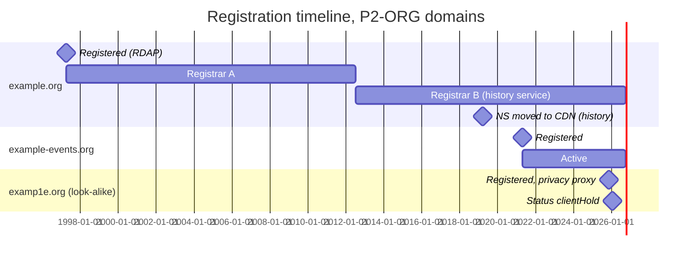

# Day 29: Domain registration: WHOIS, RDAP, and registration history

Phase: 2. OSINT and digital footprint · Track goal: Query domain registration data with `whois` and RDAP, read the fields that carry investigative weight, recover earlier registration states from a historical WHOIS service, and plot the result as a registration timeline.

## Concept
Every domain under a generic TLD (`.com`, `.org`, `.net`, and the newer gTLDs) has a registration record held by the registry and the registrar. For an investigator the useful fields are the creation date, the registrar, the name servers, the status codes, and the expiry date. A domain created nine days before the phishing campaign that used it tells a different story from one registered in 1998.

Registrant identity is mostly hidden now. Since the GDPR took effect in May 2018, registrars have redacted personal contact data for most registrations, and many domains also use a privacy or proxy service. You will usually see "REDACTED FOR PRIVACY" or the proxy company's details. The organization name field sometimes survives for corporate registrants, and historical records from before 2018 can still show what is now redacted.

The protocol has changed too. For gTLDs, ICANN's contracts stopped requiring the old WHOIS service (TCP port 43 and web WHOIS) on 28 January 2025, and RDAP (Registration Data Access Protocol) is now the authoritative source. RDAP returns structured JSON over HTTPS. Many registries still answer port-43 WHOIS, and country-code TLDs (`.ca`, `.uk`, `.de`) set their own rules, so you should know both.

Status codes are worth reading. `clientTransferProhibited` is a routine lock. `serverHold` or `clientHold` means the domain is registered but not resolving, often after an abuse complaint or non-payment. `pendingDelete` means it is about to be released.

Historical WHOIS services have collected registration snapshots for years. They show registrar changes, name-server moves, and pre-2018 registrant details. Coverage varies by service and domain, and a snapshot records what the service saw on the day it looked, so date every claim.

## Resources
- [ICANN Lookup](https://lookup.icann.org/) is ICANN's own RDAP client in the browser.
- [rdap.org](https://about.rdap.org/) is a redirector that sends an RDAP query to the right registry's server.
- [ICANN EPP status codes](https://www.icann.org/resources/pages/epp-status-codes-2014-06-16-en) explains every status value you will see.
- Historical WHOIS, freemium: [WhoisFreaks history lookup](https://whoisfreaks.com/tools/whois/history/lookup) (limited free lookups), [Whoxy WHOIS history](https://www.whoxy.com/whois-history/) (free account, pay per query, history from 2012), [WhoisXML API WHOIS History](https://whois-history.whoisxmlapi.com/) (a small number of free queries on sign-up). DomainTools has deeper history but is a paid product.

## Practical: `whois`, RDAP with `jq`, and a historical WHOIS service: a registration timeline
Use three domains: your Day 19 organization's main domain, one of its other domains from Days 20 to 22, and one look-alike from the Day 20 "Similar Domain" list or the Day 22 reconciliation table.

Step 1: port-43 WHOIS, and following the referral.

```bash
whois example.org
whois -h whois.iana.org org        # which server is authoritative for .org
whois -h whois.verisign-grs.com example.com   # ask the .com registry directly
```

The first form lets your client pick the server. The IANA query shows the `whois:` server for a TLD, which is how you find the right server for an unfamiliar ccTLD. Querying the registry directly gives you the registry's record; the registrar's own server (named in the `Registrar WHOIS Server` line, where one exists) can hold more detail.

Real output, captured 2026-09-30, for `example.com` (a domain IANA reserves for documentation), trimmed:

```
   Domain Name: EXAMPLE.COM
   Registry Domain ID: 2336799_DOMAIN_COM-VRSN
   Updated Date: 2026-08-14T08:01:43Z
   Creation Date: 1995-08-14T04:00:00Z
   Registry Expiry Date: 2027-08-13T04:00:00Z
   Registrar: RESERVED-Internet Assigned Numbers Authority
   Registrar IANA ID: 376
   Domain Status: clientDeleteProhibited https://icann.org/epp#clientDeleteProhibited
   Domain Status: clientTransferProhibited https://icann.org/epp#clientTransferProhibited
   Domain Status: clientUpdateProhibited https://icann.org/epp#clientUpdateProhibited
   Name Server: ELLIOTT.NS.CLOUDFLARE.COM
   Name Server: HERA.NS.CLOUDFLARE.COM
```

Step 2: RDAP.

```bash
curl -sL https://rdap.org/domain/example.com | jq -r '.events[] | "\(.eventAction)\t\(.eventDate)"'
curl -sL https://rdap.org/domain/example.com | jq '{ldhName, status, nameservers: [.nameservers[].ldhName], dnssec: .secureDNS.delegationSigned}'
```

`-L` follows the redirect from rdap.org to the registry's RDAP server. Real output for `example.com`, same date:

```
registration	1995-08-14T04:00:00Z
expiration	2027-08-13T04:00:00Z
last changed	2026-08-14T08:01:43Z
last update of RDAP database	2026-09-30T05:10:13Z
```

```json
{
  "ldhName": "EXAMPLE.COM",
  "status": ["client delete prohibited", "client transfer prohibited", "client update prohibited"],
  "nameservers": ["ELLIOTT.NS.CLOUDFLARE.COM", "HERA.NS.CLOUDFLARE.COM"],
  "dnssec": true
}
```

RDAP writes status codes as words ("client transfer prohibited") where WHOIS uses camel case. Registrar and contact data sit in the `entities` array; `jq '.entities'` shows it, mostly redacted for anything registered by a person.

RDAP also covers IP addresses, which you will need on Day 30:

```bash
curl -sL https://rdap.org/ip/192.0.2.1 | jq '{handle, name, startAddress, endAddress}'
```

Step 3: run Steps 1 and 2 on your three domains. Record for each: creation date, registrar and IANA ID, name servers, status codes, expiry, DNSSEC, and whatever registrant organization field is visible. If a ccTLD's RDAP query fails, use its registry's web WHOIS (for `.ca`, CIRA's lookup) and note the source.

Step 4: historical WHOIS. Create a free account on one of the services in Resources and look up the two domains most likely to have history (the oldest and the look-alike). Look for registrar changes, name-server changes, registrant organization before 2018, and gaps (a domain that lapsed and was re-registered by someone else). Screenshot or export each record and log it with the service's name and the date you queried, since these services' databases differ.

Step 5: build the timeline as a Mermaid Gantt chart. GitHub renders Mermaid in Markdown, so this timeline lives in your notes or repository as text. Illustrative (reserved names, invented dates):

````markdown

````

Every bar and milestone should match a row in the collection log.

The artifact is the rendered Gantt timeline (commit it, or paste it into any Mermaid live editor and export PNG) and the registration table for three domains.

## Checkpoint
For each domain, the creation date from WHOIS and from RDAP must match; if they do not, explain why (ccTLD differences, a re-registration). The timeline must mark which facts came from the live registry and which from a historical service. For the look-alike domain, write one sentence placing its registration date against the Day 25 social timeline: was it registered near any public event of the organization's?
