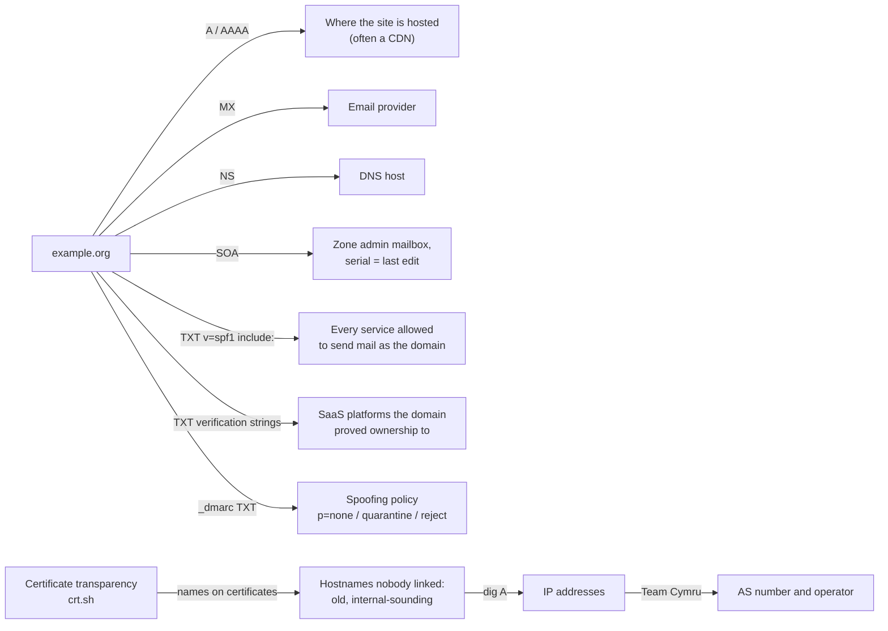
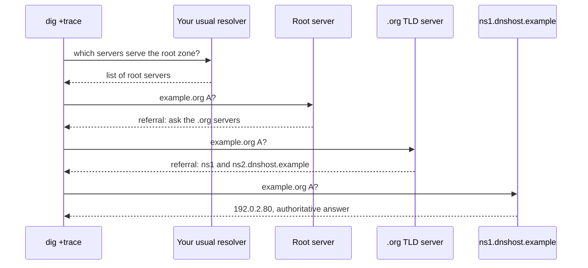
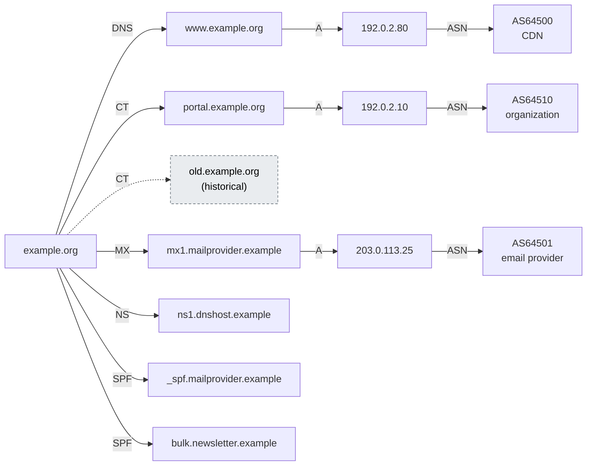

# Day 30: DNS reconnaissance with `dig`, `nslookup`, and certificate transparency

Phase: 2. OSINT and digital footprint · Track goal: Read an organization's public DNS records and certificate-transparency history, resolve what you find to networks and operators, and build an infrastructure map you can defend record by record.

## Concept
DNS is public by design. Anyone can ask a resolver for a domain's A, AAAA, MX, NS, TXT, and SOA records, and the answers describe how the organization is wired to the internet: where its websites are hosted, who handles its email, who runs its DNS, and which third-party services it has proved ownership to.

TXT records deserve the most attention. SPF records (`v=spf1 ...`) list every service allowed to send mail as the domain, so `include:` entries name email and marketing providers. DMARC lives at `_dmarc.<domain>` and shows the organization's email-spoofing policy: `p=reject` means spoofed mail should be refused, `p=none` means it is only monitored, which matters when you later assess how easy the domain is to impersonate in a phishing campaign. Verification strings (`google-site-verification=`, `MS=`, and similar) show which SaaS platforms the domain has been connected to.

Certificate transparency (CT) fills the gap DNS leaves. DNS will answer about a name only if you know to ask. Since 2018, publicly trusted TLS certificates must be logged in public CT logs to be accepted by major browsers, and each certificate lists the hostnames it covers. Searching CT for a domain returns hostnames the organization never linked anywhere, including old and internal-sounding ones.

What each source tells you, and how today's steps chain them:



The line between passive and active is concrete here. Querying public resolvers and CT logs is passive. Brute-forcing subdomains by sending thousands of guesses to the organization's own name servers, or requesting a zone transfer (AXFR) from them, is active and should only be done against domains you control or are authorized to test. For practice, the security researcher Robin Wood (DigiNinja) runs `zonetransfer.me` specifically so people can learn what a misconfigured zone transfer looks like.

## Resources
- [crt.sh](https://crt.sh/) is Sectigo's free certificate-transparency search, with a JSON output option.
- [Team Cymru IP to ASN mapping](https://www.team-cymru.com/ip-asn-mapping) is a free WHOIS-based lookup from IP to AS number and operator.
- [DigiNinja: zonetransfer.me](https://digi.ninja/projects/zonetransferme.php) explains the deliberately open practice zone.
- [RFC 7489 (DMARC)](https://www.rfc-editor.org/rfc/rfc7489) section 6.3 for the tag meanings (`p=`, `sp=`, `adkim=`, `aspf=`, `rua=`).

## Practical: `dig`, crt.sh, and Gephi: a defended infrastructure map
Use the Day 19 organization. `dig` ships with macOS and most Linux distributions (Debian/Ubuntu package `dnsutils`); on Windows use `nslookup` or install BIND tools.

**Your checklist for today.** Work through these in order, and check each one off as you finish it:

- [ ] Step 1: query the core DNS records.
- [ ] Step 2: trace delegation and run reverse lookups.
- [ ] Step 3: search certificate transparency at crt.sh.
- [ ] Step 4: resolve CT hosts to IPs and AS numbers.
- [ ] Step 5: run a zone transfer against the practice zone only.
- [ ] Step 6: build the infrastructure map in Gephi.
- [ ] Step 7: audit and compare against Days 20 and 21.

Step 1: the core records.

```bash
D=example.org
dig $D A +noall +answer
dig $D AAAA +short
dig $D MX +short
dig $D NS +short
dig $D SOA +short
dig $D TXT +short
dig _dmarc.$D TXT +short
```

`+noall +answer` prints only the answer section, with TTLs and record types; `+short` prints only the values. Illustrative output (reserved names and documentation IPs):

```
example.org.		300	IN	A	192.0.2.80
10 mx1.mailprovider.example.
20 mx2.mailprovider.example.
ns1.dnshost.example.
ns2.dnshost.example.
ns1.dnshost.example. hostmaster.example.org. 2026091501 7200 3600 1209600 300
"v=spf1 include:_spf.mailprovider.example include:bulk.newsletter.example -all"
"google-site-verification=AbC123..."
"v=DMARC1; p=quarantine; rua=mailto:dmarc@example.org"
```

Reading it: the SOA's second field is the zone administrator's mailbox with the first dot standing for `@` (`hostmaster@example.org`); the serial `2026091501` follows the common `YYYYMMDDnn` convention, so the zone was last edited on or after 15 September 2026. SPF names two senders, an email provider and a newsletter service. DMARC is at `quarantine`, stricter than `none` and looser than `reject`.

The same queries with `nslookup`, useful on Windows:

```
nslookup -type=mx example.org
nslookup -type=txt example.org 1.1.1.1
nslookup
> set type=ns
> example.org
> exit
```

The trailing `1.1.1.1` sends the query to that resolver instead of your default one. Comparing answers from two resolvers is a quick check for split-horizon DNS or a stale cache.

Step 2: trace delegation and reverse lookups.

```bash
dig +trace $D
dig -x 192.0.2.80 +short
```

`+trace` walks from the root servers down, showing which name servers are authoritative at each level. With the illustrative names from Step 1, the walk looks like this:



`-x` does a reverse (PTR) lookup; a PTR such as `server-192-0-2-80.cdn.example` identifies the hosting provider faster than anything else.

Step 3: certificate transparency.

```bash
curl -s "https://crt.sh/?q=%25.$D&output=json" \
  | jq -r '.[].name_value' | tr 'A-Z' 'a-z' | sed 's/^\*\.//' | sort -u > exports/ct-hosts.txt
wc -l exports/ct-hosts.txt
```

`%25` is a URL-encoded `%`, the wildcard, so the query means "any name ending in .example.org". `name_value` can hold several names per certificate separated by newlines; `jq -r` prints them one per line. The `sed` strips the `*.` from wildcard certificates. crt.sh times out on busy days and on very large domains; wait and retry, or use the web form. Each JSON record also carries `not_before` and `not_after`, which date when each hostname was in use.

Step 4: resolve the CT hosts and map them to networks.

```bash
while read h; do
  for ip in $(dig +short A "$h" | grep -E '^[0-9.]+$'); do printf "%s,%s\n" "$h" "$ip"; done
done < exports/ct-hosts.txt > exports/host-ip.csv

( echo begin; echo verbose; cut -d, -f2 exports/host-ip.csv | sort -u; echo end; sleep 10 ) \
  | nc whois.cymru.com 43 > exports/ip-asn.txt
```

The second command sends every unique IP to Team Cymru's bulk interface in one connection (`begin`, `verbose`, one IP per line, `end`). The `sleep` keeps the connection open long enough for the reply; without it, the macOS `nc` closes before the answer arrives and you get an empty file. Raise it for long lists. Bulk replies start with a `Bulk mode;` line and have no column header. For a single IP, `whois -h whois.cymru.com " -v 192.0.2.80"` works. Real output format, from a live query on 2026-09-30 for an IP behind a CDN:

```
AS      | IP               | BGP Prefix          | CC | Registry | Allocated  | AS Name
13335   | 104.20.23.154    | 104.20.16.0/20      | US | arin     | 2014-03-28 | CLOUDFLARENET - Cloudflare, Inc., US
```

Hosts in CT that no longer resolve are historical; keep them, marked as such.

Step 5 (practice zone only): a zone transfer.

```bash
dig +short NS zonetransfer.me
dig axfr zonetransfer.me @nsztm1.digi.ninja
```

When the practice server allows it, you get the entire zone, including records nobody would find by guessing. That is why AXFR should be restricted to secondary name servers. If you see `; Transfer failed.`, that is also what a correctly configured server returns; As of September 2026 the practice zone still answers AXFR (checked from a third-party vantage point), so a failure is most likely your network: some VPNs, ISPs and corporate networks intercept port 53 and answer on the server's behalf. Test with `dig +tcp SOA zonetransfer.me @nsztm1.digi.ninja`: a reply from the real server carries the `aa` (authoritative) flag and a full 7200-second TTL, while an intercepted reply shows `ra` without `aa` and a TTL below 7200. If you are intercepted, retry from another network rather than working around it. Do not run AXFR against your subject's name servers.

Step 6: build the map in Gephi. Make an edges file with `Source,Target,Label` columns: domain to each host (`label: CT` or `label: DNS`), host to IP (`A`), IP to AS (`ASN`), domain to MX and NS hosts (`MX`, `NS`), and domain to each SPF `include:` (`SPF`).

```
Source,Target,Label
example.org,www.example.org,DNS
example.org,portal.example.org,CT
portal.example.org,192.0.2.10,A
192.0.2.10,AS64510,ASN
example.org,mx1.mailprovider.example,MX
example.org,_spf.mailprovider.example,SPF
```

In Gephi: File > Import spreadsheet > choose the file, "Edges table", then Append to existing workspace or New workspace. Gephi recognizes `Source` and `Target` columns. Run ForceAtlas 2, color nodes by Modularity Class as on Day 20, and export PNG.

Drawn out, the six sample edges above plus a few more from the Step 1 output look like this. Each arrow is one row of your record table, labelled with the record type that produced it. The dashed node is a CT hostname that no longer resolves, kept and marked historical.



Step 7: audit and compare.

1. Pick any five edges on the map and reproduce each with a single command from this page.
2. Compare today's host list with SpiderFoot's (Day 20) and Maltego's (Day 21). In your notes, name one host that only CT found and one that only an earlier tool found.
3. Write one sentence on the DMARC policy and what it means for how easily the domain could be spoofed in a phishing email.

The artifact is the Gephi infrastructure map plus a record table (one row per edge, giving the command or source that produced it).

## Checkpoint
- All five randomly picked edges, reproduced with a single command each, match the map.
- Your notes name one host that only CT found.
- Your notes name one host that only SpiderFoot or Maltego found.
- Your notes contain one sentence on the DMARC policy and what it means for how easily the domain could be spoofed in a phishing email.
- Without notes, you can explain how the `dig +tcp SOA` test tells a reply from the real name server apart from an intercepted one.
