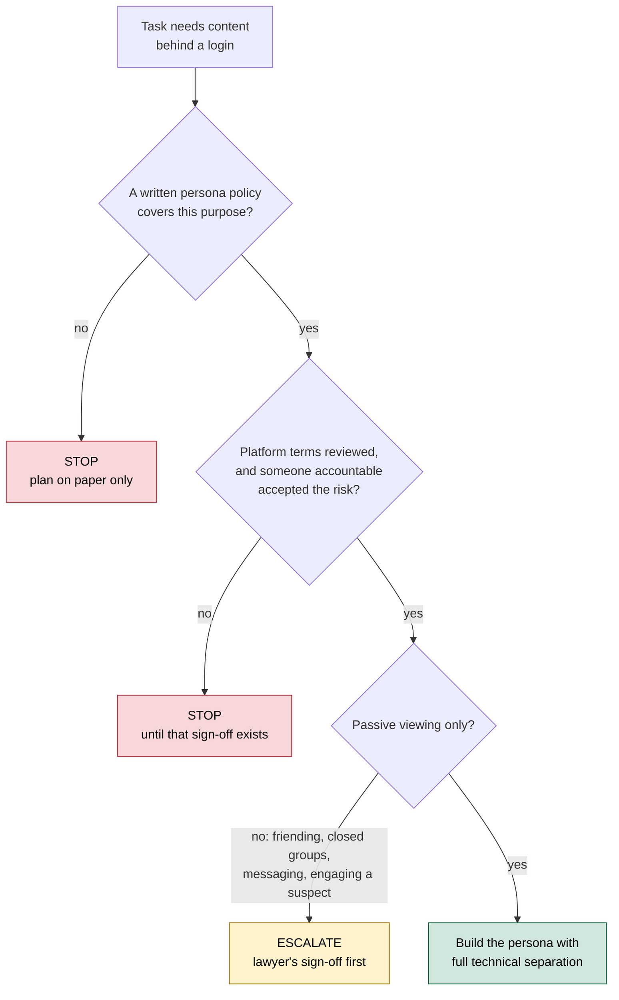
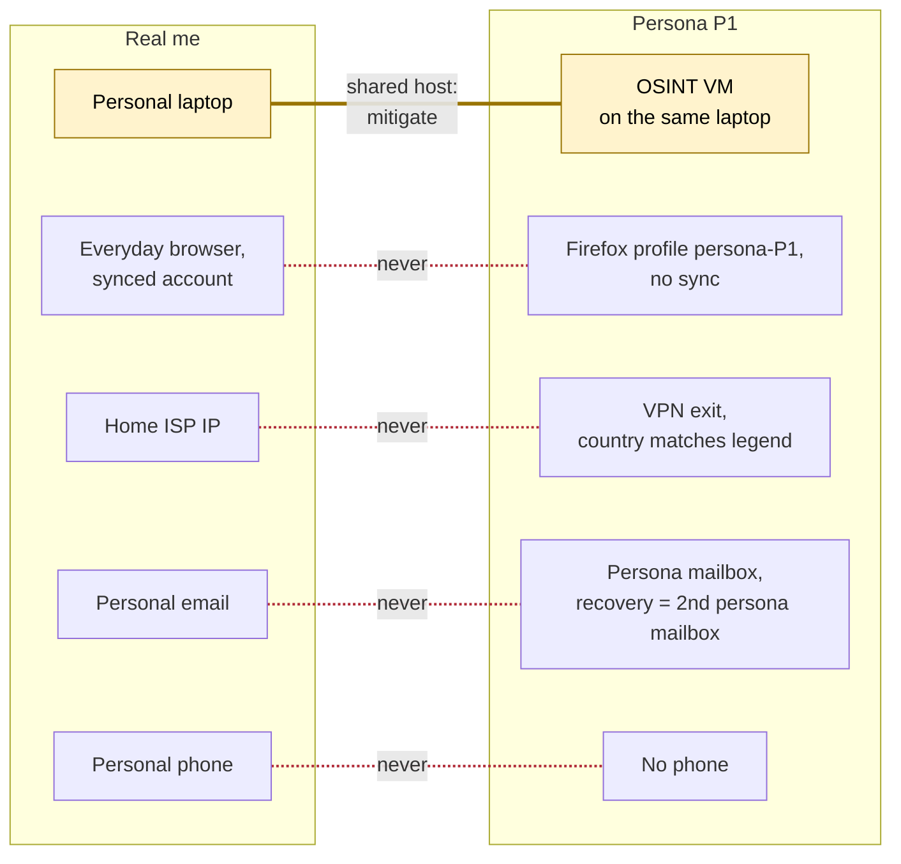

# Day 31: Sock puppets: when they are allowed, and how to keep them clean

Phase: 2. OSINT and digital footprint · Track goal: Decide whether a research persona is justified for a task, and if it is, build one inside a written policy with complete technical separation from your real identity.

## Concept
A sock puppet (research persona) is an account that does not identify you, used to view content that requires a login without exposing the investigator. It exists because logged-in platforms show viewers to the people they view (LinkedIn's "who viewed your profile", story viewer lists, "people you may know" suggestions built from contact uploads), and because an investigator browsing a fraud group under their own name tips off the group and exposes themselves.

Three constraints come before any technique.

Authorization. In a professional setting, personas are created under a written policy from your employer or client that says who may create them, for what purposes, and who reviews their use. Law-enforcement and regulated investigators often need approval per case. Without that policy you are one person making fake accounts, and you should not.

Platform terms. Many platforms prohibit accounts that misrepresent identity. Meta's terms ask users to use the name they use in everyday life and not to create accounts for anyone else; LinkedIn's User Agreement prohibits false profiles. Breaching terms is usually a contract issue rather than a crime (Day 33 covers the difference), but it can get accounts banned, evidence questioned, and your organization sued. Your policy should record that the organization has accepted this risk for a stated purpose.

Passive use. The safe default is look, do not touch. Viewing public or semi-public content is one thing. Friending real people, joining closed groups, messaging, or engaging a suspect moves into pretexting and, depending on who you are and where, into undercover work that needs legal authority. Some pretexting is a crime outright: in the United States, obtaining someone's telephone records or financial information by false pretenses is prohibited by federal statute. Any active engagement needs a lawyer's sign-off first.

The three constraints in the order you check them. A persona gets built only if every answer lands on the right-hand path:



Technically, a persona fails through linkage, not through a bad name: the same IP address as your real accounts, the same browser fingerprint, a recovery phone number that is yours, a contact list synced from your phone, a stolen profile photo that reverse-image-searches to a real person.

## Resources
- [Firefox Multi-Account Containers](https://addons.mozilla.org/firefox/addon/multi-account-containers/) keeps cookies and site data separate per container in one browser.
- [Firefox profiles (`about:profiles`)](https://support.mozilla.org/kb/profile-manager-create-remove-switch-firefox-profiles) gives full separation of history, extensions, and settings per profile.
- [Trace Labs OSINT VM](https://www.tracelabs.org/initiatives/osint-vm) is a free virtual machine image built for OSINT work, a clean base for persona work.
- [Meta Terms of Service](https://www.facebook.com/terms.php) and [LinkedIn User Agreement](https://www.linkedin.com/legal/user-agreement): read the sections on identity and prohibited conduct yourself before any persona touches either platform.

## Practical: Firefox profiles and diagrams.net: a persona legend and compartment diagram
You will design a persona and its infrastructure on paper and in a browser profile. You will not create an account on any social platform today. If your employer has a persona policy, follow it and use this as a planning exercise under it.

**Your checklist for today.** Work through these in order, and check each one off as you finish it:

- [ ] Step 1: write the persona's justification.
- [ ] Step 2: write the persona's legend.
- [ ] Step 3: build the isolated browser compartment.
- [ ] Step 4: draw the compartment diagram in diagrams.net.
- [ ] Step 5: write burn criteria and a usage log format.
- [ ] Step 6: hunt the diagram for linkages to your real identity.
- [ ] Step 7: record the risk owner.

Step 1: write the justification. Three lines at the top of `persona-P1.md`:

```
Purpose: view posts in open (public) job-scam reporting groups to catalog scam patterns (Phase 5 lab)
Authorized by: [policy name / supervisor] or "planning exercise only; no accounts created"
Activity limit: passive viewing only. No friending, joining closed groups, posting, reacting, or messaging.
```

Step 2: write the legend. The legend is the persona's minimal, consistent backstory. Keep it bland: a generic first and last name common in the region the persona claims, a broad city, an unremarkable job, few interests. Record:

| Field | Value | Notes |
|---|---|---|
| Name | (generic, checked by web search to confirm no notable real person uses it with this photo and city) | |
| Photo | none, or a non-face image (landscape, pet, object) you own the rights to | Never a stolen photo of a real person |
| Email | a new mailbox created only for this persona | Recovery email: a second persona-only mailbox, never yours |
| Phone | organization-issued number assigned to persona work, or none | Never your personal number |
| Created | date | Accounts age; note it |
| Burn criteria | see Step 5 | |

On photos: a stolen photo impersonates a real person and can be found with one reverse image search. AI-generated faces from public generators have known tells (consistent eye placement, background artifacts) and some platforms treat them as inauthentic; a non-face image is the honest default.

Step 3: build the browser compartment.

1. In Firefox, go to `about:profiles` > Create a New Profile, name it `persona-P1`. Launch it in a new browser (or from the command line: `firefox -P persona-P1 --no-remote`).
2. In that profile only: Settings > Privacy & Security > Enhanced Tracking Protection: Strict. Turn off "Remember history" or set it to clear on close if your notes are captured elsewhere.
3. Do not sign in to a Firefox account in this profile; sync would link it to you.
4. Do not install the extensions you use in your personal browser. A distinctive extension set is part of your fingerprint.
5. If you use containers instead of profiles, create one container per persona and never open a persona site outside it. Profiles give stronger separation; use them when you can.

Better still, run the profile inside a virtual machine (the Trace Labs OSINT VM or any clean Linux VM) that you use for nothing else. Day 32 tests how well each option hides you.

Step 4: draw the compartment diagram in diagrams.net (app.diagrams.net, free, no account needed). One column per identity: "Real me", "Persona P1", and if you plan one, "Persona P2". Rows: device or VM, browser profile, network exit (home ISP, VPN, Tor), email, phone, payment method, and platform accounts. Fill each cell. Draw a red line between any two cells that must never touch, and a yellow warning icon on any cell that is shared (for example, the same laptop hosting both the VM and your personal browser). Illustrative row set for a persona column:

```
Device:   OSINT VM (VirtualBox), host laptop shared   [yellow]
Browser:  Firefox profile persona-P1, no sync
Network:  commercial VPN, fixed exit country matching legend
Email:    persona mailbox, recovery = second persona mailbox
Phone:    none (platforms requiring phone: not used)
Payment:  none
Accounts: none created (planning exercise)
```

Here is roughly what the finished diagram should show, for that persona column next to "Real me". Red dashed lines are pairs that must never touch. The yellow pair is the shared host laptop, which needs a written mitigation. Any link you cannot draw as red or yellow is a linkage you have not thought about yet.



Step 5: write burn criteria and a usage log format. Burn criteria are the events that retire a persona immediately: logging in from your real IP, a platform prompting to "add people you may know" who are your real contacts, a target interacting with the persona, a request to verify identity with a document. Add a usage log table (date/time UTC, platform, purpose, case reference, actions taken) and fill one row for today's planning session.

Step 6: hunt for linkages. Review the diagram for any path from the persona column to the "Real me" column that does not cross a red line: a shared email recovery, a shared phone, the same network exit, the same browser profile. Each one found is a linkage to fix or to mark yellow with a mitigation.

Step 7: record the risk owner. Answer in writing in `persona-P1.md`: which specific platform terms apply to this persona's intended use, and who in your organization accepted that risk? If the answer is "nobody", the persona stays on paper.

The artifact is `persona-P1.md` (justification, legend, burn criteria, usage log) and the compartment diagram exported as PNG.

## Checkpoint
- Every path from the persona column to the "Real me" column crosses a red line or ends at a yellow cell.
- Every yellow cell has a written mitigation.
- `persona-P1.md` names the specific platform terms that apply to this persona's intended use.
- `persona-P1.md` names who in your organization accepted that risk, or says "nobody".
- If it says "nobody", no platform account exists for this persona.
- Without notes, you can explain why a non-face image is the default persona photo, rather than a stolen photo or an AI-generated face.
