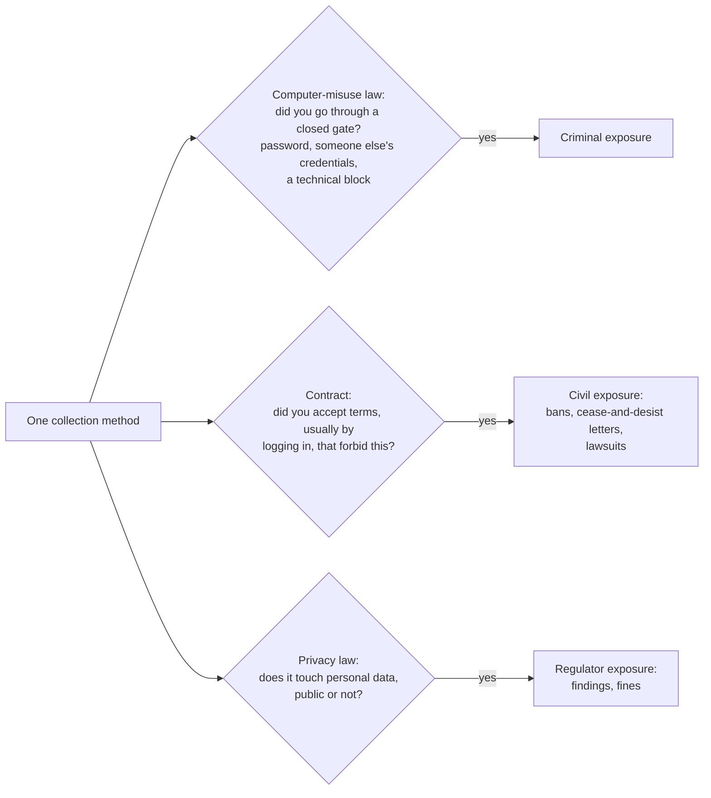
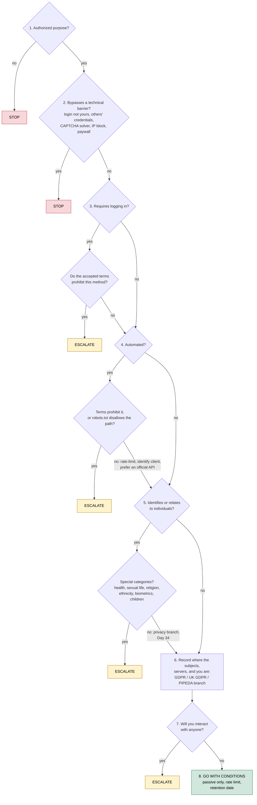

# Day 33: OSINT law, part 1: access, scraping, and terms of service

Phase: 2. OSINT and digital footprint · Track goal: Tell the difference between breaching a platform's terms, breaking computer-misuse law, and breaching privacy law, and encode that into a decision tree you run before any new collection method.

## Concept
Day 1 set the ethical line. This day is about the legal lines, and there are several of them, drawn by different bodies of law that do not track each other.

Computer-misuse law makes unauthorized access to a computer a crime: the US Computer Fraud and Abuse Act (18 U.S.C. § 1030), Canada's Criminal Code s. 342.1 (unauthorized use of a computer), the UK Computer Misuse Act 1990 s. 1, and equivalents elsewhere. The US Supreme Court narrowed the CFAA in *Van Buren v. United States* (2021): "exceeds authorized access" means entering parts of a system that are off limits to you, not misusing information you were entitled to reach. The Court described this as a gates-up-or-down question. Bypassing a password, using someone else's credentials, or defeating a technical block is going through a closed gate. Reading a page anyone can load is not.

Terms of service are a contract. Breaking them (scraping where scraping is forbidden, making a fake account) is usually a civil matter between you and the platform: account bans, cease-and-desist letters, lawsuits. In *hiQ Labs v. LinkedIn* the Ninth Circuit held in April 2022, affirming a preliminary injunction, that scraping publicly accessible profiles was unlikely to be "without authorization" under the CFAA. That was not the end of the case: in November 2022 the district court found that hiQ had breached LinkedIn's User Agreement (through automated scraping and fake profiles created by paid workers), and in December 2022 the case ended in a stipulated consent judgment against hiQ and a permanent injunction requiring it to stop scraping LinkedIn and delete the data. In *Meta v. Bright Data* (N.D. Cal., January 2024) the court held that Meta's terms did not cover scraping done while logged out, because the terms govern the use of logged-in accounts. The practical lesson: logging in usually means you agreed to the terms, and agreeing to the terms is what makes most scraping restrictions bind you.

Privacy and data-protection law applies whether or not the data was public. Canada's Privacy Commissioner and three provincial counterparts found in 2021 that Clearview AI's collection of publicly posted photos broke Canadian privacy law, and the Dutch Data Protection Authority fined Clearview €30.5 million under the GDPR in 2024. "It was public" is not a defence to a privacy regulator. Day 34 covers what that means for storing what you find.

The three bodies of law ask separate questions about the same act, and passing one test tells you nothing about the others:

Other law can also apply: copyright in the content you copy, the EU's database right, anti-circumvention rules, harassment and stalking statutes when collection targets a person.

Jurisdiction depends on where the people and systems are, as well as where you are. A Canadian investigator scraping an EU site about EU residents can be inside the GDPR's territorial scope, a US platform's terms usually choose a US court, and a criminal statute can apply where the server sits.

This is a training outline, not legal advice. Before a new collection method goes into real work, a lawyer who knows your jurisdiction should see it.

## Resources
- [*Van Buren v. United States*, 593 U.S. 374 (2021)](https://www.supremecourt.gov/opinions/20pdf/19-783_k53l.pdf), the opinion itself. Read the majority opinion and its footnote 8, which leaves open whether the limits must be technical or can be contractual.
- [Criminal Code of Canada, s. 342.1](https://laws-lois.justice.gc.ca/eng/acts/c-46/section-342.1.html) for unauthorized use of a computer.
- [OPC joint investigation of Clearview AI (PIPEDA Findings #2021-001)](https://www.priv.gc.ca/en/opc-actions-and-decisions/investigations/investigations-into-businesses/2021/pipeda-2021-001/) sets out the regulators' reasoning on "publicly available".
- [Eric Goldman's Technology & Marketing Law Blog](https://blog.ericgoldman.org/) tracks US scraping and terms-of-service cases as they are decided.

## Practical: diagrams.net: a collection-legality decision tree, tested on five scenarios
Step 1: draw the tree in diagrams.net (app.diagrams.net). Use diamonds for questions and rounded boxes for outcomes. Outcomes are GO, GO WITH CONDITIONS (write the conditions), ESCALATE (to legal or your supervisor), and STOP. The minimum question set, in this order:

**Your checklist for today.** Work through these in order, and check each one off as you finish it:

- [ ] Draw the authorized-purpose question.
- [ ] Draw the technical-barrier question.
- [ ] Draw the login and accepted-terms question.
- [ ] Draw the automation and terms/robots.txt question.
- [ ] Draw the personal-data and special-category question.
- [ ] Record the subjects, servers, and jurisdiction branch.
- [ ] Draw the interaction question.
- [ ] Add the GO WITH CONDITIONS outcome.

1. Is there an authorized purpose (a case, a contract, a policy) that covers this collection? No: STOP.
2. Does the method require bypassing a technical barrier: a login you are not entitled to, someone else's credentials, a CAPTCHA solver, an IP block, a paywall? Yes: STOP.
3. Does it require logging in? Yes: which terms did the account accept, and do they prohibit this method (automated collection, fake identity, data export)? Prohibited: ESCALATE.
4. Is it automated (scripts, scrapers, bulk API calls)? Yes: check the site's terms and `robots.txt`, rate-limit, identify your client honestly, and prefer an official API. Terms prohibit it: ESCALATE.
5. Does the data identify or relate to individuals? Yes: go to the privacy branch (lawful basis, minimization, retention; Day 34). Special categories (health, sexual life, religion, ethnicity, biometrics, children): ESCALATE.
6. Where are the subjects, the servers, and you? Any EU/UK subjects: GDPR/UK GDPR branch. Canadian commercial context: PIPEDA branch. Record the answer.
7. Will you interact with anyone (message, friend, join a closed group, buy something)? Yes: ESCALATE (pretexting and undercover rules; Day 31).
8. All clear: GO WITH CONDITIONS, listing the conditions (passive only, rate limit, retention date).

The same eight questions drawn as a tree, as a starting point. Rebuild it in diagrams.net so you can attach the conditions to each branch and add your jurisdiction's privacy branches under question 6.

Step 2: run five scenarios through the tree. Write one paragraph each giving the path through the tree and the outcome.

**Your checklist for today.** Work through these in order, and check each one off as you finish it:

- [ ] Run scenario 1: reading and saving public press releases.
- [ ] Run scenario 2: an automated script pulling public posts while logged out.
- [ ] Run scenario 3: searching a member directory with your personal account.
- [ ] Run scenario 4: using a colleague's borrowed credentials.
- [ ] Run scenario 5: downloading a leaked database from a public forum.

1. Reading a public organization's press releases and saving them with SingleFile (Days 19 to 22).
2. A Python script that pulls every public post from a platform's search page, logged out, once per second, to catalog recruitment-scam wording.
3. Using your personal account to search a platform's member directory for everyone who lists a certain employer, and exporting the results.
4. A colleague offers the username and password of a "friendly" member of a closed scam-victims group so you can read it.
5. Downloading a leaked database posted on a public forum to check whether scam phone numbers from your cases appear in it.

Illustrative worked answer for scenario 2:

> Q1 authorized purpose: yes, Phase 5 pattern research. Q2 barrier: none while logged out, but if the platform starts returning CAPTCHAs or blocks the IP and the script is changed to get around that, the answer becomes yes and the outcome STOP. Q3 login: no, so the logged-in terms arguably do not bind (compare *Meta v. Bright Data*), though the platform's site terms may still claim to cover visitors; note it. Q4 automated: yes; `robots.txt` disallows the search path, so ESCALATE. Q5 personal data: posts carry usernames; if approved, keep only message text and dates, drop usernames at collection. Outcome: ESCALATE, with a proposal to use the platform's official research API instead.

Scenario 4 should end at STOP on Q2 (someone else's credentials), whatever the good intentions. Scenario 5 should reach ESCALATE or STOP depending on your jurisdiction: possessing stolen data can itself be an offence in some places, and the data is personal data regardless.

Step 3: add one scenario of your own from a real task you expect to do, and run it through the tree. Write it up the same way: the path through the tree and the outcome.

Step 4: re-run blind. Swap your five scenarios with a study partner, or come back to them in a week, and run them through the tree again without looking at your answers. Record the second set of outcomes beside the first.

The artifact is the decision tree (PNG and the `.drawio` source) and the five scenario write-ups.

## Checkpoint
- The blind re-run outcomes match your original outcomes for all five scenarios.
- Every STOP and ESCALATE in your write-ups names the specific question that triggered it.
- Your write-ups include a sixth scenario, from a real task you expect to do, with its path through the tree and its outcome.
- Without notes, you can state which question stops scenario 4, and why good intentions do not change that outcome.
