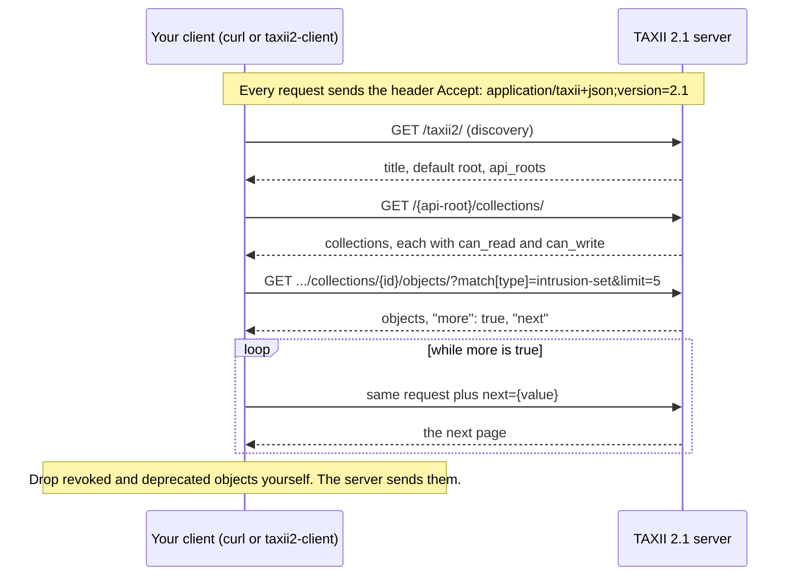
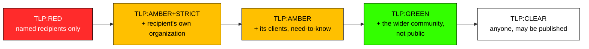
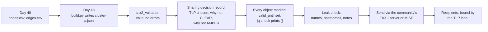

# Day 44: Moving intelligence with TAXII and marking it with TLP

Phase: 3. Cyber Threat Intelligence · Track goal: Pull STIX data from a live, public TAXII 2.1 server, and prepare your own bundle for sharing with a written decision about who may see it.

## Concept
STIX is the format. TAXII (Trusted Automated Exchange of Intelligence Information) is the HTTPS API that moves STIX between organizations. A TAXII 2.1 server has a small, fixed layout:

| Endpoint | Path pattern | Returns |
|---|---|---|
| Discovery | `/taxii2/` | Server title and a list of API roots |
| API root | `/<api-root>/` | Information about one root |
| Collections | `/<api-root>/collections/` | The collections you can read or write |
| Objects | `/<api-root>/collections/<id>/objects/` | STIX objects, filterable and paginated |
| Manifest | `/<api-root>/collections/<id>/manifest/` | Object IDs and versions without the full objects |

Every request needs the header `Accept: application/taxii+json;version=2.1`. Filters are query parameters: `match[type]=intrusion-set`, `match[id]=...`, `added_after=2026-01-01T00:00:00Z`, and `limit`. Responses page with `"more": true` and a `"next"` value you pass back.

One pull from start to finish, as the practical runs it against MITRE's server:



Most sharing happens inside communities such as ISACs, national CERT feeds and vendor exchanges. Many use MISP, an open-source sharing platform that can import and export STIX 2.1. TAXII is the common way these systems push to and pull from each other.

Before anything leaves your hands, it needs a Traffic Light Protocol label. TLP 2.0, published by FIRST in 2022, has five labels:

| Label | Recipients may share with |
|---|---|
| TLP:RED | No one. For the named recipients only |
| TLP:AMBER+STRICT | Their own organization only |
| TLP:AMBER | Their own organization and its clients, on a need-to-know basis |
| TLP:GREEN | Their community, but not publicly |
| TLP:CLEAR | Anyone. It may be published |

Each label to the right widens the circle of people the recipient may pass the information to:



TLP:CLEAR replaced TLP:WHITE, and AMBER+STRICT is new in 2.0. The STIX 2.1 standard only predefines the older TLP 1.0 markings (WHITE, GREEN, AMBER, RED). TLP 2.0 in STIX uses separate marking definitions that OASIS published later. Check which version your recipients' tools understand before relying on AMBER+STRICT inside the data.

## Resources
- [TAXII 2.1 specification](https://docs.oasis-open.org/cti/taxii/v2.1/os/taxii-v2.1-os.html): section 3 covers filtering and pagination.
- [MITRE ATT&CK TAXII 2.1 server](https://attack-taxii.mitre.org/taxii2/): a public, read-only server for practice. It is slow; allow 30 seconds or more per request.
- [taxii2-client](https://github.com/oasis-open/cti-taxii-client): the OASIS Python client.
- [FIRST TLP 2.0](https://www.first.org/tlp/): the definitions, in full.
- [MISP](https://www.misp-project.org/): the open-source sharing platform most communities run.
- [OASIS CTI documentation](https://oasis-open.github.io/cti-documentation/): look here for the current STIX marking definitions for TLP 2.0.

## Practical: curl and taxii2-client (a TAXII pull log and a marked, share-ready bundle with a sharing decision record)
MITRE's server is public and read-only, and you have no write access to it. Only pull from other TAXII servers you have been given credentials for, and never share a bundle outside the audience its TLP label allows.

**Your checklist for today.** Work through these in order, and check each one off as you finish it:

- [ ] 1. Walk the server by hand with curl
- [ ] 2. Do the same with the Python client
- [ ] 3. Mark your Day 43 bundle for sharing
- [ ] 4. Strip what should not travel

### 1. Walk the server by hand with curl
```bash
mkdir -p ~/cti-lab/day44 && cd ~/cti-lab/day44
H='Accept: application/taxii+json;version=2.1'

# Discovery
curl -s -H "$H" https://attack-taxii.mitre.org/taxii2/ | jq '{title, default, roots: (.api_roots | length)}'

# Collections in the default root
curl -s -H "$H" https://attack-taxii.mitre.org/api/v21/collections/ | jq -r '.collections[] | [.id, .title, .can_read, .can_write] | @tsv'
```
Output observed in September 2026:
```
x-mitre-collection--90c00720-636b-4485-b342-8751d232bf09  ICS ATT&CK         true  false
x-mitre-collection--1f5f1533-f617-4ca8-9ab4-6a02367fa019  Enterprise ATT&CK  true  false
x-mitre-collection--dac0d2d7-8653-445c-9bff-82f934c1e858  Mobile ATT&CK      true  false
```
The discovery document also lists one API root per past ATT&CK release (`/api/v21/attack-11.0`, `/api/v21/attack-12.0`, and so on), so you can pull the matrix as it stood when an older report was written.

Now filter objects. The square brackets in `match[type]` trip up curl, which treats `[...]` as a range pattern. Use `-g` to turn that off:
```bash
C=x-mitre-collection--1f5f1533-f617-4ca8-9ab4-6a02367fa019
curl -sg -H "$H" "https://attack-taxii.mitre.org/api/v21/collections/$C/objects/?match[type]=intrusion-set&limit=5" \
  | jq '{more, next, names: [.objects[] | {name, revoked}]}'
```
When this was tested, the first page included an object named `UNC2452` with `"revoked": true`. TAXII serves revoked objects as well as current ones. Your consumer has to filter them, exactly as your jq queries did on Day 35.

Fetch the next page by passing `next` back:
```bash
curl -sg -H "$H" "https://attack-taxii.mitre.org/api/v21/collections/$C/objects/?match[type]=intrusion-set&limit=5&next=1" | jq -r '.objects[].name'
```

### 2. Do the same with the Python client
```python
from taxii2client.v21 import Server, as_pages

server = Server("https://attack-taxii.mitre.org/taxii2/")
root = server.default
enterprise = next(c for c in root.collections if c.title == "Enterprise ATT&CK")

active = []
for page in as_pages(enterprise.get_objects, per_request=50, type="intrusion-set"):
    for obj in page.get("objects", []):
        if not obj.get("revoked") and not obj.get("x_mitre_deprecated"):
            active.append(obj["name"])
print(len(active), "active intrusion sets")
```
Record the count and compare it with your Day 35 jq count of active intrusion sets. If they differ, find out why (release version, or filtering) before moving on.

Keep a pull log: timestamp, URL, filter, page count, object count and any errors. Real feeds fail, time out and change, and the log is how you show what you received and when.

### 3. Mark your Day 43 bundle for sharing
Imagine you are sending your Day 40 cluster to a regional sharing community. The path your data takes from here, with the checks this step and step 4 add before anything leaves:



Decide the marking with a written record:

```markdown
# Sharing decision record
Content: cluster-a.json (N indicators, N relationships)
Sources inside it: <seed vendor report> (public), my own pivots (unpublished)
Could any object identify a victim, a person, or our own organization? yes / no, details:
Could sharing tip off the actor or burn a source? details:
Recipients: <community name / "hypothetical regional ISAC">
TLP chosen: TLP:GREEN
Why not CLEAR:
Why not AMBER:
Expiry / review: valid_until set to YYYY-MM-DD on all indicators
Approved by: (in real work, a named person; in this lab, "self")
```
Then apply it in the data. In `build.py` from Day 43, make sure every indicator, infrastructure object and relationship has `object_marking_refs=[TLP_GREEN]` and a `valid_until` date. Rebuild and validate:
```bash
python build.py && stix2_validator cluster-a.json
jq '[.objects[] | select(.type != "marking-definition" and .type != "identity") | select((.object_marking_refs // []) | length == 0) | .id]' cluster-a.json
```
The jq check should print `[]`, meaning no unmarked objects remain.

### 4. Strip what should not travel
Search the bundle for anything that should not leave your hands: your real name, internal hostnames, notes that reveal your sources.
```bash
jq -r '.. | strings' cluster-a.json | grep -iE 'internal|corp|todo|my name|password' || echo "clean"
```
Adjust the pattern for your own environment, and read every match before you send anything.

### What you have when you finish
- A TAXII pull log: discovery, collections, at least three filtered object pulls, and one paginated pull, each with a timestamp and object count.
- An active intrusion-set count from TAXII, reconciled with your Day 35 count.
- A completed sharing decision record.
- `cluster-a.json` rebuilt with a marking and an expiry on every object, validated, and checked for leakage.

## Checkpoint
- Explain why a response from `match[type]=intrusion-set` can contain groups that no longer exist in the current matrix.
- Your decision record gives a specific reason for not choosing TLP:CLEAR.
- The jq check for unmarked objects prints `[]`.
- You can state which TLP 2.0 label did not exist in TLP 1.0, and what a recipient may do with it.
