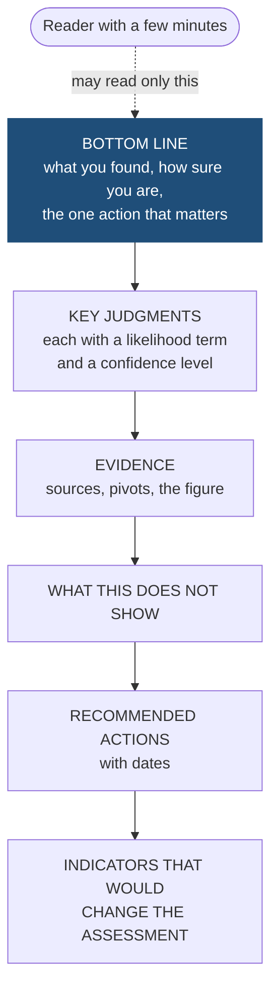
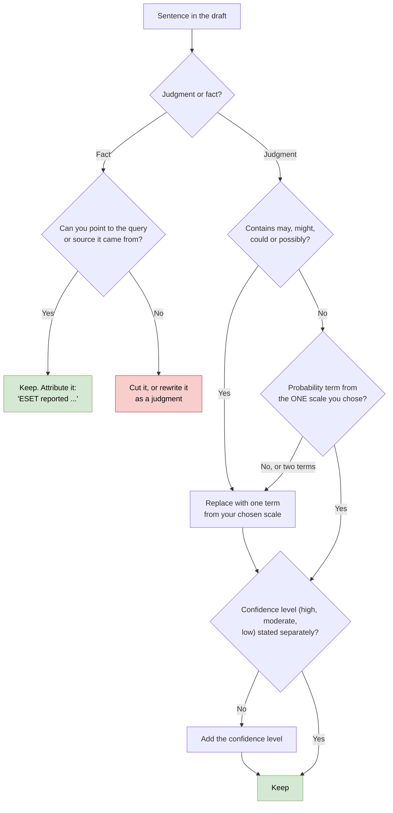

# Day 46: Writing an intelligence brief with calibrated language

Phase: 3. Cyber Threat Intelligence · Track goal: Write a one-page brief whose readers can tell exactly how likely you think each judgment is and how much you trust the evidence behind it.

## Concept
A brief exists so that someone can act. Its reader is usually a SOC lead, an IT manager or an executive with a few minutes, so the structure puts the conclusion first: bottom line up front (BLUF), then key judgments, then the evidence, then what to do and what to watch for.



The hard part is saying how sure you are. Words such as "possibly" or "may" mean anything from 5% to 70% to different readers. Sherman Kent raised this problem at the CIA in the 1960s, and intelligence services now publish fixed scales that tie words to probability ranges.

US Intelligence Community Directive 203 (ICD 203):

| Term (either column) | | Probability |
|---|---|---|
| almost no chance | remote | 01-05% |
| very unlikely | highly improbable | 05-20% |
| unlikely | improbable | 20-45% |
| roughly even chance | roughly even odds | 45-55% |
| likely | probable | 55-80% |
| very likely | highly probable | 80-95% |
| almost certain(ly) | nearly certain | 95-99% |

The UK's Professional Head of Intelligence Assessment (PHIA) probability yardstick, used by the NCSC among others:

| Term | Approximate probability |
|---|---|
| Remote chance | above 0% to about 5% |
| Highly unlikely | about 10-20% |
| Unlikely | about 25-35% |
| Realistic possibility | about 40% to under 50% |
| Likely or probable | about 55-75% |
| Highly likely | about 80-90% |
| Almost certain | about 95% to under 100% |

The PHIA scale leaves deliberate gaps between ranges so that a judgment near a boundary has to be committed to one side. Pick one scale per product, say which one you use, and do not mix terms from different rows or scales.

Likelihood and confidence are different things. Likelihood is how probable you judge an event or fact to be. Confidence (high, moderate, low) is how good your basis is: the quality of the sources, how much they corroborate each other, and how many assumptions you had to make. "The domains are likely operated by the same actor. We have low confidence in this judgment" is coherent: your estimate is above 55%, and it rests on thin evidence that could easily change. ICD 203 asks analysts to express both, but in separate sentences: section D.6.e.(2)(b) says a product must not combine a confidence level and a degree of likelihood in the same sentence.

## Resources
- [ICD 203, Analytic Standards](https://www.dni.gov/files/documents/ICD/ICD-203.pdf): the likelihood table sits under the tradecraft standard on expressing uncertainty. A [text version on GitHub](https://github.com/wesinator/ICD203-intel-analysis) is easier to read.
- [UK government, "Explaining uncertainty in UK intelligence assessment"](https://www.gov.uk/government/publications/explaining-uncertainty-in-uk-intelligence-assessment/explaining-uncertainty-in-uk-intelligence-assessment): the PHIA yardstick and how it is applied.
- [US Government Tradecraft Primer](https://www.cia.gov/resources/csi/static/Tradecraft-Primer-apr09.pdf): pairs well with Day 45.
- [Pandoc](https://pandoc.org/): turns the Markdown brief into a Word file for distribution.
- For a model of the style, read the "key judgments" section of any recent CISA joint advisory, or the NCSC's published assessments, and note how often each sentence carries a probability term.

## Practical: Pandoc (a one-page intelligence brief built from your Day 40 to 44 work)
The brief goes to a hypothetical audience. Do not name a real organization as its recipient or as a target, and keep every indicator defanged in the text.

**Your checklist for today.** Work through these in order, and check each one off as you finish it:

- [ ] 1. Collect what you have
- [ ] 2. Rewrite weak sentences first
- [ ] 3. Draft the brief

### 1. Collect what you have
You already have a pivot graph (Day 40), STIX bundle and sharing decision (Days 43 and 44), and an ATT&CK layer. Your brief reports on the Day 40 cluster to a hypothetical SOC at an organization in the seed report's target sector. The TLP label comes from your Day 44 decision record.

### 2. Rewrite weak sentences first
Practice on these before drafting. For each "before" sentence, identify what is missing (likelihood, confidence, source or scope).

| Before | After |
|---|---|
| The domains are definitely part of the same campaign. | We assess that the three domains are almost certainly operated by the same actor: a single certificate lists all three names (crt.sh, retrieved 2026-09-30). Confidence: high. |
| 198.51.100.23 may be related. | We assess it is a realistic possibility that 198.51.100.23 belongs to the same cluster. The only link is a shared favicon found on 12 hosts, and we have no second pivot. Confidence: low. |
| This actor is sophisticated and dangerous. | (Cut. It names no behavior and gives the reader nothing to act on.) |
| The actor could possibly target us soon. | We have no information indicating that our organization is targeted. The seed report describes targeting of <sector> in <region> during <months>, which includes organizations like ours. |

Notice that the second "after" uses a PHIA term. If you choose ICD 203 for your brief, "roughly even chance" is the nearest equivalent. Pick one scale and use it throughout.

### 3. Draft the brief
Save as `brief.md`, one page when rendered (about 400 to 550 words):

```markdown
---
title: "Phishing infrastructure cluster A: assessment and actions"
subtitle: "TLP:GREEN | 2026-09-30 | Probability terms: PHIA yardstick"
---

## Bottom line
One or two sentences: what you found, how sure you are, and the single most important action.

## Key judgments
1. We assess that ... (likelihood term) (confidence level), because ...
2. ...
3. We do not know ... (name the gap explicitly)

## Evidence
- Seed: <vendor report>, <date> (source grade B2).
- Pivots: shared certificate SANs (strong), favicon hash with 12 results (medium) ...
- Graph: figure 1.

{ width=90% }

## What this does not show
Say what the evidence does not support, for example who operates the cluster or whether your sector is targeted now.

## Recommended actions
- Block and alert on: (defanged indicators, or "see attached STIX bundle cluster-a.json")
- Hunt for: ATT&CK techniques from the layer, with the log source to check
- Review by: (date when indicators expire from the bundle)

## Indicators that would change this assessment
- New certificate issued with the same SAN pattern (raises confidence)
- Favicon hash appears on hosts serving unrelated content (lowers confidence)
```
Render it:
```bash
pandoc brief.md -o brief.docx
```
Open the result and check that it fits on one page with the figure. If it does not, cut words, not the figure.

### 4. Run a calibration check
Run every sentence of the draft through this path, then do the markup below:



Mark up a copy of the draft:

- Highlight every probability term. Each one must come from your chosen scale.
- Underline every sentence that states something as fact. Each must be either observed (you can point to the query or source) or explicitly attributed to its source ("ESET reported ...").
- Circle any "may", "might", "could" or "possibly". Replace each with a term from the scale, or delete the sentence.
- Check that no sentence combines two likelihood terms ("likely possible").

### What you have when you finish
- `brief.md` and `brief.docx`: a one-page brief with a TLP line, a BLUF, at least three numbered key judgments that each carry a likelihood term and a confidence level, a figure, a "what this does not show" section and dated actions.
- A marked-up calibration copy showing every probability term highlighted and every hedge word removed.
- The four rewritten practice sentences.

## Checkpoint
- The first two sentences of your brief state what you found.
- The first two sentences state how sure you are.
- The first two sentences state the single most important action.
- Every key judgment states likelihood and confidence separately.
- No "may", "might", "could" or "possibly" remains in a judgment sentence.
- At least one key judgment is about what you do not know.
- The brief makes no claim about who is behind the cluster. That comes on Days 47 and 48, and most briefs should not make one at all.
- Without notes, explain the difference between likelihood and confidence.
