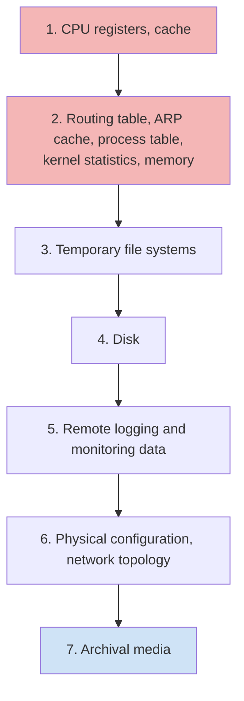
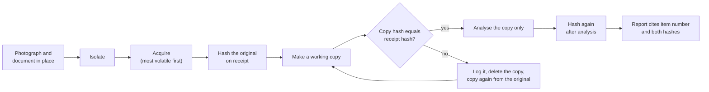
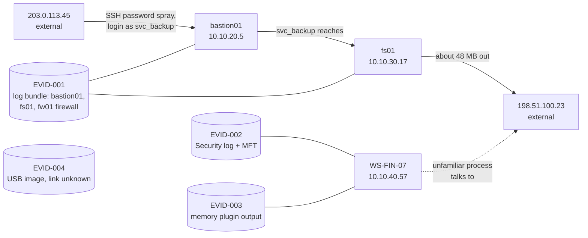

# Day 49: Evidence handling, hashing and chain of custody

Phase 4, digital forensics and incident investigation. Track goal: receive evidence so that every later finding in this phase can be traced back to a file whose integrity you can prove.

## Concept

Phase 4 runs one synthetic case, LAB-P4, from intake to final report. Today you take custody of its first evidence item. Nothing you conclude on day 64 will survive a skeptical reader unless you can show the file you analysed is the file you received.

Three habits carry most of the weight.

Order of volatility. RFC 3227 ranks evidence by how fast it disappears: CPU registers and cache, then routing and ARP tables, process table and memory, then temporary file systems, then disk, then remote logs, then archival media. You collect from the top of that list down. Pulling the plug on a running machine to "preserve" the disk destroys memory, and memory is where you would have found the network connection and the injected code (days 53 and 54).

Hash on receipt, hash before analysis, hash after analysis. A cryptographic hash (use SHA-256; MD5 and SHA-1 are still printed by many tools for compatibility but both have practical collision attacks) is a fingerprint of the exact bytes. If the value you record today matches the value on day 64, you can say the bytes did not change. If you only hashed once, you can say nothing about the gap.

Custody is a written record. The chain-of-custody form names who held the item, when, where, why, and whether the seal and hash still matched at each hand-off. A gap between two rows is a gap anyone challenging your work can point at. The form also records the legal authority for collection. "I had admin access" is not authority; an engagement letter, a signed employer policy, a consent form or a warrant is.

The order matters because each step protects the one after it. Photograph and document before touching, isolate before acquiring, acquire before analysing, hash before and after every copy, and analyse only copies.

RFC 3227's order of volatility, top of the list first. Collect in this order on a live system:



The handling sequence, with the hash check that decides whether a copy can be used:



The LAB-P4 case as the brief describes it, with the evidence item each host contributes. Treat every arrow as a claim you have not yet checked; by day 64 each one needs an evidence reference or a label saying it is unproven.



## Resources

- [RFC 3227, Guidelines for Evidence Collection and Archiving](https://www.rfc-editor.org/rfc/rfc3227): section 2.1 is the order of volatility.
- [NIST SP 800-86, Guide to Integrating Forensic Techniques into Incident Response](https://csrc.nist.gov/pubs/sp/800/86/final): sections 3 and 4 on collection and examination.
- [SWGDE best practices documents](https://www.swgde.org/documents/published-complete-listing/): search "collection" and "acquisition".
- GNU coreutils manual, [`sha256sum` invocation](https://www.gnu.org/software/coreutils/manual/html_node/sha2-utilities.html). On macOS use `shasum -a 256` (same output format).

## Practical: sha256sum and the chain-of-custody form

Evidence item EVID-001 for this lab is the synthetic log bundle in [`resources/case-lab-p4/logs/`](resources/case-lab-p4/logs/). Treat it as if an administrator at the fictional Example Fabrication Co. just handed it to you on a USB stick.

**Your checklist for today.** Work through these in order, and check each one off as you finish it:

- [ ] Make a working area that keeps the original separate from your copies.
- [ ] Hash every file on receipt and save the manifest.
- [ ] Work only on a copy, and prove it matches.
- [ ] Watch the hash check catch a tampered file.
- [ ] Fill in `resources/chain-of-custody-form.md` for EVID-001.
- [ ] Write hash manifests for EVID-002 and EVID-003.

1. Make a working area that keeps the original separate from your copies.

   ```bash
   mkdir -p ~/lab-p4/{evidence,work,notes}
   cp -a resources/case-lab-p4/logs ~/lab-p4/evidence/EVID-001
   chmod -R a-w ~/lab-p4/evidence/EVID-001
   ```

   `cp -a` keeps timestamps; `chmod a-w` removes write permission so an accidental redirect cannot overwrite the "original". This is a lab substitute for a hardware write blocker, which you will meet tomorrow.

2. Hash every file on receipt and save the manifest.

   ```bash
   cd ~/lab-p4/evidence/EVID-001
   sha256sum * | tee ~/lab-p4/notes/EVID-001.receipt.sha256
   date -u +"%Y-%m-%dT%H:%M:%SZ received EVID-001" >> ~/lab-p4/notes/actions.log
   ```

   Output has one line per file, 64 hex characters, two spaces, file name. The values you get must match anyone else's copy of this repo at the same commit, because the files are deterministic.

3. Work only on a copy, and prove the copy is identical.

   ```bash
   cp -a ~/lab-p4/evidence/EVID-001 ~/lab-p4/work/EVID-001
   cd ~/lab-p4/work/EVID-001
   sha256sum -c ~/lab-p4/notes/EVID-001.receipt.sha256
   ```

   Every line should end in `OK`. `sha256sum -c` reads the manifest, rehashes each named file and compares.

4. Watch it catch a change. Append one character to the working copy of the firewall log and re-check.

   ```bash
   chmod u+w firewall.log && printf ' ' >> firewall.log
   sha256sum -c ~/lab-p4/notes/EVID-001.receipt.sha256
   ```

   You will see `firewall.log: FAILED` and a warning that 1 computed checksum did NOT match. A single space changes the whole hash. Delete the working copy and make a fresh one from `evidence/`; write what happened in `actions.log`. That log entry is part of the record: examiners make mistakes, and a documented, corrected mistake is defensible where a hidden one is not.

5. Fill in [`resources/chain-of-custody-form.md`](resources/chain-of-custody-form.md) for EVID-001. Use these lab values where you have no real ones:

   | Field | Lab value |
   |---|---|
   | Case number | LAB-P4 |
   | Collected from | Syslog relay export, Example Fabrication Co. (fictional) |
   | Legal authority | Engagement letter LAB-P4-EL, clause 3 (fictional) |
   | Packaging | Sealed envelope, seal LAB-0001 |

   Parts B and C need your real hashes and times from steps 2 and 3. Add transfer row 1 (administrator to you) and row 2 (you to your working directory, hash re-verified).

   Steps 1 to 5 as a custody sequence. Each arrow is something your notes or form must record:

   ```mermaid
   sequenceDiagram
       participant Admin as Administrator (fictional)
       participant You as You (examiner)
       participant Ev as evidence/EVID-001 (read-only)
       participant Wk as work/EVID-001
       participant N as notes/
       Admin->>You: hands over EVID-001, seal LAB-0001
       Note over Admin,You: custody form, transfer row 1
       You->>Ev: cp -a, then chmod -R a-w
       Ev->>N: sha256sum, saved as EVID-001.receipt.sha256
       Ev->>Wk: cp -a working copy
       Note over Ev,Wk: custody form, transfer row 2
       Wk->>N: sha256sum -c, all four OK
       You->>Wk: tamper test, one space appended to firewall.log
       Wk->>N: firewall.log FAILED, written to actions.log
       Ev->>Wk: fresh copy, sha256sum -c OK again
   ```

6. Write the same hash manifest for the Windows, memory and filesystem folders as EVID-002 (`resources/case-lab-p4/windows/` plus `filesystem/`) and EVID-003 (`resources/case-lab-p4/memory/`). You will cite all three item numbers in the day 64 report.

Artifact: `~/lab-p4/notes/` containing three `.receipt.sha256` manifests, `actions.log`, and a completed chain-of-custody form for EVID-001.

## Checkpoint

- `sha256sum -c` against your EVID-001 manifest returns `OK` for all four files in your fresh working copy.
- Your custody form has no empty row between receipt and your current working copy.
- Every row on your custody form has a UTC time.
- `actions.log` has a line recording the tamper test.
- `actions.log` has a line recording the replacement of the working copy.
- Without notes, you can say in two sentences why a single hash taken after analysis is worth less than two hashes taken before and after.
