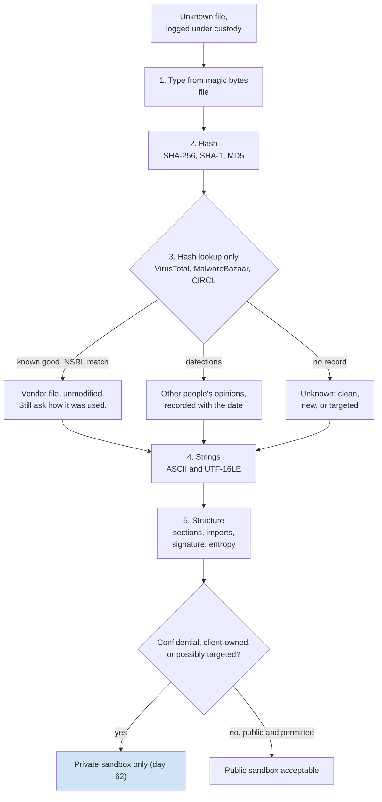

# Day 61: Static triage of a suspicious file

Phase 4, digital forensics and incident investigation. Track goal: identify, fingerprint and look up a file without running it, and record the result on a triage card that says what is known and what is not.

## Concept

Triage is the first half hour with a file. It answers four questions: what kind of file it is, whether anyone has seen it before, what it contains in plain text, and whether it deserves deeper analysis or a sandbox run (day 62). Working out everything a program does is reverse engineering, a separate discipline.

Static triage never executes the file. Do it inside an analysis VM with networking disabled and shared folders off, and keep samples in a password-protected archive when they move between machines (the long-standing convention is a zip with the password `infected`, which stops mail filters and desktop antivirus from acting on it in transit; it is not a security control). If you are triaging something from a live case, you hash it first and log it under chain of custody like any other evidence.

The steps, in order:

1. Type. `file` reads magic bytes, not the extension. `MZ` at offset 0 is a Windows executable; `PK` is a zip (and therefore also `.docx`, `.xlsx`, `.jar`, `.apk`); `%PDF` is a PDF; `\x7fELF` is a Linux binary.
2. Hash. SHA-256 is the identifier every reputation service accepts. Also record MD5 and SHA-1, because older reports and some tools only list those.
3. Reputation. Search the hash, not the file. Uploading a file to a public service shares it with everyone who uses that service, which can leak a client's document or tip off an attacker who watches for their sample. Look up first; upload only when you are allowed to and the file holds nothing confidential.
4. Strings. Readable text in a binary often includes URLs, IPs, file paths, registry keys, user-agent strings, error messages and library names. Windows programs store much of their text as UTF-16LE, which default `strings` misses; ask for it explicitly.
5. Structure. For PE files, the section names, imports (which Windows API functions it calls), compile timestamp and whether it is signed. Packed files show few imports and high-entropy sections.

The five steps as one flow, with the branch that decides where a file may go next:



A reputation result is evidence about other people's opinions of a file, not about your case. "0 of 70 engines detect it" can mean clean, new, or targeted. "Known good in NSRL" means the exact bytes match a file shipped by a software vendor, which is strong evidence the file itself is unmodified, though a legitimate tool can still be misused.

## Resources

- `file(1)`, GNU `strings(1)` (binutils; the `-e l` option reads UTF-16LE), `sha256sum(1)`.
- [FLOSS](https://github.com/mandiant/flare-floss) from Mandiant: extracts plain, stack and some obfuscated strings from PE files.
- [pefile](https://github.com/erocarrera/pefile) (Python) and [PE-bear](https://github.com/hasherezade/pe-bear) (GUI) for PE structure.
- [VirusTotal](https://www.virustotal.com/) hash search; [MalwareBazaar](https://bazaar.abuse.ch/) by abuse.ch; [CIRCL hashlookup](https://hashlookup.circl.lu/) for known-good files (NSRL and others).
- [EICAR test file](https://www.eicar.org/download-anti-malware-testfile/): a harmless string every antivirus product detects on purpose, for testing without real malware.

## Practical: triage cards for a known-good binary, the EICAR test hash, and LAB-P4's unknown file

No malware is used today. You triage a legitimate program you already have, look up the EICAR test file's hash to see what a "detected" record looks like, and write the card you would open for `synchelper.exe` from days 52 to 54, whose bytes you do not have.

**Your checklist for today.** Work through these in order, and check each one off as you finish it:

- [ ] Set up a sample binary and compute its hashes.
- [ ] Look up the hash in CIRCL, VirusTotal and MalwareBazaar.
- [ ] Pull ASCII and UTF-16LE strings from the sample.
- [ ] Look up the EICAR test file by hash.
- [ ] Write the triage card for `synchelper.exe`.
- [ ] Add the explanation sentences to the `sample01` and EICAR cards.

1. Set up. In your Linux analysis VM, copy a legitimate binary into the working area and treat it as an unknown sample.

   ```bash
   mkdir -p ~/lab-p4/triage && cd ~/lab-p4/triage
   cp /usr/bin/curl sample01
   file sample01
   sha256sum sample01; sha1sum sample01; md5sum sample01
   ls -l sample01
   ```

   `file` prints something like `ELF 64-bit LSB pie executable, x86-64, dynamically linked ...`. If you also have a Windows VM, copy `C:\Windows\System32\notepad.exe` out as `sample02` and repeat; `file` will report `PE32+ executable (GUI) x86-64, for MS Windows`.

2. Look up the hash in three places and record each answer with the date you checked.

   ```bash
   H=$(sha256sum sample01 | cut -d' ' -f1)
   curl -s "https://hashlookup.circl.lu/lookup/sha256/$H" | jq .
   ```

   CIRCL returns a JSON record (with fields such as `FileName`, `ProductName` and the source database) when it knows the file, and a "Non existing" message when it does not. A distribution's own build of `curl` may or may not be in its data; either answer is a finding. Then paste the hash into the VirusTotal search box (search only; do not upload) and into MalwareBazaar's search. Expect VirusTotal to show a file with no or very few detections and a history of many submissions, and MalwareBazaar to have no entry.

3. Pull strings, both encodings, and keep only the useful ones.

   ```bash
   strings -n 8 sample01 > sample01.ascii.txt
   strings -n 8 -e l sample01 > sample01.utf16.txt
   wc -l sample01.*.txt
   grep -Eo 'https?://[^ "]+' sample01.ascii.txt | sort -u | head
   grep -Ei 'user-agent|\.so(\.|$)|/etc/|/tmp/' sample01.ascii.txt | sort -u | head -20
   ```

   For `curl` you will find URLs from the help and licence text, shared-library names, and option names. This is the point of the exercise: strings suggest capability and context, and a legitimate network tool contains many "network-looking" strings. Strings alone never make a file malicious. On a Windows sample, run `floss sample02` and compare its count of decoded strings with plain `strings`.

4. Look up the EICAR test file by hash only (do not download or create the file on a work machine, since endpoint protection will quarantine it and raise an alert). The SHA-256 of the standard 68-byte EICAR string is:

   ```text
   275a021bbfb6489e54d471899f7db9d1663fc695ec2fe2a2c4538aabf651fd0f
   ```

   Search it on VirusTotal. Record how many engines flag it and three of the detection names. Notice that the names differ by vendor (`EICAR-Test-File`, `EICAR_Test_File` and similar). Detection names are vendor labels, not a shared taxonomy; never build a finding on a family name from one engine.

5. Write the triage card for `synchelper.exe`. You have no copy of the file, so the card records what the other evidence says and what to request:

   | Field | Entry |
   |---|---|
   | Case / item | LAB-P4 / EVID-002 (MFT), EVID-003 (memory) |
   | Name and path | `C:\Users\acct.clerk01\AppData\Roaming\SyncHelper\synchelper.exe` |
   | Size | 412,160 bytes (MFT entry 88413) |
   | First seen | `$FN` created 2026-03-13 16:42:30 UTC; process start 16:42:31 UTC |
   | Hashes | Not available. Request: file from disk image, or process dump from memory (`windows.pslist --pid 7488 --dump`) |
   | Reputation | Not checked (no hash) |
   | Related | Parent `powershell.exe` 7316; child `rundll32.exe` 7704 with injected MZ region; connections to 198.51.100.23:443 |
   | Triage decision | Acquire and hash; static triage in isolated VM; sandbox only on a private instance, because the file may contain client data or be targeted |

   Where each line of that card comes from. Everything on it is borrowed from other evidence; the dashed box is what a real triage would still need.

   ```mermaid
   graph LR
       MFT["EVID-002 MFT entry 88413<br/>path, 412,160 bytes,<br/>FN created 16:42:30"] --> CARD["Triage card<br/>synchelper.exe"]
       PST["EVID-003 pstree<br/>PID 7488 started 16:42:31,<br/>parent powershell.exe 7316"] --> CARD
       NET["EVID-003 netscan<br/>198.51.100.23:443"] --> CARD
       MAL["EVID-003 pstree + malfind<br/>child rundll32.exe 7704,<br/>MZ in RWX region"] --> CARD
       CARD -.->|"still missing"| NEED["Hashes, strings, reputation:<br/>need the file from a disk image<br/>or a process dump"]
       style NEED stroke-dasharray: 5 5
   ```

6. Add the explanations to two cards:
   - On the `sample01` card, one sentence on why its network-related strings do not make it suspicious (step 3).
   - On the EICAR card, one sentence on why the detection names disagree (step 4).

Artifact: `~/lab-p4/triage/cards.md` with three triage cards (`sample01`, the EICAR hash, `synchelper.exe`), each with the same fields, and every reputation result dated.

## Checkpoint

- Each card lists a SHA-256, or states why it is missing.
- Each card lists the file type from magic bytes, or states why it is missing.
- Each card lists at least one reputation source with the result and date, or states why none was checked.
- Your `sample01` card says in words why its network-related strings do not make it suspicious.
- Your EICAR card lists at least three different detection names.
- Your EICAR card has a sentence on why the names disagree.
- Your `synchelper.exe` card contains no claim about what the program does.
- Every entry on your `synchelper.exe` card is either observed in other evidence or marked as a request.
- Without notes, you can say why a family name from one engine is not a basis for a finding.
