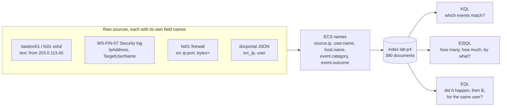

# Day 63: Correlating across sources in Elasticsearch and Kibana

Phase 4, digital forensics and incident investigation. Track goal: load LAB-P4's events into Elasticsearch, answer investigative questions with KQL, ES|QL and EQL, and build a Kibana dashboard that shows the incident at a glance.

## Concept

A SIEM (security information and event management system) is where an organisation's logs already live, normalised to shared field names and searchable across hosts. For an investigator that changes the workflow: instead of collecting files from each server and merging them yourself (days 56 to 58), you query the whole estate at once, then collect originals for the events that matter.

Normalisation is what makes cross-source queries possible. The Elastic Common Schema (ECS) gives every source the same names for the same idea: `source.ip`, `destination.ip`, `user.name`, `host.name`, `event.category` (such as `authentication` or `network`), `event.outcome` (`success` or `failure`). A single query on `user.name : "svc_backup"` then returns Linux SSH logs, Windows logons and application events together. LAB-P4's export in `resources/case-lab-p4/siem/lab-events.ndjson` uses ECS names and is already corrected to UTC.

From four raw formats to one index and three kinds of question:



Kibana gives you three query languages, each for a different job:

| Language | Use it for | Example shape |
|---|---|---|
| KQL (Kibana Query Language) | Filtering events in Discover and dashboards | `user.name : "svc_backup" and event.outcome : "success"` |
| ES\|QL (Elasticsearch Query Language) | Piped queries that aggregate: counts, sums, first/last by group | `FROM idx \| WHERE ... \| STATS ... BY ...` |
| EQL (Event Query Language) | Ordered sequences: "A then B by the same user within 30 minutes" | `sequence by user.name with maxspan=30m [..] [..]` |

A SIEM answer is only as good as the ingest behind it. Before trusting a query, check that the field you are filtering on is populated for the sources you care about, and that time fields are in UTC. On real systems, also check for ingest gaps: a quiet hour on a dashboard can mean nothing happened or that a log shipper stopped.

## Resources

- Elastic documentation: [Run Elasticsearch locally](https://www.elastic.co/docs/deploy-manage/deploy/self-managed/local-development-installation-quickstart) (the `start-local` script), [KQL](https://www.elastic.co/docs/explore-analyze/query-filter/languages/kql), [ES|QL](https://www.elastic.co/docs/explore-analyze/query-filter/languages/esql), [EQL syntax](https://www.elastic.co/docs/reference/query-languages/eql/eql-syntax).
- [Elastic Common Schema field reference](https://www.elastic.co/docs/reference/ecs).
- Kibana's [file upload](https://www.elastic.co/docs/manage-data/ingest/upload-data-files) feature (CSV, NDJSON and log files up to a configurable size).

## Practical: Kibana dashboard "LAB-P4 (synthetic)" and a saved query set

**Your checklist for today.** Work through these in order, and check each one off as you finish it:

- [ ] Start a local Elastic stack on your lab VM.
- [ ] Upload `lab-events.ndjson` and set the field mappings.
- [ ] Sanity-check the ingest in Discover.
- [ ] Run the KQL questions and save each query.
- [ ] Run the ES|QL failed-authentication and bytes-transferred queries.
- [ ] Run the EQL failure-then-success sequence and tighten it.
- [ ] Build the `LAB-P4 (synthetic)` dashboard.
- [ ] Finish your notes and results sheet.

1. Start a local, single-node Elastic stack on your lab VM (Docker required). Elastic's `start-local` script is for local development only and binds to localhost:

   ```bash
   curl -fsSL https://elastic.co/start-local | sh
   cat elastic-start-local/.env | grep -E 'ES_LOCAL_PASSWORD|ES_LOCAL_URL|KIBANA_LOCAL_URL'
   ```

   Record the Elasticsearch and Kibana versions it installed (shown in Kibana under Help, and in the `.env` file). Log in to Kibana at `http://localhost:5601` as `elastic` with the password from `.env`. Do not print that password into your case notes.

2. Upload the data. In Kibana, open the file upload page (search "Upload a file" in the top search bar), choose your hashed working copy of `lab-events.ndjson`, and on the import screen set the index name to `lab-p4`. Open the advanced settings before importing and check the mappings: set `source.ip` and `destination.ip` to type `ip`, `network.bytes` to `long`, and leave `@timestamp` as `date`. Tick "Create data view". After import, the page should report 390 documents.

3. Sanity-check the ingest in Discover before any analysis. Set the time picker to 9 to 15 March 2026 and run:

   ```text
   labels.synthetic : true
   ```

   Then break it down: in the field list, click `event.dataset` and `host.name` to see value counts. You should have four datasets across `bastion01`, `fs01`, `fw01` and `WS-FIN-07`. If a host is missing, fix the ingest now.

4. KQL: answer each question, and save each query (Save query in the query bar) with the question as its name.

   ```text
   event.dataset : "system.auth" and event.outcome : "failure" and source.ip : "203.0.113.45"
   user.name : "svc_backup" and event.outcome : "success"
   source.ip : "198.51.100.23" or destination.ip : "198.51.100.23"
   source.ip : "203.0.113.0/24" or destination.ip : "203.0.113.0/24"
   ```

   The second query shows `svc_backup` succeeding on three hosts in order: `bastion01` from 203.0.113.45, `fs01` from `bastion01`, and `WS-FIN-07` (logon type 3) from `fs01` at 03:27:41. Write that chain in your notes. You saw the WS-FIN-07 logon on day 55 as an isolated outlier; one query now places it 8 minutes after `svc_backup` reached `fs01`.

   The chain that query returns, one account across three hosts:

   ```mermaid
   sequenceDiagram
       participant X as 203.0.113.45
       participant B as bastion01
       participant F as fs01
       participant W as WS-FIN-07
       X->>B: svc_backup success, password, 03:14:07
       B->>F: svc_backup success, publickey, 03:19:22
       F->>W: svc_backup success, logon type 3 (then 4672), 03:27:41
       Note over F,W: This hop is missing from the day 58 story
   ```

5. ES|QL: open Discover, switch to ES|QL, and run the failed-authentication profile.

   ```esql
   FROM lab-p4
   | WHERE event.category == "authentication" AND event.outcome == "failure"
   | STATS failures = COUNT(*), users = COUNT_DISTINCT(user.name),
           first = MIN(@timestamp), last = MAX(@timestamp) BY source.ip, host.name
   | SORT failures DESC
   ```

   Expected three rows: 112 failures from 203.0.113.45 on `bastion01` (8 users), 23 from 10.10.20.5 on `WS-FIN-07` (3 users), and 5 with an empty `source.ip` on `WS-FIN-07` (local interactive failures during office hours). Then find where the bytes went:

   ```esql
   FROM lab-p4
   | WHERE event.dataset == "firewall" AND event.action == "accept"
       AND NOT CIDR_MATCH(destination.ip, "10.0.0.0/8")
   | STATS total_bytes = SUM(network.bytes), connections = COUNT(*) BY source.ip, destination.ip
   | SORT total_bytes DESC
   | LIMIT 5
   ```

   The top row is 10.10.30.17 to 198.51.100.23, 48,213,904 bytes in one connection; the next is under 90,000 bytes. `CIDR_MATCH` needs `destination.ip` mapped as `ip` (step 2).

6. EQL: find "failures then success for the same account". Run it in Kibana Dev Tools:

   ```text
   GET lab-p4/_eql/search
   {
     "query": """
       sequence by user.name with maxspan=30m
         [authentication where event.outcome == "failure"]
         [authentication where event.outcome == "success"]
     """
   }
   ```

   Look at every sequence returned. `svc_backup` on `bastion01` should appear. You may also get sequences for `acct.clerk01`, who mistypes a password about once a day and then logs in normally: a naive rule produces false positives. Tighten it so a single typo does not match, for example by requiring several failures first (EQL supports a repetition modifier, `[authentication where event.outcome == "failure"] with runs=5`, in recent versions), and record how the result set changed.

7. Build the dashboard. Create a dashboard named `LAB-P4 (synthetic)` with at least three Lens panels:
   - Heat map: `@timestamp` per hour on the horizontal axis, `host.name` on the vertical, count of records, filtered by `event.outcome : "failure"`.
   - Bar chart: sum of `network.bytes` by `destination.ip`, top 10, filtered by `event.dataset : "firewall"`.
   - Table: `@timestamp`, `host.name`, `user.name`, `source.ip`, `event.outcome` for `user.name : "svc_backup"`, sorted by time.

   Set the dashboard's time range to 13 March 12:00 to 14 March 06:00 UTC and save it with "Store time with dashboard" ticked.

8. Finish your notes and results sheet:
   - Next to the `svc_backup` chain from step 4, record that the day 58 story did not include the WS-FIN-07 hop.
   - If your ES|QL failed-authentication table from step 5 does not match the three expected rows, write the difference and its cause.

Artifact: the saved dashboard `LAB-P4 (synthetic)` (export it from Stack Management, Saved Objects, as NDJSON), the saved KQL queries, and a results sheet with each ES|QL and EQL query and its output rows.

## Checkpoint

- Your ingest check shows all four hosts.
- Your ingest check shows 390 documents.
- Your ES|QL failed-authentication table matches the three expected rows, or your results sheet states the difference and its cause.
- Your notes record the `svc_backup` chain across three hosts.
- Your notes record that the day 58 story did not include the WS-FIN-07 hop.
- Your results sheet records what the EQL sequence returned before tightening.
- Your results sheet records what the EQL sequence returned after tightening.
- Your results sheet names the false-positive account.
- Opened with no adjustment, the dashboard's time range is 13 March 12:00 to 14 March 06:00 UTC.
- Opened with no adjustment, the heat map shows hot cells in the 02:00 to 04:00 hours.
- Opened with no adjustment, the bar chart's largest bar is the single external destination 198.51.100.23.
- Without notes, you can say why the second ES|QL query needs `destination.ip` mapped as `ip`.

## Note

The `start-local` script, the file upload page location and some ES|QL and EQL features differ between Elastic versions. The expected results above come from the synthetic data itself (counted with `jq`); if Kibana shows different numbers, check your mappings and time range before doubting the data.
