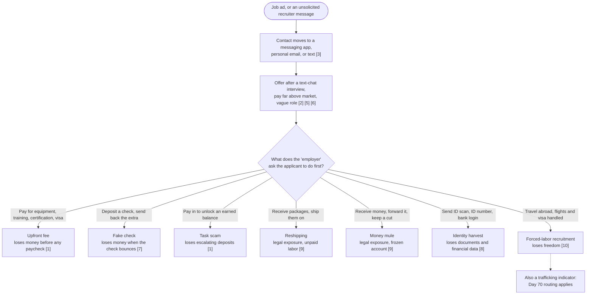
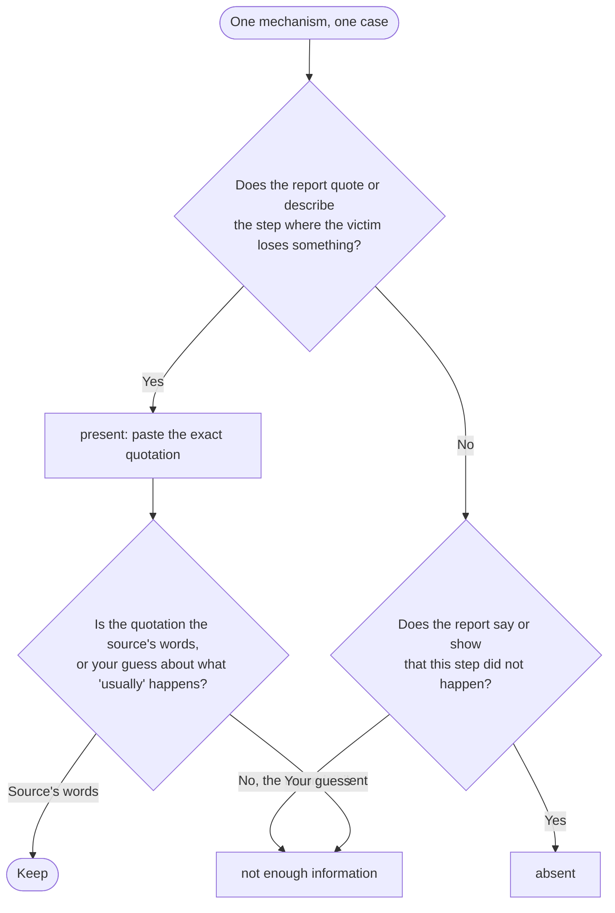

# Day 67: Recruitment fraud, the mechanisms and an evidence-scored checklist

Phase: 5. Fraud, scam, and social-engineering investigation · Track goal: Score a job offer against the known recruitment-fraud mechanisms, one quoted piece of evidence per mechanism, and produce entries clean enough to feed tomorrow's relationship graph.

## Concept
Recruitment fraud uses a fake job to get money, identity documents, or labor out of the applicant. IC3 recorded 24,688 employment-fraud complaints in 2025 with $362.9 million in reported losses, up from $264.2 million in 2024. The FTC reported that job-scam losses more than tripled between 2020 and 2023 and passed $220 million in the first half of 2024 alone, with "task scams" growing from none found in a sample of 2020 reports, to about 5,000 reports in all of 2023, to about 20,000 in the first half of 2024.

The scams vary on the surface (a remote data-entry role, a "product rating" gig, a warehouse "quality control" position) but they reuse a small set of mechanisms. Each mechanism has a point where the applicant loses something. Knowing where that point is lets you write down exactly what evidence shows the mechanism is present.

| Mechanism | What the victim loses, and when | Evidence that confirms it |
|---|---|---|
| Upfront fee | Money, before any paid work: "equipment", "training", "certification", "visa processing" | A payment request with amount and method before a first paycheck |
| Fake check | Money, days later when the deposited check bounces | A check or transfer larger than expected, with an instruction to send back or forward the difference |
| Task scam | Money, in escalating "deposits" to unlock earned commissions | An app or site showing a balance the victim can only withdraw after paying in, often in cryptocurrency |
| Reshipping | Legal exposure, and unpaid labor | Instructions to receive packages at home and ship them to a new address, often overseas, with prepaid labels |
| Money mule / "payment processor" | Legal exposure, and a frozen bank account | Instructions to receive funds into a personal account and forward them, keeping a percentage |
| Identity harvest | ID documents and financial data | Requests for a government ID number, ID scan, or bank login before any real interview or signed offer |
| Forced-labor recruitment | Freedom | An overseas job with flights and visa "handled", a vague role, and a destination known for scam compounds (see below) |

The early stages look much the same whichever mechanism follows. The split comes at the first thing the "employer" asks the applicant to do, and that request is where the loss happens. The numbers in brackets are items on the red-flag checklist below.



In August 2023 the UN Human Rights Office (OHCHR) reported that at least 120,000 people in Myanmar and around 100,000 in Cambodia may be held in scam centres and forced to run online fraud, many recruited through fake job ads for customer service, IT, or marketing roles. A FinCEN alert from September 2026 (FIN-2026-Alert005) describes the same scam-center ecosystem from the money-laundering side. The person sending a romance or investment scam message may be a trafficking victim who answered a recruitment ad, which ties Days 67, 69, and 70 together.

### Red-flag checklist
1. Any payment from the applicant before the first paycheck.
2. An offer made without a live interview, or after a text-chat "interview" only.
3. Contact moves off the job board to a messaging app, personal email, or text within the first exchange.
4. The recruiter's email domain does not match the company's real domain, or is a free-mail address.
5. Pay far above market for the stated skills and hours.
6. A vague role description that never names a manager, team, or deliverable.
7. A check or transfer arrives before any work, with instructions about what to do with the extra.
8. Requests for identity numbers, ID scans, or bank details before a signed offer from a verifiable employer.
9. Receiving and reshipping packages, or receiving and forwarding money, as the core of the job.
10. For overseas roles: the employer covers flights and visa without a verifiable contract, the destination city is vague, and the applicant is asked to travel on a tourist visa.

## Resources
- [FTC: Job scams](https://consumer.ftc.gov/articles/job-scams): the FTC's named scam types (reshipping, reselling, fake-check nanny and assistant jobs, mystery shopper, placement fees, government-job fees).
- [FTC Data Spotlight: Paying to get paid, gamified job scams drive record losses (Dec 2024)](https://www.ftc.gov/news-events/data-visualizations/data-spotlight/2024/12/paying-get-paid-gamified-job-scams-drive-record-losses): how task scams work, with report counts.
- [OHCHR: Online scam operations and trafficking into forced criminality in Southeast Asia (2023)](https://bangkok.ohchr.org/sites/default/files/documents/2025-01/online-scam-operations-2582023.pdf): the recruitment side of the scam-centre problem, from victim accounts.
- [FBI IC3 2025 Internet Crime Report (PDF)](https://www.ic3.gov/AnnualReport/Reports/2025_IC3Report.pdf): employment-fraud counts and losses, plus a note on voice spoofing in online job interviews.
- [Canadian Anti-Fraud Centre](https://antifraudcentre-centreantifraude.ca/) and [Report Fraud (UK)](https://reportfraud.police.uk/): national advisories with recent job-scam variants.

## Practical: an evidence-scored recruitment-fraud scorecard

Build a spreadsheet with one row per case and one column per mechanism from the table above. Each cell holds either "absent", "not enough information", or the quoted evidence that shows the mechanism present. Add columns for: source link, date of the report, the channel of first contact, and every concrete indicator you can extract (email addresses, domains, phone numbers, payment handles, company names, app names, cryptocurrency addresses, and distinctive phrases). Those indicator columns are what Day 68 will graph.

Start from this header. Each indicator type gets its own column, so when you turn the values into Day 68 indicator nodes, each one already carries its node type (phone, domain, wallet, and so on). Separate multiple values in one cell with a semicolon, and quote any cell that contains a comma.

```
case_id,source_link,report_date,first_contact_channel,interview,upfront_fee,fake_check,task_scam,reshipping,money_mule,identity_harvest,forced_labor_recruitment,off_platform_move,phones,emails,domains,payment_handles,crypto_addresses,company_names,app_names,phrases
```

Every mechanism cell gets one of three values, decided like this:



### Worked example (fictional)
The case below is invented. Phone numbers use the 555-01xx range reserved for fiction, and domains use `.example`.

> A job seeker applied to a "Remote Order Review Associate" posting on a job board. Within an hour, "Dana from Brightwell Staffing" texted from +1 202 555 0147 asking to continue on a messaging app. The "interview" was a text chat. Dana offered $45/hour, 10 hours a week, no experience needed. Training involved rating products in an app at `brightwell-tasks.example`. After two days, the app showed a $310 balance, but withdrawal required a "merchant upgrade" deposit of $95 in USDT to a wallet address beginning `TFICT`. After the deposit, the next tier required $480.

| Field | Entry |
|---|---|
| Upfront fee | Absent in the classic form (no fee before starting) |
| Task scam | Present: "withdrawal required a 'merchant upgrade' deposit of $95 in USDT", followed by a $480 tier |
| Identity harvest | Not enough information |
| Reshipping / mule | Absent |
| Off-platform move | Present: "texted ... asking to continue on a messaging app" within an hour |
| Interview | Text chat only |
| Indicators | +1 202 555 0147; "Brightwell Staffing"; "Dana"; `brightwell-tasks.example`; wallet `TFICT...`; phrase "merchant upgrade" |
| Novel or known? | Known pattern (FTC task-scam description matches) |

**Your checklist for today.** Work through these in order, and check each one off as you finish it:

- [ ] Score the worked example yourself, then compare
- [ ] Find three published recruitment-fraud reports
- [ ] Score each report, marking silence as "not enough information"
- [ ] Record every indicator exactly as published, with source links
- [ ] Count the "not enough information" cells in your three real cases

### Steps
1. Score the worked example yourself before reading the table, then compare.
2. Find three real, already-published recruitment-fraud reports. Good sources: FTC consumer alerts, CAFC or Report Fraud advisories, local news stories that quote a victim's messages, and DOJ press releases for charged cases. Do not engage with a live job-scam listing or recruiter, and do not apply to a suspect job to "see what happens".

   These searches return already-published material and are a reasonable place to start:

   ```
   site:justice.gov "reshipping" scheme sentenced
   site:justice.gov "money mule" "job" pleaded guilty
   site:consumer.ftc.gov job scam
   site:ftc.gov "task scam"
   site:antifraudcentre-centreantifraude.ca employment scam
   ```

   Pick reports that quote messages or payment details. A report that only says "victims lost money to a fake job" will leave every cell at "not enough information".
3. Score each report. Where the report is silent, write "not enough information". Do not fill a gap with what the scam "usually" does.
4. Record every indicator exactly as published. Keep the source link next to each.
5. Count how many cells in your three real cases are "not enough information" and write the count in your notes (not in `day67-scorecard.csv`, which Day 68 imports). Published reports are usually incomplete, and a scorecard with no gaps at all usually means someone filled them in by guessing.

### The artifact
A scorecard spreadsheet with four rows (the worked example plus your three real cases), every present mechanism backed by a quotation, and a complete indicator column per case. Save it as `day67-scorecard.csv`; Day 68 imports it.

## Checkpoint
- Pick any cell marked present: you can show the quotation that supports it.
- No cell marked present rests on your inference ("they probably asked for ID later"). Any cell that did now reads "not enough information".
- Your notes record the count of "not enough information" cells in your three real cases.
- Without notes, can you explain why a scorecard with no gaps at all is a warning sign?
