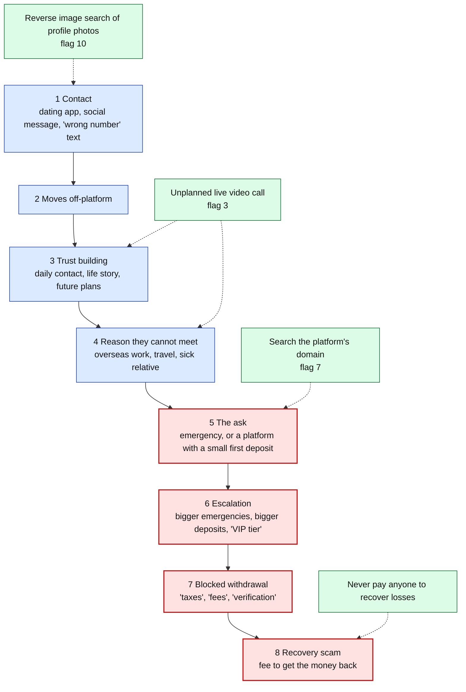
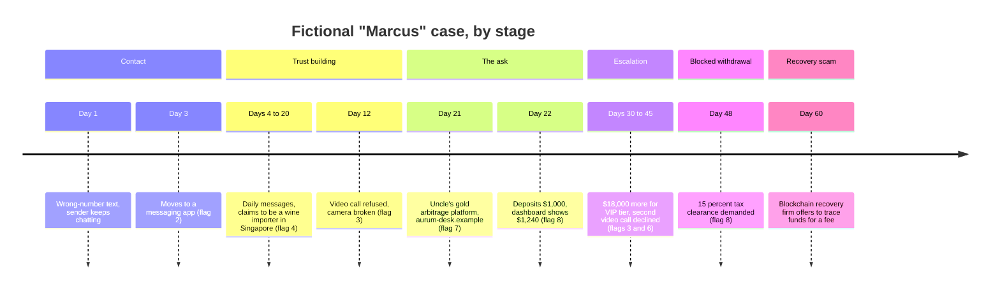

# Day 69: Romance and relationship-investment scams

Phase: 5. Fraud, scam, and social-engineering investigation · Track goal: Lay a published romance or relationship-investment scam out as a staged timeline, mark the red flags at the stage where each one appeared, and identify the earliest point where a single check would have exposed it.

## Concept
Romance scams build a relationship first and ask for money later, sometimes months later. IC3's 2025 report counts 23,159 confidence/romance complaints and $929.3 million in reported losses. For victims aged 60 and over, confidence/romance losses alone were $584 million. A related form mixes romance with a fake investment: the contact never asks for money outright, and instead introduces a trading platform that shows the victim large, fictitious gains. FinCEN's September 2023 alert (FIN-2023-Alert005) calls it "pig butchering", and its 2026 alert uses "digital asset investment scam", following INTERPOL's December 2024 call to drop the older term because it demeans victims. This curriculum uses "relationship-investment scam", and you should too when talking to anyone who lost money.

Both forms follow a sequence that published alerts describe consistently:

1. Contact: a dating app, a social media message, or a "wrong number" text that turns into a conversation.
2. Moving off-platform, usually to a messaging app, early.
3. Trust building: daily contact, a detailed life story, future plans together.
4. The reason they cannot meet: overseas work (the FTC names oil rigs, the military, international organizations), travel, a sick relative.
5. The ask. In a romance scam, an emergency: medical bills, a plane ticket, customs fees, a legal problem. In a relationship-investment scam, an "opportunity" on a platform the contact recommends, with a small first deposit that shows quick gains.
6. Escalation: larger emergencies, or larger deposits to reach a "VIP tier".
7. Blocked withdrawal: "taxes", "fees", or "account verification" must be paid before money can come out.
8. Recovery scam: after the loss, someone claiming to be a lawyer, an agency, or a "fund recovery" service offers to get the money back for a fee. FinCEN's 2026 alert notes that scammers repeatedly target the same victim this way.

The diagram adds the victim's side: the checks from this day's Practical, attached to the stage where each one can first expose the scam. Stages outlined in red are where money moves.

### Why a refused video call matters so much
A live, unplanned video call is the cheapest identity check available to the victim, and for years it reliably broke romance scams. The profile photos are usually stolen from a real person who has no idea they are being used, and the operator behind the account often does not match them in age, sex, or nationality. The operator may also be one of several people working the same account in shifts. So the account has to avoid live video, and the excuses repeat: broken camera, bad signal, security rules at work, "I'm shy on camera". A pattern of refusals across weeks is one of the strongest single signals in this category.

Deepfake video has weakened this check without removing it. IC3's 2025 report notes AI-generated fake profiles and scripts in romance scams. A pre-recorded or real-time face swap can pass a short, passive call. What still helps is an unplanned call with requests the operator did not prepare for, like turning the head fully sideways or passing a hand in front of the face, and many scam accounts still avoid video altogether. Day 71 covers this in more depth.

### Red-flag checklist
1. Declarations of love or "soulmate" talk within days, before any in-person meeting.
2. Pressure to move from the dating app or social platform to a private messaging app.
3. Repeated, varied excuses for not doing a live video call.
4. A job that keeps them far away and hard to verify.
5. Personal details that shift between conversations (age, hometown, children's names).
6. Any request for money, gift cards, or cryptocurrency from someone never met in person.
7. Unprompted investment talk, especially a specific platform or app the victim has never heard of.
8. Early "profits" that look large, followed by fees to withdraw.
9. Requests for secrecy from family and friends ("they wouldn't understand us").
10. Profile photos that reverse image search finds under a different name.

## Resources
- [FTC: What to know about romance scams](https://consumer.ftc.gov/articles/what-know-about-romance-scams): the standard lies, the payment methods, and the core advice ("never send money or gifts to a sweetheart you haven't met in person").
- [FinCEN Alert FIN-2023-Alert005 (PDF)](https://www.fincen.gov/sites/default/files/shared/FinCEN_Alert_Pig_Butchering_FINAL_508c.pdf): the stage-by-stage description of relationship-investment scams, plus behavioral, financial, and technical red flags.
- [FinCEN Alert FIN-2026-Alert005 (PDF)](https://www.fincen.gov/system/files/2026-08/FinCEN-Alert-Scam-Centers.pdf): scam centers, recovery scams, and laundering red flags.
- [FBI IC3 2025 Internet Crime Report (PDF)](https://www.ic3.gov/AnnualReport/Reports/2025_IC3Report.pdf): confidence/romance figures, the 60+ breakdown, and the AI section.
- [TinEye](https://tineye.com/) and [Google Lens](https://lens.google/): reverse image search.
- [TimelineJS](https://timeline.knightlab.com/): free timeline builder from Northwestern's Knight Lab, driven by a Google Sheets template.
- [The Fraudster Glossary](https://www.fraudsterglossary.com) by Eric Huber: slang and jargon fraudsters actually use, with real usage examples from observed conversations, including romance-scam terminology.

## Practical: TimelineJS, a staged timeline of a published case

### Worked example (fictional)
This case is invented for training and matches no real person.

| Day | Event | Stage | Red flags |
|---|---|---|---|
| 1 | "Wrong number" text: "Hi Lena, is the dinner still on for Friday?" Victim replies it's the wrong number; sender apologizes and keeps chatting | Contact | Unsolicited "wrong number" opener |
| 3 | Sender, "Marcus", suggests moving to a messaging app | Off-platform | 2 |
| 4 to 20 | Daily messages. Marcus says he is a wine importer based in Singapore. Sends photos of meals and a harbor view | Trust building | 4 |
| 12 | Video call proposed by victim. "My camera is broken, new phone arrives next week" | Trust building | 3 |
| 21 | Marcus mentions his uncle's "gold arbitrage" strategy and a platform at `aurum-desk.example` | The ask | 7 |
| 22 | Victim deposits $1,000; dashboard shows $1,240 two days later | The ask | 8 |
| 30 to 45 | Victim deposits $18,000 more to reach "VIP tier". Second video call request declined ("at work, not allowed") | Escalation | 3, 6 |
| 48 | Withdrawal blocked pending a 15% "tax clearance" payment | Blocked withdrawal | 8 |
| 60 | A "blockchain recovery firm" contacts the victim offering to trace funds for a fee | Recovery scam | Unsolicited recovery offer |

The earliest single check that would have exposed the case is day 12: the refused video call, combined with day 1's opener. Reverse image search of the meal and harbor photos might also have found them under other names.

The same case laid out by stage is roughly what your TimelineJS output should communicate: every entry tagged, and the money entries easy to pick out.

**Your checklist for today.** Work through these in order, and check each one off as you finish it:

- [ ] Pick one published case with at least eight timeline-worthy events
- [ ] Fill in the TimelineJS template, one row per event, tagged by stage and flag
- [ ] Publish the sheet and generate the TimelineJS link
- [ ] Write the two-paragraph analysis: earliest exposing check, and every point money moved
- [ ] Test reverse image search on a stock photo, not a real person's photo

### Steps
1. Pick one published case with enough detail to build at least eight timeline entries. Good sources: a DOJ press release or indictment summary for a charged relationship-investment scheme, a news feature that reconstructs a victim's messages with their consent, or the FinCEN 2023 alert's narrative. Use the published account only. Do not contact the victim, the journalist's sources, or any account named in the story.
2. Copy the TimelineJS Google Sheets template, fill one row per event with the date (or relative day), a headline, and a text field that quotes or closely paraphrases the source, then tag each row with its stage and checklist numbers.
3. Publish the sheet to the web (File, Share, Publish to web) and paste its URL into the TimelineJS generator to get a timeline link.
4. Below the timeline, write two short paragraphs: the earliest point at which one check (a video call, a reverse image search, a search of the platform's domain) would have exposed the scam, and every point where money moved.
5. To learn the reverse image tools without involving a real person, run a stock photo from a free stock site through TinEye and Google Lens and note how many other sites use it. Do not upload photos of identifiable private people, including profile photos from scam warnings; those faces usually belong to someone whose images were stolen.

### The artifact
A published TimelineJS timeline of your chosen case, with every entry tagged by stage and red-flag number, and the two-paragraph analysis. Save the sheet as well; the timeline link alone is not a record.

## Checkpoint
- Your timeline has at least one entry in stage 1 (Contact).
- Your timeline has at least one entry in stage 5 (The ask).
- Your timeline has at least one entry in stage 7 (Blocked withdrawal).
- Each red-flag tag points to text in the source.
- Your analysis never calls the victim "naive", "greedy", or a "pig". If it did, that wording has been rewritten in terms of what the scammer did.
- Without notes, can you explain why a refused video call carried so much weight before deepfakes?
- Without notes, can you explain what an unplanned call still tests today?
