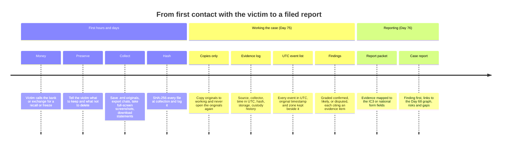
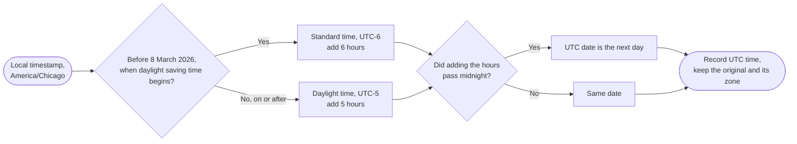
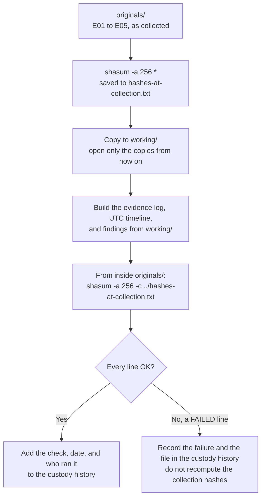

# Day 75: Case documentation, from preserved evidence to a timeline

Phase: 5. Fraud, scam, and social-engineering investigation · Track goal: Preserve a fictional victim's evidence with hashes and an evidence log, rebuild the case as a timeline in a single time zone, and grade each finding by how well it is supported.

## Concept
A fraud case is usually won or lost on paperwork done in the first days. Banks can sometimes recall a transfer if they hear about it fast with exact details. IC3's Recovery Asset Team froze about 58% of the money in the incidents it worked in 2025, and its advice is to call the bank immediately and then file with "the full transaction details". Platforms can remove accounts if you give them the exact profile URL or username. Law enforcement can link your case to others if the phone numbers, wallets, and domains are written exactly. None of that works from a summary like "she paid them about $20k in crypto sometime in March".

The path from first contact with the victim to a filed report, with this day covering the first two sections and Day 76 the last:



Good documentation has three properties.

It preserves originals. You keep the original email file (`.eml`) with its headers, not a forwarded copy. You export the chat with the app's own export feature, then take screenshots in addition to the export. Screenshots show the full screen, including the phone's clock and the contact's handle. You write down transaction hashes and wallet addresses from the exchange's records, and account numbers and reference numbers from bank statements. You work on copies and keep the originals untouched.

It proves nothing changed. When you collect a file, compute its SHA-256 hash and log it. If anyone later questions whether the file was altered, rehashing it and getting the same value shows that it was not. The log records what the item is, where it came from, who collected it, when, and how it has been stored and transferred since. That record is the chain of custody.

It separates what is known from what is inferred. The recon-log template from Day 22 grades findings as confirmed, likely, or disputed. Keep using it. "Payment 3 went to wallet `TFICT-A1`" is confirmed if the exchange record shows it. "The operator is based overseas" is at best likely, and only if you can say what supports it.

Time zones catch almost everyone. The victim's phone shows local time, the exchange records UTC, the email header has its own offset, and the bank statement may show only a date. Convert every event to UTC in the timeline and keep the original timestamp and its zone in a separate column.

For this day's case, every local time goes through the same three questions:



### What to ask a victim to keep (and not do)
1. Do not delete the conversation, the app, or the account before exporting. Blocking the scammer is fine once the export is done.
2. Do not reply to the scammer or to anyone offering to recover the money.
3. Save emails as files with "Download original" or "Save as", not by forwarding.
4. Export chats with the app's own export option where it exists (for example WhatsApp's "Export chat"; Telegram Desktop's "Export chat history").
5. Download statements from the bank and exchange showing each payment.
6. Write down, while memory is fresh, every name, number, username, website, and app the scammer used.

## Resources
- [FBI IC3 2025 Internet Crime Report (PDF)](https://www.ic3.gov/AnnualReport/Reports/2025_IC3Report.pdf): the Recovery Asset Team and Financial Fraud Kill Chain section on why speed and transaction detail matter.
- [IC3 FAQ](https://www.ic3.gov/Home/FAQ): what evidence IC3 tells complainants to keep (receipts, bank records, "preferably electronic copies of emails") and hold for law enforcement.
- [NIST SP 800-86, Guide to Integrating Forensic Techniques into Incident Response](https://csrc.nist.gov/pubs/sp/800/86/final): the collection, examination, analysis, and reporting phases, and why hashing and documentation matter.
- Built-in hashing tools, no install needed: `shasum -a 256 <file>` on macOS, `sha256sum <file>` on Linux, `Get-FileHash <file> -Algorithm SHA256` in Windows PowerShell.
- [`worksheets/osint-recon-log.md`](../../worksheets/osint-recon-log.md): the confirmed / likely / disputed grading you will reuse.

## Practical: SHA-256 hashing and a spreadsheet, an evidence log and a UTC timeline

### The fictional case
This case is based on the Day 74 role-play scenario. Everything in it is invented. Create each item below as a file in a folder called `case-FICT-075/originals/`, typing the content as given. (In a real case these would be the victim's exports; here you make them so you have something to preserve.)

- `E01-first-text.txt`: "SMS from +1 202 555 0147, received 2026-01-06 19:42 (phone set to America/Chicago): Hi Lena, is the dinner still on for Friday?"
- `E02-app-screenshot-note.txt`: "Screenshot description: aurum-desk.example dashboard showing balance $1,240.00, phone clock 2026-01-24 08:15 America/Chicago."
- `E03-exchange-record.csv`:
  ```
  time_utc,amount_usdt,to_address,tx_hash
  2026-01-22T15:03:11Z,1000,TFICT-A1,0xFICT01
  2026-02-03T16:40:55Z,5000,TFICT-A1,0xFICT02
  2026-02-10T17:02:09Z,4000,TFICT-A1,0xFICT03
  2026-02-18T15:20:47Z,6000,TFICT-B7,0xFICT04
  2026-02-26T19:11:30Z,3000,TFICT-B7,0xFICT05
  ```
- `E04-withdrawal-message.txt`: "In-app message 2026-03-01 10:05 America/Chicago: Withdrawal pending. Tax clearance of 15% ($2,850) required."
- `E05-recovery-call-note.txt`: "Victim's note: call 2026-03-09 about 14:00 local from +1 646 555 0108, caller said 'Chainsafe Recovery', asked for $1,500 fee."

**Your checklist for today.** Work through these in order, and check each one off as you finish it:

- [ ] Hash every file in originals/ and save the output
- [ ] Copy originals/ to working/ and open only the copies from now on
- [ ] Build the evidence log
- [ ] Build the UTC timeline, converting every local time
- [ ] Add the graded findings table
- [ ] Rehash originals/ and compare against hashes-at-collection.txt
- [ ] If any hash fails, record it in the custody history, not the collection hashes

### Steps
1. Hash every file in `originals/` and save the output:
   ```
   cd case-FICT-075/originals
   shasum -a 256 * > ../hashes-at-collection.txt
   ```
   (Use `sha256sum *` on Linux or `Get-FileHash * -Algorithm SHA256` on Windows.)
2. Copy the folder to `working/`. From now on, open only the copies.
3. Build the evidence log with columns: item ID, description, source (who provided it and how), collected by, collection date and time (UTC), SHA-256, storage location, and a custody history column where every later access or transfer is added as a new line.
4. Build the timeline with columns: event ID, time (UTC), original timestamp and zone, event, evidence item ID(s), indicators (exact values), and confidence (confirmed, likely, disputed). Convert every local time to UTC. America/Chicago is UTC-6 in January and February 2026, since daylight saving time begins on 8 March 2026. The 9 March call is therefore in daylight time (UTC-5).
5. Add a findings table in the Day 22 format. Include at least these findings and grade each: the total deposited; that two wallets received the money; that the "tax" demand was a scam; that the recovery call is connected to the original scammers. The last one should come out as disputed or unsupported: nothing in the evidence links +1 646 555 0108 to the other indicators, and recovery scammers often buy victim lists from elsewhere.
6. From inside `originals/`, rehash the files and compare with `hashes-at-collection.txt`:
   ```
   shasum -a 256 -c ../hashes-at-collection.txt
   ```
   Every line should end in `OK`. Record the check in the custody history.
7. If any line in step 6 does not end in `OK` (for example, because you edited a file in `originals/` by accident), record that in the custody history rather than recomputing the collection hashes.

The hashing steps as a loop. The one rule that is easy to break under pressure is on the failure branch: the collection hashes are never recomputed.



### Worked example row (timeline)

| ID | Time (UTC) | Original | Event | Evidence | Indicators | Confidence |
|---|---|---|---|---|---|---|
| T01 | 2026-01-07 01:42 | 2026-01-06 19:42 America/Chicago | First contact by SMS, "wrong number" opener | E01 | +1 202 555 0147 | Confirmed (victim's phone record) |

Note that the UTC date is the day after the local date. A timeline sorted by local date would put this event on the wrong day.

### The artifact
The `case-FICT-075/` folder containing `originals/`, `working/`, `hashes-at-collection.txt`, and a spreadsheet with three tabs: evidence log, UTC timeline (at least nine events: first contact, the dashboard screenshot, five payments, the tax demand, the recovery call), and graded findings.

## Checkpoint
- Total the payments from the exchange record: your findings table says $19,000.
- Your findings table says the $19,000 went in five payments.
- Your findings table says the payments went to two wallets.
- That finding is graded confirmed.
- That finding cites the evidence item.
- Your hash check shows `OK` for every file.
- If the check failed for any file, the custody history records the failure, and `hashes-at-collection.txt` has not been recomputed.
- The event whose UTC date differs from its local date is converted correctly.
- The event that falls after the daylight-saving change is converted correctly.
- Read as a skeptic would, every "confirmed" in your findings table points to an evidence item that shows it directly.
- Without notes, can you explain why you never recompute the collection hashes after a failed check?
