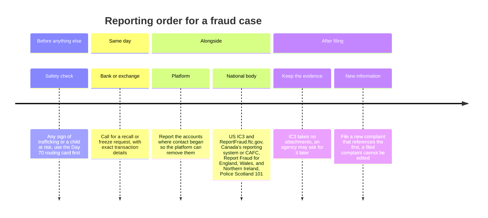
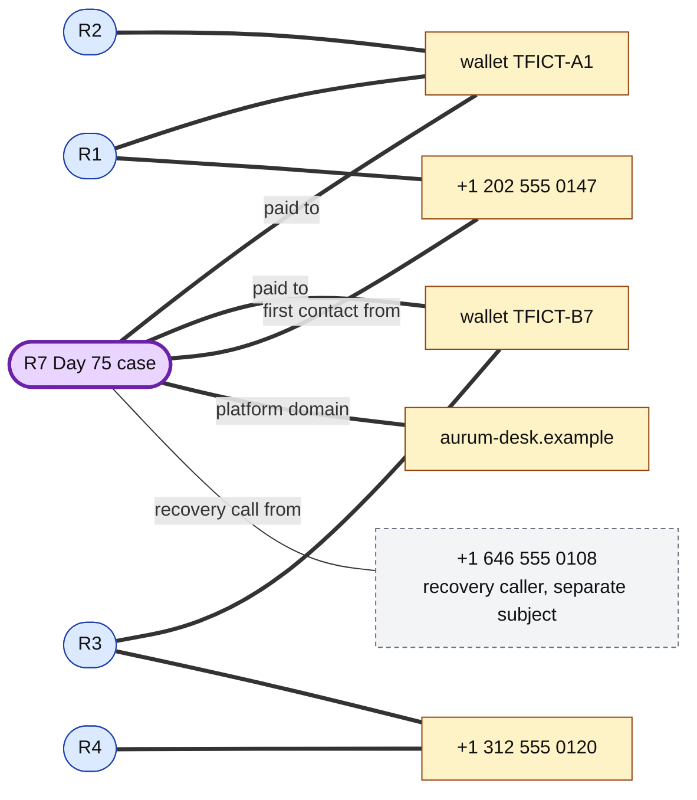

# Day 76: Reporting a fraud case to IC3 or a national anti-fraud centre

Phase: 5. Fraud, scam, and social-engineering investigation · Track goal: Turn the Day 75 case file into a complete report packet mapped to what a national reporting body asks for, write the case report that accompanies it, and close the phase with the relationship graph updated.

## Concept
Most fraud reports are thin because the person filing them has only a story and a rough loss figure. The receiving agency cannot freeze a transfer, connect the case to others, or pass it to an investigating unit without exact details. Your job, when you help someone report, is to have those details ready before the form opens.

National reporting bodies ask for broadly the same things. The FBI's IC3 FAQ lists them:

- The complainant's name, address, telephone, and email.
- Financial transaction information: account information, transaction date and amount, and who received the money. The complaint form breaks this down further into payment type, amount, account numbers, the receiving bank's name and address, and receiving cryptocurrency addresses.
- Information about the subject (the person or entity who committed the crime): name, address, telephone, email, website, and IP address, as far as known.
- Specific details on what happened, in the complainant's words.

IC3 does not accept attachments, does not investigate complaints itself (it refers them to law enforcement), and cannot provide status updates. A filed complaint cannot be cancelled or edited, so new information goes in as a new complaint that references the first. IC3 also asks complainants to keep their evidence (receipts, bank records, electronic copies of emails) in case an agency requests it. That is why Day 75's evidence log matters even though none of it gets uploaded.

Where to report depends on where the victim lives:

| Jurisdiction | Fraud and cybercrime reporting | Notes |
|---|---|---|
| United States | [IC3](https://www.ic3.gov/) for internet-enabled crime; [ReportFraud.ftc.gov](https://reportfraud.ftc.gov/) for consumer fraud | Filing both is common; they serve different purposes |
| Canada | [National Cybercrime and Fraud Reporting System](https://reportcyberandfraud.canada.ca/), run by the RCMP's National Cybercrime Coordination Centre and the Canadian Anti-Fraud Centre; CAFC phone 1-888-495-8501 | Reports can be made by victims, targets, or witnesses, and anonymously |
| England, Wales, Northern Ireland | [Report Fraud](https://reportfraud.police.uk/), 0300 123 2040, run by the City of London Police | Replaced Action Fraud: went live in early December 2025, full public launch January 2026; same phone number |
| Scotland | Police Scotland, 101 | Report Fraud does not cover Scotland |

A report to a national body runs alongside other steps and does not replace them. The bank or exchange gets called first, the same day, for a recall or freeze request. The platform where contact began (dating app, job board, social network) gets its own report so it can remove the accounts. If there is any sign of trafficking or a child at risk, the Day 70 routing card applies before any of this.

The order, read left to right:

### What makes a report usable
1. Every payment listed separately, with date, amount, method, and the receiving account or address exactly as written. A total alone is not enough.
2. Every identifier exactly as seen: phone numbers with country code, usernames with the platform, full domains and URLs (defanged in your own notes, as written in the form).
3. A narrative in plain chronological order, short enough to read in two minutes, in the victim's words where possible.
4. Facts and inferences kept apart. "The website was aurum-desk.example" is a fact. "The same group runs lumen-rewards.example" belongs in the report only if you have the evidence, and labeled as your assessment.
5. No personal identifiers the form does not ask for. IC3's own complaint form tells filers not to enter Social Security numbers or dates of birth.

## Resources
- [IC3 FAQ](https://www.ic3.gov/Home/FAQ): what complaints must contain, the no-attachment rule, and what happens after filing.
- [IC3 complaint form](https://complaint.ic3.gov/): look through the sections so you know their order. Do not submit anything for this exercise.
- [Report Cybercrime and Fraud (Canada)](https://reportcyberandfraud.canada.ca/) and [Canadian Anti-Fraud Centre](https://antifraudcentre-centreantifraude.ca/).
- [Report Fraud (UK)](https://reportfraud.police.uk/).
- [FBI IC3 2025 Internet Crime Report (PDF)](https://www.ic3.gov/AnnualReport/Reports/2025_IC3Report.pdf): the Financial Fraud Kill Chain section on calling the bank first.
- [`ai-agent-skills/SKILL.md`](../../ai-agent-skills/SKILL.md): the case-report drafting procedure (verdict first, at the right confidence level).

## Practical: IC3 complaint fields, a report packet and case report for the fictional case

Never submit a practice report to a real reporting portal. Fictional reports waste investigators' time and pollute the data that links real cases. Everything below stays in your own files.

**Your checklist for today.** Work through these in order, and check each one off as you finish it:

- [ ] Part 1: the report packet
- [ ] Part 2: the case report
- [ ] Part 3: update the graph

### Part 1: the report packet
Using your Day 75 spreadsheet, build a document with one section per IC3 form area, filled from the fictional case:

1. Victim information: use obviously fictional placeholders ("Lena Doe, 100 Example St, +1 312 555 0101").
2. Financial transactions: one entry per payment, with date (UTC and local), amount in USDT and approximate USD, method (cryptocurrency transfer from an exchange account), receiving address, and transaction hash. Five entries.
3. Subject information: every identifier from the evidence, each on its own line with its type and the evidence item it came from (E01 to E05). Include both wallets, both phone numbers, the domain, and the names used. Mark the recovery caller's number as a separate subject, with a note that no evidence links it to the original operator.
4. Description of the incident: a narrative of 250 words or fewer, in chronological order, in plain language. Write it the way the victim would say it, using the Day 74 practice interview as your model.
5. Other information: the date the bank or exchange was contacted and any reference number (fictional), and whether a report was also made to the platform.

Then write a short cross-walk: for the same case, list which fields you would need to change or add to file with the Canadian or UK service instead. Read those sites' published guidance for what they ask; do not start a real submission to find out.

### Part 2: the case report
Write a one-page report for an internal reviewer (a supervisor, or a bank's fraud team) in this order:

1. Finding, in one sentence, at the right confidence: for example, "A relationship-investment scam took $19,000 in five USDT payments to two wallets between 22 January and 26 February 2026 (confirmed by exchange records)."
2. Evidence: the three or four items that support it, by evidence ID and hash.
3. Links to other cases: run the case's indicators against your Day 68 graph. The fictional wallets `TFICT-A1` and `TFICT-B7` and the phone number +1 202 555 0147 appear there. State which links are strong and what that means ("the case likely belongs to the R1 to R4 cluster: it shares wallet TFICT-A1 with R1 and R2, wallet TFICT-B7 with R3, and the first-contact phone number with R1").
4. Actions taken and recommended: bank or exchange notification, reporting-body filing, platform report, victim referral to support services, and a warning to the victim about recovery scams, including the one already received.
5. Risks and gaps: what is not known, what could make the finding wrong, and what evidence would settle it.

### Part 3: update the graph
Add the Day 75 case as node R7 in your Day 68 Gephi project, with its indicators and weighted edges. Export the updated graph image. It is the phase-level artifact the roadmap README promises: a fraud-ring relationship graph linking shared indicators across multiple reports.

The part of the graph that changes should look like this. R7 joins the cluster through three strong links. The recovery caller's number is in R7's evidence (E05), so it gets an edge to R7, but it touches no other case and stays a separate subject. R5, R6 and the single-case indicators from Day 68 are left out of this drawing.

### The artifact
The report packet (five sections plus the cross-walk), the one-page case report, and the updated relationship graph with R7 connected.

## Checkpoint
- Checked against the IC3 FAQ list, your packet has the complainant details.
- Your packet has each transaction with its receiving account or address.
- Your packet has the subject identifiers.
- Your packet has the narrative.
- Nothing on the IC3 FAQ list is missing from the packet. Anything missing is a gap an agency would have to come back for.
- In the case report, the first sentence carries its own confidence label.
- The case report does not present the recovery caller as linked to the operator.
- On the graph, R7 attaches to the existing cluster through wallet `TFICT-A1`, a strong link.
- R7 attaches to the existing cluster through wallet `TFICT-B7`, a strong link.
- R7 attaches to the existing cluster through phone +1 202 555 0147, a strong link.
- The recovery caller's number, +1 646 555 0108, connects to nothing else.

Last, reread what you wrote on Day 1 about what would make you stop, even if you technically could. Over these twelve days you handled phishing kits, lookalike domains, a fraud ring's wallets, trafficking indicators, and a victim's account of losing their savings. Write three or four sentences on whether your answer has changed and on the moment in this phase when the line felt closest. Keep it with your progress board.
