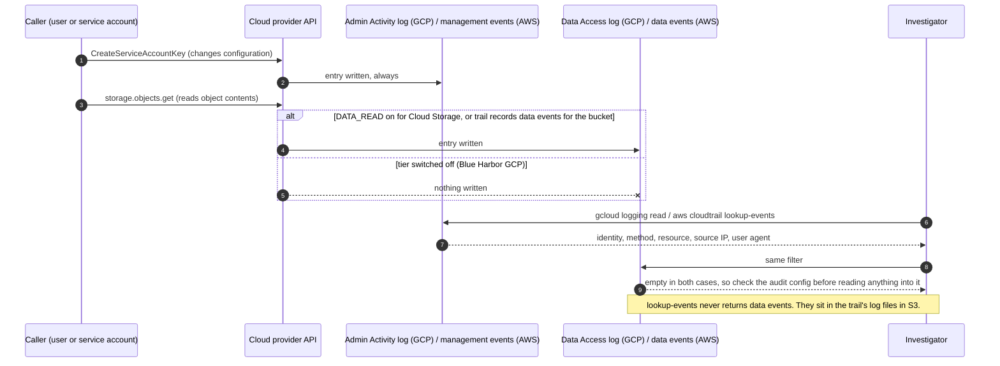
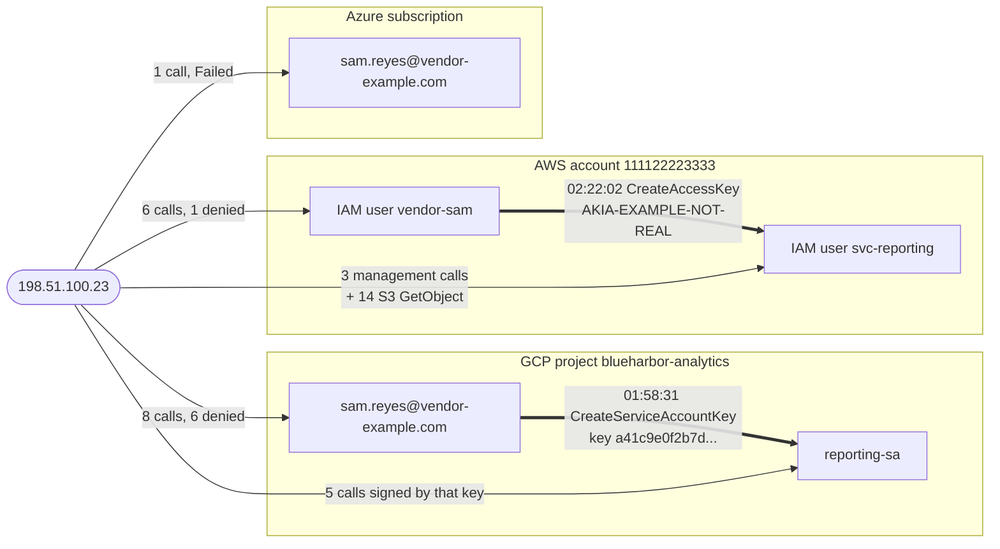

# Day 77: Reading cloud audit logs in GCP and AWS

Phase: 6. Cloud and AI-system investigation. Track goal: Take custody of the Blue Harbor evidence, pull the control-plane audit trail out of two clouds, and turn a raw event dump into one actor, action and resource timeline.

## Concept

Phase 6 runs one synthetic case, Blue Harbor, from intake to final report. The evidence lives in [`resources/`](resources/), and [`resources/README.md`](resources/README.md) describes the company, the logging that was switched on, and every file. Read the README's first two sections before you start, but not the instructor key.

When an on-premise server is compromised you image its disk. In a cloud account there is often no disk you control, so the investigation runs on the audit log: the provider's record of every API call it processed for the account. In GCP that record is Cloud Audit Logs, written to log names under `cloudaudit.googleapis.com`. In AWS it is CloudTrail. Each entry answers four questions: which identity made the call, which API method it called, which resource the call touched, and where the call came from (source IP and user agent). A timeline built from those four fields is the backbone of every later day in this phase.

Coverage is where beginners go wrong. GCP writes Admin Activity logs (configuration changes) for free and always. Data Access logs, which record reads of configuration (`ADMIN_READ`) and reads or writes of user data (`DATA_READ`, `DATA_WRITE`), are off by default for most services and have to be enabled in the project's audit config. AWS CloudTrail keeps 90 days of management events without any setup, but S3 object reads and other data events appear only if a trail was configured to record them. So when a log shows nothing, first ask whether the log for that kind of action was switched on. An investigator states which tier was active during the window, because an empty result from a tier that was off tells you nothing about whether the action happened.

The sequence below follows two calls through the logging and then through your query. The configuration change is always recorded. The object read is recorded only if its tier was switched on, and your query cannot tell "not logged" apart from "did not happen".



Blue Harbor's configuration is a good example of how uneven this gets. The project enabled `ADMIN_READ` for all services and left `DATA_READ` off, so you can see someone listing buckets but not someone downloading objects. The AWS trail records S3 data events for one bucket, so there you can see individual downloads. You will meet both consequences today.

Custody still matters when the evidence is JSON exported from a console. If you cannot show that the file you analysed is the file you received, the timeline you build on it is only an opinion. Phase 4 day 49 covered the reasoning; today you apply it in five commands.

## Resources

- [GCP Cloud Audit Logs overview](https://cloud.google.com/logging/docs/audit): the log types and what each records.
- [`gcloud logging read` reference](https://cloud.google.com/sdk/gcloud/reference/logging/read): filter syntax and flags.
- [AWS CloudTrail `lookup-events`](https://docs.aws.amazon.com/cli/latest/reference/cloudtrail/lookup-events.html): the free 90-day management event history, no trail required.
- [jq manual](https://jqlang.org/manual/): every offline query in this phase uses jq 1.6 or later (`brew install jq` or `apt install jq`).
- Free tier: a personal GCP project and a personal AWS free-tier account both produce real audit logs from your own activity. Use them to try the live commands below. Never point these commands at an account you were not authorised to investigate.

## Practical: jq and the audit-log CLIs, a two-cloud actor timeline

Artifact: `~/lab-p6/notes/day-77-timeline.csv`, a single chronological timeline of every event from the suspect source across GCP, AWS and Azure, plus a hash manifest and one paragraph stating what the logging could not see.

**Your checklist for today.** Work through these in order, and check each one off as you finish it:

- [ ] 1. Take custody of the evidence
- [ ] 2. Find out what the audit config let you see
- [ ] 3. Read the GCP events for the suspect identity
- [ ] 4. Follow the new key
- [ ] 5. Read the AWS events
- [ ] 6. Pivot on the source and merge

### 1. Take custody of the evidence

Run these from `curriculum/phase-6-cloud-ai-system-investigation/`.

```bash
mkdir -p ~/lab-p6/{evidence,work,notes}
cp -a resources ~/lab-p6/evidence/resources
chmod -R a-w ~/lab-p6/evidence/resources
cd ~/lab-p6/evidence/resources
find . -type f \( -name '*.json' -o -name '*.jsonl' -o -name '*.csv' \) | sort \
  | xargs shasum -a 256 | tee ~/lab-p6/notes/receipt.sha256
date -u +"%Y-%m-%dT%H:%M:%SZ received Blue Harbor evidence" >> ~/lab-p6/notes/actions.log

cp -a ~/lab-p6/evidence/resources ~/lab-p6/work/resources
chmod -R u+w ~/lab-p6/work/resources
cd ~/lab-p6/work/resources && shasum -a 256 -c ~/lab-p6/notes/receipt.sha256
```

The manifest has 15 lines. Every line of the check should end in `OK`. On Linux, `sha256sum` produces and checks the same format. From here on, every command runs from `~/lab-p6/work` with this variable set:

```bash
cd ~/lab-p6/work && C=resources/case-blueharbor
```

### 2. Find out what the audit config let you see

```bash
jq '.auditConfigs' $C/gcp/iam-project-policy.json
jq length $C/gcp/audit-activity.json $C/gcp/audit-data-access.json
```

The audit config enables `ADMIN_READ` for `allServices` and nothing else. The Admin Activity file holds 26 entries and the Data Access file 474. Write both facts in `actions.log`; the paragraph at the end of today's artifact depends on them.

### 3. Read the GCP events for the suspect identity

On a live project you would pull one identity's events with `gcloud logging read`. Here is the command in its live form:

```
gcloud logging read \
  'logName:"cloudaudit.googleapis.com" AND
   protoPayload.authenticationInfo.principalEmail="suspect@example.com"' \
  --project=YOUR_PROJECT --freshness=7d --order=asc \
  --format='table(
     timestamp,
     protoPayload.authenticationInfo.principalEmail,
     protoPayload.methodName,
     protoPayload.resourceName,
     protoPayload.requestMetadata.callerIp)'
```

To read only the Admin Activity stream, the filter names the log directly. `%2F` is the URL-encoded slash inside the log name and has to be there:

```
gcloud logging read \
  'logName="projects/YOUR_PROJECT/logs/cloudaudit.googleapis.com%2Factivity"' \
  --project=YOUR_PROJECT \
  --freshness=3d \
  --order=asc \
  --format=json \
  --limit=100
```

The case files are the saved JSON output of commands like these, so jq does the filtering offline. Start with the contractor's account in the Admin Activity file only:

```bash
jq -r '.[] | select(.protoPayload.authenticationInfo.principalEmail == "sam.reyes@vendor-example.com")
  | [.timestamp, .protoPayload.methodName] | @tsv' $C/gcp/audit-activity.json
```

One line comes back: `google.iam.admin.v1.CreateServiceAccountKey` at 2026-09-12T01:58:31. Now run the same query over both files, with the status code, source and the first part of the user agent:

```bash
jq -r '.[] | select(.protoPayload.authenticationInfo.principalEmail == "sam.reyes@vendor-example.com")
  | [.timestamp, .protoPayload.methodName, (.protoPayload.status.code // 0),
     .protoPayload.requestMetadata.callerIp,
     (.protoPayload.requestMetadata.callerSuppliedUserAgent | split(" ")[0])] | @tsv' \
  $C/gcp/audit-activity.json $C/gcp/audit-data-access.json | sort | tail -10
```

```
2026-09-11T20:18:31.612Z  google.cloud.bigquery.v2.JobService.InsertJob     0  192.0.2.44     Mozilla/5.0
2026-09-11T20:24:55.082Z  google.cloud.bigquery.v2.JobService.InsertJob     0  192.0.2.44     Mozilla/5.0
2026-09-12T01:47:03.176Z  storage.buckets.list                              7  198.51.100.23  google-api-python-client/2.143.0
2026-09-12T01:47:41.960Z  v1.compute.instances.list                         7  198.51.100.23  google-api-python-client/2.143.0
2026-09-12T01:48:15.251Z  ListKeyRings                                      7  198.51.100.23  google-api-python-client/2.143.0
2026-09-12T01:48:52.695Z  GetIamPolicy                                      7  198.51.100.23  google-api-python-client/2.143.0
2026-09-12T01:49:30.897Z  google.iam.admin.v1.ListServiceAccounts           7  198.51.100.23  google-api-python-client/2.143.0
2026-09-12T01:51:02.260Z  google.iam.admin.v1.GetIAMPolicy                  7  198.51.100.23  google-api-python-client/2.143.0
2026-09-12T01:52:47.155Z  google.iam.admin.v1.ListServiceAccountKeys        0  198.51.100.23  google-api-python-client/2.143.0
2026-09-12T01:58:31.207Z  google.iam.admin.v1.CreateServiceAccountKey       0  198.51.100.23  google-api-python-client/2.143.0
```

(Columns aligned here for reading; your output is tab-separated.) Status code 7 is `PERMISSION_DENIED`. The Admin Activity file alone showed one event. With the Data Access file, six denied reads and a key listing appear in the five minutes before the key was created, from a new address, with a scripting client, on a Saturday at 01:47 UTC. Sam's earlier activity came from 192.0.2.44 through a browser during working hours.

### 4. Follow the new key

The key Sam's account created belongs to `reporting-sa`. From that point the actor authenticates as the service account, so filtering on Sam's email loses them. The key ID links the two:

```bash
jq -r '.[] | select(.protoPayload.methodName | endswith("CreateServiceAccountKey"))
  | .protoPayload.response.name | split("/") | last' $C/gcp/audit-activity.json
jq -r '.[] | select(.protoPayload.authenticationInfo.serviceAccountKeyName != null)
  | [.timestamp, .protoPayload.methodName,
     (.protoPayload.authenticationInfo.serviceAccountKeyName | split("/") | last)] | @tsv' \
  $C/gcp/audit-activity.json $C/gcp/audit-data-access.json
```

The key `a41c9e0f2b7d...` created at 01:58:31 signs five later calls: `instances.start` at 02:03:12, `setMetadata` at 02:04:40 and 03:05:40, a `DeleteSink` at 03:06:15 and `instances.stop` at 03:07:02.

### 5. Read the AWS events

The live query for one IAM user's management events:

```
aws cloudtrail lookup-events \
  --lookup-attributes AttributeKey=Username,AttributeValue=suspect-iam-user \
  --start-time 2026-09-10T00:00:00Z \
  --end-time   2026-09-13T00:00:00Z \
  --max-items 50 \
  --region us-east-1
```

The response nests the useful fields inside a JSON string called `CloudTrailEvent`. The flattening pipeline for the live output:

```
aws cloudtrail lookup-events \
  --lookup-attributes AttributeKey=Username,AttributeValue=suspect-iam-user \
  --start-time 2026-09-10T00:00:00Z --end-time 2026-09-13T00:00:00Z \
  --region us-east-1 --output json \
| jq -r '.Events[].CloudTrailEvent | fromjson
    | [.eventTime, .userIdentity.arn, .eventName, .sourceIPAddress, .userAgent]
    | @tsv'
```

`cloudtrail-lookup-events.json` is saved output in that shape, newest event first, as `lookup-events` returns it. Filter it on the two users that matter and add the error code:

```bash
jq -r '.Events[] | select(.Username == "vendor-sam" or .Username == "svc-reporting")
  | .CloudTrailEvent | fromjson
  | [.eventTime, .userIdentity.arn, .eventName, .sourceIPAddress, (.errorCode // "ok")] | @tsv' \
  $C/aws/cloudtrail-lookup-events.json | sort | tail -9
```

The last nine events run from `GetCallerIdentity` at 02:19:48 through `CreateAccessKey` for `svc-reporting` at 02:22:02 (made by `vendor-sam`), then the new user's `GetCallerIdentity`, a denied `StopLogging` and a `ListBuckets`. This is the pivot the actor made in GCP, repeated about 24 minutes later. Confirm it by matching the key ID.

```bash
jq -r '.Events[].CloudTrailEvent | fromjson | select(.eventName == "CreateAccessKey")
  | .responseElements.accessKey.accessKeyId' $C/aws/cloudtrail-lookup-events.json
jq '[.Records[] | select(.userIdentity.accessKeyId == "AKIA-EXAMPLE-NOT-REAL")] | length' \
  $C/aws/cloudtrail-s3-data-events.json
```

The key created at 02:22:02 is the key behind 14 `GetObject` data events on the mirror bucket. `lookup-events` never returns data events, which is why those sit in a separate trail log file.

### 6. Pivot on the source and merge

Identities changed twice, but the source address stayed the same. The graph summarises steps 3 to 5, plus the one Azure event the merge below picks up. Every call came from one address, and the created key IDs link each new identity to the one that minted it. The edge labels count the events each identity contributes to today's timeline.



Filtering on any one identity field gives you a fragment of this picture. Filtering on the address gives you all 37 events. Build the timeline on it across every log you hold:

```bash
IP=198.51.100.23
{
  echo '"time_utc","cloud","identity","action","resource","result"'
  {
    jq -r --arg ip "$IP" '.[] | select(.protoPayload.requestMetadata.callerIp == $ip)
      | [.timestamp[0:19] + "Z", "gcp", .protoPayload.authenticationInfo.principalEmail,
         .protoPayload.methodName, .protoPayload.resourceName,
         (if (.protoPayload.status.code // 0) == 0 then "ok" else "denied" end)] | @csv' \
      $C/gcp/audit-activity.json $C/gcp/audit-data-access.json
    jq -r --arg ip "$IP" '.Events[].CloudTrailEvent | fromjson | select(.sourceIPAddress == $ip)
      | [.eventTime, "aws", .userIdentity.arn, .eventName,
         (.requestParameters.userName // .requestParameters.name // ""), (.errorCode // "ok")] | @csv' \
      $C/aws/cloudtrail-lookup-events.json
    jq -r --arg ip "$IP" '.Records[] | select(.sourceIPAddress == $ip)
      | [.eventTime, "aws", .userIdentity.arn, .eventName,
         "s3://" + .requestParameters.bucketName + "/" + .requestParameters.key, "ok"] | @csv' \
      $C/aws/cloudtrail-s3-data-events.json
    jq -r --arg ip "$IP" '.[] | select(.httpRequest.clientIpAddress == $ip)
      | [.eventTimestamp[0:19] + "Z", "azure", .caller, .operationName.value, .resourceId,
         .status.value] | @csv' $C/azure/activity-log.json
  } | sort
} > ~/lab-p6/notes/day-77-timeline.csv
wc -l ~/lab-p6/notes/day-77-timeline.csv
```

The file has 38 lines: a header and 37 events between 01:47:03 and 03:07:02 on 12 September. Under the table, in a notes file or a spreadsheet tab, write the paragraph on coverage: which log tiers were active in each cloud, and one class of action that happened in this window but cannot appear in your timeline. (Hint: compare the GCP resources the actor touched with the AWS ones.)

## Checkpoint

- `shasum -a 256 -c` against your manifest returns `OK` for all 15 files in the working copy.
- `actions.log` has a UTC line for receipt of the evidence.
- `actions.log` records that the GCP audit config enables only `ADMIN_READ` for `allServices`.
- `actions.log` records the entry counts: 26 in the Admin Activity file and 474 in the Data Access file.
- `~/lab-p6/notes/day-77-timeline.csv` has 37 event rows below the header.
- The rows are in one chronological sequence, from 01:47:03 to 03:07:02 on 12 September.
- The rows cover all three clouds: `gcp`, `aws` and `azure` each appear in the cloud column.
- Every row has a result (`ok`, `denied`, `AccessDenied` or `Failed`).
- Your coverage paragraph says that Cloud Storage object reads were not logged because `DATA_READ` was off.
- Your coverage paragraph says that the S3 object reads were logged because the trail records data events for that bucket.
- Without notes, you can name the evidence that ties `reporting-sa` and `svc-reporting` to the same actor as `sam.reyes@vendor-example.com` and `vendor-sam` (source IP plus the created key IDs), without relying on the identity field.
