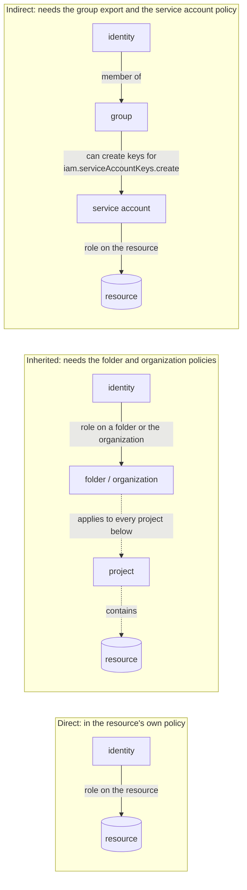
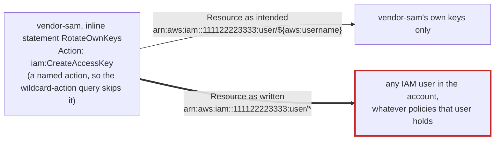

# Day 79: Auditing cloud IAM: who has what

Phase: 6. Cloud and AI-system investigation. Track goal: Read Blue Harbor's IAM exports from GCP and AWS, expand every group and resource-level grant into one inventory, and flag the grants that let a low-value identity become a more powerful one.

## Concept

The Blue Harbor timeline from days 77 and 78 shows what the actor did. Today's question is why they could. In most cloud incidents the actor used a permission that an identity already held and should not have held, so the investigator answers "who can reach what" from the account's actual policies, and treats the org chart and the documentation as claims to check against them.

IAM ties an identity (a user, a group, a service account or role) to a role or policy (a named set of permissions) on a resource or scope (one bucket, one service account, a whole project or account). The binding you look at first is rarely the whole story, because a permission can arrive in three ways.

A direct grant names the identity in a binding on the resource. It is the easy case.

An inherited grant sits higher up and flows down. In GCP, a role granted on a folder or organization applies to every project under it. AWS organizations work the other way round: a service control policy on an organizational unit caps what every account under it can grant, so the level above can explain why an access was blocked. A project policy can look clean while the real access comes from above, so an inventory built from one project's policy has to say that it did not see the levels above.

An indirect grant reaches the resource through another identity. The identity belongs to a group that holds the role. Or it can mint credentials for a service account or IAM user that holds the role. Or it can attach a service account to a VM it controls and then act as that VM. An identity with `iam.serviceAccountKeys.create` on a powerful service account has that account's power, even though no binding on the target resource names it. In AWS, `iam:CreateAccessKey` on another user does the same thing. These paths are where investigations most often find the explanation, because nobody reviewing a single policy sees them.

The three shapes side by side, with the export that reveals each one. Only the direct grant is visible in the resource's own policy.



Blue Harbor has an instance of every shape except the inherited one, which the evidence cannot show. Your inventory today has to place each grant in one of these boxes.

Some grants deserve suspicion on sight because they are over-granted constantly: `roles/owner` and `roles/editor` in GCP, `AdministratorAccess` or a policy with `"Action": "*"` in AWS, and anything that lets one identity create credentials for another. The `editor` role alone includes the permission to create service-account keys, which hands out a persistence mechanism as a convenience.

## Resources

- [`gcloud projects get-iam-policy`](https://cloud.google.com/sdk/gcloud/reference/projects/get-iam-policy): the project-level policy.
- [GCP Policy Analyzer / `gcloud asset analyze-iam-policy`](https://cloud.google.com/policy-intelligence/docs/analyze-iam-policies): expands groups and impersonation, which the raw policy does not.
- [GCP IAM roles and permissions reference](https://cloud.google.com/iam/docs/roles-permissions): look up what a role actually contains before you call it harmless.
- [`aws iam get-account-authorization-details`](https://docs.aws.amazon.com/cli/latest/reference/iam/get-account-authorization-details.html): every user, group, role and attached policy in one document.
- [AWS IAM policy variables](https://docs.aws.amazon.com/IAM/latest/UserGuide/reference_policies_variables.html): `${aws:username}` and the other variables that scope a statement to the caller.
- Free tier: both export commands are read-only and safe to run against your own free-tier account. Do not run them against any account you do not own or were not authorised to audit.

## Practical: jq and a short Python join, a two-cloud IAM inventory

Artifact: `~/lab-p6/notes/day-79-iam-inventory.csv`, one row per (identity, role or policy, resource) with the grant path and a flag column, plus a notes column you fill by hand for every flagged row.

```bash
cd ~/lab-p6/work && C=resources/case-blueharbor
```

**Your checklist for today.** Work through these in order, and check each one off as you finish it:

- [ ] 1. GCP: the project policy
- [ ] 2. GCP: the resource-level policies
- [ ] 3. GCP: expand the groups
- [ ] 4. What the GCP inventory cannot show
- [ ] 5. AWS: the authorization document
- [ ] 6. Annotate the flagged rows
- [ ] 7. Name the export that closes the gap

### 1. GCP: the project policy

The live export:

```
gcloud projects get-iam-policy YOUR_PROJECT --format=json
```

Flattened to one row per (member, role) pair so it is greppable:

```
gcloud projects get-iam-policy YOUR_PROJECT \
  --flatten="bindings[].members" \
  --format='table(bindings.role, bindings.members)'
```

`gcp/iam-project-policy.json` is the first command's saved output. Flatten it with jq:

```bash
jq -r '.bindings[] | .role as $r | .members[] | [$r, .] | @tsv' $C/gcp/iam-project-policy.json
```

Twelve rows. Three to read closely: `roles/editor` on `ci-deploy` (a CI identity that can do almost anything in the project), `roles/compute.instanceAdmin.v1` on `reporting-sa` (a batch job's identity that can reconfigure VMs), and the fact that no row names `sam.reyes@vendor-example.com` at all. Sam reaches this project only through `group:data-eng`.

### 2. GCP: the resource-level policies

Project bindings are only one layer. The service account and the bucket carry their own policies:

```bash
jq -r '.bindings[] | .role as $r | .members[] | [$r, .] | @tsv' \
  $C/gcp/iam-reporting-sa-policy.json $C/gcp/iam-bucket-customer-exports.json
```

The first row is the one day 77's timeline needed: `group:data-eng` holds `roles/iam.serviceAccountKeyAdmin` on `reporting-sa`, and key administration includes creating keys. The bucket policy then gives `reporting-sa` `roles/storage.objectAdmin`. The `projectEditor:`, `projectOwner:` and `projectViewer:` members on the bucket are convenience values: they mean "whoever holds that basic role on the project", so they are indirect grants to every project editor, owner and viewer. Finally, `gcp/service-accounts.csv` records that `reporting-sa` is the runtime identity of `report-runner-1`, which matters as soon as someone can log in to that VM.

### 3. GCP: expand the groups

Group membership lives in the identity provider, so it arrives as a separate export. This script joins it to all three policies and writes the GCP half of the inventory, then adds the AWS half from step 5. Save it as `~/lab-p6/notes/inventory.py`:

```python
import csv, json, sys

C = "resources/case-blueharbor/"
HOME_DOMAIN = "blueharbor.example"
RISKY = {"roles/owner", "roles/editor", "roles/iam.serviceAccountKeyAdmin",
         "roles/iam.serviceAccountTokenCreator", "roles/iam.serviceAccountUser",
         "AdministratorAccess", "AmazonS3FullAccess"}

groups = {}
for row in csv.DictReader(open(C + "gcp/groups-export.csv")):
    groups.setdefault("group:" + row["group_email"], []).append("user:" + row["member"])

out = csv.writer(sys.stdout, lineterminator="\n")
out.writerow(["cloud", "identity", "identity_type", "role_or_policy", "resource", "grant_path", "flag"])

def flag(identity, role):
    f = []
    if role in RISKY:
        f.append("broad-or-escalation-role")
    if identity.startswith("user:") and not identity.endswith("@" + HOME_DOMAIN):
        f.append("external-identity")
    return ";".join(f)

for path, resource in (("gcp/iam-project-policy.json", "project:blueharbor-analytics"),
                       ("gcp/iam-reporting-sa-policy.json", "serviceAccount:reporting-sa"),
                       ("gcp/iam-bucket-customer-exports.json", "bucket:blueharbor-customer-exports")):
    for b in json.load(open(C + path))["bindings"]:
        for m in b["members"]:
            out.writerow(["gcp", m, m.split(":")[0], b["role"], resource, "direct", flag(m, b["role"])])
            for member in groups.get(m, []):
                out.writerow(["gcp", member, "user", b["role"], resource, "group via " + m,
                              flag(member, b["role"])])

aws = json.load(open(C + "aws/iam-authorization-details.json"))
for u in aws["UserDetailList"]:
    for p in u.get("AttachedManagedPolicies", []):
        out.writerow(["aws", u["UserName"], "user", p["PolicyName"], "*", "direct", flag("", p["PolicyName"])])
    for p in u.get("UserPolicyList", []):
        for st in p["PolicyDocument"]["Statement"]:
            acts = st["Action"] if isinstance(st["Action"], list) else [st["Action"]]
            f = ["wildcard-action"] if "*" in acts else []
            if any(a.startswith(("iam:Create", "iam:Put", "iam:Attach")) for a in acts):
                f.append("iam-write")
            out.writerow(["aws", u["UserName"], "user", p["PolicyName"] + " (inline)",
                          st["Resource"], "direct", ";".join(f)])
    for g in u.get("GroupList", []):
        for gd in aws["GroupDetailList"]:
            if gd["GroupName"] == g:
                for p in gd["AttachedManagedPolicies"]:
                    out.writerow(["aws", u["UserName"], "user", p["PolicyName"], "*", "group via " + g, ""])
for r in aws["RoleDetailList"]:
    for p in r.get("RolePolicyList", []):
        for st in p["PolicyDocument"]["Statement"]:
            out.writerow(["aws", r["RoleName"], "role", p["PolicyName"] + " (inline)", st["Resource"], "direct", ""])
```

```bash
python3 ~/lab-p6/notes/inventory.py > ~/lab-p6/notes/day-79-iam-inventory.csv
wc -l ~/lab-p6/notes/day-79-iam-inventory.csv
awk -F, '$7 != ""' ~/lab-p6/notes/day-79-iam-inventory.csv | wc -l
grep sam.reyes ~/lab-p6/notes/day-79-iam-inventory.csv
```

39 lines (a header and 38 grants), 17 of them flagged. Sam's three rows all say `group via group:data-eng@blueharbor.example`, and one of them is `roles/iam.serviceAccountKeyAdmin` on `reporting-sa`, flagged twice (an escalation role held by an external identity).

On a live project, Policy Analyzer does the group and impersonation expansion for you:

```
gcloud asset analyze-iam-policy \
  --project=YOUR_PROJECT \
  --identity="user:contractor@vendor-example.com" \
  --expand-groups \
  --analyze-service-account-impersonation \
  --format=json
```

It needs the Cloud Asset API enabled on the project (`gcloud services enable cloudasset.googleapis.com`) and `roles/cloudasset.viewer` for the caller; neither is set on a fresh free-tier project, so expect this step to fail until you enable the API. The raw `get-iam-policy` export needs nothing extra. Doing the join by hand today shows you what the analyzer is computing.

### 4. What the GCP inventory cannot show

Write two limits into the notes column now. The export covers the project and two resources, with nothing from the folder or organization above it, so inherited grants are unknown. The inventory also cannot tell you what a role contains. Before you call `roles/storage.legacyBucketReader` harmless or `roles/compute.instanceAdmin.v1` dangerous, look each one up and write the permission that matters next to it.

`gcloud iam roles describe` prints a predefined role's permissions. It reads Google's role catalogue, not any project's data, so any authenticated free-tier login can run it:

```
for r in storage.legacyBucketReader storage.objectViewer \
         compute.instanceAdmin.v1 iam.serviceAccountKeyAdmin; do
  printf '%s: ' "$r"
  gcloud iam roles describe roles/$r --format=json | jq '.includedPermissions | length'
  gcloud iam roles describe roles/$r --format=json | jq -r '.includedPermissions[]' \
    | grep -E '^storage\.objects\.(get|list)$|^compute\.instances\.(start|stop|setMetadata)$|serviceAccountKeys\.create$'
done
```

Run on 30 September 2026, it showed that `legacyBucketReader` holds 7 permissions, including `storage.objects.list` but not `storage.objects.get`. It can list object names and cannot read their contents. `objectViewer` adds `storage.objects.get`. `compute.instanceAdmin.v1` holds 533 permissions, among them `compute.instances.start`, `stop` and `setMetadata`, which together are enough to boot a VM and add an SSH key to it. `iam.serviceAccountKeyAdmin` holds 10, one of which is `iam.serviceAccountKeys.create`. Google edits predefined roles, so your counts may differ; record the date you ran the lookup next to each row. If you have no GCP login, search the same role names in the roles reference page linked above.

Add a column `key_permission` to your notes with one line per distinct role in the inventory. Day 80 depends on the `legacyBucketReader` versus `objectViewer` line.

### 5. AWS: the authorization document

The live export:

```
aws iam get-account-authorization-details --output json > iam-dump.json
```

Save the case file under that name so the queries run exactly as written:

```bash
cp $C/aws/iam-authorization-details.json iam-dump.json
```

Users and their attached managed policies:

```
jq -r '.UserDetailList[]
  | .UserName as $u
  | (.AttachedManagedPolicies[]?.PolicyName // "no-managed-policy")
  | [$u, .] | @tsv' iam-dump.json
```

```
dana-admin     AdministratorAccess
vendor-sam     no-managed-policy
svc-reporting  AmazonS3FullAccess
old-etl        no-managed-policy
```

Inline policies with a wildcard action:

```
jq -r '.UserDetailList[]
  | .UserName as $u
  | .UserPolicyList[]?
  | select(.PolicyDocument.Statement[]?.Action == "*"
        or (.PolicyDocument.Statement[]?.Action | type=="array" and index("*")))
  | [$u, .PolicyName] | @tsv' iam-dump.json
```

One hit: `old-etl` with `etl-everything`. The wildcard query misses the grant that mattered, because `vendor-sam`'s inline policy uses named actions. Print every inline statement with its resource:

```bash
jq -r '.UserDetailList[] | .UserName as $u | .UserPolicyList[]? | .PolicyName as $p
  | .PolicyDocument.Statement[] | [$u, $p, (.Action | tostring), .Resource] | @tsv' iam-dump.json
```

The statement `RotateOwnKeys` allows `iam:CreateAccessKey` on `arn:aws:iam::111122223333:user/*`. The Sid says the intent was to let the contractor rotate their own keys, which is written `arn:aws:iam::111122223333:user/${aws:username}`. As written, `vendor-sam` can create an access key for any IAM user in the account.



`svc-reporting`'s tag says it was replaced by `MirrorWriterRole` in November 2025, yet it still holds `AmazonS3FullAccess`. A stale user with a broad policy, reachable through a mis-scoped statement, is the path day 77 recorded at 02:22:02.

### 6. Annotate the flagged rows

For each flagged row, write one line in a notes column: why the grant is questionable, and the least-privilege replacement. For example: "`roles/editor` on `ci-deploy`: CI deploys one Cloud Run service; `roles/run.developer` on that service plus `roles/iam.serviceAccountUser` on its runtime account would cover it."

### 7. Name the export that closes the gap

Next to the inherited-grants limit from step 4, name the export you would request from Blue Harbor to close it: the IAM policies of the folder and organization above the project.

## Checkpoint

- The inventory has at least 38 grant rows across both clouds.
- The `grant_path` column includes at least one `direct` row.
- The `grant_path` column includes at least one `group via` row.
- The inventory includes the resource-level service account grant that lets one identity mint keys for another (`roles/iam.serviceAccountKeyAdmin` on `reporting-sa`).
- Every row flagged `external-identity` or `broad-or-escalation-role` has a filled notes column.
- Each of those notes names a least-privilege alternative.
- Your notes have a `key_permission` line for each distinct role, with the date you ran the lookup.
- You can state, from the files alone, the GCP chain from `sam.reyes@vendor-example.com` to object contents in `blueharbor-customer-exports`.
- You can state, from the files alone, the AWS chain from `vendor-sam` to objects in `blueharbor-exports-mirror`.
- Your notes say that inherited grants from above the project were not in the evidence.
- Your notes name the export you would request to close that gap.
- Without notes, you can explain why the wildcard query found `old-etl` but not `vendor-sam`, and which query found the `vendor-sam` problem.
