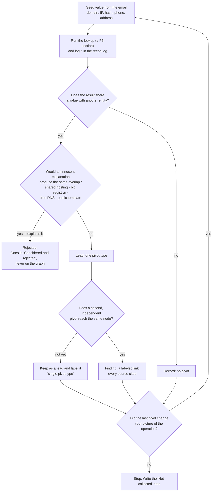
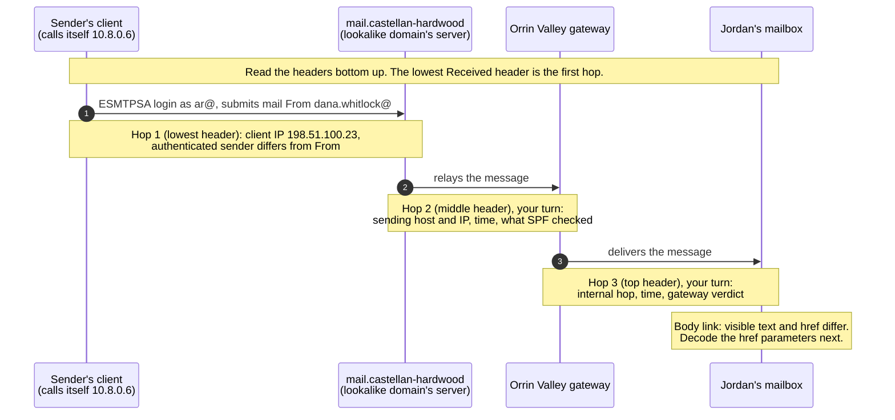

# Day 84: Recon on the case's external infrastructure

Phase: 7. Capstone and career · Track goal: Turn one phishing email into a map of the infrastructure behind it, using the header analysis, OSINT and pivoting methods from Phases 2 and 3, and record every step so another analyst could repeat it.

## Concept

Recon comes before formal case planning here for a practical reason. On the intake call the client told you what happened as they understand it. Before you commit to a plan on Day 85, you want a quick, bounded look at the attacker's side to learn what kind of operation this is. A one-off lookalike domain calls for a different plan than a campaign that has hit several suppliers' customers.

Start from the email, because it is the one artifact the attacker built and sent to the client. The headers record which servers handled it and which IP submitted it. The body and the HTML record where the link really goes, what the attacker copied, and what they changed. Every value you pull out becomes a seed for pivoting.

The pivoting method is the one from Day 40, and the standard for a link is the same. A single shared attribute is a lead. A relationship becomes a finding when several independent pivots converge on the same nodes, and when you have checked the obvious innocent explanation for each one. Shared hosting, a popular registrar, a free DNS service, and a website template anyone can download all create shared attributes between unrelated sites. The skill today is telling those apart from the attributes an operator creates by reusing their own tools.

Every pivot you run today goes through the same loop. The two exits that matter are "rejected", which goes in a note and never onto the graph, and "finding", which needs a second independent pivot before it earns a link.



The lookup results in `06-lookup-results.md` stand in for live queries, because every domain and IP in the packet is a reserved value that real services cannot resolve. Treat each section as a query you ran: log it, cite it, and do not assume anything the result does not show. Apart from typing the query, the method is the same as live work.

Recon also needs a stopping rule. You are not trying to learn everything about the attacker today. You are trying to learn enough to write a good plan tomorrow. When a new pivot stops changing your picture of the operation, stop and write down what you did not collect and why.

## Resources

- [Google Admin Toolbox Messageheader](https://toolbox.googleapps.com/apps/messageheader/) parses raw headers into a hop-by-hop table. Paste only synthetic or authorized headers into any third-party web tool; in a real case, headers can contain personal data and belong to the client.
- [CyberChef](https://gchq.github.io/CyberChef/) for decoding URL parameters.
- [Maltego Community Edition](https://www.maltego.com/community-edition/) for the pivot graph. Gephi works too if you prefer the Day 40 setup.
- [MITRE ATT&CK Navigator](https://mitre-attack.github.io/attack-navigator/) for the draft technique layer.
- [Meld](https://meldmerge.org/) or plain `diff -u` for comparing the two public web pages.
- Back-references: [Day 22](../phase-2-osint-digital-footprint/day-22.md) for hubs, clusters and bridges, [Day 40](../phase-3-cyber-threat-intelligence/day-40.md) for pivot reliability, and the [OSINT recon log template](../../worksheets/osint-recon-log.md).

## Practical: Maltego CE and ATT&CK Navigator, an infrastructure pivot graph and a draft technique layer

Work from your `working/` copy. Start a fresh copy of `worksheets/osint-recon-log.md` as `notes/recon-log.md`, and fill in its Plan section before you open any file: the question for today is "What infrastructure sent and supported the 10 March phishing email, and is it part of a larger operation?"

**Your checklist for today.** Work through these in order, and check each one off as you finish it:

- [ ] Part 1: extract indicators from the email
- [ ] Part 2: compare the real and the fake public pages
- [ ] Part 3: pivot through the lookup results
- [ ] Part 4: build the pivot graph in Maltego CE
- [ ] Part 5: draft the ATT&CK layer
- [ ] Part 6: write the stop note
- [ ] Part 7: write down the graph reading

### Part 1: extract indicators from the email

Open `02-suspicious-email.eml` in a text editor. Do not open it in a mail client, which may load the remote logo image. Read the `Received` headers from the bottom up, because each server adds its header on top.

Worked example for the lowest header:

```
Received: from [10.8.0.6] (unknown [198.51.100.23])
	(Authenticated sender: ar@castellan-hardwood.example)
	by mail.castellan-hardwood.example (Postfix) with ESMTPSA id 2C4A1E03
```

This says a client at 198.51.100.23, whose own machine called itself 10.8.0.6 (a private address, typical of a VPN or a home network), logged in to the mail server `mail.castellan-hardwood.example` as `ar@castellan-hardwood.example` and handed it the message. ESMTPSA means authenticated submission. So 198.51.100.23 is the closest thing to the sender's own connection that the headers record. Notice also that the authenticated account (`ar@`) differs from the `From` address (`dana.whitlock@`). The server allowed that, which suggests the attacker runs the domain's mail server and can send as any address on it.

Each server that handles a message adds its `Received` header on top of the ones already there, so the delivery path runs in the opposite order to the file. The diagram shows the path you are rebuilding. Hop 1 is filled in from the worked example; the two notes marked "your turn" are what you extract from the other two headers.



The link in the body is a separate path. The text Jordan saw and the address the browser would open are two different values, and the parameters in the second one show who the message was built for.

Do the same for the other two `Received` headers and the `Authentication-Results` block. Then compare that block with M1's in `03-related-messages.md`. Write one sentence on what SPF passing for `castellan-hardwood.example` does and does not prove.

Now the link. The visible text says `https://castellanhardwood.example/remittance`, and the HTML `href` goes somewhere else. Paste the `href` into CyberChef, apply `URL Decode`, and decode each parameter value with `From Base64`:

```
u=b3JyaW52YWxsZXkuZXhhbXBsZQ%3D%3D  ->  b3JyaW52YWxsZXkuZXhhbXBsZQ==  ->  orrinvalley.example
t=anBpa2U%3D                        ->  anBpa2U=                      ->  jpike
```

The link was built for one person at one company. Record that as a finding about targeting, citing P2 and your decode.

Build the indicator table in `notes/indicators.md`, one row per value, defanged:

| # | Indicator | Type | Where found | First observed (UTC) | Notes |
|---|---|---|---|---|---|
| 1 | castellan-hardwood[.]example | Domain | P2 From, Return-Path | 2026-03-10 14:02 | Lookalike of castellanhardwood[.]example, hyphen added |
| 2 | 198.51.100[.]23 | IPv4 | P2 lowest Received | 2026-03-10 14:02 | Authenticated submitter of the phish |

Include the Reply-To address, the phone number in the signature, the Message-ID and In-Reply-To values, the link domain, and the logo URL. Then add the indicators from M3 and M6 in `03-related-messages.md`, including the letter's bank name, account ending and file hash. Expect about 15 to 20 rows.

### Part 2: compare the real and the fake public pages

Copy the rendered text and page head of Artifact A (`04-vendor-site-archived.md`) and Artifact B1 (`05-lookalike-site-capture.md`) into two text files and compare them with Meld or `diff -u a.txt b.txt`. Two differences to start you off:

- The real site has a Payments section telling customers that Castellan never changes banking details by email alone and to call before acting. The lookalike removed it and added a Banking update section announcing a change. The attacker edited the one paragraph that would have defeated the scam.
- The lookalike's stylesheet link is `site.css?v=2024.1`, loaded from the real site, while the archived real page uses `v=2025.3`. The clone was probably made from a copy of the real site older than November 2025, or from an old cached asset list. Record it as an inference.

Find the rest. There are at least six more differences, including one in the team list and one on the privacy page (B2) that is worth a full pivot on its own. For each, write whether it is an indicator of the fraud, a clue to how the clone was built, or neither.

### Part 3: pivot through the lookup results

Work through L1 to L9 in `06-lookup-results.md`. Log each section in your recon log's collection table as a separate row, with the section ID as the source and 17 March 2026 as the access date.

For every candidate link between two entities, write a short pivot note with four parts: the shared value, the pivot type, the innocent explanation you checked, and your verdict. Two worked notes:

> Pivot: `cstl-docshare.example` and `portal.marrowline-docs.example` both load `/assets/js/vw-portal.min.js` with SHA-256 `9e41c0b7...c9f218` (P6 L6 S1, S2).
> Type: shared page resource, identical file hash.
> Innocent explanation checked: a public library would appear on many unrelated sites. This file name is not a known library, and the favicon search (L7) shows that the only other site sharing the page's favicon, Brightquay Legal, uses a different script (`viewer.js`, different hash). So the identical script is specific to these two sites.
> Verdict: strong link, the same phishing kit, possibly the same operator. Keep and look for a second independent pivot.

> Pivot: `cstl-docshare.example` shares IP 203.0.113.88 with `ferncastle-bakery.example` and 1,411 other domains (P6 L5).
> Type: co-hosting.
> Innocent explanation checked: 203.0.113.88 is a shared web server (L5, L8). Co-hosting on shared hosting links nothing.
> Verdict: rejected. Do not add the neighbours to the graph.

Write pivot notes for every IP address in L8, for the registrar and name server pattern in L1, for the favicon hashes in L7, and for the privacy-page sentence from Part 2. At least one of the IPs sits in the same /24 range as unrelated infrastructure, so check ownership and network type in L8 before you link any two addresses.

### Part 4: build the pivot graph in Maltego CE

Create a new graph. Maltego transforms will return nothing for `.example` domains, so build the graph by hand: drag entities from the Entity Palette (Domain, DNS Name, IP Address, Email Address, Phone Number, and Phrase for hashes if your palette has no hash entity), then draw links between them.

Rules for the graph:

1. Every link gets a label naming the pivot and the source, for example `shared JS hash (P6 L6)` or `A record 2026-02-25 to 03-17 (P6 L3)`. Open the link's properties to set the label, and turn on label display.
2. Rejected pivots do not become links. Put them in a text note on the graph titled "Considered and rejected."
3. Use one colour for entities in the Castellan leg and another for anything you find beyond it.

When the graph is built, read it the way Day 22 taught: name the clusters, name any node that bridges two clusters, and say why each bridge is connected to both sides. Export the graph as a PNG and save the `.mtgl` file.

### Part 5: draft the ATT&CK layer

Open ATT&CK Navigator, create a new Enterprise layer, and mark only the techniques today's evidence shows. Candidates include acquiring domains, establishing email accounts, staging a link target, phishing with a link, and impersonation. For each technique you mark, add a comment citing the packet evidence. Leave everything that happens inside the client's mailbox for Day 86, even if you can guess it. Export the layer as JSON and name it `layer-day84-recon.json`.

Credential-harvesting links can be mapped to Phishing (T1566.002) or to Phishing for Information (T1598.003). Pick one, or mark both, and write a one-line reason in the technique's comment.

### Part 6: write the stop note

Add a short section at the end of `recon-log.md` called "Not collected." List what you would look at next with more time or wider authorization, and why you stopped. Examples: the contents of the freemail account (out of scope), Castellan's mail logs (another organization), live state of the phishing site (prohibited by the rules of engagement).

### Part 7: write down the graph reading

Add a section to `recon-log.md` called "Graph reading" and write down the reading you did at the end of Part 4. Name each cluster on the graph. Name each bridge between clusters, and under it list the independent pivots that support it. If a cluster rests on one pivot type only, say so in that cluster's entry.

## Checkpoint

1. Your indicator table has at least 15 rows.
2. Every indicator in the table is defanged.
3. Every row has a packet citation.
4. Every link on the Maltego graph carries a label naming the pivot.
5. Every link label includes a source ID.
6. At least two pivots appear in "Considered and rejected."
7. Each rejected pivot has a written reason.
8. The "Graph reading" section names each cluster on the graph.
9. The "Graph reading" section names each bridge between clusters.
10. Each bridge lists the independent pivots that support it.
11. Any cluster that rests on one pivot type only is marked as such.
12. Every technique in your ATT&CK layer has a comment pointing to specific packet evidence.
13. Nothing from inside the client's mailbox is marked in the layer yet.
14. Your recon log shows each L-section as a logged collection step.
15. The "Not collected" note exists.
16. Without notes, can you state what SPF passing for `castellan-hardwood.example` does and does not prove?
