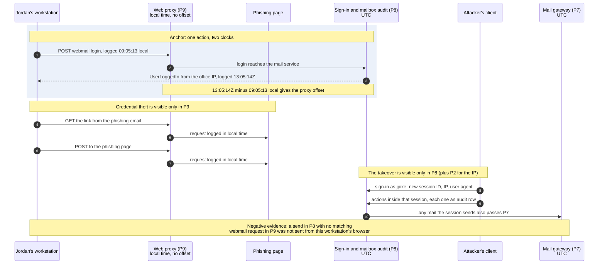
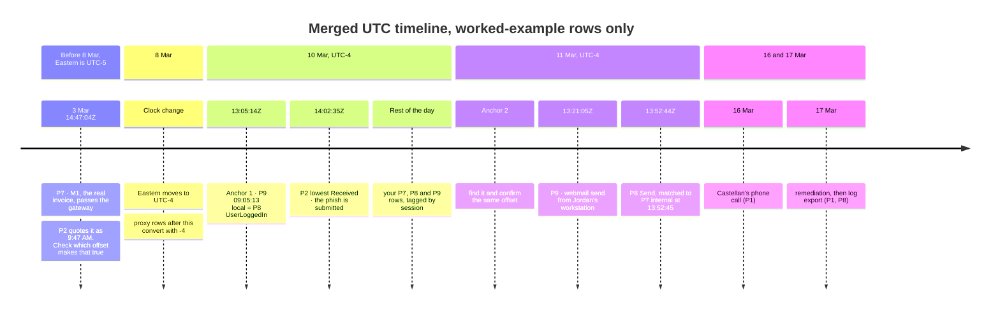
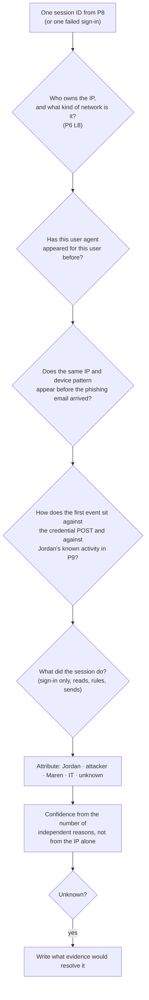

# Day 86: Forensics, merging three logs into one timeline

Phase: 7. Capstone and career · Track goal: Apply the Phase 4 timeline method (and the Phase 6 cloud-log skills) to the case logs, and establish from evidence when the account was taken over, by whom, and what was done with it.

## Concept

You have three log sources and each one keeps time differently. The mail gateway trace (P7) and the mailbox audit (P8) record UTC. The web proxy (P9) records the appliance's local time with no offset, and the IT contractor is only "pretty sure" which time zone that is. The email headers carry their own offsets, and those offsets change partway through the case, because Eastern time moved from UTC-5 to UTC-4 on 8 March 2026. A timeline built without sorting this out will put events in the wrong order, and in a case about which login came first, order is the finding.

The fix for an unknown clock is an anchor: an event that appears in two sources, one of which has a trusted clock. If the proxy shows Jordan's browser posting to the webmail login page at a local time, and the audit log shows the resulting sign-in in UTC one second later, the difference between the two is the proxy's offset. One anchor gives you a working offset. A second anchor on a different day tells you whether it holds.

Once everything is in UTC, the unit of analysis is the session. A sign-in creates a session, and every later action in that session inherits its IP address, user agent and actor. Attributing the sessions (Jordan, the attacker, the controller, IT, unknown) attributes almost every event in the case at once, and forces you to write down why for each one.

Two more ideas matter today. Negative evidence is an event that should exist under a hypothesis and does not. If Jordan sent an email from the office workstation, the proxy should show the webmail send request. Checking for that absence is as much a test as checking for a presence. Evidence handling also has a history in this case: IT deleted the inbox rule before exporting the logs. The deletion is itself logged, and the rule's contents survive in the audit event that created it, but you should note in your report that remediation came before collection.

The sequence below shows which log sees which step of a mailbox takeover, and so where to look for each kind of event. The first block is the anchor idea: one real action recorded by two clocks. The rest is the general shape of a phishing-to-takeover chain. Filling in the actual rows, times and session IDs is today's work.



## Resources

- [Timesketch user guide: importing CSV and JSONL](https://timesketch.org/guides/user/import-from-json-csv/). A CSV needs at least `message`, `datetime` and `timestamp_desc` columns.
- [Python `zoneinfo` documentation](https://docs.python.org/3/library/zoneinfo.html), for converting local times with daylight-saving rules applied.
- [Day 58](../phase-4-digital-forensics-incident-investigation/day-58.md) for the timeline method and cross-source causal links.
- [MITRE ATT&CK: Email Hiding Rules (T1564.008)](https://attack.mitre.org/techniques/T1564/008/), for the detection notes on inbox rules.

## Practical: Timesketch, a merged UTC timeline and a session attribution table

Artifacts for today: `notes/timeline_utc.csv`, a Timesketch sketch with tagged events (or a spreadsheet with a tag column if you cannot run Timesketch), `notes/sessions.md`, and an updated ATT&CK layer.

**Your checklist for today.** Work through these in order, and check each one off as you finish it:

- [ ] Step 1: anchor the proxy clock
- [ ] Step 2: normalize everything to UTC
- [ ] Step 3: load the timeline into Timesketch
- [ ] Step 4: attribute every session
- [ ] Step 5: tag and connect events
- [ ] Step 6: summarize what the attacker did and touched
- [ ] Step 7: attack your own conclusion
- [ ] Step 8: update the ATT&CK layer and the ACH matrix
- [ ] Step 9: state the limits of the logs

### Step 1: anchor the proxy clock

Find an event in P9 that should also appear in P8. Worked example:

```
P9: 2026-03-10 09:05:13 OVM-WS-AP02 jpike POST https://mail.orrinvalley.example/login 302 ...
P8: 2026-03-10T13:05:14Z,jpike,jpike,UserLoggedIn,Success,192.0.2.10,"...Chrome/122...",s-12f4a8,...
```

A login form post followed one second later by a successful sign-in from the office IP with the same browser family is the same event seen twice. 13:05:14 UTC minus 09:05:13 local gives UTC-4, which is Eastern daylight time. That matches the IT contractor's guess, and now you have evidence for it rather than a guess.

Find a second anchor on 11 March and confirm it gives the same offset. Record both anchors in your decisions log, with the row references, as the basis for every proxy conversion.

Then check the one place where the offset matters most to the story. The phishing email quotes M1 as sent "Tue, Mar 3, 2026 at 9:47 AM." M1's gateway record is 14:47:04 UTC on 3 March. Convert that with the offset in force on 3 March, before daylight time began, and write down whether the quote's time matches M1. If you applied UTC-4 everywhere you would be an hour out and might conclude the quote was altered.

### Step 2: normalize everything to UTC

Run this script from your `working/case-packet` folder. It reads all three logs, converts the proxy times with daylight-saving rules applied, and writes one sorted CSV that Timesketch can import. Before you run it, confirm the `PROXY_ZONE` line matches your Step 1 finding.

```python
import csv
from datetime import datetime, timezone
from zoneinfo import ZoneInfo

PROXY_ZONE = ZoneInfo("America/Toronto")  # set from your anchor events, not from the IT note

def rows(path):
    with open(path, newline="") as f:
        return list(csv.DictReader(line for line in f if not line.startswith("#")))

out = []
for r in rows("logs/mail-trace.csv"):
    out.append({
        "datetime": r["received_utc"].replace("Z", "+00:00"),
        "timestamp_desc": "Message received (gateway)",
        "message": f'{r["direction"]} {r["sender"]} -> {r["recipients"]}: {r["subject"]}',
        "source": "P7", "user": "", "client": r["sender_ip"], "session_id": ""})
for r in rows("logs/mailbox-audit.csv"):
    out.append({
        "datetime": r["timestamp_utc"].replace("Z", "+00:00"),
        "timestamp_desc": "Audit event",
        "message": f'{r["operation"]} ({r["result"]}) by {r["actor"]} on {r["target_mailbox"]}: {r["details"]}',
        "source": "P8", "user": r["actor"], "client": r["client_ip"], "session_id": r["session_id"]})
with open("logs/web-proxy.log") as f:
    for line in f:
        if line.startswith("#") or not line.strip():
            continue
        d, t, host, user, method, url, status, size, cat, action = line.split()
        local = datetime.strptime(f"{d} {t}", "%Y-%m-%d %H:%M:%S").replace(tzinfo=PROXY_ZONE)
        out.append({
            "datetime": local.astimezone(timezone.utc).isoformat(),
            "timestamp_desc": "Proxy request (converted from local time)",
            "message": f"{method} {url} -> {status} [{cat}]",
            "source": "P9", "user": user, "client": host, "session_id": ""})

out.sort(key=lambda e: e["datetime"])
with open("timeline_utc.csv", "w", newline="") as f:
    w = csv.DictWriter(f, fieldnames=list(out[0].keys()))
    w.writeheader()
    w.writerows(out)
print(f"{len(out)} events written to timeline_utc.csv")
```

It should report 80 events. Open the output and spot-check three proxy rows by converting them by hand. A script you have not checked is an assumption.

The phishing email's own header times are not in any log file. Add the three `Received` timestamps from P2 as rows by hand, with source `P2`, because the lowest one records the attacker's submission IP.

Here is the skeleton of the merged timeline, holding only rows that this page and Day 84 already gave you as worked examples. The sections follow the clock rules, because the same proxy time converts differently on each side of 8 March. Your finished CSV has about 80 more rows in these gaps, each tagged with its source.



### Step 3: load the timeline into Timesketch

Create a sketch named for the case, upload `timeline_utc.csv` as a new timeline, and confirm the event count. If Timesketch will not run on your machine, use a spreadsheet with the same columns plus `tag` and `comment`; the analysis is the same.

### Step 4: attribute every session

List every distinct `session_id` in P8, plus the failed sign-ins, which have none. For each, fill a row in `notes/sessions.md`. Worked example:

| Session | IP | User agent | First and last event (UTC) | Events | Attributed to | Confidence | Reasons |
|---|---|---|---|---|---|---|---|
| s-7f3a61 | 198.51.100.23 | Linux, Firefox 115 | 10 Mar 14:31:12 to 14:44:09 | Sign-in, New-InboxRule, three MailItemsAccessed | Attacker | Confirmed | Same IP as the authenticated submitter of the phish (P2). Sign-in came 10 minutes 31 seconds after Jordan's browser posted credentials to the phishing page (P9, converted). User agent matches no other session for this user. Jordan's own office session s-12f4a8 was active that morning (P9 shows continuous office browsing). |

Work each session through the same questions, in this order, and write the answer to each one into the Reasons column. The IP question comes first but never settles a session by itself, which is why Checkpoint 7 asks for a reason beyond the IP.



Do the rest. Some sessions belong to Jordan on devices you have not seen yet; decide from IP ownership and network type in P6 L8, the user agent, and whether the same pattern appears before the phishing email arrived. Mark any session you cannot attribute as "unknown" and say what would resolve it.

### Step 5: tag and connect events

In Timesketch, tag every event `attacker`, `jordan`, `maren`, `it-remediation`, `external-mail` or `noise`, based on your session table. Star the events that carry the story. For each starred event, add a comment that links it to at least one event in a different source, in words. For example: "P8 Send at 13:52:44 is the same message as P7 internal at 13:52:45 (same subject, same attachment hash as P3 M3). P9 has no webmail send from Jordan's workstation between 13:48 and 14:01 UTC, and does show one at 13:21:05 for Jordan's genuine email to Castellan orders."

That last point is negative evidence. Write down which hypothesis it weakens.

### Step 6: summarize what the attacker did and touched

In `notes/attacker-activity.md`, list every attacker action in time order, each with its row reference. Then answer, with citations:

1. When did the takeover start, and when did it end? What is the evidence that the password reset worked?
2. What did the inbox rule do, which messages did it catch, and what did Jordan therefore never see?
3. Which folders did the attacker sync or read, and how many items? Treat synced items as copied by the attacker, since a sync downloads them.
4. Is there any evidence of attacker access to the controller's account? What protected it, and how confident are you?

### Step 7: attack your own conclusion

For each rival explanation below, write the observation that would have to exist if the rival were true, then check whether it exists.

- The password spray at 03:11 UTC on 10 March, not the phishing page, gave the attacker Jordan's password. Worked answer: if the spray had succeeded there would be a `UserLoggedIn` from 203.0.113.200, or an attacker sign-in before 14:20:41. Every spray attempt shows `InvalidPassword`, and the first attacker sign-in follows the credential POST by ten minutes. The rival fails.
- Jordan sent the bank letter to the controller and is covering for it.
- 198.51.100.23 is a shared VPN or proxy exit, so the phish submitter and the sign-in could be different people.
- The IP link to the Marrowline infrastructure from Day 84 is a coincidence of IP reuse, since that IP's Marrowline DNS record ended the day before the phish.

For each, record whether the rival fails, survives, or cannot be tested with the packet. A rival that survives goes into your report's risk section.

### Step 8: update the ATT&CK layer and the ACH matrix

Copy `layer-day84-recon.json` to `layer-day86.json` and add the techniques the logs show inside the mailbox, each with a comment citing the P8 rows. Then return to your Day 85 ACH matrix and add rows for what the audit log shows, and does not show, before 14:31 UTC on 10 March.

### Step 9: state the limits of the logs

At the end of `notes/attacker-activity.md`, add a short "Limits" section stating the limits of the logs: the dates covered, the accounts covered, and what happened before collection.

## Checkpoint

1. Your proxy offset rests on two anchor events.
2. The two anchor events are on different days.
3. Both anchors are recorded in your decisions log with row references.
4. You have written down whether the phishing email's quoted time for M1 matches M1's gateway record, converted with the offset in force on 3 March.
5. Every P8 session and every failed sign-in has an attribution.
6. Every P8 session and every failed sign-in has a confidence.
7. Every P8 session and every failed sign-in has at least one reason that cites evidence other than the IP address.
8. At least three starred events carry a written cross-source link.
9. At least one finding rests on negative evidence.
10. Each rival explanation in Step 7 has a named disconfirming observation.
11. Each rival explanation in Step 7 has a recorded outcome.
12. Your attacker activity summary answers all four questions.
13. Every answer in the summary cites row references.
14. The "Limits" section states the dates covered.
15. The "Limits" section states the accounts covered.
16. The "Limits" section states what happened before collection.
17. Without notes, can you explain why M1's header uses a different offset from the rest of the case?
