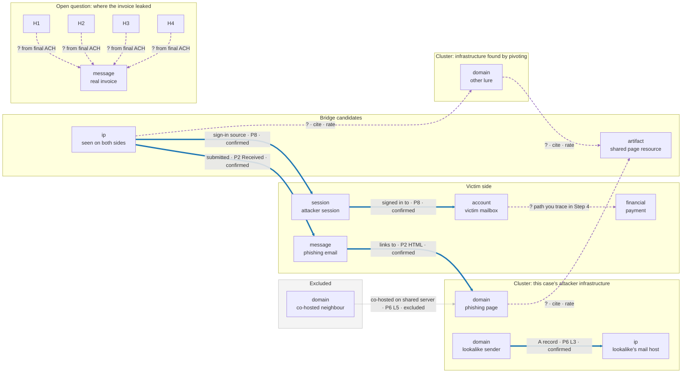
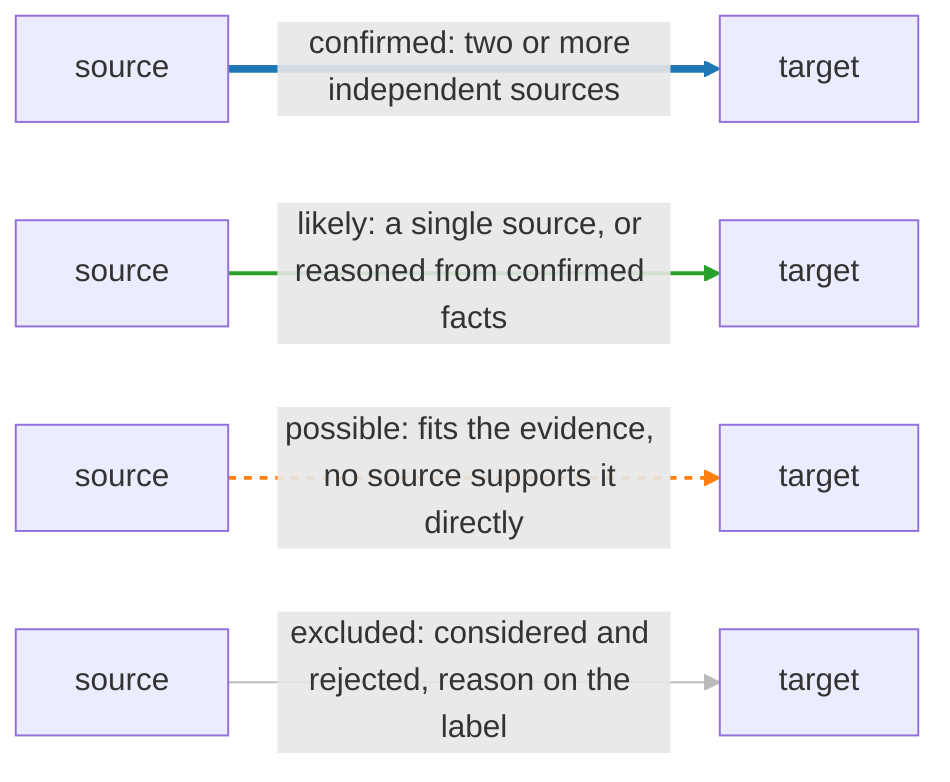

# Day 88: The final case graph

Phase: 7. Capstone and career · Track goal: Tie every entity and evidence link from Days 84 to 87 into one graph that answers the client's questions on its own, with the evidence and confidence for each link built into it. This graph is the capstone deliverable.

## Concept

By now you have four partial pictures: a pivot graph of attacker infrastructure (Day 84), a timeline of what happened in the mailbox (Day 86), a swimlane of how the fraud moved through people and controls (Day 87), and an ACH matrix on where the invoice leaked (Days 85 and 86). Each is correct within its own frame, and none of them shows the whole case. The final graph joins them, so that a reader can follow the case from a domain registered in February to a payment released in March without switching documents.

Treat every edge as a claim. "`castellan-hardwood.example` resolves to 203.0.113.47" is a claim with a source (P6 L3) and a confidence (confirmed). "198.51.100.23 is operated by the same actor as the Marrowline infrastructure" is a claim too, with several sources and a lower confidence. A graph that draws both with the same plain line tells the reader they are equally certain, which is false. So every edge carries three attributes: what the relationship is, which evidence supports it, and how confident you are. The confidence is then encoded visually, so the uncertainty is visible at a glance.

Below is the structure of a finished graph, with generic node names. The solid blue edges are the five rows from the worked `edges.csv` in Step 2, so their confidence is already set. Every purple edge marked `?` is a relationship this page deliberately leaves for you to rate from your own notes; the example says nothing about what those ratings should be. The grey edge shows how an excluded item stays on the graph with its reason.



One way to encode the four confidence levels, which your legend should explain in words as well:



The graph also has to show what you excluded. The spray IP, the 1,412 co-hosted domains and the law firm that shares a favicon all appeared in your evidence. A reviewer who does not see them on the graph cannot tell whether you rejected them or missed them. Put them in an excluded group, or list them in the legend with the reason for exclusion.

Keep the node count honest. Include every entity that carries part of the argument and leave out the ones that only add clutter.

## Resources

- [Gephi](https://gephi.org/) 0.10 or later, free. The [Gephi quick start](https://gephi.org/users/quick-start/) covers the Data Laboratory, layouts and the Preview tab.
- Maltego CE works too if you built your Day 84 graph there; add the new node types as entities and put the confidence in each link's label and colour.
- [Day 22](../phase-2-osint-digital-footprint/day-22.md) for reading hubs, clusters and bridges.
- Your Day 85 plan, which lists the node and edge types this graph must include.

## Practical: Gephi, the case graph and a graph-reading memo

Artifacts: `notes/graph/nodes.csv`, `notes/graph/edges.csv`, the Gephi project file, an SVG or PNG export, and `notes/graph-memo.md`.

**Your checklist for today.** Work through these in order, and check each one off as you finish it:

- [ ] Step 1: define the schema
- [ ] Step 2: write the tables
- [ ] Step 3: import and lay out in Gephi
- [ ] Step 4: check the graph against the case questions
- [ ] Step 5: write the graph-reading memo
- [ ] Step 6: test the image on a fresh reader

### Step 1: define the schema

Use these node types. Add others only if Day 85 planned for them.

| Type | Examples from the case |
|---|---|
| domain | the lookalike, the phishing domain, Marrowline and Quennmarsh domains, the real vendor domain |
| ip | every IP that carries a link |
| email_address | the lookalike sender, the Reply-To, the remittance address |
| phone | the numbers in the real and fake signatures |
| artifact | JS hash, favicon hashes, the letter PDF |
| message | M1 to M7 |
| account | `jpike`, `mbeaulieu` |
| session | the attacker sessions from your Day 86 table |
| mailbox_object | the inbox rule |
| financial | the payee account ending 8830, payment 000731 |
| organization | Orrin Valley, Castellan, and the brands used without permission |

Edges carry these columns: `Source`, `Target`, `Type` (Directed), `Label` (the relationship in a few words), `evidence` (packet citation), `confidence` (confirmed, likely, possible, or excluded) and `day` (where you established it).

### Step 2: write the tables

Start `nodes.csv` with the columns `Id,Label,type,cluster` and `edges.csv` with `Source,Target,Type,Label,evidence,confidence,day`. A few rows to show the level of detail:

```csv
Id,Label,type,cluster
d_lookalike,castellan-hardwood[.]example,domain,castellan
d_phish,cstl-docshare[.]example,domain,castellan
ip_023,198.51.100[.]23,ip,bridge
ip_047,203.0.113[.]47,ip,castellan
msg_M2,M2 phishing email 10 Mar,message,castellan
sess_7f3a61,session s-7f3a61,session,castellan
acct_jpike,jpike mailbox,account,victim
```

```csv
Source,Target,Type,Label,evidence,confidence,day
d_lookalike,ip_047,Directed,A record since 2026-02-25,P6 L3,confirmed,84
ip_023,msg_M2,Directed,authenticated submitter of,P2 lowest Received header,confirmed,84
msg_M2,d_phish,Directed,links to (href),P2 HTML part; P9 10 Mar 14:19:07 UTC,confirmed,84
ip_023,sess_7f3a61,Directed,sign-in source,P8 2026-03-10T14:31:12Z,confirmed,86
sess_7f3a61,acct_jpike,Directed,signed in to,P8 2026-03-10T14:31:12Z,confirmed,86
```

Now add everything else from your notes: Day 84 indicators and accepted pivots, Day 86 sessions and attacker actions, Day 87 message flow, and the payment. For each edge, copy the citation from the note where you established it. If you cannot find a citation for an edge, the edge is a guess. Either find the evidence or delete the edge.

Add the excluded items as nodes with `cluster` set to `excluded`, each joined to the node that made it look relevant by an edge with `confidence` set to `excluded` and a label saying why, such as `co-hosted on shared server, rejected`.

Before you import anything, check the two files against each other. By default Gephi's import can create a new, unlabeled node for an edge whose `Source` or `Target` has a typo, and it never checks for a missing citation. Save this as `notes/graph/check_graph.py` and run it from `notes/graph/`:

```python
import csv

LEVELS = {"confirmed", "likely", "possible", "excluded"}
with open("nodes.csv", newline="") as f:
    nodes = list(csv.DictReader(f))
ids = [n["Id"] for n in nodes]
problems = 0
for dup in sorted({i for i in ids if ids.count(i) > 1}):
    print(f"nodes.csv: duplicate Id {dup}"); problems += 1
with open("edges.csv", newline="") as f:
    for line, e in enumerate(csv.DictReader(f), start=2):
        for end in ("Source", "Target"):
            if e[end] not in ids:
                print(f"edges.csv line {line}: {end} '{e[end]}' is not a node Id"); problems += 1
        if not e["evidence"].strip():
            print(f"edges.csv line {line}: no evidence citation"); problems += 1
        if e["confidence"] not in LEVELS:
            print(f"edges.csv line {line}: confidence '{e['confidence']}' not in {sorted(LEVELS)}"); problems += 1
used = set()
with open("edges.csv", newline="") as f:
    for e in csv.DictReader(f):
        used.update((e["Source"], e["Target"]))
for orphan in sorted(set(ids) - used):
    print(f"nodes.csv: {orphan} has no edges; link it or drop it")
print(f"{len(ids)} nodes checked, {problems} problems")
```

Fix every problem it reports and run it again until it prints `0 problems`. Orphan nodes are warnings, not errors, but each one is either a missing edge or clutter.

### Step 3: import and lay out in Gephi

1. File, Import spreadsheet, choose `nodes.csv` as a nodes table, then import `edges.csv` as an edges table into the same workspace.
2. In the Data Laboratory, check the counts against your CSV row counts. A mismatch usually means an edge refers to a node `Id` with a typo.
3. Run ForceAtlas 2 with "Prevent overlap" on until the layout settles. Drag nodes by hand afterwards if a label is hidden; the layout is a starting point.
4. Appearance, Nodes, Colour, Partition by `cluster`. Appearance, Edges, Colour, Partition by `confidence`. Choose colours a reader can tell apart and keep excluded edges pale grey.
5. In Preview, turn on node labels and edge labels, set the edge label size so it can be read at export size, and export to SVG and PNG.

Add a legend to the exported image (in any image editor, or as a text block in the SVG). It must explain node colours, edge colours and what each confidence level means in this case.

### Step 4: check the graph against the case questions

For each of the client's five questions, trace the part of the graph that answers it and write down the node path. Worked example for question 2:

> Was Jordan's account taken over, and when? Path: `msg_M2` → `d_phish` (link) ← credential POST from Jordan's workstation (P9, 14:20:41 UTC) ... `ip_023` → `sess_7f3a61` → `acct_jpike` (14:31:12 UTC). Every edge on the path is confirmed.

If a question cannot be traced, either the graph is missing edges or the question cannot be answered from the evidence. Decide which, and fix the graph or note the gap for the report.

For question 3, the leak question, your graph cannot show a confirmed path, because the evidence does not contain one. Show the competing explanations. One approach is a node for each ACH hypothesis, linked to M1 with edges whose confidence matches your final ACH result. Another is a text note on the graph pointing to the ACH matrix. Either works if the reader can see that the question is open and why.

### Step 5: write the graph-reading memo

In `notes/graph-memo.md`, write half a page covering:

1. The clusters on the graph, what each one represents, and how many nodes it has.
2. Each bridge between clusters, and the independent pivots that support it. Count them. If a bridge rests on one pivot type, say so, and say what else would firm it up.
3. The hubs, and why each one is connected to so much. Separate hubs that matter (an attacker IP) from hubs that are artifacts of how you drew the graph (a node like "Orrin Valley" that everything touches).
4. The excluded group and why each member is excluded.
5. The single edge that, if it turned out to be wrong, would change your answer to a client question the most. That edge gets named in the report's risk section tomorrow.

### Step 6: test the image on a fresh reader

Show only the exported image and legend to someone who has not seen the case. Within two minutes they should be able to tell you how the money left, and which part of the story is least certain. If they cannot, revise the layout or the legend, not the evidence, and test again.

## Checkpoint

1. Every edge in `edges.csv` has a label.
2. Every edge has an evidence citation naming a packet ID plus a row, section, header or timestamp, as in the worked rows.
3. `notes/graph/check_graph.py` prints `0 problems`.
4. Confidence colours on the exported image match the CSV.
5. The graph contains every node type your Day 85 plan listed, or your memo explains why one was dropped.
6. A path of confirmed edges runs from the lookalike domain's registration to payment 000731.
7. The events on that path match your Day 86 timeline.
8. The memo names both clusters.
9. The memo names every bridge.
10. The memo gives a count of independent pivots for each bridge.
11. The memo names the single most consequential edge.
12. A reader who saw only the image and legend told you, within two minutes, how the money left and which part of the story is least certain.
13. Without notes, can you explain why co-hosting on a shared server links nothing?
