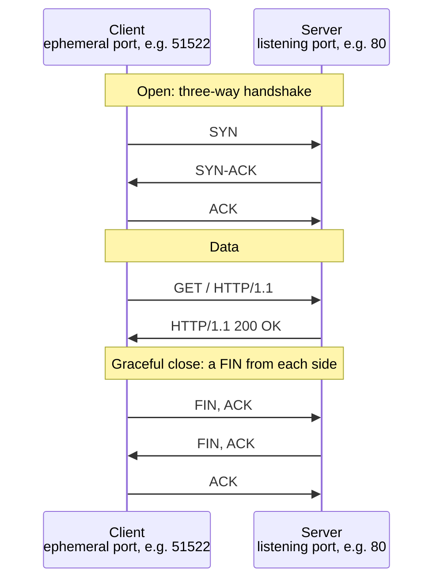
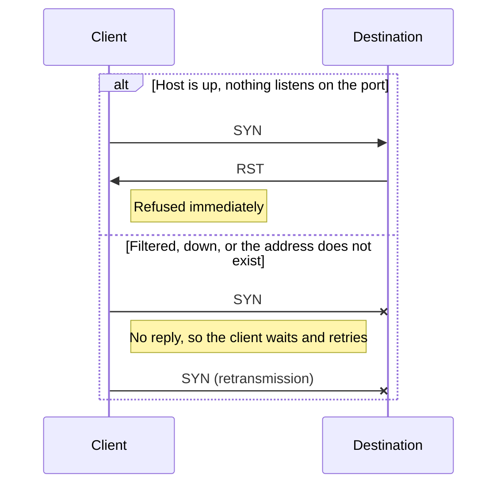
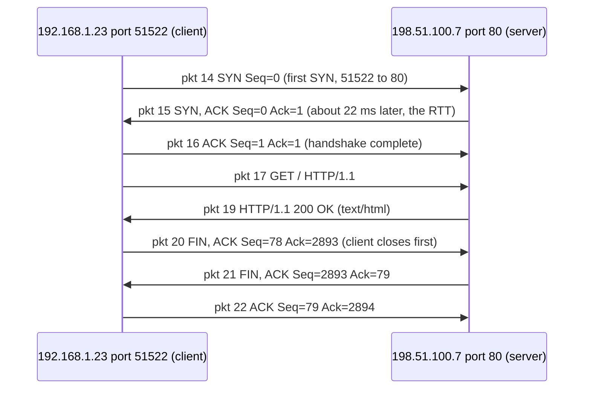

# Day 3: TCP/IP for investigators, reading one connection in Wireshark

Phase: 1. Foundations · Track goal: Read a single network connection packet by packet and describe it in the terms an investigator uses: who, to where, over what, when, and how it ended.

## Concept
You do not need to design networks to investigate them. You need to read the records networks leave behind, and nearly all of those records describe connections in the same few terms.

The IP layer carries source and destination addresses. It also carries a TTL (time to live) that each router decrements by one. Operating systems start from different values (Linux and macOS commonly use 64, Windows 128), so a packet arriving with TTL 52 probably started at 64 and crossed about 12 hops. That is a hint, not proof, since the starting value can be changed.

TCP and UDP add ports. A server listens on a well-known port (443 for HTTPS, 22 for SSH, 53 for DNS), and the client uses a temporary high-numbered ephemeral port. Linux picks from 32768 to 60999 by default and Windows from 49152 to 65535. Put the protocol, both addresses, and both ports together and you have the 5-tuple, which identifies one conversation. Every connection log you will ever read, from a firewall, a proxy, or Zeek, is a table of 5-tuples plus times and byte counts.

TCP opens with a three-way handshake: the client sends SYN, the server answers SYN-ACK, the client sends ACK. It closes gracefully with FIN packets from each side, or abruptly with RST. The flags tell you the story. A SYN with no answer means the destination was down, filtered, or never existed. SYN followed by RST means the host is up but nothing listens on that port. Hundreds of SYNs to different ports with no completed handshakes is what a port scan looks like. UDP has no handshake at all, so a UDP "connection" in a log is really a grouping of packets by 5-tuple and time.

A complete, healthy TCP conversation looks like this on the wire:



A connection that never opens leaves one of two shapes. A port scan is mostly a long list of them:



Wireshark has two kinds of filter, and mixing them up wastes an afternoon. Capture filters use BPF syntax (`host 192.0.2.10 and port 80`) and decide what gets recorded at all. Display filters use Wireshark's own syntax (`ip.addr == 192.0.2.10 && tcp.port == 80`) and only hide packets that are already recorded. In an investigation, prefer broad capture and narrow display, because anything you filtered out at capture time is gone.

Only capture traffic on networks and devices you own or are authorized to monitor. Capturing someone else's traffic is interception, which is a separate offence in most places.

## Resources
- [Wireshark User's Guide](https://www.wireshark.org/docs/wsug_html_chunked/): chapter 4 (capturing) and chapter 6 (display filters).
- [Wireshark display filter reference](https://www.wireshark.org/docs/dfref/): look up `tcp` and `ip` to see every field you can filter on.
- [RFC 9293: Transmission Control Protocol](https://www.rfc-editor.org/rfc/rfc9293), section 3.5 for the handshake and figure 6 for the state diagram.
- [Practical Packet Analysis, 3rd ed.](https://nostarch.com/packetanalysis3) (Chris Sanders), if you want a full book. Paid; the Wireshark guide above covers today's work for free.

## Practical: Wireshark, a flow-graph ladder diagram and a 5-tuple table for one connection
You will capture your own machine fetching a page over plain HTTP, so every byte is readable, and document the connection.

### Step 1: capture
1. Install Wireshark from `https://www.wireshark.org/download.html`. On Linux, `sudo apt install wireshark` and answer Yes when asked whether non-root users may capture, then add yourself with `sudo usermod -aG wireshark $USER` and log out and back in.
2. Open Wireshark and go to View > Time Display Format > UTC Date and Time of Day. Investigators work in UTC.
3. Go to Capture > Options, select your active interface (Wi-Fi or Ethernet), and in the capture filter box type `port 80 or port 53`. Click Start.
4. In a terminal, run:
   ```bash
   curl -4 -s -o /dev/null -w '%{remote_ip}:%{remote_port}\n' http://neverssl.com/
   ```
   `neverssl.com` exists to serve plain HTTP for testing. `-4` forces IPv4 so the addresses are easier to read. Note the IP it prints.
5. Stop the capture (red square) and save it with File > Save As as `day03.pcapng`. Hash it: `sha256sum day03.pcapng`.

### Step 2: isolate the connection
Apply these display filters one at a time and note what each shows:

| Display filter | What it shows |
|---|---|
| `dns` | The lookup of `neverssl.com` that happened before the connection |
| `tcp.flags.syn == 1 && tcp.flags.ack == 0` | Only connection openings, one packet per attempt |
| `ip.addr == <the IP curl printed> && tcp.port == 80` | The whole conversation |
| `http.request` | The GET request line |
| `tcp.flags.fin == 1 \|\| tcp.flags.reset == 1` | How the conversation ended |

Illustrative packet list for the conversation filter (addresses from documentation ranges):
```
No.  Time (UTC)                   Source         Destination    Proto Info
 14  2026-03-10 14:30:01.201844   192.168.1.23   198.51.100.7   TCP   51522 → 80 [SYN] Seq=0 Win=64240 Len=0 MSS=1460
 15  2026-03-10 14:30:01.224310   198.51.100.7   192.168.1.23   TCP   80 → 51522 [SYN, ACK] Seq=0 Ack=1 Win=65535 Len=0
 16  2026-03-10 14:30:01.224402   192.168.1.23   198.51.100.7   TCP   51522 → 80 [ACK] Seq=1 Ack=1 Win=64240 Len=0
 17  2026-03-10 14:30:01.224571   192.168.1.23   198.51.100.7   HTTP  GET / HTTP/1.1
 19  2026-03-10 14:30:01.249907   198.51.100.7   192.168.1.23   HTTP  HTTP/1.1 200 OK  (text/html)
 20  2026-03-10 14:30:01.250311   192.168.1.23   198.51.100.7   TCP   51522 → 80 [FIN, ACK] Seq=78 Ack=2893 Len=0
 21  2026-03-10 14:30:01.273020   198.51.100.7   192.168.1.23   TCP   80 → 51522 [FIN, ACK] Seq=2893 Ack=79 Len=0
 22  2026-03-10 14:30:01.273101   192.168.1.23   198.51.100.7   TCP   51522 → 80 [ACK] Seq=79 Ack=2894 Len=0
```
The gap between packets 14 and 15 (about 22 ms) is the round-trip time to the server. Wireshark shows sequence numbers relative to the start of the connection by default, which is why they begin at 0.

Click packet 15 and expand the Internet Protocol layer in the details pane. Record the TTL. A value like 52 or 56 suggests an initial TTL of 64; a value like 116 or 120 suggests 128.

### Step 3: build the ladder diagram
1. With the conversation filter applied, open Statistics > Flow Graph.
2. Tick "Limit to display filter" and set Flow type to "TCP Flows".
3. Save the graph with the "Save As..." button as `day03-flow.png` (PDF also works).
4. In any image editor, or by redrawing in draw.io (`https://app.diagrams.net`), label the three handshake packets, the request, the response, and the two FINs. Next to the first SYN, write the client's ephemeral port and the server's port.

Your labelled flow graph should carry the same information as this reference ladder, which is built from the illustrative packet list in Step 2. Check your labels against it:



You can also keep a text version next to the image. Copy the block above into `day03-flow.md`, replace every address, port, packet number, and sequence value with your own, and GitHub renders it in place. Keep the `.png` as well, since it comes straight from Wireshark.

### Step 4: build the conversation table
Open Statistics > Conversations and select the TCP tab. Tick "Limit to display filter". Copy the row for your connection into `day03-5tuple.md`:

```markdown
| Field | Value |
|---|---|
| Protocol | TCP |
| Client IP : port | |
| Server IP : port | |
| First packet (UTC) | |
| Duration (s) | |
| Packets A→B / B→A | |
| Bytes A→B / B→A | |
| How it opened | SYN / SYN-ACK / ACK at packets __, __, __ |
| How it closed | FIN from ___ first, or RST |
| Server TTL observed / likely initial | |
| Capture file SHA-256 | |
```

### Step 5: add a failed connection for contrast
Start a new capture with no capture filter and run `curl -4 --max-time 5 http://neverssl.com:81/`. Port 81 is not served, so the attempt fails. Filter on `tcp.port == 81` and note whether you see repeated SYNs with no reply (filtered, so the client retries) or a SYN answered by RST (the host refused). Add one row to your table describing it.

## Checkpoint
Your artifact is the annotated `day03-flow.png` plus `day03-5tuple.md`. It passes when:
- The ladder diagram labels all three handshake packets, the GET, the 200 response, and the closing FIN or RST packets, with ports written on the first SYN.
- Every cell in the table is filled, times are UTC, and the capture hash is included.
- You can state, in one sentence each, what the port-81 attempt looked like on the wire and what it would look like in a firewall log that records only the 5-tuple and an action.
