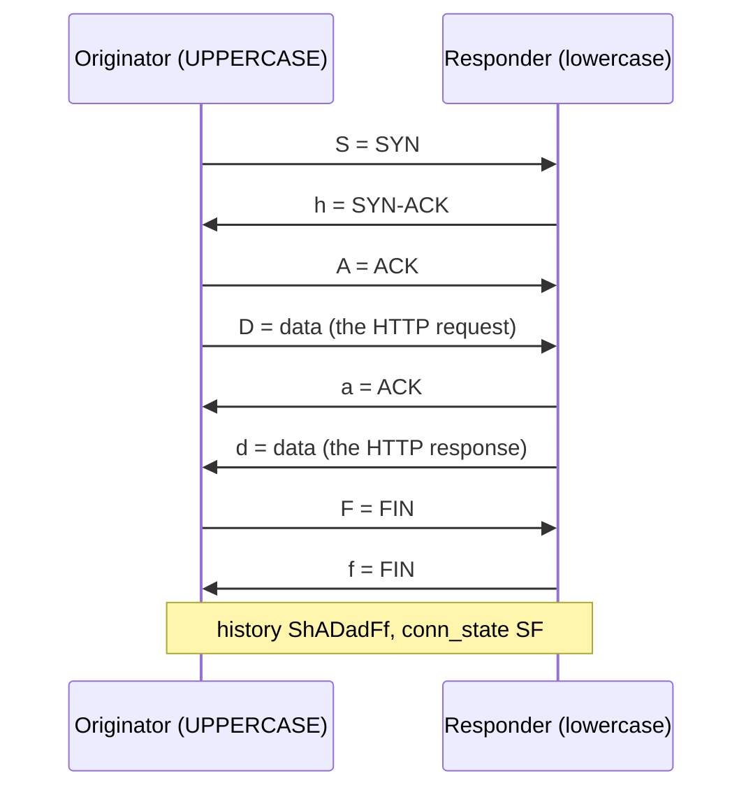
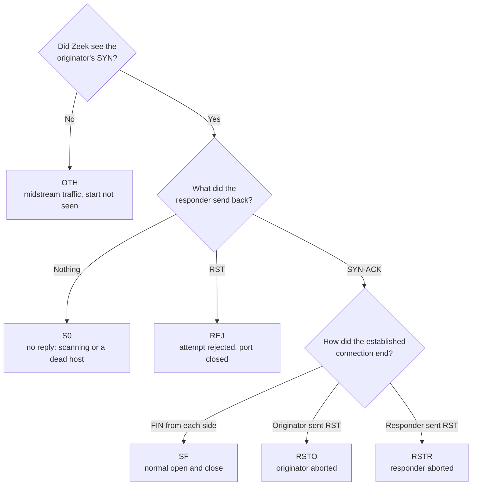
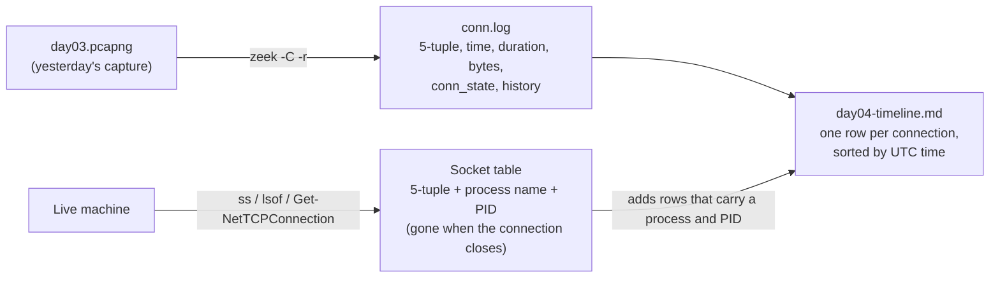

# Day 4: Reading connection logs with Zeek and live socket tables

Phase: 1. Foundations · Track goal: Turn raw packets into the one-line-per-connection records that most investigations actually run on, and read a connection's outcome from its state codes.

## Concept
Full packet captures are rare in real cases. They are large, they fill disks within hours, and most organizations do not keep them. What you usually get is a connection log: one row per conversation with the 5-tuple, start time, duration, byte counts, and some statement of how the conversation went. Firewalls, cloud flow logs (AWS VPC Flow Logs, Google Cloud VPC Flow Logs), proxies, and network sensors all produce some version of this. Zeek's `conn.log` is the most widely used open format, and learning it makes every other flavour easy to read.

Zeek summarizes each connection with two fields worth memorizing. `conn_state` is a short code for how the connection went. `SF` means a normal open and close. `S0` means a SYN was seen with no reply at all, which is what scanning and dead hosts look like. `REJ` means the SYN was answered with a RST, so the port was closed. `RSTO` and `RSTR` mean the originator or the responder reset an established connection. `OTH` means Zeek saw the middle of a conversation without its start, common at the beginning of a capture. The `history` field spells out the packet sequence in letters: `S` for SYN, `h` for SYN-ACK, `A` for ACK, `D` for data, `F` for FIN, `R` for RST. Uppercase letters come from the originator and lowercase from the responder, so `ShADadFf` reads as a full, ordinary TCP conversation.

Here is `ShADadFf` laid out packet by packet. Zeek records `A`, `a`, `D`, and `d` at most once per direction however many it sees, so `D` means "at least one data packet," and the final ACK of the close adds no new letter.



The `conn_state` codes above come from a short series of questions about the start and end of the connection. This chart covers only the six states named in this section; the Zeek documentation lists the rest.



Byte counts carry a lot of investigative weight. A connection where the internal host sent 40 MB and received 2 KB is an upload, whatever the port number suggests. A connection lasting nine hours with a few hundred bytes every minute looks like a heartbeat, which is how many remote-access tools and malware implants behave.

The live counterpart of a connection log is the operating system's socket table. `ss` on Linux, `lsof` on macOS, and `netstat` on Windows show connections open right now and, with the right flags, which process owns each one. That link from a network connection to a process is often the fact that turns "odd traffic" into a finding, and it only exists while the connection is alive. That is why it sits near the top of the order of volatility from Day 2.

## Resources
- [Zeek conn.log documentation](https://docs.zeek.org/en/master/logs/conn.html): the full field list and the `conn_state` and `history` tables.
- [Zeek documentation, "Zeek Logs" and zeek-cut](https://docs.zeek.org/en/master/log-formats.html).
- [ss(8) man page](https://man7.org/linux/man-pages/man8/ss.8.html).
- [Security Onion documentation](https://docs.securityonion.net/) if you later want Zeek running continuously on a sensor. Not needed today.

## Practical: Zeek (via Docker) and ss, producing a connection timeline table
You will turn yesterday's capture into a Zeek `conn.log`, read it, and join it with a live socket table from your own machine.

### Step 1: run Zeek against your pcap
Install Docker Desktop (Windows and macOS) or `docker.io` (Linux). Then, in the folder holding `day03.pcapng`:
```bash
docker run --rm -v "$PWD":/pcap -w /pcap zeek/zeek zeek -C -r day03.pcapng
ls *.log
```
`-r` reads a capture file instead of listening on an interface. `-C` tells Zeek to ignore bad checksums, which you will see on almost every capture taken on the sending machine because the network card fills in checksums after Wireshark sees the packet. Expect `conn.log`, `dns.log`, `http.log`, and a few others.

If you cannot use Docker, `tshark` (installed with Wireshark) gives a comparable conversation summary:
```bash
tshark -r day03.pcapng -q -z conv,tcp
```

### Step 2: read the connection log
Raw `conn.log` is tab-separated with a header block. `zeek-cut` selects columns by name, and `-u` converts timestamps to UTC:
```bash
docker run --rm -v "$PWD":/pcap -w /pcap zeek/zeek sh -c \
  "zeek-cut -u ts id.orig_h id.orig_p id.resp_h id.resp_p proto service duration orig_bytes resp_bytes conn_state history < conn.log"
```
Illustrative output (documentation addresses):
```
2026-03-10T14:30:01+0000  192.168.1.23  38211  192.168.1.1   53  udp  dns   0.021  31  47    SF   Dd
2026-03-10T14:30:01+0000  192.168.1.23  51522  198.51.100.7  80  tcp  http  0.071  77  2892  SF   ShADadFf
2026-03-10T14:30:44+0000  192.168.1.23  51530  198.51.100.7  81  tcp  -     5.002  0   0     S0   S
```
Read each row aloud as a sentence. The second row: "At 14:30:01 UTC, 192.168.1.23 opened an HTTP connection to 198.51.100.7 on port 80, sent 77 bytes, received 2,892, and closed it normally." The third: "It tried port 81 and got no answer at all." If your port-81 attempt was refused instead, you will see `REJ` with history `Sr`.

### Step 3: count by state
On a larger capture this one-liner is your first look at what kind of traffic you have:
```bash
docker run --rm -v "$PWD":/pcap -w /pcap zeek/zeek sh -c \
  "zeek-cut conn_state < conn.log | sort | uniq -c | sort -rn"
```
A capture dominated by `S0` and `REJ` from one source is scanning. A capture dominated by `SF` is ordinary use.

### Step 4: map live connections to processes
With a browser open, run the socket table for your own machine:
```bash
# Linux
sudo ss -tunap state established
# macOS
sudo lsof -nP -iTCP -sTCP:ESTABLISHED
# Windows (PowerShell as admin)
Get-NetTCPConnection -State Established | Select LocalAddress,LocalPort,RemoteAddress,RemotePort,OwningProcess
```
Illustrative Linux output:
```
Netid Recv-Q Send-Q  Local Address:Port    Peer Address:Port  Process
tcp   0      0       192.168.1.23:51544    198.51.100.7:443   users:(("firefox",pid=2311,fd=87))
tcp   0      0       192.168.1.23:40118    203.0.113.20:443   users:(("slack",pid=3120,fd=41))
```
The `Process` column links a connection to a named program and PID, which no network log can do on its own.

### Step 5: build the connection timeline
Create `day04-timeline.md` with one row per connection from your `conn.log`, sorted by time, plus three rows from your socket table. The two sources meet in the table like this:



```markdown
| Time (UTC) | Source | Destination | Proto/Service | Duration | Bytes out/in | State | History | Process (if known) | Plain-English reading |
|---|---|---|---|---|---|---|---|---|---|
```
The last column is the point of the exercise. Each row needs a sentence a non-technical manager could follow, such as "the laptop looked up neverssl.com, then downloaded its homepage over unencrypted HTTP."

## Checkpoint
Your artifact is `day04-timeline.md`. It passes when:

- `day04-timeline.md` has at least five rows.
- The rows are sorted by UTC time.
- Every `conn_state` and `history` value is copied exactly from the log.
- At least one row has a state other than `SF`.
- The plain-English reading of that row says correctly what happened (no answer, refused, or reset, and by which side).
- At least one row carries a process name and PID from the socket table.
- You can explain why a firewall log could never have told you that process name and PID.
- Without notes, you can decode `ShADadFf`, `S`, and `Sr`.
