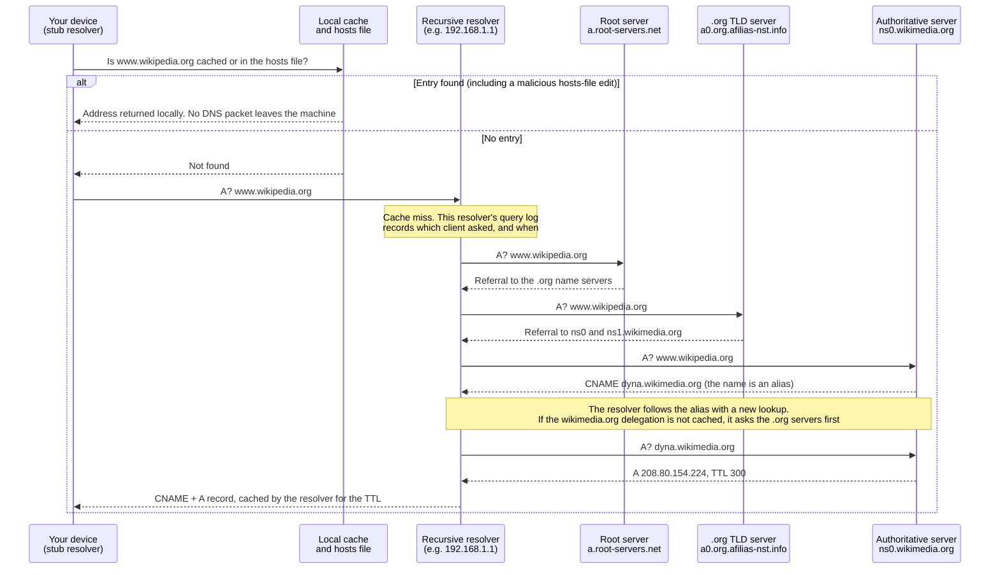
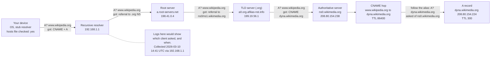

# Day 5: DNS resolution chains, following a name to an address

Phase: 1. Foundations · Track goal: Trace how a hostname becomes an IP address, hop by hop, and know which party in that chain holds which evidence.

## Concept
Almost every incident starts with a name: a link in a phishing text, a domain in a proxy log, a hostname in malware configuration. Before a connection happens, the name has to be resolved, and each step of that resolution involves a different party who saw the query and may have logged it.

The chain has four kinds of participant. Your device's stub resolver checks the local cache and the hosts file (`/etc/hosts` on Linux and macOS, `C:\Windows\System32\drivers\etc\hosts` on Windows), then asks a recursive resolver. That is usually your router, your ISP, your employer's DNS server, or a public service such as 1.1.1.1 or 8.8.8.8. The recursive resolver, if it has no cached answer, asks a root server which servers handle the top-level domain (`.org`), asks those which servers are authoritative for the domain (`wikipedia.org`), and finally asks the authoritative server for the record itself.

The full chain for `www.wikipedia.org`, using the illustrative values from today's practical, runs like this:



Two details trip up investigators again and again. First, answers are cached for the record's TTL in seconds. If a domain's A record has a TTL of 300, two people querying ten minutes apart may get different answers, and neither is wrong. Always record the time and the resolver you used. Second, many names are aliases. A CNAME record says "this name is really that other name," and the chain can run several hops, often ending at a CDN or cloud provider's hostname. The final IP may belong to a shared platform hosting thousands of unrelated sites, so an IP alone rarely identifies who is behind a domain.

For evidence, the recursive resolver's query log is often the best record of which internal machine looked up which domain, and when. It exists before any connection and survives even when the connection was blocked. The hosts file matters for the opposite reason: malware and some fraud tools edit it to send a real bank's name to a fake server, and nothing on the network will show the redirection, because no DNS query ever leaves the machine.

`dig` is the investigator's standard tool because it shows the whole response, including flags and TTLs. `nslookup` is installed everywhere, including Windows, and is good enough for quick checks.

## Resources
- [How DNS Works (comic)](https://howdns.works/): a fast, accurate walk through the resolution chain.
- [Mess With DNS](https://messwithdns.net/) by Julia Evans: a free sandbox where you create records and watch real resolvers query them.
- [dig manual (BIND 9 documentation)](https://bind9.readthedocs.io/en/latest/manpages.html#dig-dns-lookup-utility).
- [DNSViz](https://dnsviz.net/): draws the delegation and DNSSEC chain for any domain.
- [RFC 1034](https://www.rfc-editor.org/rfc/rfc1034), section 5 on resolvers, if you want the source.

## Practical: dig, DNSViz, and draw.io, producing a resolution-chain diagram for a public organization's hostname
Pick one public organization's website hostname (a university, a city government, a national library, or Wikipedia). The examples below use `www.wikipedia.org`.

### Step 1: find out what your machine uses
```bash
# Linux (systemd-resolved)
resolvectl status | grep -A2 "DNS Servers"
# macOS
scutil --dns | grep nameserver | sort -u
# Windows
Get-DnsClientServerAddress -AddressFamily IPv4
```
Also check the hosts file on your machine for any entries other than `localhost`. Record both in your notes.

### Step 2: resolve normally and read the full answer
```bash
dig www.wikipedia.org
```
Illustrative output, trimmed:
```
;; ->>HEADER<<- opcode: QUERY, status: NOERROR, id: 40211
;; flags: qr rd ra; QUERY: 1, ANSWER: 2, AUTHORITY: 0, ADDITIONAL: 1

;; QUESTION SECTION:
;www.wikipedia.org.             IN      A

;; ANSWER SECTION:
www.wikipedia.org.      49518   IN      CNAME   dyna.wikimedia.org.
dyna.wikimedia.org.     300     IN      A       208.80.154.224

;; Query time: 18 msec
;; SERVER: 192.168.1.1#53(192.168.1.1)
;; WHEN: Tue Mar 10 14:41:02 UTC 2026
```
What each part tells you:
- `status: NOERROR` means the name exists. `NXDOMAIN` means it does not. `SERVFAIL` means the resolver could not get an answer, which is common for broken or deliberately misconfigured malicious domains.
- `flags: qr rd ra` shows this is a response (`qr`), you asked for recursion (`rd`), and the server offers it (`ra`). The absence of `aa` means the answer came from a cache or a recursive resolver, not from the authoritative server.
- The ANSWER section shows a two-hop chain: `www.wikipedia.org` is an alias (CNAME) for `dyna.wikimedia.org`, which has the A record. The CNAME's TTL is long (hours); the A record's is 5 minutes, so the address can change quickly while the alias stays stable.
- `SERVER` and `WHEN` are your provenance. Copy them into your notes every time.

The same lookup with `nslookup`, for comparison:
```bash
nslookup www.wikipedia.org 1.1.1.1
```
It shows the CNAME as `canonical name = dyna.wikimedia.org.` and labels the result "Non-authoritative answer."

### Step 3: walk the chain from the root
```bash
dig +trace +nodnssec www.wikipedia.org
```
`+trace` makes `dig` do the resolver's job itself: it asks a root server, follows the referral to the `.org` servers, then to the domain's own name servers. Illustrative, trimmed:
```
.                     518400  IN  NS  a.root-servers.net.
;; Received 239 bytes from 192.168.1.1#53(192.168.1.1) in 12 ms

org.                  172800  IN  NS  a0.org.afilias-nst.info.
;; Received 780 bytes from 198.41.0.4#53(a.root-servers.net) in 21 ms

wikipedia.org.        86400   IN  NS  ns0.wikimedia.org.
wikipedia.org.        86400   IN  NS  ns1.wikimedia.org.
;; Received 350 bytes from 199.19.56.1#53(a0.org.afilias-nst.info) in 30 ms

www.wikipedia.org.    86400   IN  CNAME  dyna.wikimedia.org.
;; Received 88 bytes from 208.80.154.238#53(ns0.wikimedia.org) in 95 ms
```
Each `Received ... from` line names the server that gave that piece of the answer. Note that the last step returns only the CNAME; `+trace` does not follow it. Run `dig +trace +nodnssec dyna.wikimedia.org` to finish the chain.

Some networks block direct queries to root servers, so `+trace` stops after the first block. If that happens, run it from a different network or skip to Step 4, which does not depend on it.

### Step 4: ask the authoritative server directly
```bash
dig @ns0.wikimedia.org dyna.wikimedia.org +norecurse
```
The `flags` line now includes `aa` (authoritative answer). The TTL shows the full configured value rather than a countdown from a cache.

### Step 5: watch caching happen
```bash
for i in 1 2 3; do dig +noall +answer dyna.wikimedia.org @1.1.1.1; sleep 20; done
```
The TTL goes down between runs, which shows you are reading from a cache.

### Step 6: get the DNSViz graph
Go to `https://dnsviz.net/`, enter the domain (`wikipedia.org`), and click the analyze button. On the results page, save the graph image (right-click > Save image as) as `day05-dnsviz.png`. It draws the delegation from the root down to the domain, including the DNSSEC signing chain if the domain uses DNSSEC.

### Step 7: draw your own resolution chain
In draw.io (`https://app.diagrams.net`, choose "Device" to save locally), draw the chain you observed, left to right:

1. Your device (label: OS, stub resolver, hosts file checked yes or no)
2. Your recursive resolver (label: IP from Step 1)
3. Root server (label: the name and IP from `+trace`)
4. TLD server (label: name and IP)
5. Authoritative server (label: name and IP)
6. Each CNAME hop as its own box, with its TTL
7. The final A or AAAA record, with its TTL

On each arrow, write what was asked and what came back ("A? www.wikipedia.org → referral to .org NS"). Beside the recursive resolver, add a note: "Logs here would show which client asked, and when." Save as `day05-resolution-chain.drawio` and export with File > Export as > PNG.

A finished diagram carries the same boxes and labels as this reference, which uses the illustrative values from Steps 2 and 3. Every value on yours must come from your own output:



Each arrow into a server box is labelled with the question sent to that server and the answer it gave.

## Checkpoint
Your artifacts are `day05-resolution-chain.png` and `day05-dnsviz.png`. They pass when:
- Every server box carries a name and IP taken from your own `dig` output, and every record box carries a TTL.
- The CNAME chain is complete, ending at an A or AAAA record.
- The diagram marks where query logs would exist (the recursive resolver, at minimum) and notes the collection time and resolver used.
- You can explain why two investigators could get different IPs for the same name an hour apart, and why editing a hosts file would leave no trace on the network.
