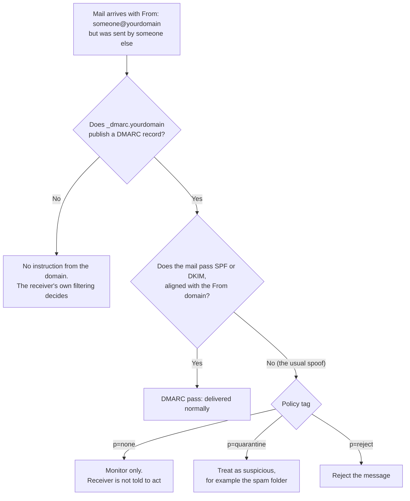
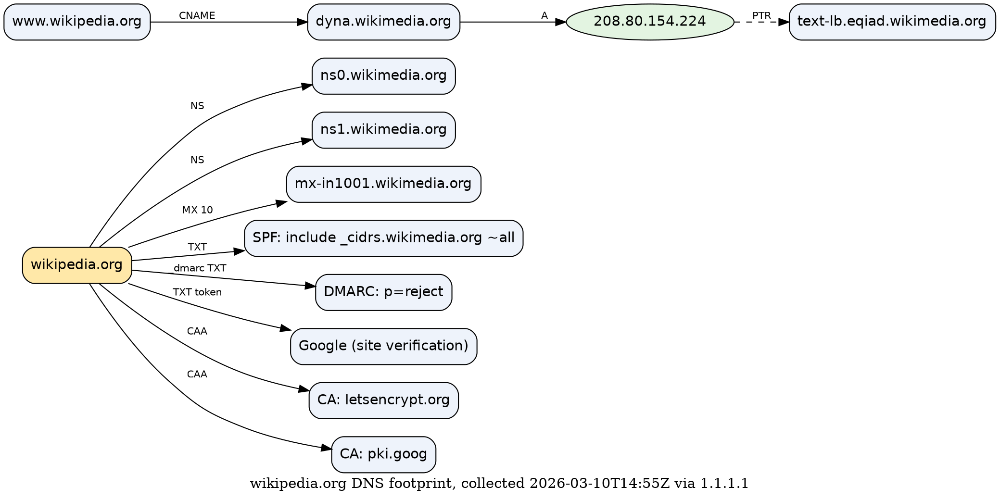
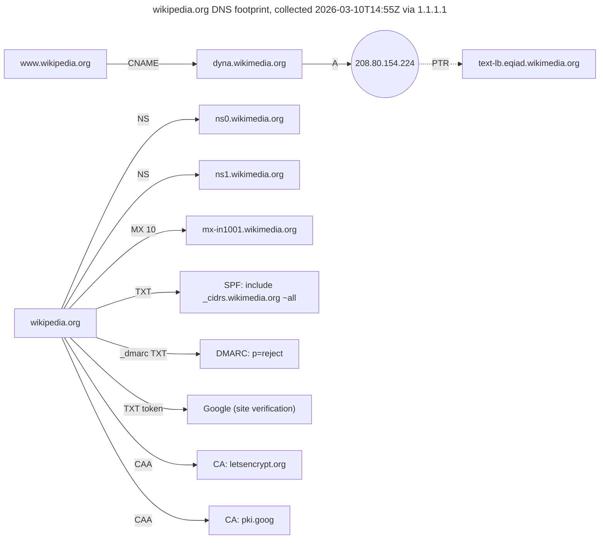

# Day 6: DNS records as evidence, building a domain footprint graph

Phase: 1. Foundations · Track goal: Read each common DNS record type for what it reveals about an organization's infrastructure and email posture, and turn the results into a graph.

## Concept
Yesterday you resolved a name to an address. Today you read the rest of a domain's public DNS, which says a surprising amount about how an organization runs its infrastructure. All of it is published on purpose so that the internet can reach the organization, which is why reading it is ordinary, lawful reconnaissance.

The records worth knowing, and what each tells an investigator:

| Record | Holds | What it tells you |
|---|---|---|
| A / AAAA | IPv4 / IPv6 address | Where the service is hosted. Often a CDN or cloud range shared with many other customers. |
| CNAME | An alias to another name | Which platform actually serves the name (a CDN, a SaaS help desk, a website builder). |
| NS | The domain's name servers | Who operates the domain's DNS. A sudden NS change on an established domain can mean a transfer or a hijack. |
| SOA | Primary server, admin mailbox, serial number | The RNAME field is an email address written with a dot for the `@`. Serials are often dates (`2026060420`), which shows when the zone last changed. |
| MX | Mail servers, with priority | Who handles inbound mail (Google Workspace, Microsoft 365, self-hosted). `0 .` is a null MX (RFC 7505): the domain accepts no mail at all. |
| TXT | Free text | SPF policy, domain-verification tokens left by SaaS vendors, and sometimes other configuration. |
| TXT at `_dmarc.` | DMARC policy | How receivers should treat mail that fails authentication. Directly relevant to how easily the domain can be spoofed. |
| CAA | Which certificate authorities may issue for the domain | An unexpected CA in Certificate Transparency logs becomes suspicious when CAA forbids it. |
| PTR | Reverse mapping from IP to name | Hosting hints. Operators often encode data-centre or role names here. |

Email records deserve extra attention because so much fraud travels by email. SPF (`v=spf1 ... -all`) lists which servers may send mail for the domain; `-all` means reject everything else, and `~all` means only mark it as suspicious. DMARC (`v=DMARC1; p=reject`) tells receiving servers what to do with mail that fails SPF and DKIM alignment. A domain with no DMARC record, or with `p=none`, gives receivers no instruction to reject spoofed mail, so a lookalike attack against it is cheaper. You will use this in Phase 5 when you assess why a business email compromise worked.

For a receiver that honours DMARC, the fate of a spoofed message comes down to the record at `_dmarc.` and the policy tag in it:



Current DNS only shows the present. Passive DNS services record what names resolved to in the past, which matters when a scam domain has already moved or gone dark. You will use them in Phase 3.

## Resources
- [RFC 7208: SPF](https://www.rfc-editor.org/rfc/rfc7208), section 5 for the mechanisms (`include`, `ip4`, `-all`).
- [RFC 7489: DMARC](https://www.rfc-editor.org/rfc/rfc7489), section 6.3 for the policy tags (`p`, `sp`, `rua`, `pct`).
- [dmarc.org overview](https://dmarc.org/overview/).
- [Graphviz documentation](https://graphviz.org/documentation/) and the [DOT language reference](https://graphviz.org/doc/info/lang.html).
- [Cloudflare Learning Center: DNS records](https://www.cloudflare.com/learning/dns/dns-records/), a readable reference for each type.

## Practical: dig and Graphviz, producing a domain footprint graph
Pick one public organization's primary domain. The worked example uses `wikipedia.org` and `example.com`, the domain IANA reserves for documentation.

### Step 1: collect every record type
```bash
D=wikipedia.org
for t in A AAAA NS SOA MX TXT CAA; do
  echo "== $t"; dig +noall +answer "$D" "$t"
done | tee day06-$D-raw.txt
dig +noall +answer "_dmarc.$D" TXT | tee -a day06-$D-raw.txt
date -u +%Y-%m-%dT%H:%M:%SZ >> day06-$D-raw.txt
```
Do not use `dig ANY`. Most servers now return a minimal answer to ANY queries (RFC 8482), so it will look like the domain has almost no records.

Illustrative results for `wikipedia.org` (captured in 2026; yours may differ):
```
wikipedia.org.  86400  IN  NS    ns0.wikimedia.org.
wikipedia.org.  3600   IN  SOA   ns0.wikimedia.org. hostmaster.wikimedia.org. 2026060420 43200 7200 1209600 3600
wikipedia.org.  600    IN  MX    10 mx-in1001.wikimedia.org.
wikipedia.org.  600    IN  TXT   "v=spf1 include:_cidrs.wikimedia.org ~all"
wikipedia.org.  600    IN  TXT   "google-site-verification=AMHkgs-..."
wikipedia.org.  600    IN  CAA   0 issue "letsencrypt.org"
wikipedia.org.  600    IN  CAA   0 issue "pki.goog"
_dmarc.wikipedia.org. 600 IN TXT "v=DMARC1; p=reject; rua=mailto:dmarc-rua@wikimedia.org;"
```
Reading it:
- DNS and mail are self-hosted under `wikimedia.org` (the NS and MX names are the organization's own).
- The SOA admin mailbox `hostmaster.wikimedia.org` means `hostmaster@wikimedia.org`, and the serial reads as a date: 4 June 2026, change number 20.
- SPF ends in `~all` (soft fail), but DMARC is `p=reject`, so receivers are told to reject mail that fails alignment.
- A Google site-verification token shows the domain was verified with a Google service. Tokens like this tell you which SaaS vendors an organization uses.
- CAA allows only Let's Encrypt and Google Trust Services to issue certificates.

And for `example.com`:
```
example.com.  300  IN  MX   0 .
example.com.  300  IN  TXT  "v=spf1 -all"
```
A null MX and an SPF record that authorizes nobody: this domain sends and receives no mail, so any email claiming to come from it is forged. Many organizations publish exactly this on parked or defensive lookalike domains they own.

### Step 2: follow the pointers one level out
```bash
dig +short A mx-in1001.wikimedia.org        # where does mail land?
dig +short -x 208.80.154.224                # reverse lookup of the web IP
dig +short TXT _cidrs.wikimedia.org         # expand the SPF include
```
An illustrative reverse lookup returns `text-lb.eqiad.wikimedia.org.`, a name that suggests a load balancer (`lb`) and a site code (`eqiad`). Treat the site-code reading as an inference; the record does not state it.

### Step 3: write the graph
Install Graphviz (`sudo apt install graphviz`, `brew install graphviz`, or the Windows installer from graphviz.org). Create `day06-footprint.dot` using your own data:


Render it:
```bash
dot -Tpng day06-footprint.dot -o day06-footprint.png
dot -Tsvg day06-footprint.dot -o day06-footprint.svg
```

Here is the same data drawn with Mermaid, so you can see what a finished footprint graph looks like before you render your own. Graphviz lays the nodes out differently, and your values will come from your own domain:



If you prefer Mermaid to Graphviz, you can write your graph this way instead and save it in `day06-footprint.md`; GitHub renders it, and the Mermaid Live Editor (`https://mermaid.live`) exports it as PNG or SVG.

### Step 4: annotate findings
Under the graph, in `day06-findings.md`, write one line per observation in the form "Observation (record) → what it suggests → confidence." For example:
```
DMARC p=reject (_dmarc TXT) → receivers are told to reject spoofed mail from this exact domain → high, stated in the record
PTR contains "eqiad" (PTR) → web front end sits in a data centre with that site code → low, inferred from naming only
```

## Checkpoint
Your artifact is `day06-footprint.png` plus `day06-findings.md` and the raw capture file. It passes when:
- The graph has at least one node for each of NS, MX, A (or CNAME to A), SPF, DMARC (or an explicit "no DMARC" node), and CAA (or "no CAA").
- The graph label carries the collection time in UTC and the resolver.
- Every finding line states its confidence, and any line based on naming conventions alone is marked as an inference.
- You can say, from DMARC and SPF alone, whether a spoofed email "from" your chosen domain is likely to be rejected by a receiver that honours DMARC, and why.
