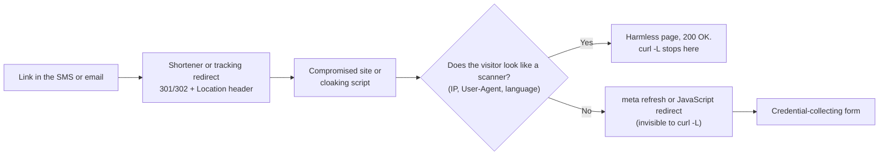
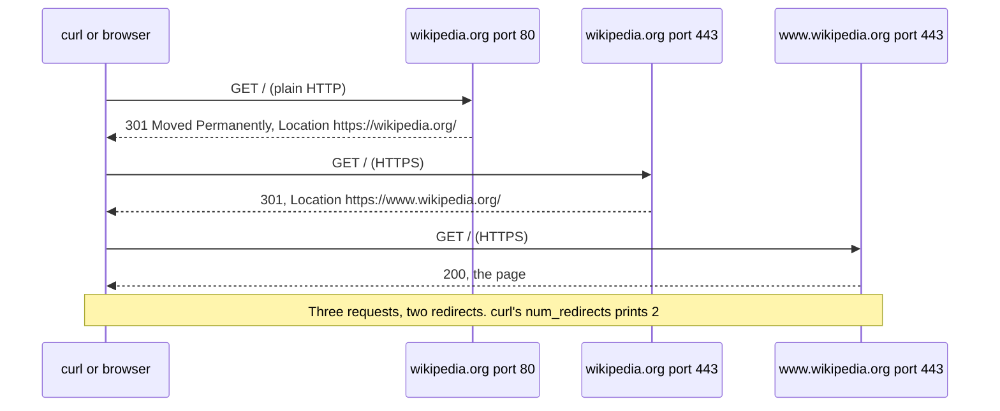
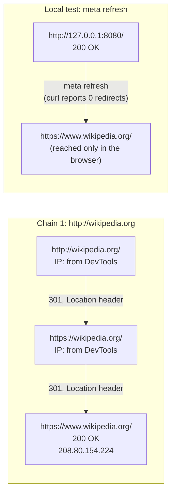

# Day 7: HTTP for investigators, headers, status codes, and redirect chains

Phase: 1. Foundations · Track goal: Read an HTTP exchange the way it appears in logs and captures, and map a redirect chain from the first URL a victim clicked to the page that finally loaded.

## Concept
Most scams reach victims as a URL, and the URL in the message is rarely where the victim ends up. Link shorteners, tracking redirects, compromised websites, and cloaking scripts sit between the lure and the phishing page. Mapping that chain is routine investigative work, and it runs on a handful of HTTP facts.

A request has a method (`GET` to fetch, `POST` to submit a form), a path, and headers. The ones investigators check are `Host` (which site was asked for, important when one IP hosts many sites), `User-Agent` (what the client claims to be), `Referer` (the page the client came from; the misspelling is in the standard), and `Cookie`.

A response has a status code and headers. The status classes: `2xx` success, `3xx` redirect, `4xx` client error (`403` forbidden, `404` not found), `5xx` server error. For redirects, `301` and `308` are permanent and `302`, `303`, and `307` are temporary; the destination is in the `Location` header. Response headers that help identify infrastructure include `Server` (web server software, often generic or hidden), `Via`, and CDN-specific headers such as `CF-RAY` for Cloudflare or `X-Cache`, as well as `Set-Cookie` (session and tracking cookies, sometimes named after the framework that set them), `Date` (the server's own clock, useful for time reconciliation), and `Last-Modified`.

Header redirects are only one mechanism. A page can also redirect with an HTML `<meta http-equiv="refresh">` tag or with JavaScript (`window.location = ...`). Command-line tools such as `curl -L` follow only header redirects, so a chain that looks like it stops at a `200 OK` may continue in the browser. Phishing kits also cloak: they return a harmless page to visitors whose IP, user agent, or language looks like a security scanner, and the real page to everyone else. Two tools can see two different chains for the same URL, and both captures can be accurate.

A typical scam chain, and the point where your tools and the victim's browser part ways:



A header redirect is a plain request and response exchange. This is the public chain you will map in Step 2:



Do not open suspicious links from your own home or office IP, and never enter anything into a suspected phishing form. Today you practise on known-good public redirects. In Phase 2 you will use sandboxed services such as urlscan.io for live suspicious URLs.

## Resources
- [MDN: HTTP response status codes](https://developer.mozilla.org/en-US/docs/Web/HTTP/Status) and [MDN: HTTP headers](https://developer.mozilla.org/en-US/docs/Web/HTTP/Headers).
- [Everything curl](https://everything.curl.dev/), especially the sections on verbose output and following redirects.
- [Chrome DevTools: Network features reference](https://developer.chrome.com/docs/devtools/network/reference).
- [urlscan.io](https://urlscan.io/): preview for Phase 2. It records every request and redirect a page makes. Public scans are visible to everyone; choose Unlisted or Private for anything sensitive.

## Practical: curl and browser DevTools, producing a redirect-chain diagram and a header comparison table

### Step 1: read one exchange in full
```bash
curl -4 -sv -o /dev/null https://www.wikipedia.org/ 2>&1 | grep -E '^[<>*] '
```
Lines starting with `>` are what you sent, `<` is what came back, and `*` is curl describing the connection. Illustrative, trimmed:
```
* Connected to www.wikipedia.org (208.80.154.224) port 443
* SSL connection using TLSv1.3 / AEAD-CHACHA20-POLY1305-SHA256
> GET / HTTP/2
> Host: www.wikipedia.org
> User-Agent: curl/8.7.1
> Accept: */*
< HTTP/2 200
< date: Tue, 10 Mar 2026 15:02:19 GMT
< server: ATS/9.2.15
< x-cache: cp1108 miss, cp1108 hit/1167008
< strict-transport-security: max-age=106384710; includeSubDomains; preload
< content-type: text/html
```
The `server` and `x-cache` headers point to a caching layer in front of the site. `strict-transport-security` tells browsers to use HTTPS only for this domain in future.

### Step 2: map a header redirect chain
```bash
curl -4 -sIL http://wikipedia.org | grep -iE '^(HTTP/|location:|server:|date:)'
```
Illustrative output (captured in 2026):
```
HTTP/1.1 301 Moved Permanently
location: https://wikipedia.org/
HTTP/2 301
location: https://www.wikipedia.org/
HTTP/2 200
```
Three hops: plain HTTP is upgraded to HTTPS, then the bare domain is sent to `www`, then the page loads.

`-I` sends HEAD requests, and some servers answer HEAD differently from GET. Confirm with a real GET that discards the body but dumps every hop's headers:
```bash
curl -4 -sL -D - -o /dev/null http://wikipedia.org | grep -iE '^(HTTP/|location:)'
curl -4 -sL -o /dev/null -w 'hops=%{num_redirects} final=%{url_effective} code=%{http_code}\n' http://wikipedia.org
```

Repeat for a second public chain of your choice, such as `http://github.com` or your city government's bare domain over `http://`.

### Step 3: catch what curl misses
Create a local test page that redirects with a meta tag, to prove the point on your own machine:
```bash
mkdir -p ~/lab/day07 && cd ~/lab/day07
cat > index.html <<'EOF'
<html><head><meta http-equiv="refresh" content="0; url=https://www.wikipedia.org/"></head>
<body>Redirecting...</body></html>
EOF
python3 -m http.server 8080 --bind 127.0.0.1
```
In another terminal, `curl -sL -o /dev/null -w '%{num_redirects} %{url_effective}\n' http://127.0.0.1:8080/` reports zero redirects and a final URL on 127.0.0.1. Open the same address in a browser and you land on Wikipedia. Write down what this means for any chain you map with curl alone. Stop the server with Ctrl+C.

### Step 4: record the same chain in the browser
1. Open a new private window and press F12 (Cmd+Option+I on macOS) to open DevTools. Select the Network tab.
2. Tick "Preserve log", so entries survive the page changing, and "Disable cache".
3. Type `http://wikipedia.org` in the address bar and press Enter.
4. Each redirect appears as its own row with its status code. Click a row and read the Headers panel; the `Location` response header shows the next hop.
5. Save the recording as a HAR file (the download-arrow icon in the Network toolbar, or right-click a row and choose the save or export HAR option). HAR files are JSON and include cookies and sometimes tokens, so treat them as sensitive evidence. Hash the file as on Day 2.

### Step 5: build the artifacts
Draw the chain in draw.io, one box per hop, left to right. Each box holds the full URL, and each arrow holds the status code and the mechanism (`301 Location`, `meta refresh`, `JavaScript`). Under each box, note the responding IP where you have it (from `curl -v` or the DevTools Headers panel, which shows "Remote Address"). Add the local meta-refresh test as a second, separate chain. Export as `day07-redirects.png`.

Your drawing should end up shaped like this reference. The IP under the final box is the one `curl -v` printed in Step 1; fill in the others from your own DevTools "Remote Address" values:



Chain 2, your own choice from Step 2, goes between them in the same style.

Then fill `day07-headers.md` for the final page of each public chain:

```markdown
| Header | Chain 1 final page | Chain 2 final page | What it suggests |
|---|---|---|---|
| Status | | | |
| Server | | | |
| CDN / cache headers (Via, X-Cache, CF-RAY, ...) | | | |
| Set-Cookie names | | | |
| Strict-Transport-Security | | | |
| Date (server clock) vs your UTC clock | | | |
```

## Checkpoint
Your artifacts are `day07-redirects.png`, `day07-headers.md`, and the hashed HAR file. They pass when:
- Both public chains show every hop with full URL, status code, and mechanism.
- The number of redirect arrows in each chain matches `%{num_redirects}` from curl (the Wikipedia chain has three boxes and two arrows).
- The meta-refresh chain is drawn separately.
- The meta-refresh chain carries a note explaining why curl reported zero redirects.
- The header table's last column states inferences as inferences (for example, "`x-cache` suggests a caching proxy in front of the origin") rather than facts about who operates the site.
- You can explain why a phishing URL might show a harmless page to your scanner and a credential form to a victim, and name one thing you would change about how you fetch it to reduce that effect.
