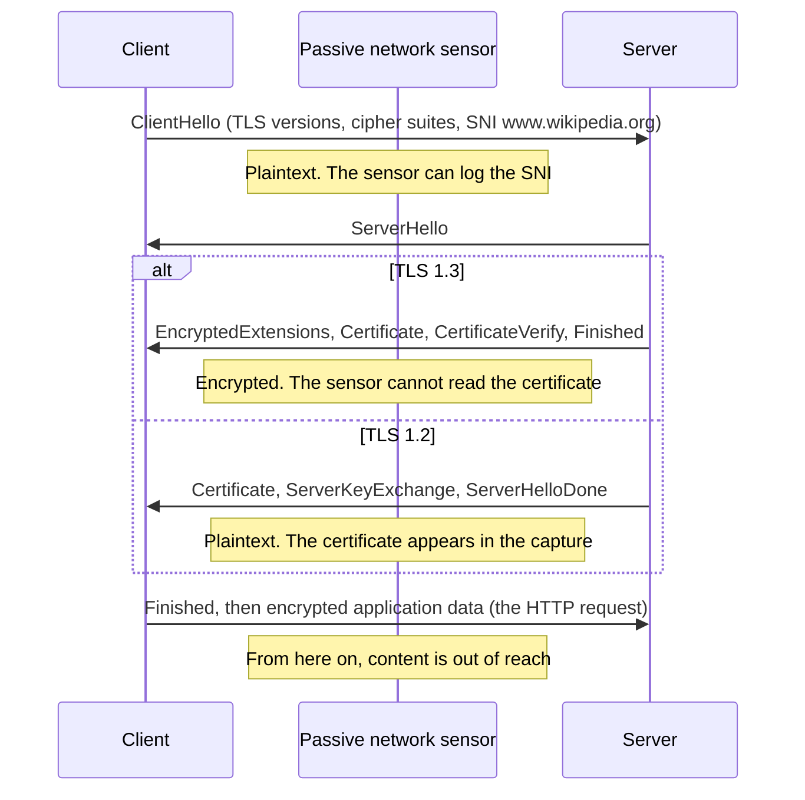
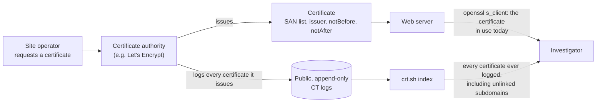
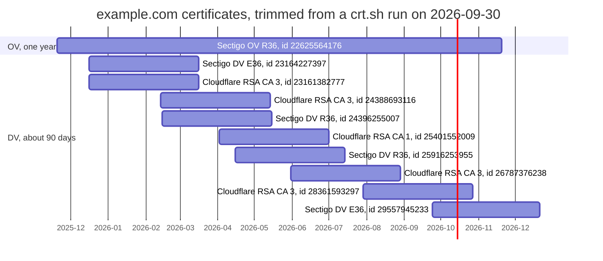

# Day 8: TLS and certificates, what an investigator reads in a cert

Phase: 1. Foundations · Track goal: Pull a server's certificate, read the fields that matter to an investigation, and use Certificate Transparency logs to build an issuance timeline for a domain.

## Concept
Most web traffic is encrypted with TLS, so content is usually out of reach. The handshake and the certificate are not, and they carry a lot of investigative value.

A TLS connection begins with the client's ClientHello. It lists the TLS versions and cipher suites the client supports and, in the Server Name Indication (SNI) extension, the hostname it wants. SNI travels in plaintext in almost all traffic today (Encrypted Client Hello exists but is not yet common), so a network sensor that cannot read the page can still log which site was requested. The server answers with a ServerHello and its certificate. In TLS 1.2 the certificate is sent in plaintext and appears in packet captures. In TLS 1.3 it is encrypted, so a passive sensor sees the SNI but not the certificate. To read the certificate you connect to the server yourself.

The handshake, from the point of view of a sensor sitting on the wire:



The certificate fields worth reading:

- Subject Alternative Name (SAN) is the list of hostnames the certificate is valid for. Browsers use this, not the old Common Name. A SAN list is a ready-made list of related domains, and one certificate covering `brand-login.example` and `brand-verify.example` ties both to the same operator.
- Issuer names the certificate authority. Free, automated CAs such as Let's Encrypt issue a large share of all web certificates, for legitimate and malicious sites alike, so the issuer alone proves nothing.
- Validity (`notBefore`, `notAfter`) sets the certificate's lifetime. `notBefore` is usually within minutes of issuance, so it dates when someone set up the site. A certificate for a bank lookalike issued two days before the phishing texts started is a timeline anchor.
- The certificate policy OID gives the validation level: `2.23.140.1.2.1` is domain validated (DV, meaning only control of the domain was checked), `2.23.140.1.2.2` is organization validated (OV), and `2.23.140.1.1` is extended validation (EV). A DV certificate says nothing about who the site owner is.
- The serial number and SHA-256 fingerprint identify one specific certificate, and they are what you cite in a report.

Certificate Transparency (CT) makes certificates searchable. Browsers require publicly trusted CAs to log every certificate they issue to public, append-only CT logs. Services such as crt.sh index those logs, so you can list every certificate ever issued for a domain, including subdomains nobody linked to. Defenders use this to spot lookalike domains the moment a certificate is issued for them. Investigators use it to date infrastructure and to find related hosts.

The two routes to a certificate, and what each gives you:



## Resources
- [The Illustrated TLS 1.3 Connection](https://tls13.xargs.org/): every byte of a real handshake, annotated.
- [crt.sh](https://crt.sh/): free Certificate Transparency search by Sectigo.
- [Certificate Transparency: How CT works](https://certificate.transparency.dev/howctworks/).
- [RFC 5280](https://www.rfc-editor.org/rfc/rfc5280), section 4.1 (certificate fields) and 4.2.1.6 (Subject Alternative Name).
- [CA/Browser Forum Baseline Requirements](https://cabforum.org/working-groups/server/baseline-requirements/), for the current maximum certificate lifetimes and the policy OIDs.

## Practical: openssl and crt.sh, producing a certificate profile card and an issuance timeline
Use the same public organization's domain as Days 5 and 6. The worked example uses `www.wikipedia.org`.

### Step 1: pull the certificate
```bash
echo | openssl s_client -connect www.wikipedia.org:443 -servername www.wikipedia.org 2>/dev/null \
  | openssl x509 -noout -subject -issuer -dates -serial -fingerprint -sha256 \
      -ext subjectAltName,certificatePolicies
```
`-servername` sets SNI; without it, a server hosting many sites may hand you the wrong certificate. `echo |` closes the connection once the handshake is done.

Output from a run in 2026 (SAN list trimmed):
```
subject=CN=*.wikipedia.org
issuer=C=US, O=Let's Encrypt, CN=YE2
notBefore=Aug  5 19:15:41 2026 GMT
notAfter=Nov  3 19:15:40 2026 GMT
serial=062387C4D2B6E686767EFF54CE0B7E26BDDF
sha256 Fingerprint=08:E0:B6:5D:F4:1F:B0:75:...:32:F7:B7:32:53
X509v3 Subject Alternative Name:
    DNS:*.m.mediawiki.org, DNS:*.m.wikibooks.org, ..., DNS:wikipedia.org, DNS:wiktionary.org, DNS:wmfusercontent.org
X509v3 Certificate Policies:
    Policy: 2.23.140.1.2.1
```
Reading it: a Let's Encrypt, domain-validated certificate valid for 90 days, covering about 40 names across the organization's projects. The SAN list alone maps the organization's family of domains.

The `-ext` option needs OpenSSL 1.1.1 or newer. macOS ships LibreSSL as `/usr/bin/openssl`, which may reject it; if so, install OpenSSL with Homebrew or replace `-ext ...` with `-text` and read the same sections from the full dump.

Save the certificate itself as evidence:
```bash
echo | openssl s_client -connect www.wikipedia.org:443 -servername www.wikipedia.org 2>/dev/null \
  | openssl x509 -outform PEM > day08-www.wikipedia.org.pem
sha256sum day08-www.wikipedia.org.pem
```

### Step 2: see SNI on the wire
Start a Wireshark capture, run the Step 1 command again, stop the capture, and apply the display filter:
```
tls.handshake.type == 1
```
That shows only ClientHello packets. Expand Transport Layer Security > Handshake Protocol: Client Hello > Extension: server_name and confirm the hostname is readable. Right-click the Server Name field and choose Apply as Column. Now try `tls.handshake.type == 11` (Certificate). On a TLS 1.3 connection it returns nothing, because the certificate was encrypted.

### Step 3: query Certificate Transparency
In a browser, open `https://crt.sh/?q=wikipedia.org`. Each row is one logged certificate (or precertificate) with its logged date, validity dates, common name, matching identities, and issuer. Add `%25.` before the domain (`https://crt.sh/?q=%25.wikipedia.org`) to include all subdomains.

For large organizations the results run to thousands of rows. Pick a smaller public organization's domain if the page times out. crt.sh is a free community service that is often slow or temporarily returns errors; retry later rather than hammering it.

The JSON output is easier to process:
```bash
curl -s 'https://crt.sh/?q=example.com&output=json' \
  | jq -r '.[] | [.not_before, .issuer_name, (.name_value | gsub("\n"; " "))] | @tsv' \
  | sort -u | tail -20
```
Each line gives the start of validity, the issuer, and the names covered, in date order.

### Step 4: build the issuance timeline
From the crt.sh results for your domain, take the last 12 months. Group certificates by the set of names they cover and plot them as horizontal bars from `notBefore` to `notAfter`. Use any spreadsheet (LibreOffice Calc or Google Sheets: stacked bar chart, first series transparent as the offset) or draw the bars in draw.io. Label each bar with issuer and the first SAN.

Look for three kinds of events: a regular renewal cadence (bars that overlap and repeat every 60 to 90 days, which is automation), a new name appearing for the first time (a new service or subdomain), and a change of CA.

You can also skip the spreadsheet and generate the chart as a Mermaid Gantt diagram straight from crt.sh. Each bar runs from `not_before` to `not_after` and is labelled with the common name, the issuing CA, and the crt.sh ID, so every bar traces back to one logged certificate. crt.sh often has two rows with the same serial number, the precertificate and the final certificate, so `unique_by(.serial_number)` keeps one bar per certificate (for `example.com` on 2026-09-30, 78 rows reduced to 43 serials before the date filter).
```bash
D=example.com
since=$(date -u -v-12m +%F 2>/dev/null || date -u -d '12 months ago' +%F)   # macOS || Linux
{
  echo 'gantt'
  echo "    title Certificates logged for $D since $since (crt.sh)"
  echo '    dateFormat YYYY-MM-DD'
  echo '    axisFormat %Y-%m'
  curl -s "https://crt.sh/?q=$D&output=json" \
    | jq -r --arg since "$since" '
        map(select(.not_before >= $since)) | unique_by(.serial_number) | sort_by(.not_before) | .[]
        | "    \(.common_name), \((.issuer_name | capture("CN=(?<cn>[^,]+)").cn) // .issuer_name), id \(.id) :\(.not_before[0:10]), \(.not_after[0:10])"'
} > day08-timeline.mmd
```
Output from a run on 2026-09-30, first rows (27 lines in total):
```
gantt
    title Certificates logged for example.com since 2025-09-30 (crt.sh)
    dateFormat YYYY-MM-DD
    axisFormat %Y-%m
    example.com, Sectigo Public Server Authentication CA OV R36, id 22625564176 :2025-11-20, 2026-11-20
    example.com, Sectigo Public Server Authentication CA OV R36, id 22648264889 :2025-11-21, 2026-11-21
    example.com, Sectigo Public Server Authentication CA OV R36, id 22853418213 :2025-12-02, 2026-12-02
    example.com, Sectigo Public Server Authentication CA DV E36, id 23164227397 :2025-12-16, 2026-03-16
```
Put the file's contents inside a ` ```mermaid ` block in `day08-timeline.md`. GitHub renders it, and the Mermaid Live Editor (`https://mermaid.live`) exports it as PNG for your timeline image. A trimmed version of that run renders like this:


Two of the three kinds of event show up even in this trimmed view. The 90-day certificates repeat roughly every two months, which is a renewal cadence, and the issuer changes: two CA families (Sectigo and Cloudflare) issue in parallel, and the Cloudflare issuer moves from CA 3 to CA 1 and back. A one-year OV certificate runs alongside them. The bars are labelled by common name only, which is `example.com` on every row of this run, so to spot a first-seen name you still need to read the SAN list (`name_value` in the JSON).

### Step 5: the certificate profile card
Create `day08-cert-card.md`:

```markdown
| Field | Value | Investigative note |
|---|---|---|
| Host queried (SNI) | | |
| Collected (UTC) / from IP | | |
| Subject CN | | |
| SAN count / notable SANs | | |
| Issuer | | |
| Validation level (policy OID) | | DV / OV / EV |
| notBefore / notAfter / lifetime in days | | |
| Serial | | |
| SHA-256 fingerprint | | |
| Matches CAA in DNS (Day 6)? | | |
| First cert ever logged for this domain (crt.sh) | | |
| Renewal cadence observed | | |
```

## Checkpoint
Your artifacts are `day08-cert-card.md`, the saved and hashed `.pem` file, and the issuance timeline image. They pass when:
- Every card field is filled from your own output, the validation level is decoded from the policy OID, and the issuer is checked against the CAA records from Day 6.
- The timeline covers at least 12 months and marks at least one renewal and, if present, any first-seen name or CA change.
- You can explain why a network sensor recorded the SNI of a TLS 1.3 session but not its certificate, and why a DV certificate from a free CA is not evidence that a site is malicious.
