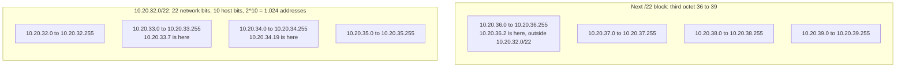
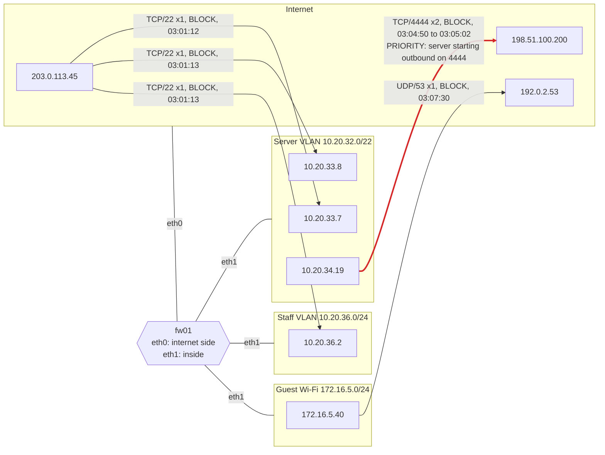

# Day 9: Subnetting and CIDR for reading firewall logs

Phase: 1. Foundations · Track goal: Place any IP address in a firewall log inside or outside a named network segment, quickly and correctly, and turn a raw block log into a map of which segments talked to what.

## Concept
A firewall log is a list of addresses. It becomes evidence once you know which addresses belong to which part of the network: the server segment, the staff laptops, guest Wi-Fi, or the internet. Networks are described in CIDR notation, and reading it is a small amount of arithmetic.

`10.20.32.0/22` means the first 22 bits of the address are the network, and the remaining 10 bits number the hosts. 2^10 is 1,024 addresses, so the range is `10.20.32.0` to `10.20.35.255`. To place an address by hand, look at the octet where the prefix ends. A /22 ends inside the third octet, leaving 2 host bits there, so the third octet moves in blocks of 2^2 = 4: 32 to 35 is one network, 36 to 39 the next. `10.20.33.7` is inside `10.20.32.0/22`; `10.20.36.2` is not. The same reasoning covers every prefix: a /24 is a block of 256 in the last octet, a /16 a block of 256 in the third, a /26 a block of 64 in the last.

Drawn out, the /22 is four consecutive /24-sized blocks, and the next /22 starts where it ends:



Some ranges you should recognize on sight:

| Range | Meaning |
|---|---|
| `10.0.0.0/8`, `172.16.0.0/12`, `192.168.0.0/16` | Private addresses (RFC 1918). Never routed on the internet. Note that `172.16.0.0/12` runs to `172.31.255.255`. |
| `100.64.0.0/10` | Carrier-grade NAT (RFC 6598). One public address shared by many ISP customers. |
| `127.0.0.0/8` | Loopback, the machine talking to itself. |
| `169.254.0.0/16` | Link-local. A host that failed to get an address from DHCP often shows up here. |
| `192.0.2.0/24`, `198.51.100.0/24`, `203.0.113.0/24` | Reserved for documentation (RFC 5737). This roadmap uses them in examples; they should never appear in a real log. |

NAT changes what each log can tell you. When a laptop at `10.20.36.14` browses a website, the site's own logs record the organization's public IP, not `10.20.36.14`. To identify the internal machine you need the firewall's NAT translation log for the same time and port. The same limit applies to carrier-grade NAT, where a single public IP at a given moment may stand for hundreds of households. An IP address in a log identifies a network endpoint at a time. It does not identify a person, and reports that treat it as if it does cause real harm.

In a firewall log, direction matters as much as addresses. Inbound blocks from the internet are constant background noise on any exposed address. An outbound connection from an internal server to an unfamiliar external host on an odd port is rarer and usually the more important line.

## Resources
- [RFC 1918: Address Allocation for Private Internets](https://www.rfc-editor.org/rfc/rfc1918) and the [IANA IPv4 Special-Purpose Address Registry](https://www.iana.org/assignments/iana-ipv4-special-registry/).
- [Python `ipaddress` module documentation](https://docs.python.org/3/library/ipaddress.html).
- [Subnet cheat sheet and practice (subnettingpractice.com)](https://subnettingpractice.com/) for drills until /8 through /30 feel automatic.
- [Ubuntu UFW documentation](https://help.ubuntu.com/community/UFW), for the log format used below.

## Practical: Python ipaddress and draw.io, producing a segment flow map from a firewall log

### The environment
You are reviewing logs for a fictional small organization with this address plan (write it at the top of your notes):

| Segment | CIDR | Contents |
|---|---|---|
| Server VLAN | `10.20.32.0/22` | Web, file, and database servers |
| Staff VLAN | `10.20.36.0/24` | Staff laptops |
| Guest Wi-Fi | `172.16.5.0/24` | Visitor devices, internet access only |
| Internet | everything else | |

### Step 1: save the sample log
Save the following as `ufw-sample.log`. It is in the Linux UFW (iptables) format and uses documentation addresses for the external hosts:
```
Mar 10 03:01:12 fw01 kernel: [UFW BLOCK] IN=eth0 OUT= MAC=52:54:00:aa:bb:cc:52:54:00:11:22:33:08:00 SRC=203.0.113.45 DST=10.20.33.7 LEN=60 TOS=0x00 PREC=0x00 TTL=52 ID=4410 DF PROTO=TCP SPT=50122 DPT=22 WINDOW=64240 RES=0x00 SYN URGP=0
Mar 10 03:01:13 fw01 kernel: [UFW BLOCK] IN=eth0 OUT= MAC=52:54:00:aa:bb:cc:52:54:00:11:22:33:08:00 SRC=203.0.113.45 DST=10.20.33.8 LEN=60 TOS=0x00 PREC=0x00 TTL=52 ID=4411 DF PROTO=TCP SPT=50123 DPT=22 WINDOW=64240 RES=0x00 SYN URGP=0
Mar 10 03:01:13 fw01 kernel: [UFW BLOCK] IN=eth0 OUT= MAC=52:54:00:aa:bb:cc:52:54:00:11:22:33:08:00 SRC=203.0.113.45 DST=10.20.36.2 LEN=60 TOS=0x00 PREC=0x00 TTL=52 ID=4412 DF PROTO=TCP SPT=50124 DPT=22 WINDOW=64240 RES=0x00 SYN URGP=0
Mar 10 03:04:50 fw01 kernel: [UFW BLOCK] IN=eth1 OUT=eth0 MAC=52:54:00:dd:ee:ff:52:54:00:44:55:66:08:00 SRC=10.20.34.19 DST=198.51.100.200 LEN=52 TOS=0x00 PREC=0x00 TTL=127 ID=881 DF PROTO=TCP SPT=49811 DPT=4444 WINDOW=64240 RES=0x00 SYN URGP=0
Mar 10 03:05:02 fw01 kernel: [UFW BLOCK] IN=eth1 OUT=eth0 MAC=52:54:00:dd:ee:ff:52:54:00:44:55:66:08:00 SRC=10.20.34.19 DST=198.51.100.200 LEN=52 TOS=0x00 PREC=0x00 TTL=127 ID=902 DF PROTO=TCP SPT=49812 DPT=4444 WINDOW=64240 RES=0x00 SYN URGP=0
Mar 10 03:07:30 fw01 kernel: [UFW BLOCK] IN=eth1 OUT=eth0 MAC=52:54:00:dd:ee:ff:52:54:00:77:88:99:08:00 SRC=172.16.5.40 DST=192.0.2.53 LEN=71 TOS=0x00 PREC=0x00 TTL=63 ID=12001 PROTO=UDP SPT=53001 DPT=53 LEN=51
```
The fields you need: `IN=` and `OUT=` are the interfaces (an empty `OUT=` means the packet was addressed to the firewall or blocked on the way in), `SRC` and `DST` are addresses, `PROTO`, `SPT`, and `DPT` are protocol and ports, `TTL` is the remaining time to live, and a bare `SYN` near the end is the TCP flag.

### Step 2: reduce each line to a flow
```bash
grep -o 'SRC=[^ ]* DST=[^ ]*.*DPT=[0-9]*' ufw-sample.log \
  | sed -E 's/SRC=([^ ]+) DST=([^ ]+).*PROTO=([A-Z]+).*DPT=([0-9]+)/\1 -> \2 \3\/\4/'
```
Output:
```
203.0.113.45 -> 10.20.33.7 TCP/22
203.0.113.45 -> 10.20.33.8 TCP/22
203.0.113.45 -> 10.20.36.2 TCP/22
10.20.34.19 -> 198.51.100.200 TCP/4444
10.20.34.19 -> 198.51.100.200 TCP/4444
172.16.5.40 -> 192.0.2.53 UDP/53
```

### Step 3: place every address by hand, then check with Python
First, place each address in a segment on paper using the block-size method from the Concept. Then check your work:
```bash
python3 - <<'EOF'
import ipaddress
rfc1918 = [ipaddress.ip_network(n) for n in ("10.0.0.0/8", "172.16.0.0/12", "192.168.0.0/16")]
segments = {
    "Server VLAN": ipaddress.ip_network("10.20.32.0/22"),
    "Staff VLAN":  ipaddress.ip_network("10.20.36.0/24"),
    "Guest Wi-Fi": ipaddress.ip_network("172.16.5.0/24"),
}
for ip in ["203.0.113.45", "10.20.33.7", "10.20.33.8", "10.20.36.2",
           "10.20.34.19", "198.51.100.200", "172.16.5.40", "192.0.2.53"]:
    a = ipaddress.ip_address(ip)
    seg = next((name for name, net in segments.items() if a in net), "Internet")
    print(f"{ip:15} rfc1918={str(any(a in r for r in rfc1918)):5} segment={seg}")

n = ipaddress.ip_network("10.20.32.0/22")
print(n.network_address, "-", n.broadcast_address, n.num_addresses, "addresses, mask", n.netmask)
EOF
```
Output:
```
203.0.113.45    rfc1918=False segment=Internet
10.20.33.7      rfc1918=True  segment=Server VLAN
10.20.33.8      rfc1918=True  segment=Server VLAN
10.20.36.2      rfc1918=True  segment=Staff VLAN
10.20.34.19     rfc1918=True  segment=Server VLAN
198.51.100.200  rfc1918=False segment=Internet
172.16.5.40     rfc1918=True  segment=Guest Wi-Fi
192.0.2.53      rfc1918=False segment=Internet
10.20.32.0 - 10.20.35.255 1024 addresses, mask 255.255.252.0
```
The script checks RFC 1918 explicitly instead of using Python's `is_private` property. `is_private` also returns `True` for the documentation ranges, so `ipaddress.ip_address("203.0.113.45").is_private` is `True`. Test that yourself. A script that trusts `is_private` would label a documentation or other special-purpose address as internal.

`10.20.34.19` is the address most people misplace. It looks like it could be anywhere, but 34 falls in the 32 to 35 block, so it is a server.

### Step 4: read the story
Write `day09-findings.md` with one entry per distinct flow: segment to segment, protocol and port, count, and your reading. Worked reading for this log:

- An external address sent SSH connection attempts (SYN to port 22) to three internal addresses within two seconds, and the firewall blocked all of them. This is routine internet scanning. Record it, but it is not the priority.
- A server (`10.20.34.19`, Server VLAN) tried twice, twelve seconds apart, to open an outbound TCP connection to an external host on port 4444. The firewall blocked both. Servers rarely start outbound connections to arbitrary hosts, and 4444 is the default listener port of common penetration-testing and remote-access tooling. This is the lead. The next steps would be the server's own process and connection records from the same minute, which is Day 4's `ss` view.
- A guest device sent a DNS query directly to an external resolver, and the firewall blocked it, which suggests guest DNS is meant to go through an internal resolver. This is probably a policy block rather than a threat.

A TTL of 127 on the server's packets fits a Windows host that started at 128 and crossed the firewall once. Mark that as an inference.

### Step 5: draw the segment flow map
In draw.io, open More Shapes (bottom of the left panel) and enable the Networking library. Draw:

1. One large rectangle per segment, labelled with name and CIDR.
2. An "Internet" cloud.
3. The firewall `fw01` between them, with its interfaces (`eth0` facing the internet, `eth1` facing inside).
4. One arrow per distinct flow from Step 2, from source to destination, labelled `proto/port × count, BLOCK`, with the time range.
5. Colour the arrow you rated highest priority in red and add a callout with your one-line reading.

Export as `day09-segment-flows.png`.

Your map should carry the same information as this reference, drawn from the sample log. The firewall sits between the zones, and because every line in the log is a `BLOCK`, none of these flows reached its destination:



## Checkpoint
Your artifact is `day09-segment-flows.png` plus `day09-findings.md`. It passes when:

- Every address in the log sits in the correct segment on the map, including `10.20.34.19` in the Server VLAN.
- Arrow direction matches `SRC` to `DST`.
- Every arrow carries protocol, port, count, and action.
- The findings rank the outbound 4444 attempts above the inbound SSH scan.
- The findings explain why direction and source segment drive that ranking.
- Without a calculator, you can give the first and last address of `172.20.14.77/20` (answer: `172.20.0.0` to `172.20.15.255`) and say whether it is RFC 1918 space (it is).
