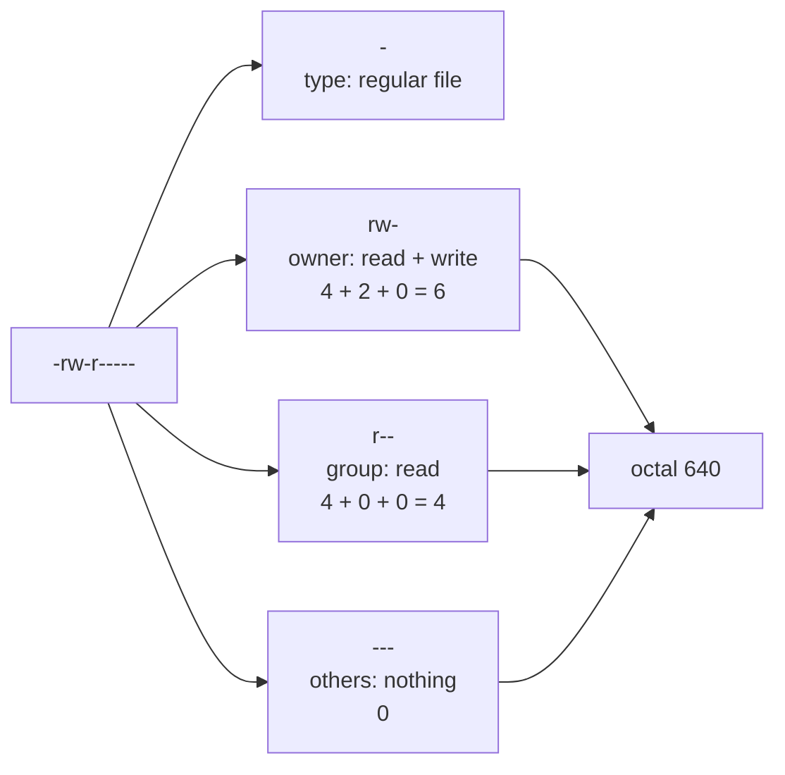
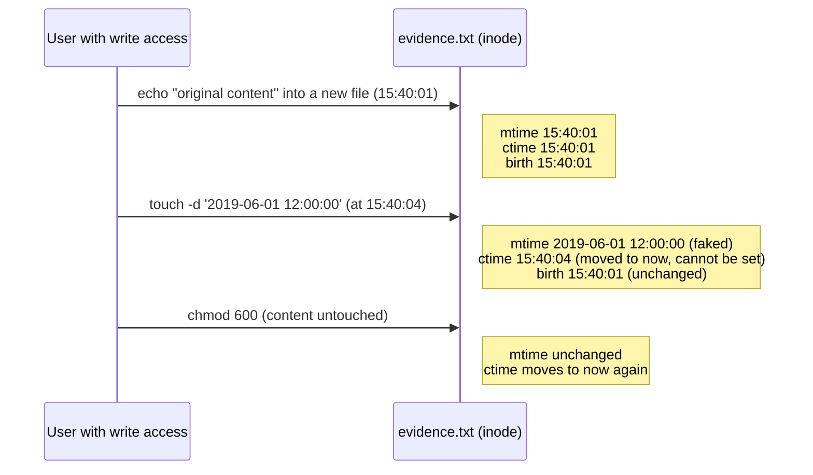

# Day 10: The Linux shell, filesystem, and permissions model

Phase: 1. Foundations · Track goal: Move around a Linux system confidently, read ownership, permissions, and timestamps as evidence, and know which timestamps an attacker can fake.

## Concept
Most servers you will investigate run Linux, and most forensic and OSINT tooling runs best on it. You need enough fluency to find files, read them without changing them, and answer two recurring questions: who could have written this file, and when did it change?

Every file has an owner, a group, and three sets of permissions: read (`r`), write (`w`), and execute (`x`) for the owner, the group, and everyone else. `ls -l` shows them as `-rw-r-----`: the first character is the type (`-` file, `d` directory, `l` symlink), then three characters each for owner, group, and others. The octal form counts `r`=4, `w`=2, `x`=1, so `rw-r-----` is `640`. On a directory, `x` means permission to enter it and `w` means permission to create or delete files inside it, whoever owns those files. That second point is why a world-writable directory under a web root matters so much: any process on the system can drop a file there.

Reading `-rw-r-----` piece by piece:



Three special bits come up in investigations. SUID (`s` in the owner's execute position, octal 4000) makes a program run with its owner's privileges, so an unexpected SUID-root binary is a classic persistence and privilege-escalation finding. SGID (2000) does the same for the group. The sticky bit (`t`, 1000) on a shared directory like `/tmp` stops users deleting each other's files.

Every file also carries timestamps, and investigators misread them all the time. `mtime` (modify) changes when the file's content changes. `atime` (access) changes when it is read, but most systems mount with `relatime`, which updates it only occasionally, so it is weak evidence. `ctime` is the inode change time, updated when content, permissions, or ownership change; it is not a creation time. Many modern filesystems (ext4, XFS, Btrfs) also record a birth time, which `stat` shows as `Birth` where the kernel and tools support it.

The important asymmetry: any user who can write to a file can set its `mtime` and `atime` to any value with `touch`, but cannot set `ctime`, because changing the other timestamps itself updates `ctime` to the current time. A file whose `mtime` says 2019 and whose `ctime` says last Tuesday has been touched. That mismatch is one of the most common signs of deliberate timestamp tampering on Linux.

This is the experiment you will run in Step 3, with the illustrative times from its output. Watch which timestamp each action moves:



## Resources
- [The Linux Command Line](https://linuxcommand.org/tlcl.php) by William Shotts, a free book. Chapters 2 to 4 (navigation) and 9 (permissions).
- [OverTheWire: Bandit](https://overthewire.org/wargames/bandit/), levels 0 to 12. A legal, purpose-built practice server for exactly these skills.
- [inode(7) man page](https://man7.org/linux/man-pages/man7/inode.7.html): the authoritative description of the timestamps and permission bits.
- [find(1) man page](https://man7.org/linux/man-pages/man1/find.1.html), especially `-perm`, `-newer`, `-mmin`, and `-user`.

## Practical: stat and find, producing a file triage card and a timestamp-tampering comparison table
Use a Linux machine you own: a VM, WSL on Windows, or a spare machine. (macOS works for most steps, but its `stat` uses different flags; the Linux forms are shown.)

### Step 1: navigate and orient
```bash
pwd; whoami; id
cd /var/log && ls -la | head -20
ls -l /etc/passwd /etc/shadow
```
Illustrative:
```
uid=1000(analyst) gid=1000(analyst) groups=1000(analyst),4(adm),27(sudo)
-rw-r--r-- 1 root root   2891 Mar  9 10:02 /etc/passwd
-rw-r----- 1 root shadow 1502 Mar  9 10:02 /etc/shadow
```
Being in the `adm` group is what lets you read most logs in `/var/log` without `sudo` on Debian and Ubuntu. `/etc/shadow` holds password hashes and is readable only by root and the `shadow` group.

### Step 2: read one file's full metadata
```bash
stat /var/log/auth.log            # or /var/log/syslog, or any log present
```
Illustrative:
```
  File: /var/log/auth.log
  Size: 48213           Blocks: 96         IO Block: 4096   regular file
Device: 8,2     Inode: 1048612     Links: 1
Access: (0640/-rw-r-----)  Uid: (  104/  syslog)   Gid: (    4/     adm)
Access: 2026-03-10 09:14:02.118201233 +0000
Modify: 2026-03-10 09:02:13.771034520 +0000
Change: 2026-03-10 09:02:13.771034520 +0000
 Birth: 2026-03-09 00:00:01.004411902 +0000
```
Reading it: owned by the `syslog` user, readable by the `adm` group, last written at 09:02:13 UTC, created (birth) just after midnight on 9 March, which fits a daily log rotation.

A one-line form that is easier to paste into a table:
```bash
stat -c '%n|%U:%G|%a|mtime=%y|ctime=%z|birth=%w' /var/log/auth.log
```

### Step 3: the timestamp-tampering experiment
In your home directory:
```bash
mkdir -p ~/lab/day10 && cd ~/lab/day10
echo "original content" > evidence.txt
stat -c 'mtime=%y  ctime=%z  birth=%w' evidence.txt
sleep 3
touch -d '2019-06-01 12:00:00' evidence.txt
stat -c 'mtime=%y  ctime=%z  birth=%w' evidence.txt
```
Illustrative:
```
mtime=2026-03-10 15:40:01.221 +0000  ctime=2026-03-10 15:40:01.221 +0000  birth=2026-03-10 15:40:01.221 +0000
mtime=2019-06-01 12:00:00.000 +0000  ctime=2026-03-10 15:40:04.502 +0000  birth=2026-03-10 15:40:01.221 +0000
```
`mtime` now claims 2019. `ctime` moved forward to the moment of the `touch`, and `birth` still shows today. An `mtime` older than the birth time, or a `ctime` years newer than the `mtime` on a file that should never have changed, is a question you must answer before trusting the file's dates.

Now change the permissions and watch `ctime` move again without touching the content:
```bash
chmod 600 evidence.txt && stat -c 'mode=%a mtime=%y ctime=%z' evidence.txt
```

### Step 4: find files the way an investigator does
```bash
# SUID and SGID programs on the root filesystem
find / -xdev -type f \( -perm -4000 -o -perm -2000 \) -exec ls -l {} + 2>/dev/null

# World-writable files and directories outside /proc, /sys, /tmp
find / -xdev \( -path /tmp -o -path /var/tmp \) -prune -o -perm -0002 ! -type l -print 2>/dev/null

# Files in /etc changed in the last 2 days
find /etc -xdev -type f -mtime -2 -exec ls -l --time-style=+%FT%T {} + 2>/dev/null

# Files newer than a reference file (everything written after your evidence.txt was created)
find ~ -newer ~/lab/day10/evidence.txt -type f 2>/dev/null | head
```
`-xdev` keeps `find` on one filesystem so it does not wander into network mounts. `2>/dev/null` hides "Permission denied" noise; run it once without that to see how much you cannot read as a normal user.

A fresh install has a short list of SUID binaries (`passwd`, `sudo`, `su`, `mount`, and similar); the exact count depends on the distribution and installed packages. Save your list as a baseline:
```bash
find / -xdev -type f -perm -4000 2>/dev/null | sort > ~/lab/day10/suid-baseline.txt
wc -l ~/lab/day10/suid-baseline.txt
```
Every unexpected entry later is a lead.

### Step 5: build the file triage card
Pick five files: `/etc/passwd`, `/etc/shadow`, `/usr/bin/passwd` (a normal SUID binary), one file under `/var/log`, and your tampered `evidence.txt`. For each, fill a row in `day10-triage-card.md`:

```markdown
| Path | Owner:Group | Mode (octal / symbolic) | Special bits | Who can write it? | mtime (UTC) | ctime (UTC) | birth (UTC) | Timestamps consistent? | SHA-256 |
|---|---|---|---|---|---|---|---|---|---|
```
"Who can write it?" means naming the actual accounts or groups, for example "root only" or "root, and any member of adm". Get the hash with `sha256sum <path>`, using `sudo` where needed.

## Checkpoint
Your artifacts are `day10-triage-card.md`, `~/lab/day10/suid-baseline.txt`, and a two-row comparison table in the same file showing `evidence.txt` before and after the `touch`. They pass when:

- Every mode is given in both octal and symbolic form.
- The special-bits column correctly flags `/usr/bin/passwd` as SUID.
- The row for `evidence.txt` is marked inconsistent, with a one-sentence reason citing `ctime` and `birth`.
- You can explain, without notes, why `ctime` is not a creation time.
- You can explain, without notes, why `atime` is weak evidence on a `relatime` mount.
- You can explain, without notes, why write permission on a directory lets a user delete a file they do not own (unless the sticky bit is set).
