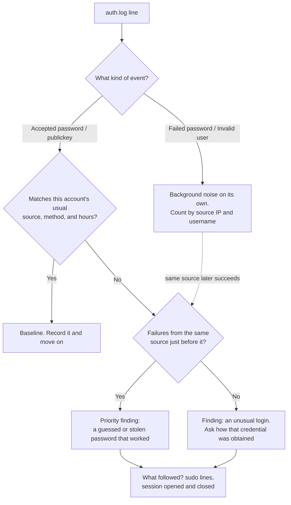

# Day 12: Authentication log triage and an SSH intrusion timeline

Phase: 1. Foundations · Track goal: Read Linux authentication records, separate background noise from the one login that matters, and assemble the result into a timeline another investigator can check.

## Concept
On a Linux server, the authentication log is where logins, failed logins, `sudo` use, and session starts and ends are written. On Debian and Ubuntu systems running rsyslog, that is `/var/log/auth.log`; on RHEL, Fedora, and their relatives it is `/var/log/secure`. Systems that keep logs only in the systemd journal expose the same events through `journalctl`. Separately, `/var/log/wtmp` (read with `last`) records sessions and `/var/log/btmp` (read with `sudo lastb`) records failed logins in a binary format.

The lines you will read most often come from `sshd`:

- `Failed password for root from 203.0.113.45 port 50240 ssh2`: a real account, wrong password.
- `Failed password for invalid user admin from ...`: the username does not exist on this server. Lots of these mean someone is working through a generic username list.
- `Accepted password for deploy from ...` or `Accepted publickey for analyst from ... ED25519 SHA256:...`: a successful login and the method used. For key logins, the fingerprint identifies which key was used, which you can match against `authorized_keys`.
- `pam_unix(sshd:session): session opened for user deploy(uid=1001)` and the matching `session closed`: session start and end, which bound what that login could have done.

`sudo` writes its own line with the user, the working directory, the target user, and the full command, which makes it one of the most useful single records on a Linux system.

Timestamps in this log need care. The traditional syslog format (`Mar 10 02:14:09`) has no year and no time zone. The year comes from context (the file's dates, rotation names, surrounding records), and the zone is the server's local zone at the time, which you must confirm with `timedatectl` or the system configuration before comparing against any other source. Newer defaults on some distributions write full RFC 3339 timestamps (`2026-03-10T02:14:09.412233+00:00`) instead, which removes the ambiguity. Record which format you are working with.

Most internet-facing SSH servers see failed logins from scanners every few minutes. That is background noise. The finding is almost always a success: a login from an unexpected place, at an unexpected time, by a method that account does not normally use, especially one that follows a run of failures from the same source.

The triage order for each line, as a decision chart:



## Resources
- [sshd(8) and sshd_config(5) man pages](https://man.openbsd.org/sshd), including the `LogLevel` setting that controls how much is logged.
- [journalctl(1) man page](https://man7.org/linux/man-pages/man1/journalctl.1.html), especially `--since`, `--until`, `-u`, and `-o short-iso-precise`.
- [sudoers(5): logging](https://www.sudo.ws/docs/man/sudoers.man/), for what `sudo` records and where.
- [MITRE ATT&CK T1110 Brute Force](https://attack.mitre.org/techniques/T1110/) and [T1078 Valid Accounts](https://attack.mitre.org/techniques/T1078/), for how these patterns are classified.

## Practical: grep, sed, and awk, producing an SSH intrusion timeline (CSV plus a drawn timeline)

### Step 1: save the sample log
Create `~/lab/day12/auth.log`. The server `lab-web01` is fictional, it logs in UTC, and all addresses are documentation ranges.
```
Mar 10 02:14:07 lab-web01 sshd[1811]: Invalid user admin from 203.0.113.45 port 50122
Mar 10 02:14:09 lab-web01 sshd[1811]: Failed password for invalid user admin from 203.0.113.45 port 50122 ssh2
Mar 10 02:14:12 lab-web01 sshd[1815]: Invalid user oracle from 203.0.113.45 port 50188
Mar 10 02:14:14 lab-web01 sshd[1815]: Failed password for invalid user oracle from 203.0.113.45 port 50188 ssh2
Mar 10 02:14:18 lab-web01 sshd[1819]: Failed password for root from 203.0.113.45 port 50240 ssh2
Mar 10 02:14:22 lab-web01 sshd[1823]: Failed password for root from 203.0.113.45 port 50301 ssh2
Mar 10 02:31:40 lab-web01 sshd[1902]: Failed password for deploy from 198.51.100.9 port 41822 ssh2
Mar 10 02:31:47 lab-web01 sshd[1902]: Failed password for deploy from 198.51.100.9 port 41822 ssh2
Mar 10 02:31:55 lab-web01 sshd[1902]: Accepted password for deploy from 198.51.100.9 port 41822 ssh2
Mar 10 02:31:55 lab-web01 sshd[1902]: pam_unix(sshd:session): session opened for user deploy(uid=1001) by (uid=0)
Mar 10 02:33:02 lab-web01 sudo:   deploy : TTY=pts/0 ; PWD=/home/deploy ; USER=root ; COMMAND=/usr/bin/cat /etc/shadow
Mar 10 02:35:40 lab-web01 sshd[1902]: pam_unix(sshd:session): session closed for user deploy
Mar 10 09:02:13 lab-web01 sshd[2410]: Accepted publickey for analyst from 192.0.2.10 port 55012 ssh2: ED25519 SHA256:q3Vd1xExampleFingerprintOnlyForLab0000000
Mar 10 09:02:13 lab-web01 sshd[2410]: pam_unix(sshd:session): session opened for user analyst(uid=1000) by (uid=0)
```
Background you have been given: the `deploy` account is used only by an automated deployment job from `192.0.2.50`, always with a key. The `analyst` account belongs to the administrator, who normally logs in from `192.0.2.10` during office hours.

Hash the file before you begin. The outputs below come from running each command against it.

### Step 2: count the noise
Failed logins by source. In every `Failed password` line the IP is the fourth field from the end, whether or not the line says "invalid user", so `$(NF-3)` works for both:
```bash
grep "Failed password" auth.log | awk '{print $(NF-3)}' | sort | uniq -c | sort -rn
```
```
   4 203.0.113.45
   2 198.51.100.9
```
Usernames tried:
```bash
grep "Failed password" auth.log \
  | sed -E 's/.*Failed password for (invalid user )?([^ ]+) from.*/\2/' \
  | sort | uniq -c | sort -rn
```
```
   2 root
   2 deploy
   1 oracle
   1 admin
```

### Step 3: find every success and every privileged command
```bash
grep -E "Accepted (password|publickey)" auth.log | awk '{print $1, $2, $3, "user=" $9, "ip=" $11, "method=" $7}'
grep "sudo:" auth.log | sed -E 's/.*sudo: +([^ ]+) :.*COMMAND=(.*)/\1 ran: \2/'
```
```
Mar 10 02:31:55 user=deploy ip=198.51.100.9 method=password
Mar 10 09:02:13 user=analyst ip=192.0.2.10 method=publickey
deploy ran: /usr/bin/cat /etc/shadow
```

### Step 4: correlate failures with a success from the same source
```bash
awk '/Failed password/ {f[$(NF-3)]++}
     /Accepted/ && f[$11] {print "SUCCESS AFTER", f[$11], "FAILS:", $1, $2, $3, "user=" $9, "ip=" $11}' auth.log
```
```
SUCCESS AFTER 2 FAILS: Mar 10 02:31:55 user=deploy ip=198.51.100.9
```
`awk` keeps a count of failures per IP as it reads, and prints any accepted login from an IP that already has failures.

Now weigh it against the background. `deploy` normally logs in from `192.0.2.50` with a key. This login came from a different address, used a password, followed two failures, and within 67 seconds ran `sudo cat /etc/shadow`, which reads every account's password hash. The `analyst` login at 09:02 matches the administrator's usual source, method, and hours. The `203.0.113.45` activity is a generic username scan that never succeeded.

### Step 5: produce the timeline CSV
```bash
awk 'BEGIN {OFS=","; print "time,host,event,user,src_ip"}
/Failed password/  {print $1" "$2" "$3, $4, "ssh_fail", ($9=="invalid" ? $11 : $9), $(NF-3)}
/Accepted/         {print $1" "$2" "$3, $4, "ssh_success_" $7, $9, $11}
/sudo:.*COMMAND=/  {split($0, c, "COMMAND="); print $1" "$2" "$3, $4, "sudo:" c[2], $6, "-"}' \
  auth.log > day12-timeline.csv
cat day12-timeline.csv
```
```
time,host,event,user,src_ip
Mar 10 02:14:09,lab-web01,ssh_fail,admin,203.0.113.45
Mar 10 02:14:14,lab-web01,ssh_fail,oracle,203.0.113.45
Mar 10 02:14:18,lab-web01,ssh_fail,root,203.0.113.45
Mar 10 02:14:22,lab-web01,ssh_fail,root,203.0.113.45
Mar 10 02:31:40,lab-web01,ssh_fail,deploy,198.51.100.9
Mar 10 02:31:47,lab-web01,ssh_fail,deploy,198.51.100.9
Mar 10 02:31:55,lab-web01,ssh_success_password,deploy,198.51.100.9
Mar 10 02:33:02,lab-web01,sudo:/usr/bin/cat /etc/shadow,deploy,-
Mar 10 09:02:13,lab-web01,ssh_success_publickey,analyst,192.0.2.10
```
Add the session close at 02:35:40 by hand (or extend the `awk` with a `/session closed/` rule, which is good practice), and convert the time column to full ISO 8601 with the year and `Z`, since you know the server logs in UTC: `2026-03-10T02:31:55Z`.

On your own lab machine, the equivalent live query is:
```bash
journalctl -u ssh --since "today" -o short-iso-precise    # the unit is "sshd" on RHEL-family systems
sudo lastb -F | head                                        # failed logins with full dates
last -F | head                                              # sessions with full dates
```

### Step 6: draw the timeline
In draw.io, draw a horizontal time axis from 02:10 to 09:10 UTC with a break between 02:40 and 09:00. Place each event as a marker above the line, coloured by type: grey for the `203.0.113.45` scan (one bracket for the whole burst), orange for the two `deploy` failures, red for the successful password login and the `sudo` command, and green for the normal `analyst` login. Draw a shaded bar for the `deploy` session from 02:31:55 to 02:35:40. Add a caption box: "Assessment: the deploy account was likely logged into by an unauthorized party from 198.51.100.9 using a password, and password hashes were read. Confidence: moderate; needs confirmation that the deploy job did not change source or method."

Export as `day12-timeline.png`.

This Mermaid Gantt chart is a reference for the 02:10 to 02:40 part of your drawing, using grey for the scan, red for the intrusion events, and a bar for the session. Mermaid cannot draw an axis break, so the 09:02 `analyst` login, which sits after the break, is not shown here; it must appear on yours.

```mermaid
gantt
    title lab-web01, 10 March 2026, 02:10 to 02:40 UTC
    dateFormat HH:mm:ss
    axisFormat %H:%M
    section Scan
    203.0.113.45, 4 failed passwords (admin, oracle, root x2) :done, scan, 02:14:07, 02:14:22
    section Intrusion
    deploy fails from 198.51.100.9   :crit, milestone, f1, 02:31:40, 0s
    deploy fails again               :crit, milestone, f2, 02:31:47, 0s
    Accepted password for deploy     :crit, milestone, ok, 02:31:55, 0s
    deploy session open              :active, sess, 02:31:55, 02:35:40
    sudo cat /etc/shadow             :crit, milestone, sudo, 02:33:02, 0s
```



If you want a text version to commit alongside the PNG, save the block above in `day12-timeline.md` and extend it from your CSV.

## Checkpoint
Your artifacts are `day12-timeline.csv` and `day12-timeline.png`. They pass when:

- The CSV has every failure, success, `sudo` command, and the session close.
- Every CSV time is ISO 8601 UTC.
- Every CSV row can be traced to one line of the source log.
- The drawn timeline separates the scan from the intrusion visually.
- The drawn timeline bounds the `deploy` session with its open and close times.
- Your assessment states what makes the 02:31 login abnormal (source, method, preceding failures, what followed).
- Your assessment states what single fact would overturn it.
- You can explain why the year and time zone of a classic syslog line must be established from outside the line itself.
