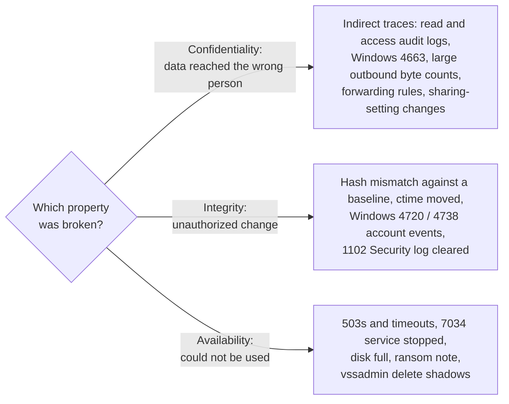
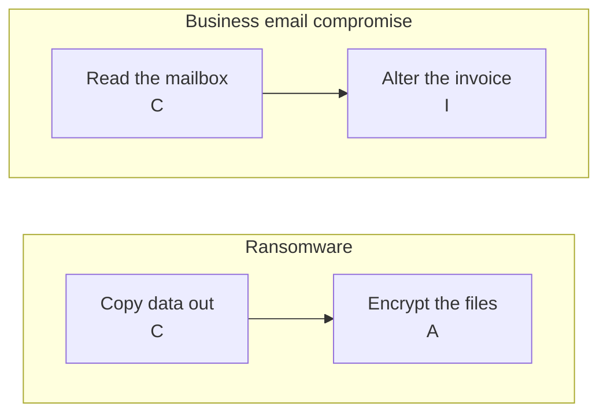
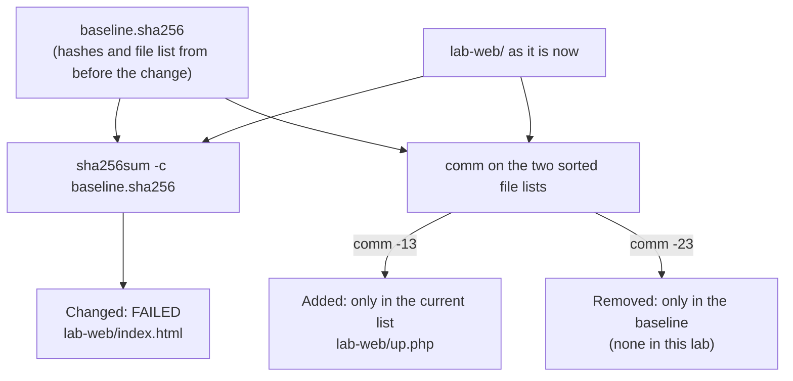

# Day 14: The CIA triad as it shows up in evidence

Phase: 1. Foundations · Track goal: Classify an incident by which security property was violated, and know which records would prove each kind of violation.

## Concept
Confidentiality, integrity, and availability (the CIA triad) are usually taught as design goals. For an investigator they are more useful as a sorting question: which property was broken, and what trace does that kind of break leave? The answer tells you which logs to request first and what the finding needs to prove.

A confidentiality violation means information reached someone who should not have it. The hard part is that reading data often changes nothing on the system that held it. Evidence is indirect: access logs showing who opened or downloaded what (cloud storage audit logs, database query logs, Windows event 4663 for file access where object auditing is enabled), unusually large outbound transfers in connection logs (Day 4's byte counts), mailbox rules that forward mail to an outside address, or a storage bucket whose sharing setting was changed to public. Many confidentiality cases stall because nobody had turned on read auditing before the incident.

An integrity violation means data or a system was changed without authorization. Changes leave more traces than reads: file hashes no longer match a baseline, `ctime` moves (Day 10), configuration or account changes appear in audit logs (Windows 4720 for account creation, 4738 for account changes), a web page gains a script tag it never had, or a supplier's bank details in an invoice differ from the ones on file. Deleting or tampering with logs is itself an integrity violation, and Windows records the clearing of the Security log as event 1102.

An availability violation means a system or data could not be used when needed. It is usually loud: `503` responses and timeouts, services stopping (Windows 7034 for a service that terminated unexpectedly), disk-full errors, ransom notes, and deleted backups or shadow copies (a `vssadmin delete shadows` command line in process-creation logs, if they are captured).

Real incidents cross categories. Ransomware usually copies data out first (confidentiality) and then encrypts it (availability). Business email compromise often starts by reading a mailbox (confidentiality) and ends with an altered invoice (integrity). Classify each stage separately, because each needs its own evidence.

The sorting question, and where each answer sends you:



Two common multi-stage incidents, classified one stage at a time:



Two terms often added to the triad are useful here. Authenticity asks whether the actor was who they appeared to be (the Day 12 `deploy` login). Non-repudiation asks whether an action can be tied to its actor afterwards, and it depends entirely on logging that existed before the incident.

## Resources
- [NIST SP 800-12 Rev. 1: An Introduction to Information Security](https://csrc.nist.gov/pubs/sp/800/12/r1/final), section 1.4 and chapter 2.
- [FIPS 199: Standards for Security Categorization](https://csrc.nist.gov/pubs/fips/199/final), for the formal definitions of the three properties and the impact levels.
- [Microsoft: Events to monitor (Appendix L)](https://learn.microsoft.com/en-us/windows-server/identity/ad-ds/plan/appendix-l--events-to-monitor), a reference list of Windows security event IDs.
- [Verizon Data Breach Investigations Report](https://www.verizon.com/business/resources/reports/dbir/), for how often each pattern appears in real breaches.

## Practical: sha256sum and a spreadsheet, producing a CIA evidence matrix and an integrity-monitoring report

### Part 1: detect an integrity violation in your own lab
You will build a hash baseline for a small web folder, make an unauthorized change, and see what the baseline catches and what it misses.
```bash
mkdir -p ~/lab/day14/lab-web && cd ~/lab/day14
echo '<h1>Lab</h1>' > lab-web/index.html
echo 'body{}' > lab-web/site.css

find lab-web -type f -exec sha256sum {} + | sort -k2 > baseline.sha256     # macOS: shasum -a 256
cat baseline.sha256
```
Now play the intruder. Append a script tag to the page and drop a new file:
```bash
echo '<script src="//203.0.113.9/x.js"></script>' >> lab-web/index.html
echo '<?php' > lab-web/up.php
```
Check against the baseline:
```bash
sha256sum -c baseline.sha256; echo "exit=$?"
```
Output:
```
lab-web/index.html: FAILED
lab-web/site.css: OK
sha256sum: WARNING: 1 computed checksum did NOT match
exit=1
```
The modified page was caught. The new file `up.php` was not, because `sha256sum -c` only checks files already listed in the baseline. Compare the file lists to find additions:
```bash
comm -13 <(awk '{print $2}' baseline.sha256 | sort) <(find lab-web -type f | sort)
```
```
lab-web/up.php
```
`comm -13` prints lines that appear only in the second list. Reverse it (`comm -23`) to find deleted files. File-integrity monitoring tools such as AIDE and Wazuh's syscheck do all three checks (changed, added, removed) on a schedule, but the logic is exactly what you just ran.

The three checks side by side, with what each caught in this lab:



Finally, look at when the changes happened:
```bash
stat -c '%n  mtime=%y  ctime=%z' lab-web/*
```
Record the output. If this were a real web server, those times would be your anchor for searching the web access log (Day 11) for the request that wrote `up.php`.

Save everything above, with outputs, as `day14-integrity-report.md`, ending with one paragraph stating what the baseline proves, what it missed until you compared file lists, and what it cannot tell you (who made the change, and how).

### Part 2: the CIA evidence matrix
Create a spreadsheet (LibreOffice Calc, Google Sheets, or Excel) named `day14-cia-matrix` with these columns:

| Scenario | Property violated (C / I / A, may be several) | Stage (if several) | Primary evidence to request | Specific record or field | Logging that must already have been enabled | What the evidence cannot prove |

Fill one row for each of these eight scenarios:

1. A staff member's mailbox has a rule, created at 03:12, that forwards every message containing "invoice" to an outside webmail address.
2. The public website shows a "hacked by" banner on the homepage.
3. The online booking system returns `503` errors for six hours on a public holiday.
4. A cloud storage folder of scanned ID documents has had public link-sharing turned on for three weeks.
5. A supplier's bank account number differs between the PDF invoice received by accounts payable and the copy the supplier says it sent.
6. On a Windows file server, the Security event log contains event 1102 followed by almost no older entries.
7. The Day 12 `deploy` login, followed by `sudo cat /etc/shadow`.
8. Files on a shared drive are renamed with a new extension, and a text file in each folder demands payment.

A worked row, for scenario 1:

| Field | Entry |
|---|---|
| Property | C (mail is being read by an outsider) and I (an unauthorized rule was added to the mailbox) |
| Primary evidence | Mailbox audit and admin audit logs for rule creation; sign-in logs for the session that created it |
| Specific record | The rule-creation event with its timestamp, client IP, and rule parameters; the sign-in event from the same IP and session |
| Logging required beforehand | Mailbox auditing enabled and retained past 03:12 on the relevant date |
| Cannot prove | Which forwarded messages the outsider actually read, or who was physically at the keyboard |

## Checkpoint
Your artifacts are `day14-integrity-report.md` and the completed `day14-cia-matrix`. They pass when:

- The integrity report shows the `FAILED` result.
- The integrity report shows the `comm` output catching `up.php`.
- The integrity report shows the `stat` times.
- The integrity report's closing paragraph separates what was proved from what was not.
- All eight matrix rows are filled.
- Scenarios 1, 5, and 8 each list more than one property (or a likely second stage to check for), with the stage for each.
- Scenario 7 notes authenticity alongside the property it violates.
- Every row names a specific record or field rather than a vague source like "the logs."
- Every "cannot prove" cell names a specific fact the evidence leaves open (for example, which messages were read, or who was at the keyboard) rather than a general caveat.
- At least one row notes that a confidentiality breach cannot be shown at all if read access was never logged.
- Without notes, you can explain why `sha256sum -c` caught the modified page but not the new file `up.php`.
