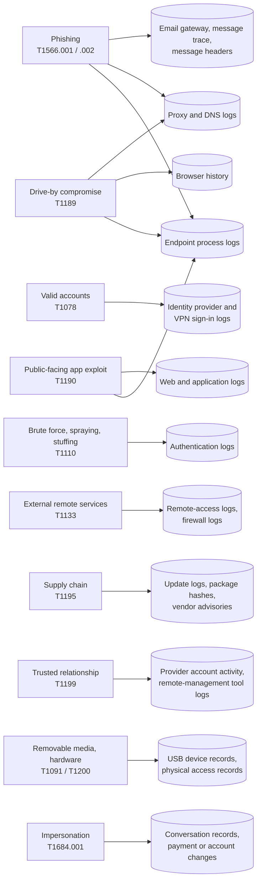

# Day 15: Common attack vectors and the evidence each one leaves

Phase: 1. Foundations · Track goal: Name the ways attackers most often get in, map each to its MITRE ATT&CK technique, and know which records you would pull to confirm or rule it out.

## Concept
An attack vector is the route an attacker used to get their first foothold. It is usually the first question in an investigation ("how did they get in?"), and each vector leaves evidence in a different place. A small number of vectors account for most real intrusions and frauds, and MITRE ATT&CK gives each one an ID, which lets your notes line up with threat reports and other analysts' work.

The vectors worth knowing now, with where their evidence lives:

| Vector | ATT&CK ID | Where the evidence usually is |
|---|---|---|
| Phishing with a link or attachment | T1566.002, T1566.001 | Email gateway and message-trace logs; the message's own headers (`Authentication-Results` showing SPF, DKIM, and DMARC results, and `Received` hops); proxy or DNS logs showing the click; endpoint process logs showing what the attachment launched |
| Use of stolen but valid credentials | T1078 | Identity provider and VPN sign-in logs: new source IP or network, new device, unusual hour, impossible travel between two sign-ins |
| Password guessing, spraying, and credential stuffing | T1110, including .003 and .004 | Authentication logs: many failures then a success (Day 12), or one password tried across many accounts, or many accounts each tried once from rotating IPs (stuffing) |
| Exploiting a public-facing application | T1190 | Web and application logs with exploit strings in the path or body, error spikes, and then the web server process starting a shell or a new process it never normally runs |
| Exposed remote services (RDP, SSH, VPN) | T1133 | Remote-access logs; Windows logon event 4624 with logon type 10 for RDP; firewall logs showing the port reachable from the internet |
| Drive-by compromise from a malicious or compromised site | T1189 | Proxy and DNS logs of the visit; browser history; endpoint logs of a download or exploit following the visit |
| Supply chain compromise | T1195 | Software update logs, package hashes that differ from the vendor's published ones, vendor security advisories. Often discovered from outside the victim organization. |
| Trusted relationship (an IT provider's or partner's access is abused) | T1199 | Activity by the provider's accounts outside their normal pattern; remote-management tool logs |
| Removable media and hardware additions | T1091, T1200 | Device-connection records (Windows registry and event logs for USB devices), physical access records |

Fraud adds one vector ATT&CK files under Stealth (the tactic that replaced most of Defense Evasion in ATT&CK v19): impersonation (T1684.001, Social Engineering: Impersonation; older reports cite it as T1656), where the attacker poses as a boss, a supplier, or a bank to get a person to act. The evidence is the conversation itself (email, SMS, call records) and the payment or account change that followed. No malware is needed.

The same table drawn as a graph shows how few evidence sources the vectors depend on. Endpoint process logs, for example, feed three vectors, so an organization without them (like the one in today's scenario) is weaker on all three at once:

In fraud and scam cases, the victim is usually a person, not a server, and the "vector" is often a message on a platform the investigator does not control. The investigator's job is to document the pattern (the lure, the pretext, the infrastructure) in a form that helps the next potential victim, which is where Phase 5 goes.

For every vector, the practical question is the same: if this were how they got in, what record would exist, who holds it, and how long do they keep it? Retention periods matter. Many cloud sign-in logs on basic licence tiers are kept for weeks rather than months, so a vector that happened three months ago may no longer be provable.

## Resources
- [MITRE ATT&CK: Initial Access tactic (TA0001)](https://attack.mitre.org/tactics/TA0001/), and each technique page's "Detection" section, which lists the data sources.
- [MITRE ATT&CK Navigator](https://mitre-attack.github.io/attack-navigator/), the free web tool you will use today, and its [GitHub repository and documentation](https://github.com/mitre-attack/attack-navigator).
- [CISA Known Exploited Vulnerabilities Catalog](https://www.cisa.gov/known-exploited-vulnerabilities-catalog), the list behind many T1190 intrusions.
- [Verizon DBIR](https://www.verizon.com/business/resources/reports/dbir/), for the current ranking of initial access vectors.

## Practical: MITRE ATT&CK Navigator, producing an evidence-readiness heatmap for initial access

### The scenario
Use the fictional organization from Day 9 (server VLAN, staff VLAN, guest Wi-Fi, one firewall) and assume it has: a cloud email and identity service with default logging, the UFW firewall logs from Day 9, web server access logs (Day 11), Linux auth logs (Day 12), and no endpoint detection tool on staff laptops.

### Step 1: score each vector
For each technique in the Concept table, decide how well this organization could prove or rule out that vector with the logs it has. Use this scale:

| Score | Meaning |
|---|---|
| 0 | No relevant evidence source exists |
| 1 | Evidence exists but is partial, short-lived, or would need a third party |
| 2 | Evidence exists and would probably show the vector, with gaps |
| 3 | Strong, retained evidence that would clearly confirm or exclude it |

Write the scores and a one-line justification for each in `day15-scores.md` before touching the tool. Example: "T1190: 2. Web access logs capture exploit strings in URLs, but not POST bodies, and there is no process logging on the server to show what an exploit ran."

### Step 2: build the layer
1. Open `https://mitre-attack.github.io/attack-navigator/`, choose Create New Layer, then Enterprise.
2. Click the layer name tab and rename it "Initial access evidence readiness, fictional org (Day 15)". Add a description stating the scenario and the scoring scale.
3. Use the search control in the toolbar (magnifying glass) to find each technique by ID, such as `T1190`. Select it.
4. With the technique selected, use the scoring control in the technique toolbar to enter your score. Repeat for every technique, including the sub-techniques (`T1566.001`, `T1566.002`, `T1110.003`, `T1110.004`). To see sub-techniques in the matrix, expand the parent with the small side handle on its cell.
5. Add your one-line justification to each scored technique with the comment control.
6. Open the color setup in the layer controls and set a gradient from red (0) through yellow to green (3), with minimum 0 and maximum 3.
7. Unscored techniques will clutter the view. In the layer controls, use the option to hide disabled techniques after disabling unscored ones, or leave them and let the colour carry the message.

Navigator's toolbar icons change between versions. If a control is not where described, hover over the toolbar icons for their labels.

### Step 3: export
- Use the layer control to download the layer as JSON: `day15-initial-access.json`. This is the reusable artifact; you can load it again with Open Existing Layer.
- Use the render-to-SVG control and download `day15-initial-access.svg` for your report.

### Step 4: close the biggest gap
Pick the vector with the lowest score that you also consider most likely for this organization. In `day15-scores.md`, write a short recommendation: which log source to add or retain, for how long, and which specific event or field would then answer the question. Example: "T1566.002 is scored 1. Enabling DNS query logging on the internal resolver and keeping it 180 days would show which staff laptop resolved a phishing domain, and when."

### Step 5: test the reload
In Navigator, choose Open Existing Layer and upload `day15-initial-access.json`. Check that every score and every comment came back intact. If anything is missing, fix it, download the JSON again, and repeat the test.

## Checkpoint
Your artifacts are `day15-initial-access.svg`, `day15-initial-access.json`, and `day15-scores.md`. They pass when:

- At least eleven techniques and sub-techniques from the Concept table are scored.
- Each justification names a specific log source.
- Each justification names a specific limitation.
- The heatmap uses a 0 to 3 gradient.
- The heatmap has a legend or description explaining the scale.
- Reloading `day15-initial-access.json` with Open Existing Layer (Step 5) shows every score and comment intact.
- The gap recommendation names a specific event or field (a product name alone does not count).
- The gap recommendation gives a retention period with a reason.
- Without notes, you can state what a score of 0, 1, 2, and 3 means on this scale.
