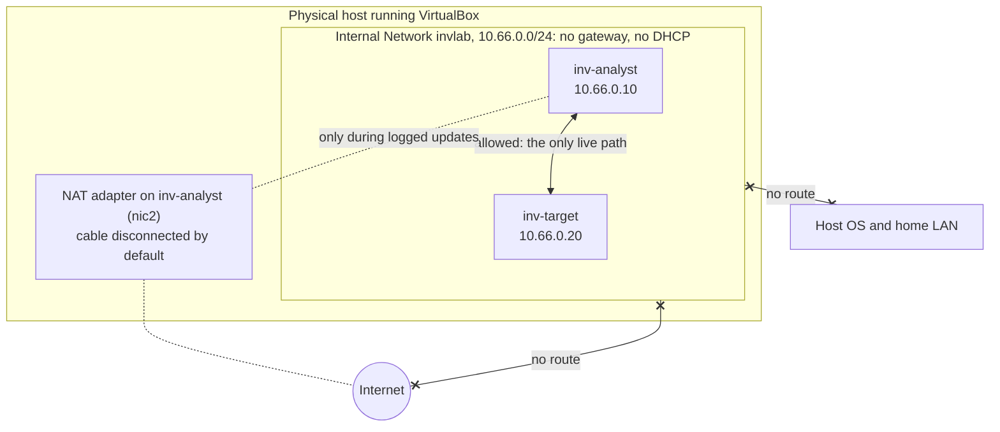
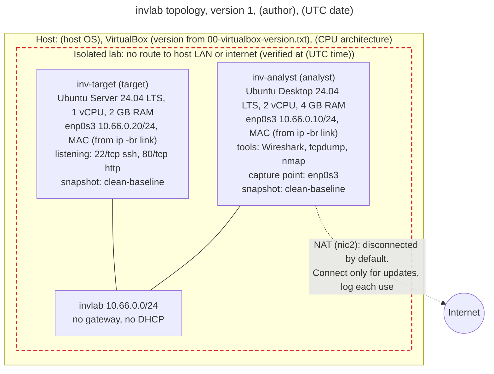
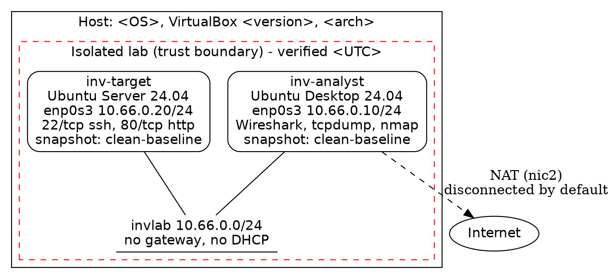

# Day 18: Build your investigation lab and map its topology

Phase: 1. Foundations · Track goal: Stand up an isolated two-machine lab you are fully authorized to attack, capture, and examine, prove it is isolated, and produce the network topology map that closes Phase 1.

## Concept
From Phase 2 onward you will run scanners, open suspicious files, replay captures, and generate attack traffic on purpose. All of that needs a place where you own every machine and every packet, and where a mistake cannot reach your home network, your employer, or the internet. A small virtual lab gives you that, and every exercise in Phase 1 that used sample logs can be rerun there on real systems.

Isolation is the design goal, and it has to be shown, not assumed. The lab here uses VirtualBox's Internal Network mode: virtual machines attached to the same named internal network can reach each other, but not the host and not the internet, because nothing on that network routes anywhere. You add internet access only temporarily, through a separate NAT adapter, to install updates, and you record each time you do.

What can reach what, once the lab is built:



A lab is also evidence infrastructure. Snapshots let you return to a known-clean state after an exercise, which is the lab equivalent of Day 2's working copy. A packet capture of the lab network shows exactly what each exercise did on the wire. Build notes with UTC times and hashes let you, or anyone reviewing your work, reconstruct how the lab was set up.

The topology map is the deliverable most people skip and later wish they had. Six weeks from now, when a capture shows `10.66.0.20` talking to `10.66.0.10` on port 4444, the map is how you know which machine was which, what it was running, and whether that flow should have been possible at all. It should be exact enough that someone else could rebuild the lab from it.

## Resources
- [VirtualBox downloads](https://www.virtualbox.org/wiki/Downloads) and the [VirtualBox User Manual](https://www.virtualbox.org/manual/), chapter "Virtual Networking" for the attachment modes (NAT, Host-only, Internal Network, Bridged).
- [Ubuntu Server](https://ubuntu.com/download/server) and [Ubuntu Desktop](https://ubuntu.com/download/desktop), both 24.04 LTS.
- [Netplan documentation](https://netplan.io/) for static addressing on Ubuntu Server.
- [draw.io](https://app.diagrams.net/) (free, runs in the browser or as a desktop app from [GitHub](https://github.com/jgraph/drawio-desktop/releases)).
- [Graphviz](https://graphviz.org/), if you prefer a text-defined diagram kept under version control.
- [Lab setup resources](../lab-setup-resources.md): other free hypervisors (VMware Workstation Pro, UTM, Proxmox VE) and vulnerable practice targets to add to `invlab` once this build passes its checkpoint.

## Practical: VirtualBox and draw.io, producing an isolated lab with a verified network topology map

### The design
| Item | Value |
|---|---|
| Hypervisor | VirtualBox 7.x on your host |
| Lab network | VirtualBox Internal Network named `invlab`, `10.66.0.0/24`, no gateway, no DHCP |
| `inv-analyst` | Ubuntu Desktop 24.04 LTS, 2 vCPU, 4 GB RAM, `10.66.0.10/24`. Adapter 1: `invlab`. Adapter 2: NAT, cable disconnected except during updates |
| `inv-target` | Ubuntu Server 24.04 LTS, 1 vCPU, 2 GB RAM, `10.66.0.20/24`. Adapter 1: `invlab`. Runs OpenSSH (22) and nginx (80) |

On an Apple Silicon Mac, use the ARM64 builds of Ubuntu with VirtualBox 7.1 or later, or use UTM with an equivalent isolated network. Record which one you chose; it goes on the map.

### Step 1: start the build log
On your host:
```bash
mkdir -p ~/invlab/build-log && cd ~/invlab
VBoxManage --version | tee build-log/00-virtualbox-version.txt
date -u +%Y-%m-%dT%H:%M:%SZ | tee build-log/00-build-start.txt
```
Download both Ubuntu ISOs, and check each against the `SHA256SUMS` file published in the same download directory on `releases.ubuntu.com`:
```bash
sha256sum ubuntu-24.04*-live-server-amd64.iso ubuntu-24.04*-desktop-amd64.iso | tee build-log/01-iso-hashes.txt
```
Compare by eye or with `grep` against the published file. An ISO that does not match does not get installed.

### Step 2: create and install the VMs
In VirtualBox, choose Machine > New for each VM, using the names, CPU, and RAM from the design table. During installation of `inv-target`, leave networking on the default NAT adapter so it can download packages, and tick "Install OpenSSH server" when the installer offers it. After first boot:
```bash
sudo apt update && sudo apt -y full-upgrade
sudo apt -y install nginx
```
On `inv-analyst`, after installation:
```bash
sudo apt update && sudo apt -y full-upgrade
sudo apt -y install wireshark tshark nmap tcpdump dnsutils curl jq
```

### Step 3: move both VMs onto the isolated network
Power both VMs off. Then on the host (the same settings are available in each VM's Settings > Network panel):
```bash
VBoxManage modifyvm "inv-target"  --nic1 intnet --intnet1 invlab
VBoxManage modifyvm "inv-analyst" --nic1 intnet --intnet1 invlab \
                                  --nic2 nat --cable-connected2 off
VBoxManage showvminfo "inv-target"  | grep -i "^NIC" | tee build-log/03-target-nics.txt
VBoxManage showvminfo "inv-analyst" | grep -i "^NIC" | tee build-log/03-analyst-nics.txt
```
Older VirtualBox releases spell the last option `--cableconnected2`. `inv-target` no longer has any NAT adapter at all.

### Step 4: assign static addresses
Boot `inv-target`, find the interface name with `ip -br link` (usually `enp0s3` in VirtualBox), then create `/etc/netplan/60-invlab.yaml`:
```yaml
network:
  version: 2
  ethernets:
    enp0s3:
      dhcp4: false
      addresses: [10.66.0.20/24]
```
Apply it, and remove or disable any older netplan file that still configures DHCP on the same interface:
```bash
sudo chmod 600 /etc/netplan/60-invlab.yaml
sudo netplan apply
ip -br addr
```
On `inv-analyst`, use NetworkManager:
```bash
nmcli connection add type ethernet ifname enp0s3 con-name invlab \
  ipv4.method manual ipv4.addresses 10.66.0.10/24 ipv6.method disabled
nmcli connection up invlab
ip -br addr
```

### Step 5: prove connectivity and isolation
On `inv-analyst`, start a capture in one terminal:
```bash
sudo tcpdump -i enp0s3 -w ~/day18-verify.pcap
```
In a second terminal, run the checks and save the output:
```bash
{
  date -u +%Y-%m-%dT%H:%M:%SZ
  ip -br addr
  ip route
  ping -c 3 10.66.0.20
  nmap -sn 10.66.0.0/24
  nmap -sT -p 22,80 10.66.0.20
  curl -sI http://10.66.0.20/ | head -3
  ping -c 2 -W 2 1.1.1.1 || echo "ISOLATION OK: no route to internet"
  dig +time=2 +tries=1 @1.1.1.1 example.com || echo "ISOLATION OK: no DNS to internet"
} 2>&1 | tee ~/day18-verify.txt
```
Illustrative extract:
```
enp0s3           UP             10.66.0.10/24
10.66.0.0/24 dev enp0s3 proto kernel scope link src 10.66.0.10 metric 100
Nmap scan report for 10.66.0.20
Host is up (0.00041s latency).
22/tcp open  ssh
80/tcp open  http
HTTP/1.1 200 OK
ping: connect: Network is unreachable
ISOLATION OK: no route to internet
```
The route table has only the `10.66.0.0/24` entry and no `default` route. That line, together with the failed ping and DNS query, is your proof of isolation. Scanning `10.66.0.20` is lawful here because you own both machines; the same `nmap` command pointed at anyone else's network without permission is not.

Stop the capture, then copy both files to the host (a shared folder, or `scp` while you briefly reconnect NAT, logged as a change) and hash them into `build-log/`.

The target already holds its first evidence. On `inv-target`:
```bash
sudo tail -3 /var/log/nginx/access.log
```
Your `curl -sI` and `nmap` requests are there, from `10.66.0.10`, in the Day 11 format.

### Step 6: take clean snapshots
```bash
VBoxManage snapshot "inv-target"  take "clean-baseline" --description "Updated, nginx+ssh, isolated on invlab, $(date -u +%FT%TZ)"
VBoxManage snapshot "inv-analyst" take "clean-baseline" --description "Tools installed, isolated on invlab, $(date -u +%FT%TZ)"
VBoxManage snapshot "inv-target" list | tee ~/invlab/build-log/06-target-snapshots.txt
```
From now on, restore `clean-baseline` after any exercise that changes a VM.

### Step 7: draw the topology map
In draw.io, create `invlab-topology.drawio`. Enable the Networking shape library (More Shapes at the bottom of the left panel). The finished diagram must show all of the following; the checkpoint checks each one:

1. The physical host as an outer container, labelled with host OS, hypervisor name and version (from `00-virtualbox-version.txt`), and CPU architecture.
2. Each VM as a box inside the host, labelled with VM name, hostname, OS and version, role (analyst or target), vCPU and RAM.
3. Each VM's network interfaces, with interface name, IP/CIDR, and MAC address (from `ip -br link`).
4. The `invlab` internal network as a labelled segment (a line or bar) with its CIDR, "no gateway, no DHCP," and both VMs attached to it.
5. The NAT adapter on `inv-analyst`, drawn with a dashed line to an "Internet" cloud and labelled "disconnected by default; connect only for updates, log each use."
6. A trust boundary (dashed red rectangle) around the `invlab` segment and both VMs, labelled "Isolated lab: no route to host LAN or internet (verified <UTC time>)."
7. The listening services on `inv-target` (`22/tcp ssh`, `80/tcp http`) and the tools on `inv-analyst` (Wireshark, tcpdump, nmap).
8. The capture point (a small marker on `inv-analyst`'s `enp0s3`) and the snapshot name on each VM (`clean-baseline`).
9. A legend explaining line styles and colours, and a title block with the diagram version, author, and UTC date.

Export with File > Export as > PNG, and tick "Include a copy of my diagram" so the PNG can be reopened for editing. Save the `.drawio` file alongside it.

Here is what the finished map holds, drawn in Mermaid with placeholders where your own values go. Placeholders in parentheses come from your command output. A legend is still required on your version, and draw.io is where you add it.



If you prefer text you can keep in git, the same map as Graphviz is a starting point:

Render with `dot -Tpng invlab.dot -o invlab-topology.png`.

### Step 8: close the build log
Create `~/invlab/build-log/README.md` listing each file in `build-log/` with its SHA-256, the build start and finish times, every time the NAT adapter was connected and why, and the snapshot names. Add a "Rules of this lab" section of three or four lines in your own words: what may run here, what may never be pointed outside it, and how you restore it.

### Step 9: confirm the capture shows only lab traffic
Open `day18-verify.pcap` in Wireshark and choose Statistics > Conversations. On the IPv4 tab, every address should be a `10.66.0.x` address. Any entries on the IPv6 tab should be link-local `fe80::` addresses. Confirm that `1.1.1.1` appears nowhere in the list, which means no packet in the capture reached it.

## Checkpoint
Your artifacts are `invlab-topology.png` (with its `.drawio` or `.dot` source), `~/day18-verify.txt`, `~/day18-verify.pcap`, and `build-log/README.md`. They pass when:

- All nine required elements appear on the map.
- Every IP, MAC, interface name, and version on the map matches your saved command output.
- `~/day18-verify.txt` shows a successful ping to `10.66.0.20`.
- `~/day18-verify.txt` shows ports 22 and 80 open on `10.66.0.20`.
- `~/day18-verify.txt` shows no default route.
- `~/day18-verify.txt` shows failed attempts to reach `1.1.1.1`.
- The IPv4 tab of Statistics > Conversations for `~/day18-verify.pcap` (Step 9) lists only `10.66.0.x` addresses, and any IPv6 entries are link-local `fe80::` addresses.
- No packet in `~/day18-verify.pcap` reached `1.1.1.1` (Step 9).
- Both VMs have a `clean-baseline` snapshot.
- The build log records every period the NAT adapter was connected.
- Your Day 1 board has all eighteen Phase 1 cards in `Artifact built`, each with its Artifact field filled.
