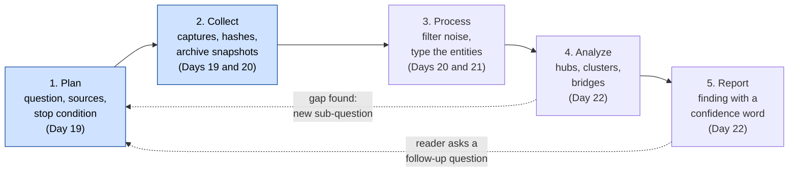
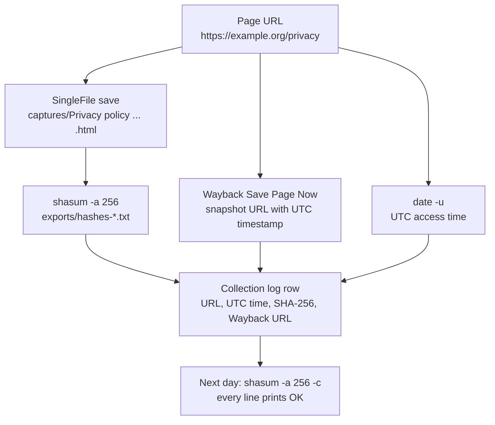

# Day 19: The OSINT cycle, part 1: planning and evidence-grade collection

Phase: 2. OSINT and digital footprint · Track goal: Start every open-source investigation with a written question and a collection plan, and capture sources in a way that proves later what you saw and when.

## Concept
The OSINT cycle has five stages: plan, collect, process, analyze, report. Beginners skip the first and rush the second. They open a search engine, follow whatever looks interesting, and two hours later have forty browser tabs and no way to say which fact came from where. The plan prevents that. It turns a vague task ("look into this organization") into questions you can answer, a list of sources likely to answer each one, and a stop condition.

Days 19 to 22 walk the whole cycle once, on one subject. The dotted arrows are the part beginners miss: analysis usually exposes a gap, and the gap becomes a new sub-question in the plan.



A usable intelligence question is narrow enough that you can tell when it is answered. "What is this organization's online presence?" is too broad. "Which domains does this organization operate, and when was each first registered?" can be answered, checked, and handed to someone else.

Collection has its own discipline. Web pages change and disappear, and a screenshot proves little about when it was taken or whether it was edited. Evidence-grade capture records four things for every item: the exact URL, the UTC time you accessed it, a copy of the content in a format that preserves the page, and a cryptographic hash of that copy taken at capture time. The hash lets you, or anyone reviewing your work, show the file has not changed since you saved it. A third-party archive snapshot (the Wayback Machine) adds an independent witness you did not control.

This is where each of the four items comes from, plus the archive snapshot, and how they meet in one row of the collection log:



When a finding is challenged, "I saw it on their site" loses to "here is the capture, its SHA-256, and the Internet Archive snapshot taken the same minute."

## Resources
- [SingleFile](https://github.com/gildas-lormeau/SingleFile) browser extension saves a complete page (HTML, CSS, images inlined) as one `.html` file. Free, Firefox and Chromium.
- [Wayback Machine Save Page Now](https://web.archive.org/save) creates a public, third-party timestamped copy.
- [Bellingcat's Online Investigation Toolkit](https://bellingcat.gitbook.io/toolkit) is a maintained catalog of tools with notes on cost and reliability. Use it to fill your source matrix.
- [OSINT recon log template](../../worksheets/osint-recon-log.md) is the log you will use from today to the end of Phase 2.

## Practical: SingleFile, Save Page Now, and `shasum`: a hashed collection log
Your subject for Days 19 to 22 is one public organization: a city government, a public university, a national charity, or a standards body. Pick one whose website you can browse normally. Do not pick a private individual or a small business run by one person. Write the organization's primary domain down; this guide writes it as `example.org`.

Step 1: write the plan. Copy `worksheets/osint-recon-log.md` to your notes as `P2-recon-log.md` and fill in the Plan section. Use this question, or one of similar scope:

> Which domains and public web properties does the organization operate, when did each appear, and which of them share infrastructure?

Under "Explicitly out of scope" write at least three items. Good ones for this lab: named staff members and their personal accounts; any page behind a login; any active scanning (port scans, directory brute-forcing) of the organization's systems.

Step 2: build a source matrix. Add a table under the Plan section with one row per sub-question:

| Sub-question | Likely sources | Expected output | Passive? |
|---|---|---|---|
| Which domains does it operate? | Site footer and "legal" pages, certificate transparency (crt.sh), SpiderFoot | List of domains and subdomains | Yes |
| When was each registered? | RDAP / WHOIS, historical WHOIS | Creation dates | Yes |
| Which share infrastructure? | DNS A/MX/NS records, Maltego | IP and name-server overlap | Yes |
| When did the main site change? | Wayback Machine CDX | Version timeline | Yes |

Passive means you query third parties (search engines, archives, registries, public DNS resolvers) and read the organization's public pages as any visitor would. Every row in this lab must say yes.

Step 3: set up a case folder.

```bash
mkdir -p ~/cases/P2-ORG/{captures,exports,notes}
cd ~/cases/P2-ORG
```

Step 4: capture ten pages. Candidates: the home page, the "About" page, the contact page, the privacy policy (these often name other domains and data processors), the site footer's linked properties, and any page listing partner or subsidiary sites. For each page:

1. Save it with SingleFile (toolbar icon, or right-click > SingleFile > Save page with SingleFile). Move the file into `captures/`. In SingleFile's options you can edit the file name template so every file carries a date and time; do that once now.
2. Submit the same URL to `https://web.archive.org/save/` and copy the snapshot URL it returns. Snapshot URLs embed a UTC timestamp in `YYYYMMDDhhmmss` form, for example `https://web.archive.org/web/20260930141502/https://example.org/about`.
3. Note the UTC time. `date -u +%Y-%m-%dT%H:%M:%SZ` prints it.

Step 5: hash the captures.

```bash
# macOS
shasum -a 256 captures/* | tee exports/hashes-$(date -u +%Y%m%dT%H%M%SZ).txt
# Linux
sha256sum captures/* | tee exports/hashes-$(date -u +%Y%m%dT%H%M%SZ).txt
# Windows PowerShell
Get-FileHash -Algorithm SHA256 .\captures\* | Format-List
```

Illustrative output (hash values shortened and made up for this example):

```
3f9a1c...e21b  captures/About us - example.org (2026-09-30 14_15_02).html
b07d44...9c0a  captures/Privacy policy - example.org (2026-09-30 14_18_40).html
```

Step 6: fill the collection log. One row per capture. The Notes column should hold the SHA-256 and the Wayback snapshot URL. A finished row looks like this (illustrative):

| # | Data point | Source | Date/time accessed | Notes |
|---|---|---|---|---|
| 3 | Privacy policy names two further domains (`example-events.org`, `examplefoundation.org`) as "our websites" | https://example.org/privacy | 2026-09-30T14:18:40Z | SHA-256 `b07d44...9c0a`; Wayback `.../web/20260930141901/https://example.org/privacy` |

If a Wayback submission failed (it sometimes does for heavy pages), write that in the row; do not leave it blank.

The artifact is `P2-recon-log.md` with a completed Plan section, the source matrix, and ten collection rows, plus the `captures/` folder and the hash file.

## Checkpoint
- Tomorrow, before you start Day 20, the verification against yesterday's hash file prints `OK` on every line:

  ```bash
  shasum -a 256 -c exports/hashes-*.txt     # Linux: sha256sum -c
  ```

- Every sub-question in the source matrix maps to at least one source.
- Every collection row has a UTC timestamp.
- Every collection row has a SHA-256 hash.
- Every collection row has a Wayback snapshot URL, or a note that the submission failed; no archive cell is blank.
- The out-of-scope list has at least three concrete items.
- Without notes, you can explain what "passive" means in this lab: which kinds of sources you may query, and how you may read the organization's own pages.
