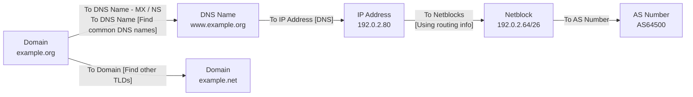
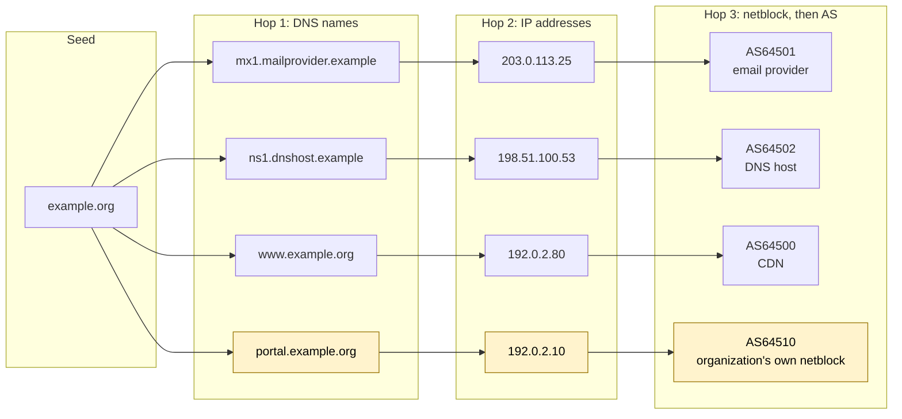

# Day 21: The OSINT cycle, part 3: processing into a Maltego graph

Phase: 2. OSINT and digital footprint · Track goal: Model your collected data as typed entities and relationships in Maltego, expand it with transforms under the free plan's limits, and keep every entity traceable to a source.

## Concept
SpiderFoot answers "what can be found?". Maltego is better at "how do these specific things relate?", because you control each expansion step and every node has a type. A Domain entity is a different kind of object from a DNS Name, an IP Address, a Netblock, or an AS number, and transforms are written for specific types. Running "To IP Address [DNS]" on a DNS Name resolves it; the same transform does not appear on an Email Address. Types force you to be precise about what each fact is.

A transform is a small query against a data source. You select entities, run a transform, and Maltego adds the results as new entities linked to the input. Each run is one deliberate hop, which is why Maltego graphs stay smaller and more explainable than automated scan output.

The chain you will build today, one transform per arrow. Each box is an entity type, and the type decides which transforms appear when you right-click it:



The free tier has changed. What used to be Maltego Community Edition is now the Maltego Basic plan: Maltego Graph (Desktop), up to 24 results per transform run, and 200 Maltego Data credits per month with limited access to data providers. The old "Standard Transforms" set is now legacy, available only on old paid plans. The transforms you see depend on your plan and on which Transform Hub items you install, and that catalog changes. So learn the method, not a memorized menu: right-click an entity, search the transform list by keyword, and check what a transform costs before running it on fifty entities.

The 24-result cap matters analytically. A transform that returns exactly 24 results has probably been truncated, so write "at least 24" in your notes, never "24".

## Resources
- [Maltego products and plans](https://docs.maltego.com/en/support/solutions/articles/15000036759-maltego-products-and-plans) gives the current free-plan limits. Check it; they have changed before.
- [Beginners' guide: setting up the Basic plan](https://www.maltego.com/blog/beginners-guide-to-maltego-setting-up-maltego-community-edition-ce/) covers Maltego ID registration and first sign-in.
- [How to use Maltego transforms to map network infrastructure](https://www.maltego.com/blog/how-to-use-maltego-transforms-to-map-network-infrastructure-an-in-depth-guide/) walks through the DNS, netblock, and AS transform chain used below.
- [Free-tier data in the Transform Hub](https://www.maltego.com/blog/free-tier-data-in-the-transform-hub/) lists partners that offer free-tier integrations.

## Practical: Maltego Graph (Desktop), Basic plan: a three-hop, source-annotated infrastructure graph
Step 1: install and sign in. Register a Maltego ID, install Maltego Graph (Desktop) for your OS, and sign in. In the Transform Hub (the start page), use the filter for free-tier items and install any that cover DNS, certificates, or passive DNS. Note which items you installed in your recon log; another analyst needs that to reproduce your graph.

Step 2: seed the graph. Press Ctrl+T (Cmd+T on macOS) for a new graph. In the Entity Palette on the left, open the Infrastructure group and drag a Domain entity onto the canvas. Double-click its label and type your Day 19 domain.

Step 3: hop 1, from the domain. Right-click the Domain. The context menu lists transform sets and has a search box at the top. Type `DNS`, `MX`, `NS`, or `TLD` to find the relevant transforms. In Maltego's own documentation and guides these are named like this:

- `To DNS Name - MX (mail server)`
- `To DNS Name - NS (name server)`
- `To DNS Name [Find common DNS names]`
- `To Domain [Find other TLDs]`

If a transform with that exact name is not in your menu, pick the one on your plan that does the same job (the search box finds it) and write the name you actually ran in the log. Before running anything marked as using credits, hover over it or check the Transform Hub item's page for its cost.

Step 4: hop 2, from DNS names to addresses. Select all DNS Name entities (drag a selection box around them, or sort the Entity List view by type and select the DNS Name rows), right-click, and run `To IP Address [DNS]`. Now you have the hosts the organization's names resolve to.

Step 5: hop 3, from addresses to networks. Select the IP Address entities and run `To Netblocks [Using natural boundaries]` or `To Netblocks [Using routing info]`, then on the Netblock entities run `To AS Number`. The AS entity tells you who operates the network: the organization itself, a hosting company, or a CDN.

Step 6: bring in SpiderFoot's findings. You have a filtered CSV from Day 20. Maltego can build entities from a table: Import | Export tab > Import Graph from Table, then map columns to entity types in the wizard. A simpler route for a few items: copy a list of domains, click the canvas, and paste; Maltego creates one entity per line and asks for the type. Import only what survived your Day 20 false-positive pass.

Step 7: annotate provenance. For every entity you added by hand or imported, open it (double-click) and use the Notes field to record the source and the collection-log row number, for example `crt.sh, log #14, 2026-09-30T15:02Z`. Entities created by a transform already record which transform produced them; you can see it in the Detail View.

Step 8: lay it out and export. Use the layout buttons on the Layout tab: Organic for an overview, Hierarchical to see the hop structure from the seed. Save the graph as `exports/P2-ORG.mtgl`. Export an image via the Export tab (Export Graph as Image) at a size where labels are readable.

A worked mini-example (illustrative: reserved example domain and documentation IP ranges, not a live capture):

```
Domain  example.org
 ├─ MX  mx1.mailprovider.example        -> 203.0.113.25  -> AS64501 (email provider)
 ├─ NS  ns1.dnshost.example             -> 198.51.100.53 -> AS64502 (DNS host)
 ├─ DNS www.example.org                 -> 192.0.2.80    -> AS64500 (CDN)
 ├─ DNS portal.example.org              -> 192.0.2.10    -> AS64510 (organization's own netblock)
 └─ Other TLDs: example.net, example.ca (same registrar; check on Day 29)
```

The same example drawn by hop, roughly the shape the Hierarchical layout gives you. Read each row left to right to get from the seed to the operator of the network. The highlighted row is the one that does not end at a provider:



`portal.example.org` is the interesting one: it resolves into a netblock registered to the organization rather than to a provider. That is a self-hosted system, and on a real engagement it is the kind of detail that goes into the report with care.

Step 9: audit the graph and the session.

1. Pick any three entities at random and trace each back to either a named transform (visible in the Detail View) or a numbered row in your collection log.
2. List every transform run that returned exactly 24 results, and check that your notes say "at least 24" for each.
3. Count credits used this session (shown in your Maltego account) and write the figure in the log so you can budget Day 22.

The artifact is `P2-ORG.mtgl` plus its exported image: a graph at least three hops deep from the seed domain, where every manually added entity carries a source note.

## Checkpoint
- All three randomly checked entities trace back to a named transform or a numbered collection-log row.
- Your notes list every transform run that returned exactly 24 results.
- For each of those runs, your notes say "at least 24", never "24".
- The recon log records the number of credits used this session.
- Without notes, you can explain what the AS Number entity at the end of hop 3 tells you about who operates a network.
