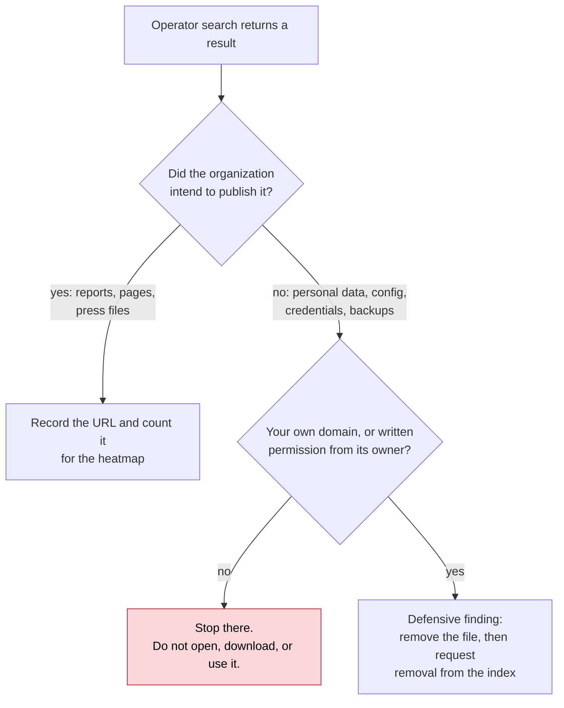
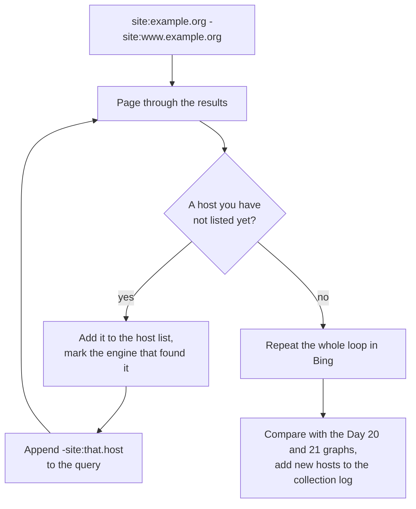

# Day 23: Search operators for organizational footprinting

Phase: 2. OSINT and digital footprint · Track goal: Use search-engine operators to enumerate an organization's indexed subdomains, documents, and third-party mentions, and turn the results into an exposure heatmap.

## Concept
Search engines have already crawled most of what an organization has published, including things it forgot it published. Operators narrow the index to exactly the slice you need. A plain query for an organization's name returns its home page and news. `site:example.org -site:www.example.org` returns pages on every other indexed host under that domain, which is often the quickest passive subdomain list you can get.

Operator support differs by engine and changes without notice. Google dropped the `cache:` operator in 2024, and Bing removed its cached-page links later the same year, so the Wayback Machine (Day 26) is now the practical replacement. Always test an operator with a query whose answer you know before relying on it.

Two cautions shape this day. First, result counts ("About 1,240 results") are estimates that can swing by an order of magnitude between pages of the same query. Record the number of results you actually paged through, not the estimate. Second, operator searches sometimes surface material that should never have been public: spreadsheets of personal data, configuration files, credentials. Finding it through a search engine is generally lawful. Opening, downloading, or using it can stop being lawful fast, and using a found credential is unauthorized access in almost every jurisdiction. The sensitive-exposure queries below are for your own organization or a domain you control. Against the public organization you studied on Days 19 to 22, stay with documents and pages the organization intended to publish.



## Resources
- [Google Search operators (Search Central)](https://developers.google.com/search/docs/monitor-debug/search-operators/all-search-site) is Google's own documentation of `site:` and related behavior.
- [Bing advanced search keywords](https://support.microsoft.com/en-us/topic/advanced-search-keywords-ea595928-5d63-4a0b-9c6b-0b769865e78a) lists Bing's operators, including several Google lacks.
- [Google Hacking Database (Exploit-DB)](https://www.exploit-db.com/google-hacking-database) is a catalog of queries that find exposed files. Read it to understand what defenders should check on their own domains.
- [DuckDuckGo search syntax](https://duckduckgo.com/duckduckgo-help-pages/results/syntax/) for a second index with different coverage.

## Practical: Google, Bing, and a spreadsheet: an exposure heatmap by host and file type
Use the same public organization and `P2-recon-log.md` from Days 19 to 22.

Step 1: learn the operators you will use. Test each one against your subject.

| Operator | Engine | Example | What it does |
|---|---|---|---|
| `site:` | Google, Bing, DDG | `site:example.org` | Results from that domain and its subdomains |
| `-site:` | Google, Bing | `site:example.org -site:www.example.org` | Excludes a host; use it to peel off known subdomains |
| `filetype:` / `ext:` | Google (both), Bing (`filetype:`) | `site:example.org filetype:pdf` | Restricts to a file extension |
| `intitle:` | Google, Bing, DDG | `site:example.org intitle:"annual report"` | Word or phrase in the page title |
| `inurl:` | Google, DDG | `site:example.org inurl:careers` | Word in the URL |
| `intext:` / `inbody:` | Google / Bing | `intext:"example.org" -site:example.org` | Word in the body text |
| `"..."` | all | `"Example Organization"` | Exact phrase |
| `OR`, `-` | all | `site:example.org (filetype:xlsx OR filetype:csv)` | Boolean; `OR` must be upper case |
| `before:` / `after:` | Google | `site:example.org filetype:pdf after:2024-01-01` | Filters by date Google associates with the page |

Bing also documents `ip:`, which returns pages hosted on a given IP address. Try `ip:192.0.2.80` with one of your Day 21 IPs. On a shared CDN IP it returns unrelated sites, which is Day 22's hub lesson in search form.

Step 2: enumerate hosts. Run and repeat, adding one `-site:` for each host you find, until results stop producing new hosts:

```
site:example.org -site:www.example.org
site:example.org -site:www.example.org -site:events.example.org
site:example.org -site:www.example.org -site:events.example.org -site:library.example.org
```

The loop looks like this:



Run the same sequence in Bing. Record every host in a list and mark which engine found it. Compare against your Day 20 and 21 graphs and add new hosts to the collection log.

Step 3: count document types per host. For each host, run:

```
site:events.example.org filetype:pdf
site:events.example.org filetype:docx
site:events.example.org filetype:xlsx
site:events.example.org filetype:pptx
```

Page through the results and record the number you actually saw, capped at 50 (the first five pages). Do not record the "About N results" estimate.

Step 4: find third-party mentions. These show where the organization's domain appears outside its own site:

```
"example.org" -site:example.org
site:github.com "example.org"
site:linkedin.com/company "Example Organization"
```

The GitHub query often surfaces public repositories the organization publishes, and sometimes configuration that references its hosts. Read, record the URL, and do not clone or run anything.

Step 5: build the heatmap. In Google Sheets or LibreOffice Calc, put hosts in rows, file types in columns, and your observed counts in the cells. Illustrative:

| Host | pdf | docx | xlsx | pptx |
|---|---|---|---|---|
| www.example.org | 50 | 12 | 3 | 7 |
| events.example.org | 18 | 0 | 0 | 2 |
| library.example.org | 50 | 4 | 9 | 0 |
| archive.example.org | 31 | 22 | 14 | 0 |

Select the numbers and apply a color scale (Sheets: Format > Conditional formatting > Color scale; Calc: Format > Conditional > Color Scale). A host like `archive.example.org` with a high count of editable Office documents is where Day 28's metadata analysis will find the most.

Step 6 (own domain only): an exposure check. If you control a domain (a personal site, a lab domain, or your employer's domain with written permission from its security team), run these against it and nowhere else:

```
site:yourdomain.example intitle:"index of"
site:yourdomain.example (ext:env OR ext:log OR ext:sql OR ext:bak)
site:yourdomain.example inurl:admin
```

If anything sensitive appears, the fix is removal plus a request to the search engine to drop the URL (Google Search Console > Removals). Write that in your notes as a defensive finding.

Step 7: explain one engine gap. Pick one host that only one engine found and write one sentence in your notes on why that might be (indexing differences, robots.txt, recency).

The artifact is the heatmap (exported as PNG or PDF) and a host list annotated with the engine that found each host, added to the recon log.

## Checkpoint
- Every heatmap cell holds an observed count, not an "About N results" estimate.
- The heatmap caption states that the counts are observed.
- Every host in your host list is marked as found by Google, Bing, both, or neither (found only by earlier tools).
- Your notes contain one sentence on why one single-engine host was found by only that engine.
- If you ran Step 6, your notes show the domain is one you control.
- Without notes, you can explain why Bing's `ip:` operator, run on a shared CDN IP, returns sites unrelated to your subject.
