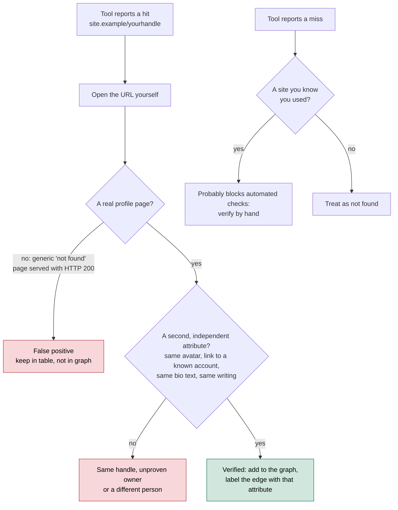
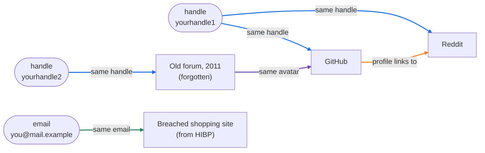

# Day 24: Username enumeration and digital-footprint mapping (your own)

Phase: 2. OSINT and digital footprint · Track goal: Map your own online identities with username-enumeration tools, verify every hit by hand, and build a footprint graph that shows what an investigator (or a scammer) could link together about you.

## Concept
People reuse handles. A username chosen at fifteen often survives on a gaming forum, a code-hosting account, and a photo site twenty years later. Username enumeration tools exploit that: they take a handle and check hundreds of sites for a profile at the expected URL (`https://example-site.com/{username}`), then report which ones exist.

In scam and fraud investigation this is a pattern-level technique. A recruitment-scam operator who posts as `hr_talentdesk` on one job board frequently uses the same handle on a messaging app, a payment service, and a second job board; that reuse is how separate scam reports get linked into one operation on Day 68. The subject there is an operation's handles. The subject here is you, because a footprint of a private person built without authorization is a dossier, and this roadmap does not build those.

Enumeration tools produce false positives in both directions. A site that returns HTTP 200 for every URL, including non-existent profiles, looks like a hit for every handle. A site that blocks automated requests looks like a miss. A real hit may also be a different person who picked the same handle. A result means only that a profile page exists; attribution needs a second, independent attribute (the same avatar, a link back to a known account, the same bio text, the same writing).

Every hit and every miss goes through the same checks before it counts:



Your own footprint gives you ground truth. You know which accounts are yours, so you can measure each tool's accuracy directly. That calibration is the most useful thing you will take from today.

## Resources
- [WhatsMyName web app](https://whatsmyname.app/) runs the WhatsMyName project's curated site list in your browser. No install.
- [Sherlock](https://github.com/sherlock-project/sherlock) is a command-line username checker, installable with pip.
- [Maigret](https://github.com/soxoj/maigret) is a Sherlock fork that also parses profile pages for linked identifiers and can draw a graph.
- [Have I Been Pwned](https://haveibeenpwned.com/) shows which known breaches include your own email address.

## Practical: Sherlock, Maigret, and WhatsMyName: a verified self-footprint graph
Choose two to four handles you have used, and one email address you own. Do not run any of today's tools on anyone else's handle, including friends, unless they have asked you to and are sitting with you.

Step 1: install the tools in an isolated environment.

```bash
python3 -m pip install --user pipx && python3 -m pipx ensurepath
pipx install sherlock-project
pipx install maigret
```

Step 2: run Sherlock.

```bash
mkdir -p ~/cases/self-footprint && cd ~/cases/self-footprint
sherlock yourhandle1 yourhandle2 --csv --timeout 10 --folderoutput sherlock/
```

`--csv` writes one CSV per username into the output folder. `--timeout 10` stops slow sites from stalling the run. By default Sherlock prints found profiles only; `--print-all` also shows misses, which is useful when you are measuring accuracy. Illustrative console output:

```
[*] Checking username yourhandle1 on:
[+] GitHub: https://www.github.com/yourhandle1
[+] Reddit: https://www.reddit.com/user/yourhandle1
[+] Chess: https://www.chess.com/member/yourhandle1
[+] Pinterest: https://www.pinterest.com/yourhandle1/
[*] Search completed with 4 results
```

Step 3: run Maigret.

```bash
maigret yourhandle1 --html --graph
```

`--html` writes a report into `reports/`. `--graph` writes an interactive graph of accounts and the identifiers Maigret extracted from them (linked usernames, full names, profile links). Maigret checks its top 500 sites by default; add `-a` to check all of them, which takes much longer.

Step 4: run WhatsMyName. Enter the same handle at whatsmyname.app. It uses a separate, curated site list, so its hits will not match Sherlock's exactly. Export or copy the results.

Step 5: verify every hit by hand. Build a table in your notes. For every site any tool reported, open the URL and decide:

| Site | Sherlock | Maigret | WMN | Is it mine? | Evidence |
|---|---|---|---|---|---|
| GitHub | hit | hit | hit | yes | my repos |
| Chess.com | hit | hit | miss | no | different person; joined 2012, country differs |
| Pinterest | hit | miss | miss | no profile | page loads a generic "user not found" with HTTP 200 (false positive) |
| Old forum | miss | miss | hit | yes, forgotten | my 2011 posts; still public |

The "forgotten" row is usually the most interesting one. Accounts you had forgotten are exactly what an attacker finds and you do not defend.

Step 6: check your email. Enter your own address at haveibeenpwned.com. Each breach it lists tells you which services held that address, and some of those accounts may be missing from the username results because you used a different handle there. Add them to the table as "linked by email".

Step 7: build the footprint graph. Start from Maigret's graph output, or build one by hand in Maltego (Personal palette: Alias and Email Address entities, Social palette for accounts) or diagrams.net. Nodes are your handles, your email, and every verified account. Edges are the attribute that links them: same handle, same email, a profile that links to another profile, the same avatar. Color edges by type. Leave false positives out of the graph but keep them in the table.

An illustrative result, using the rows from the Step 5 table. Blue edges are a shared handle, green a shared email, orange a profile linking to another, purple a reused avatar. The forgotten forum account joins the rest only through the avatar, which is exactly the kind of link people do not think to break.



Step 8: note what links are strongest. One sentence each on the two or three attributes that tie most of your accounts together. For most people it is one reused handle plus one reused avatar.

Step 9: measure each tool. Compute each tool's precision on your handles: verified-yours hits divided by all hits it reported. Write the three figures in your notes.

Step 10 (optional): if you found a forgotten account you no longer want public, deleting it or scrubbing it is a reasonable end to the lab. Note what you did in that account's row of the verification table.

The artifact is the self-footprint graph (PNG) and the verification table with a column per tool.

## Checkpoint
- Your notes hold three precision figures, one each for Sherlock, Maigret, and WhatsMyName.
- Each figure equals that tool's verified-yours hits divided by all hits it reported.
- Every account in your graph is one you verified as yours in Step 5 or linked by email in Step 6; no false positive appears in it.
- Every edge in your graph is labelled with the attribute that links it.
- The verification table includes at least one false positive.
- Every false positive in the table states the reason it is false.
- If you did Step 10, the account's row in the verification table records whether you deleted or scrubbed it.
- Without notes, you can explain why a site that returns a generic "user not found" page with HTTP 200 shows up as a false positive in username tools.
