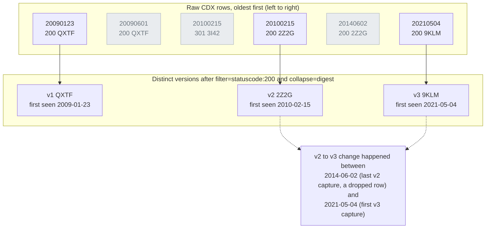

# Day 26: Social media investigation, part 2: archived and deleted content

Phase: 2. OSINT and digital footprint · Track goal: Recover earlier versions of pages and profiles from web archives, query the Wayback Machine's index directly, and produce a version timeline showing what changed and when.

## Concept
Content removed from a live site often survives elsewhere. The Internet Archive's Wayback Machine has captured hundreds of billions of pages since 1996, archive.today keeps user-requested snapshots, and a page's past versions often say more than its present one: an earlier "About" page naming a different parent company, a removed list of partners, a phone number that was swapped out after complaints.

Until 2024 many investigators used search-engine caches for recent versions. Google removed its `cache:` operator in 2024 and Bing removed cache links later that year, so archives are now the main route.

The Wayback Machine has a query interface most people never see: the CDX API. The calendar view shows you captures one day at a time. The CDX API returns every capture of a URL, or of every URL under a prefix, as rows you can filter and count. Each row carries a digest: a hash of the captured content. Two captures with the same digest are byte-identical, so collapsing on the digest gives you only the captures where something changed. That turns "browse 900 snapshots" into "read the 14 versions".

The rows below are the illustrative ones from Step 1, with two later captures added. Grey rows are dropped: one is a redirect, the others repeat the digest of the row before them. What survives is one row per version. The dates of neighboring rows also give you the honest answer to "when did it change?", which is a window and not a day. Read that window from the uncollapsed list, because `collapse=digest` keeps the first capture of each run and throws away the last.



Social platforms are harder to archive. Their pages are built by JavaScript after login, and many snapshots of profiles on X, Instagram, or Facebook are empty shells or login walls. Archives work best on ordinary web pages, and on the organization's own site, which is usually where the interesting edits live anyway.

Archive captures are strong evidence because a third party made them, but check the timestamp is the capture time, not the page's own date, and remember that someone may have requested a snapshot deliberately.

## Resources
- [Wayback CDX Server API documentation](https://github.com/internetarchive/wayback/tree/master/wayback-cdx-server) lists every parameter used below.
- [Wayback Machine](https://web.archive.org/) itself, including the Changes view for comparing two captures.
- [archive.today](https://archive.ph/) is a separate archive with its own captures; search it with the URL.
- [Memento Time Travel](https://timetravel.mementoweb.org/) searches several web archives at once for a URL and date.

## Practical: Wayback CDX API and the Changes view: a version timeline and capture-density chart
Use your Day 19 organization. Choose two URLs likely to have changed: the "About" or "Who we are" page, and the privacy policy or partners page.

Step 1: list every capture.

```bash
curl -s "https://web.archive.org/cdx/search/cdx?url=example.org/about&output=json&fl=timestamp,statuscode,digest,length" | jq -r '.[] | @tsv' | head
```

The first row is the header. Illustrative output (digests shortened):

```
timestamp	statuscode	digest	length
20090123021509	200	QXTF6ZNN...	4412
20090601183322	200	QXTF6ZNN...	4410
20100215094410	301	3I42H3S6...	402
20100215094412	200	2Z2G4AWV...	5120
```

Timestamps are UTC, in `YYYYMMDDhhmmss` form. A `301` or `302` status is a redirect, which is itself a finding: the page moved.

Step 2: collapse to unique versions.

```bash
curl -s "https://web.archive.org/cdx/search/cdx?url=example.org/about&output=json&fl=timestamp,statuscode,digest&filter=statuscode:200&collapse=digest" \
  | jq -r '.[1:][] | @tsv' > exports/about-versions.tsv
wc -l exports/about-versions.tsv
```

`filter=statuscode:200` drops redirects and errors. `collapse=digest` drops each capture identical to the previous one. The line count is the number of distinct versions. Note that `collapse` compares adjacent rows only; a page that changed and changed back appears twice, which is correct for a timeline.

Step 3: count capture density.

```bash
curl -s "https://web.archive.org/cdx/search/cdx?url=example.org/*&fl=timestamp" \
  | cut -c1-4 | sort | uniq -c
```

`url=example.org/*` is a prefix query covering every archived URL under the domain. Cutting the timestamp to four characters counts captures per year; use `cut -c1-6` for per month. Put the counts into a bar chart in your spreadsheet. A sudden spike often means someone started requesting snapshots, which sometimes means a dispute or a campaign.

Step 4: fetch a clean copy of each version.

```bash
curl -s "https://web.archive.org/web/20090123021509id_/https://example.org/about" -o captures/about-2009-01.html
```

The `id_` after the timestamp asks for the original captured bytes without the Wayback toolbar and without rewritten links. Hash the file as on Day 19.

Step 5: compare versions. Two routes:

1. In the browser, open the Wayback calendar for the URL and use the Changes view (from the page's capture summary) to pick two captures; it highlights added and removed text.
2. On the command line, strip markup and diff:

```bash
for f in captures/about-*.html; do sed -e 's/<[^>]*>//g' "$f" | tr -s ' \n' > "${f%.html}.txt"; done
diff -u captures/about-2009-01.txt captures/about-2021-05.txt | less
```

The `sed` tag-strip is crude and fine for spotting changed sentences. Record each substantive change (a name, a number, a claim, a link) in the recon log.

Step 6: check archive.today and a deleted social post. Paste the "About" URL into archive.ph's search to see whether anyone captured it there. Then, for one post from Day 25 that the organization later deleted or edited (if none, use any old post URL from their account), look it up in the Wayback Machine with a wildcard listing:

```
https://web.archive.org/web/*/x.com/ExampleOrg/status/*
https://web.archive.org/web/*/twitter.com/ExampleOrg/status/*
```

Check both domains; older captures sit under `twitter.com`. Expect some captures to be blank.

Step 7: build the version timeline. Add a section to the recon log, one row per distinct version:

| Version | First captured (UTC) | Last identical capture | What changed | Evidence |
|---|---|---|---|---|
| v1 | 2009-01-23 02:15 | 2010-02-15 | Original text | `about-2009-01.html`, SHA-256 in log |
| v2 | 2010-02-15 09:44 | 2014-06-02 | URL moved (301); "subsidiary of" sentence added | diff, log #41 |
| v3 | 2021-05-04 11:20 | current | Partner list removed | diff, log #42 |

The artifact is the version timeline for two URLs plus the capture-density bar chart.

## Checkpoint
For each version in the table you must have a clean `id_` copy on disk with its hash in the log. Take the change you judge most significant, find the date range in which it happened (last capture of the old version, first capture of the new), and write that range as the finding: the archive tells you the change happened between those two captures, not on a specific day. Put the same event on your Day 25 TimelineJS timeline if it fits.
