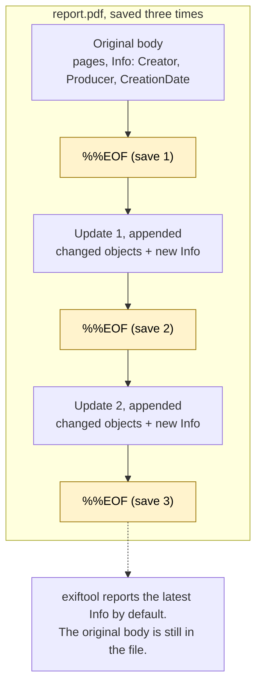
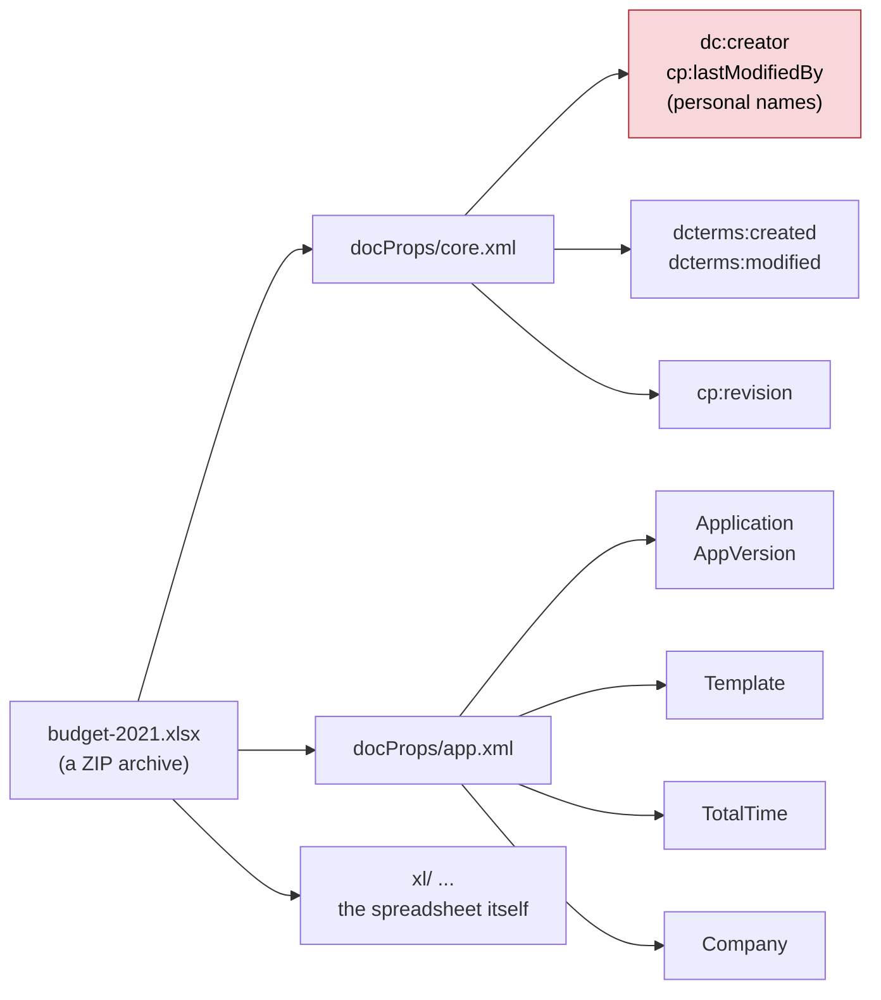

# Day 28: Metadata forensics, part 2: PDFs and Office documents

Phase: 2. OSINT and digital footprint · Track goal: Read the metadata inside PDF and Office files, recognize the fields that expose authoring software, templates, and edit history, and turn a set of an organization's public documents into a software-by-year heatmap.

## Concept
Documents carry more history than images. A PDF has an Info dictionary (Author, Creator, Producer, CreationDate, ModDate) and usually an XMP packet with its own copies of those fields plus document and instance IDs. `Creator` is normally the application the document was written in; `Producer` is the library that wrote the PDF. A Word file exported to PDF typically shows a word-processor Creator and a PDF-export Producer; a scanned letter shows the scanner's software; a document assembled in an online PDF editor shows that service's name.

PDFs also support incremental updates. An edit can be appended to the end of the file instead of rewriting it, leaving the earlier version inside the same file. Each saved revision usually ends with its own `%%EOF` marker, so a file with three of them has probably been saved three times, and the earlier content may be recoverable.



Office Open XML files (`.docx`, `.xlsx`, `.pptx`) are ZIP archives. `docProps/core.xml` holds the creator, the last person to modify the file, created and modified timestamps, and a revision count. `docProps/app.xml` holds the application and version, the template name, total editing time, and sometimes the company name the software was registered to.



The red box holds the fields you will drop from `meta.csv` in Step 5.

Two uses matter for this roadmap. For an organization's public documents, the aggregate shows patterns: which software generations produced them, when a template changed, which departments publish what. For fraud work (Phase 5), document metadata is one of the fastest forgery checks. A "bank statement" whose Producer is a free online PDF editor, or an "offer letter" dated March whose CreationDate is in July, is a strong indicator the document is not what it claims to be.

Author and last-modified fields contain real names. The pattern is today's subject, not the people. Your artifact aggregates software and dates and drops the name columns.

## Resources
- [ExifTool PDF tags](https://exiftool.org/TagNames/PDF.html) documents every PDF field exiftool reads, and explains how it handles incremental updates.
- [Poppler `pdfinfo`](https://poppler.freedesktop.org/) is a second, independent reader for the Info dictionary.
- [ECMA-376 (Office Open XML)](https://ecma-international.org/publications-and-standards/standards/ecma-376/) is the standard that defines `core.xml` and `app.xml`, if you want the field definitions at source.
- [Didier Stevens' PDF tools](https://blog.didierstevens.com/programs/pdf-tools/) (`pdfid.py`, `pdf-parser.py`) for looking inside PDF structure, including revisions.

## Practical: `exiftool`, `pdfinfo`, and `unzip`: a document-metadata heatmap
Use the Day 19 organization. Your Day 23 heatmap showed which hosts publish the most documents.

Step 1: collect 25 to 40 public documents. Use the queries from Day 23 (`site:example.org filetype:pdf`, plus `filetype:docx` and `filetype:xlsx`). Download them by clicking, from pages the organization published, over at least three different years if possible. Record each URL in the collection log.

```bash
mkdir -p ~/cases/P2-ORG/docs/{orig,work} && cd ~/cases/P2-ORG/docs
# after downloading into orig/
chmod a-w orig/* && cp orig/* work/ && shasum -a 256 orig/* > hashes.txt
```

Step 2: read one PDF in full, two ways.

```bash
exiftool -a -G1 -s work/annual-report-2022.pdf
pdfinfo work/annual-report-2022.pdf
```

Illustrative exiftool output, trimmed:

```
[PDF]           PDFVersion                      : 1.7
[PDF]           Linearized                      : Yes
[PDF]           Author                          : (name redacted for this example)
[PDF]           Creator                         : Microsoft® Word for Microsoft 365
[PDF]           Producer                        : Microsoft® Word for Microsoft 365
[PDF]           CreateDate                      : 2022:06:03 10:14:52-04:00
[PDF]           ModifyDate                      : 2022:06:03 10:14:52-04:00
[XMP-xmpMM]     DocumentID                      : uuid:5E1A...
[XMP-xmpMM]     InstanceID                      : uuid:5E1A...
[PDF]           PageCount                       : 48
```

And the matching `pdfinfo` fields (illustrative):

```
Creator:         Microsoft® Word for Microsoft 365
Producer:        Microsoft® Word for Microsoft 365
CreationDate:    Fri Jun  3 10:14:52 2022 EDT
ModDate:         Fri Jun  3 10:14:52 2022 EDT
Pages:           48
PDF version:     1.7
```

Two tools agreeing on the same fields is a small but real cross-check. If they disagree, the file likely has more than one revision with different metadata; exiftool reports the latest values by default.

Step 3: count revisions.

```bash
for f in work/*.pdf; do printf "%s\t%s\n" "$(grep -ac '%%EOF' "$f")" "$f"; done | sort -rn | head
```

A count above 1 means incremental updates (a linearized PDF commonly shows 2 even when saved once, so treat 2 as normal and 3 or more as worth a look). For the top file, run `pdfid.py work/that-file.pdf` and look at the `%%EOF` and `/Info` counts.

Step 4: open one Office document.

```bash
unzip -p work/budget-2021.xlsx docProps/core.xml | xmllint --format -
unzip -p work/budget-2021.xlsx docProps/app.xml  | xmllint --format -
```

Illustrative `core.xml` elements: `<dc:creator>`, `<cp:lastModifiedBy>`, `<dcterms:created>2019-11-04T15:22:00Z</dcterms:created>`, `<dcterms:modified>2021-02-10T09:03:00Z</dcterms:modified>`. A file created in 2019 and published as the 2021 budget was built from an older file; that is a template lineage, often harmless and sometimes the thing that exposes a forgery. In `app.xml` look at `<Application>`, `<AppVersion>`, `<Template>`, `<TotalTime>`, and `<Company>`.

Step 5: extract everything to CSV.

```bash
exiftool -csv -r -FileName -FileType -Creator -Producer -CreateDate -ModifyDate -Application -AppVersion work/ > meta.csv
```

Open `meta.csv` in a spreadsheet. Delete any Author, Creator-name, or LastModifiedBy columns that hold personal names before you save the working copy. The pattern does not need them.

Step 6: normalize and pivot. Add a column `SoftwareFamily` that groups raw Producer strings into families (for example "Word export", "Acrobat", "macOS Quartz", "LibreOffice", "online PDF service", "scanner"). Add `Year` from CreateDate. Build a pivot table: SoftwareFamily in rows, Year in columns, count of files in values. Apply a color scale as on Day 23. Illustrative:

| SoftwareFamily | 2018 | 2019 | 2020 | 2021 | 2022 |
|---|---|---|---|---|---|
| Acrobat | 6 | 5 | 1 | 0 | 0 |
| Word export | 1 | 2 | 7 | 8 | 9 |
| online PDF service | 0 | 0 | 2 | 1 | 0 |
| scanner | 3 | 1 | 0 | 0 | 0 |

In this example the organization moved from Acrobat to Word exports around 2020 and stopped scanning paper. The two files from an online PDF service in 2020 are the outliers worth reading: which documents were they, and why were they produced differently?

Step 7: add anomalies to the recon log. For each outlier, one line: file, what is unusual (software, a CreateDate after the date printed in the document, a high revision count), and a benign or concerning explanation you can check.

Step 8: cross-check one anomaly. For one anomaly, show in your notes that `exiftool` and `pdfinfo` (or `core.xml`) agree on the field that makes it anomalous.

Step 9: calibrate. Take one PDF you made yourself last week, run Step 2 and Step 3 on it, and compare the output with what you know about how you made it; that is your calibration check.

The artifact is the heatmap (PNG or PDF), `meta.csv` without personal-name columns, and the anomaly notes.

## Checkpoint
- Your heatmap covers at least 25 files.
- Your heatmap covers at least three years.
- The heatmap caption states the file count.
- The heatmap caption states that personal-name fields were removed.
- For one anomaly, your notes show `exiftool` and `pdfinfo` (or `core.xml`) agreeing on the field that makes it anomalous.
- The Step 2 and Step 3 output for your own PDF matches what you know about how you made it.
- Without notes, you can explain why a `%%EOF` count of 2 is treated as normal and what count is worth a look.
