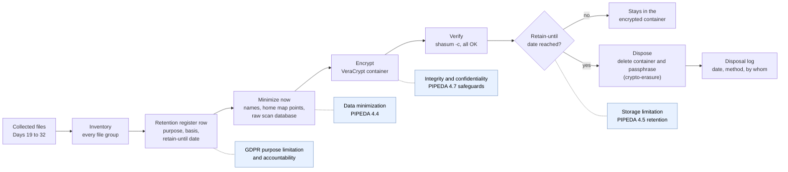

# Day 34: OSINT law, part 2: storing, retaining, and disposing of what you collect

Phase: 2. OSINT and digital footprint · Track goal: Apply data-protection principles to your own case files: justify what you keep, protect it, set a date to destroy it, and close out Phase 2 with a case package that would survive a privacy audit.

## Concept
Collection is a moment; storage is ongoing. Once you save a screenshot containing someone's name, you are processing personal data for as long as you keep it, and data-protection law cares about that whole period.

Under the EU GDPR (and the UK GDPR, which mirrors it), Article 5 sets the principles you will apply today: purpose limitation (collected for a specified purpose and not reused for an incompatible one), data minimization (adequate, relevant, and limited to what is necessary), storage limitation (kept no longer than necessary), and integrity and confidentiality (appropriate security). Article 5(2) adds accountability: you must be able to show you complied. Private-sector investigators usually rely on legitimate interests under Article 6(1)(f), which requires a documented balancing test: a legitimate purpose, necessity, and a check that the individual's rights do not override it. Special-category data (health, ethnicity, religion, sexual life, biometrics and others) under Article 9, and criminal-offence data under Article 10, need an additional legal condition. Article 14 generally requires telling people when you collect their data from other sources, with exceptions. Article 14(5)(b) covers cases where giving notice would be impossible or involve disproportionate effort, or is likely to render impossible or seriously impair the achievement of the objectives of the processing; even then the controller must take appropriate measures to protect the person's rights, and you should document why the exception applies rather than assume it. Police and prosecutors in the EU fall under a separate instrument, the Law Enforcement Directive (EU) 2016/680.

In Canada, PIPEDA governs private-sector organizations in commercial activity (some provinces have their own substantially similar laws). Its Schedule 1 principles include limiting collection (4.4), limiting use, disclosure, and retention (4.5, including destroying or anonymizing information no longer needed), and safeguards (4.7). Section 7(1)(b) allows collection without knowledge or consent when it is reasonable to expect that collecting with knowledge or consent would compromise the availability or the accuracy of the information, and the collection is reasonable for purposes related to investigating a breach of an agreement or a contravention of the laws of Canada or a province. The "publicly available" exception is narrow: the regulations list specific sources such as telephone and professional directories, public registries, court records, and published magazines and newspapers. The Clearview AI findings (Day 33) rejected the argument that social-media content falls within it.

Security failures have their own obligations: PIPEDA requires reporting breaches that create a real risk of significant harm, and the GDPR has 72-hour notification to the regulator for most breaches. An unencrypted laptop full of OSINT screenshots is a breach waiting to happen.

The investigative standard for handling digital open-source evidence, the Berkeley Protocol, points the same way: preserve what the case needs with integrity, and minimize the rest.

Today's practical walks your Phase 2 files through this lifecycle. The dotted notes show which principle each step puts into practice, so the finished case package is also your accountability record.



## Resources
- [GDPR full text (EUR-Lex, Regulation (EU) 2016/679)](https://eur-lex.europa.eu/eli/reg/2016/679/oj); read Articles 5, 6(1)(f), 9, 14, 30, and 32.
- [PIPEDA (Justice Laws)](https://laws-lois.justice.gc.ca/eng/acts/p-8.6/), including Schedule 1 and section 7.
- [Berkeley Protocol on Digital Open Source Investigations](https://www.ohchr.org/en/publications/policy-and-methodological-publications/berkeley-protocol-digital-open-source) (UN OHCHR and UC Berkeley Human Rights Center), chapters on preservation and data security.
- [VeraCrypt](https://www.veracrypt.fr/) is free, open-source disk and container encryption for Windows, macOS, and Linux.

## Practical: VeraCrypt and a retention register: an encrypted, minimized Phase 2 case package
Step 1: create an encrypted container. Install VeraCrypt (on macOS it also needs macFUSE or FUSE-T; the installer page says which). Then:

1. Create Volume > Create an encrypted file container > Standard VeraCrypt volume.
2. Volume Location: `~/cases/P2-case.hc`.
3. Encryption Options: AES, hash SHA-512 (the defaults are fine).
4. Volume Size: large enough for your Phase 2 folders plus room to grow (check with `du -sh ~/cases/*`).
5. Password: a long passphrase from your password manager. Store it there, not in the case notes.
6. Filesystem: exFAT if you need to open it on more than one OS. Move the mouse to gather randomness, then Format.
7. Mount it: select a slot, Select File, choose `P2-case.hc`, Mount.

Step 2: inventory what you hold. List every Phase 2 folder and file group: Day 19 captures, SpiderFoot exports, Maltego graph, Day 24 self-footprint, Day 25 timeline sheet, Day 27 images and map, Day 28 document set and `meta.csv`, Days 29 and 30 exports, Day 31 persona file, Day 32 heatmap.

Step 3: build the retention register. A spreadsheet or Markdown table in the case package, one row per file group:

| Data set | Contains personal data? | Whose / what kind | Purpose | Lawful basis or authority | Minimization applied | Retain until | Disposal method |
|---|---|---|---|---|---|---|---|
| Day 19 captures | Incidental (staff names on pages) | Organization staff, public role | Phase 2 training case | Training exercise; no case authority | None needed beyond scope rule | end of roadmap (Day 90) | Delete with container |
| Day 24 self-footprint | Yes | Your own | Self-assessment | Your own data | Other people's same-handle profiles removed | your choice | n/a |
| Day 27 images | Yes, location | Your own | Geolocation lab | Your own data | Points within 1 km of home removed from map | Day 90 | Delete with container |
| Day 28 `meta.csv` | Removed | n/a | Metadata heatmap | Training exercise | Author and LastModifiedBy columns dropped | Day 90 | Delete with container |
| SpiderFoot DB | Yes (emails found) | Organization contacts | Day 20 lab | Training exercise | Export kept; full scan DB deleted | now | Delete scan in UI |

In real casework the "Lawful basis or authority" column carries the case number and the basis (for example, legitimate interests with a reference to the balancing test on file, or a warrant or production order for law enforcement).

Step 4: do the minimization pass. Work through the register and act on it now, not later:

- Delete the full SpiderFoot scan from its UI (Scans list, select, Delete) once you have kept the filtered export you actually used. The raw scan database holds everything, including the noise you filtered out.
- Remove or blur personal names in captures that you do not need for any finding.
- Remove any Day 27 map point that shows where you live.
- Keep hash files. They contain no personal data and are what makes the remaining evidence trustworthy.

Step 5: move the case into the container and verify.

```bash
rsync -a --checksum ~/cases/P2-ORG/ "/Volumes/P2-case/P2-ORG/"      # macOS mount path; Linux: /media/veracrypt1/
cd "/Volumes/P2-case/P2-ORG" && shasum -a 256 -c exports/hashes-*.txt
```

Every line must say `OK`. Then delete the unencrypted originals. On an SSD, deleting a file does not reliably erase its blocks, so the durable protection comes from full-disk encryption on the machine (FileVault, BitLocker, LUKS) plus the container. At the retention date, deleting the container and its passphrase is your disposal method (crypto-erasure); log the date you did it.

Step 6: write the disposal log and Phase 2 index. Add a `README.md` inside the container with: the case question from Day 19, a list of artifacts by day, the location of the retention register, and an empty disposal log table (data set, date destroyed, method, by whom).

Step 7: spot-check and scope-check. Pick one row of the retention register at random and check, from the files, that its minimization was actually applied. Then look back at your Day 19 out-of-scope list: if anything in the container contradicts it, remove it and record that in the disposal log.

The artifact is the mounted VeraCrypt container holding the minimized Phase 2 case, the completed retention register, and the `README.md` index.

## Checkpoint
- The files for the randomly picked register row show its minimization was actually applied.
- Every row of the retention register has a retain-until date or a stated reason for none.
- With the container dismounted, the case files are unreadable.
- After you remount the container, the case files open again.
- Nothing in the container contradicts your Day 19 out-of-scope list.
- Every item you removed for contradicting that list has a row in the disposal log.
- Without notes, you can explain why deleting a file on an SSD does not reliably erase it, and what provides the durable protection instead.
