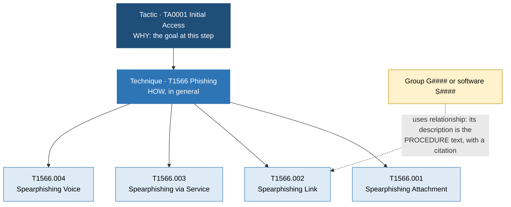
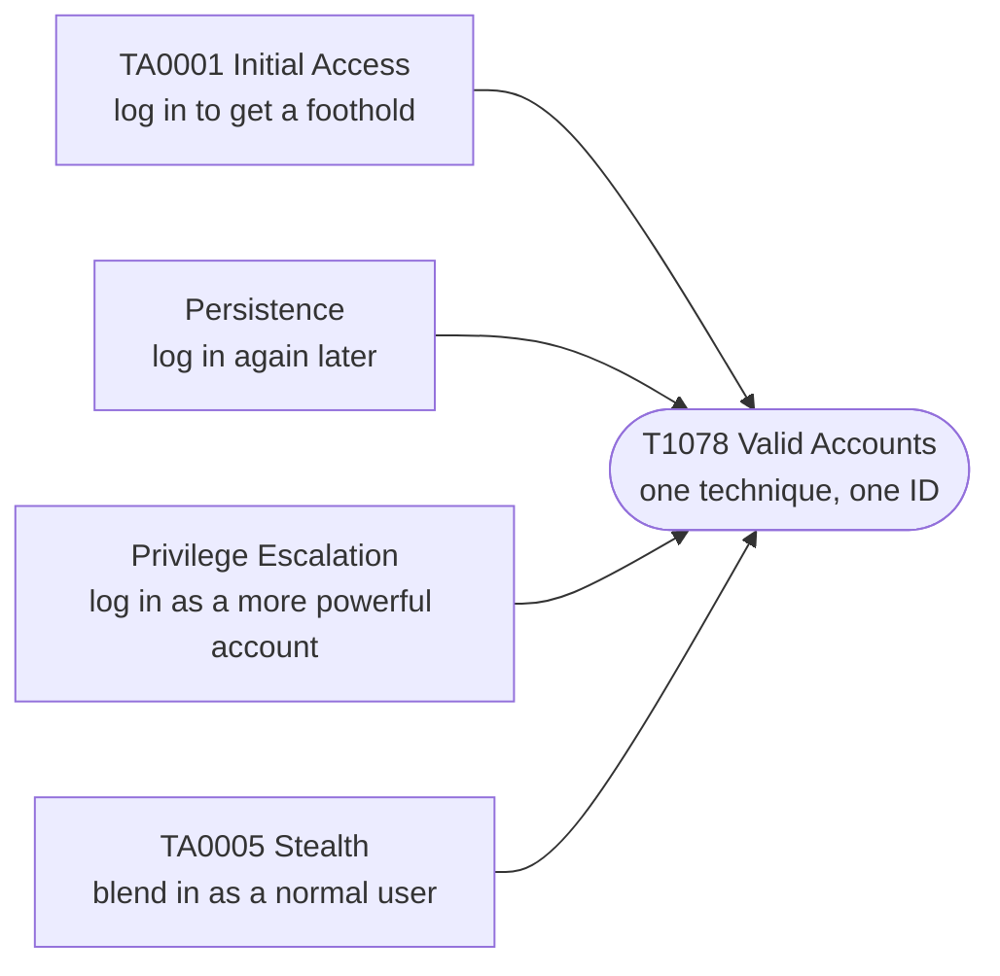
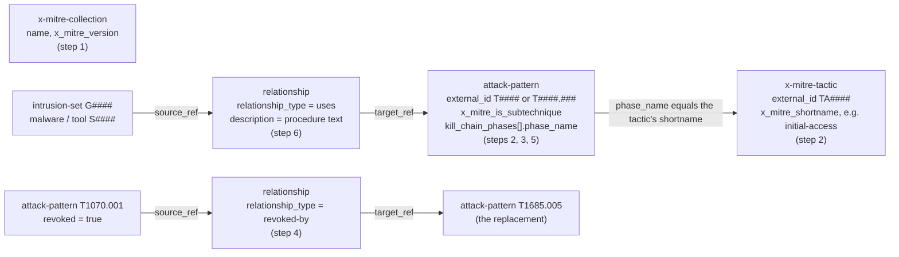

# Day 35: How ATT&CK is built, from tactic to procedure

Phase: 3. Cyber Threat Intelligence · Track goal: Read ATT&CK as a data model you can query, so every technique ID you write later in this phase is one you have looked up rather than remembered.

## Concept
MITRE ATT&CK is a catalog of adversary behavior assembled from public incident reporting. It covers three domains (Enterprise, Mobile, ICS). This phase uses Enterprise.

The matrix has four layers, and investigators mix them up constantly:

| Layer | Answers | ID format | Example |
|---|---|---|---|
| Tactic | Why the adversary did it (the goal at that step) | `TA####` | TA0001 Initial Access |
| Technique | How, in general terms | `T####` | T1566 Phishing |
| Sub-technique | How, more specifically | `T####.###` | T1566.002 Spearphishing Link |
| Procedure | What one named group or tool actually did, with a citation | no ID; stored as the text of a "uses" relationship | "APT29 has bypassed UAC" (from the APT29 layer, citing Mandiant) |

The phishing family drawn as those four layers. Each arrow points one step more specific, and the procedure is the only layer without an ID of its own:



A technique can serve more than one tactic. T1078 Valid Accounts sits under Initial Access, Persistence, Privilege Escalation and Stealth, because logging in with a stolen password can accomplish any of those goals. When you map behavior, the tactic comes from the adversary's purpose at that moment in the intrusion. The technique alone does not tell you.



ATT&CK also tracks groups (`G####`), software (`S####`), campaigns (`C####`), mitigations (`M####`), data sources (`DS####`) and data components (`DC####`). Newer releases add detection strategies (`DET####`) and analytics (`AN####`).

The matrix changes. In ATT&CK v19.0 (April 2026), MITRE split the old Defense Evasion tactic into Stealth (which kept TA0005) and a new Defense Impairment tactic (TA0112), and revoked some IDs in the process. T1070.001 Clear Windows Event Logs, which appears in years of published reports, now resolves to T1685.005. A report written in 2023 and a layer built today can use different IDs for the same behavior. Record the ATT&CK version next to every mapping you make.

## Resources
- [ATT&CK STIX data on GitHub](https://github.com/mitre-attack/attack-stix-data): the full knowledge base as STIX 2.1 JSON, one file per domain and version.
- [ATT&CK data and tools](https://attack.mitre.org/resources/attack-data-and-tools/): MITRE's index of official ways to consume the data.
- [ATT&CK Navigator](https://mitre-attack.github.io/attack-navigator/) and its [layer format spec](https://github.com/mitre-attack/attack-navigator/tree/master/layers/spec): the heatmap tool used all phase. The current layer format is 4.5.
- [MITRE ATT&CK CTI training](https://attack.mitre.org/resources/learn-more-about-attack/training/cti/): free course. Module 1 covers this day's material.
- [jq manual](https://jqlang.org/manual/): the query language used below.

## Practical: jq and ATT&CK Navigator (a sub-technique density heatmap and a technique ID card)
You will query the raw ATT&CK dataset from the command line, trace a revoked ID to its replacement, and then generate a Navigator layer from the data. Everything here reads MITRE's published dataset. Nothing touches any live system.

The file is one big STIX bundle. These are the objects and fields the queries below read, and how they point at each other:



### 1. Get the data and record the version
```bash
mkdir -p ~/cti-lab/day35 && cd ~/cti-lab/day35
curl -sL https://raw.githubusercontent.com/mitre-attack/attack-stix-data/master/enterprise-attack/enterprise-attack.json -o enterprise-attack.json
jq -r '.objects[] | select(.type=="x-mitre-collection") | .name + " v" + .x_mitre_version' enterprise-attack.json
```
The file is about 50 MB. In September 2026 the command printed `Enterprise ATT&CK v19.2`. Write your version at the top of your notes.

### 2. Count what is in the matrix
Revoked and deprecated objects stay in the file for backward compatibility, so filter them out or your counts will be wrong:

```bash
# parent techniques
jq '[.objects[] | select(.type=="attack-pattern" and .revoked!=true and .x_mitre_deprecated!=true and .x_mitre_is_subtechnique!=true)] | length' enterprise-attack.json
# sub-techniques
jq '[.objects[] | select(.type=="attack-pattern" and .revoked!=true and .x_mitre_deprecated!=true and .x_mitre_is_subtechnique==true)] | length' enterprise-attack.json
# tactics, with IDs and the short names Navigator uses
jq -r '.objects[] | select(.type=="x-mitre-tactic") | [(.external_references[] | select(.source_name=="mitre-attack") | .external_id), .name, .x_mitre_shortname] | @tsv' enterprise-attack.json
```
Against v19.2 these returned 222 techniques, 475 sub-techniques and 15 tactics, including `TA0005 Stealth` and `TA0112 Defense Impairment`. Expect different numbers on a later release.

### 3. Pull one technique family
```bash
jq -r '.objects[] | select(.type=="attack-pattern" and .revoked!=true)
  | select(.external_references[0].external_id | startswith("T1566"))
  | [.external_references[0].external_id, .name, (.kill_chain_phases | map(.phase_name) | join(","))] | @tsv' enterprise-attack.json | sort
```
Output observed on v19.2:
```
T1566      Phishing                     initial-access
T1566.001  Spearphishing Attachment     initial-access
T1566.002  Spearphishing Link           initial-access
T1566.003  Spearphishing via Service    initial-access
T1566.004  Spearphishing Voice          initial-access
```
The `kill_chain_phases` field is where the technique-to-tactic link lives. Run the same query for `T1078` and you will see four phase names on one technique.

### 4. Resolve a revoked ID
Older reports cite `T1070.001`. Find what replaced it:

```bash
OLD=$(jq -r '.objects[] | select(.type=="attack-pattern") | select(any(.external_references[]; .external_id=="T1070.001")) | .id' enterprise-attack.json)
jq -r --arg old "$OLD" '.objects as $o
  | ($o[] | select(.type=="relationship" and .relationship_type=="revoked-by" and .source_ref==$old) | .target_ref) as $new
  | $o[] | select(.id==$new) | .external_references[0].external_id + " " + .name' enterprise-attack.json
```
On v19.2 this prints `T1685.005 Clear Windows Event Logs`. Use this pattern any time a report's ID does not appear in Navigator.

### 5. Generate a heatmap layer from the data
Save this as `sublayer.jq`. It scores each parent technique by how many active sub-techniques it has:

```jq
[.objects[] | select(.type=="attack-pattern" and .revoked!=true and .x_mitre_deprecated!=true)
  | (.external_references[] | select(.source_name=="mitre-attack") | .external_id)] as $ids
| ($ids | map(select(contains(".")) | split(".")[0]) | group_by(.) | map({key:.[0], value:length}) | from_entries) as $subs
| {
    name: "Sub-technique density",
    versions: {layer: "4.5", attack: "19", navigator: "5.3.2"},
    domain: "enterprise-attack",
    description: "Score = number of active sub-techniques under each parent technique",
    techniques: [ $ids[] | select(contains(".") | not) | {techniqueID: ., score: ($subs[.] // 0)} ],
    gradient: {colors: ["#ffffff", "#ff6666"], minValue: 0, maxValue: 10}
  }
```
```bash
jq -f sublayer.jq enterprise-attack.json > sub-density-layer.json
jq -c '.techniques | sort_by(-.score) | .[0:5]' sub-density-layer.json
```
On v19.2 the top five were T1027 and T1546 (18 each), then T1547, T1564 and T1218 (14 each). Set `versions.attack` to your own major version.

Open Navigator, choose "Open Existing Layer", then "Upload from local", and load `sub-density-layer.json`. Export it with the "render layer to SVG" control in the layer toolbar, then download the SVG from the render view.

### 6. Write a technique ID card
Pick five techniques from the darkest cells. For each one, fill in a row from the dataset (not from memory):

| ID | Name | Tactic(s) | Sub-technique count | One real procedure example and its source |
|---|---|---|---|---|
| T1027 | Obfuscated Files or Information | stealth | 18 | (copy one "uses" relationship description and its citation) |

To get procedure text for a technique, query `relationship` objects whose `target_ref` is that technique's STIX `id` and read their `description` field.

### 7. Check one ID from an older report
Pick one technique ID from a report published before April 2026 and resolve it to its current ID with the step 4 pattern, or confirm that it is unchanged. Record the old ID and the result in your notes file.

### What you have when you finish
- `sub-density-layer.json` plus its SVG export: a heatmap where every Enterprise technique is shaded by sub-technique count.
- A five-row technique ID card with tactic, count and one cited procedure per row.
- A notes file that records the ATT&CK version, the revoked-ID lookup you ran, and the older-report ID from step 7.

## Checkpoint
- Your heatmap loads in Navigator without a version warning, or you can explain the warning you got.
- For each row of your ID card, point to the jq output or relationship description it came from. Any cell you filled from memory is wrong by definition, even if it turns out to be correct.
- Your notes file records one technique ID from a report published before April 2026, next to its current ID or a note that it is unchanged.
- Without notes, explain why T1078 shows up in four columns of the matrix.
