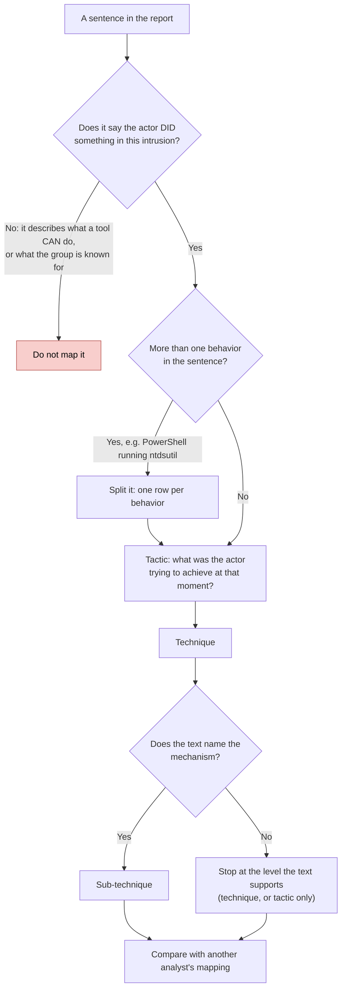
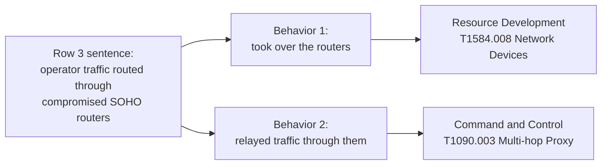
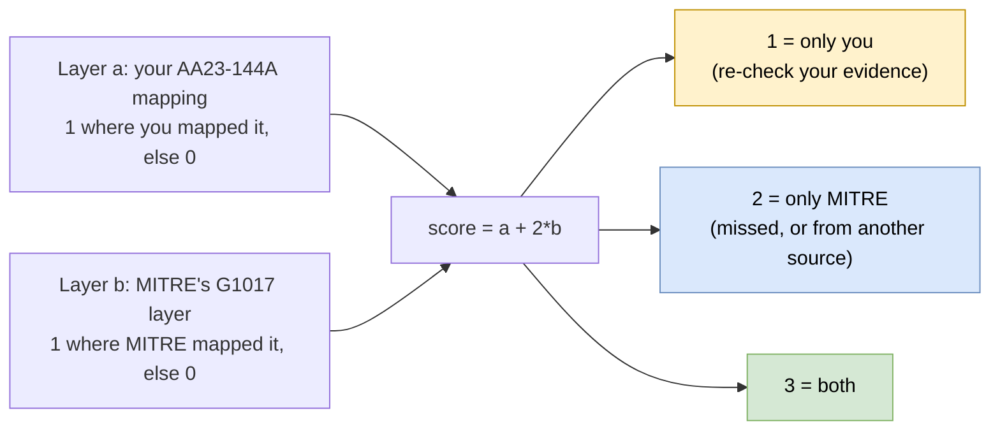

# Day 36: Mapping a published advisory to ATT&CK

Phase: 3. Cyber Threat Intelligence · Track goal: Turn prose in a real government advisory into ATT&CK technique IDs you can defend sentence by sentence, then measure your mapping against MITRE's own.

## Concept
Mapping is a translation job. A report says what an intruder did in plain language, and you convert each observed behavior into a tactic and a technique. CISA's mapping guide breaks it into steps: find the behavior, research it, identify the tactic, then the technique, then the sub-technique if the evidence supports that level of detail, and finally compare your results with another analyst's.

Most mapping errors fall into a few patterns:

- Mapping the tool instead of the behavior. "The actor used PowerShell to run ntdsutil" contains two behaviors: T1059.001 PowerShell for execution and T1003.003 NTDS for credential access. The goal of the step was the credential theft.
- Mapping capability as if it were observed. A malware family that can capture screenshots does not mean the actor captured screenshots in this intrusion. Map only what the report says happened.
- Guessing a sub-technique the text does not support. "The actor established persistence" with no mechanism named maps to the tactic at most. Leave the technique blank rather than inventing Registry Run Keys.
- Inferring tactic from the technique. The tactic is the purpose at that moment. The same `netsh` command can be discovery in one intrusion and command and control in another.

The CISA steps as a decision path, with each of those errors placed at the point where it happens:



Today's source is a joint advisory on Volt Typhoon, a cluster that the US and partner governments attribute to the People's Republic of China. Microsoft published its own analysis the same day. Both documents describe "living off the land": the actor relied on built-in Windows tools rather than custom malware, which makes behavior mapping the main way to describe what happened.

## Resources
- [CISA AA23-144A, "People's Republic of China State-Sponsored Cyber Actor Living off the Land to Evade Detection"](https://www.cisa.gov/news-events/cybersecurity-advisories/aa23-144a) (May 24, 2023): your primary source today.
- [Microsoft Threat Intelligence, "Volt Typhoon targets US critical infrastructure with living-off-the-land techniques"](https://www.microsoft.com/en-us/security/blog/2023/05/24/volt-typhoon-targets-us-critical-infrastructure-with-living-off-the-land-techniques/) (May 24, 2023): second source for cross-checking.
- [CISA, "Best Practices for MITRE ATT&CK Mapping"](https://www.cisa.gov/news-events/news/best-practices-mitre-attckr-mapping): the step-by-step method and a list of common mistakes.
- [ATT&CK group page G1017, Volt Typhoon](https://attack.mitre.org/groups/G1017/): MITRE's mapping, which you will compare against.
- [CISA AA24-038A](https://www.cisa.gov/news-events/cybersecurity-advisories/aa24-038a) (February 2024): a later, longer advisory on the same actor, for the optional extension.

## Practical: ATT&CK Navigator (an evidence-backed technique layer and a comparison heatmap)
You are mapping a published document. Do not look up, resolve or visit any infrastructure named in the advisory.

### 1. Build an evidence table before touching Navigator
Read AA23-144A end to end once without mapping. On the second pass, copy every sentence that describes an action the actor took into a spreadsheet with these columns:

| # | Quote (verbatim, from the report) | Behavior in your own words | Tactic | Technique / sub-technique | Confidence in the mapping |
|---|---|---|---|---|---|

Worked rows (paraphrased here; your rows must hold the report's exact wording):

| # | Behavior described in the advisory | Tactic | Technique | Why this level |
|---|---|---|---|---|
| 1 | Used `ntdsutil` to create a copy of the Active Directory database from a domain controller | Credential Access | T1003.003 NTDS | The report names the database and the tool, which is enough for the sub-technique |
| 2 | Configured `netsh interface portproxy` to forward traffic between hosts inside the network | Command and Control | T1090.001 Internal Proxy | Forwarding inside the victim network, not out to the internet |
| 3 | Routed operator traffic through compromised small-office/home-office routers | Command and Control; Resource Development | T1090.003 Multi-hop Proxy; T1584.008 Network Devices | Two behaviors: compromising the routers, then using them as relays |
| 4 | Gained initial access through an internet-facing network appliance | Initial Access | T1190 Exploit Public-Facing Application | Map only T1190 unless the text says how the appliance was exploited |
| 5 | Queried Windows security event logs for successful logons | Discovery | T1654 Log Enumeration | The purpose was learning about accounts and hosts; the logs were not cleared |

Row 3 is the pattern the checkpoint asks for: one sentence, two behaviors, two tactics. Drawn out, it looks like this:



Row 5 is a trap worth studying. Reading logs is not the same behavior as clearing them. If you mapped it to anything under Defense Impairment, go back and reread the sentence.

Aim for 15 to 25 rows. Mark any row where you had to guess as low confidence.

### 2. Convert the table into a Navigator layer
Write the layer by hand so every technique carries its evidence in the comment field. A minimal file:

```json
{
  "name": "Volt Typhoon, my mapping of AA23-144A",
  "versions": {"layer": "4.5", "attack": "19", "navigator": "5.3.2"},
  "domain": "enterprise-attack",
  "description": "Mapped from CISA AA23-144A (2023-05-24). One technique per evidence row.",
  "techniques": [
    {"techniqueID": "T1003.003", "score": 1, "comment": "Row 1: ntdsutil copy of AD database", "showSubtechniques": true},
    {"techniqueID": "T1090.001", "score": 1, "comment": "Row 2: netsh portproxy between internal hosts", "showSubtechniques": true},
    {"techniqueID": "T1654", "score": 1, "comment": "Row 5: security log queries for logon events"}
  ],
  "gradient": {"colors": ["#ffffff", "#66b1ff"], "minValue": 0, "maxValue": 1}
}
```
Check it with `jq . my-volt-typhoon.json` before loading. A trailing comma breaks the upload.

### 3. Pull MITRE's mapping for the same group
```bash
curl -sL https://attack.mitre.org/groups/G1017/G1017-enterprise-layer.json -o attack-G1017.json
jq '[.techniques[] | select(.score==1)] | length' attack-G1017.json
```
The same URL pattern works for any group (`/groups/G0016/G0016-enterprise-layer.json` for APT29). MITRE's layer merges every public source it has reviewed for the group, of which this advisory is one. It also folds in techniques from campaigns attributed to the group, so it will be much larger than yours. When checked in September 2026 (ATT&CK v19.2), the command above returned 98.

### 4. Build the comparison heatmap
In Navigator, open both layers. Then choose "Create New Layer", then "Create Layer from other layers". Navigator assigns each open layer a letter. If your mapping is `a` and MITRE's is `b`, set the score expression to:

```
a + 2*b
```
Each technique then scores 1 if only you mapped it, 2 if only MITRE did, and 3 if both did.


 Set a three-color gradient (for example yellow, blue, green) and add legend items that say what each score means.

### 5. Write the gap note
Under the heatmap, write a short note in three parts:

- Techniques only you mapped (score 1). For each, quote your evidence and say whether you still stand by it.
- Techniques only MITRE mapped (score 2) that you can trace to AA23-144A. Say why you missed them.
- Techniques MITRE mapped from other sources. You do not need to list them all. Count them, and say why a group layer is not the same thing as a mapping of one report.

### 6. Optional extension: a second advisory
Map AA24-038A the same way and use `a + 2*b` again to see how reporting on the actor changed between 2023 and 2024.

### What you have when you finish
- An evidence table of 15 or more rows, each with a verbatim quote from AA23-144A.
- `my-volt-typhoon.json`, a layer in which every technique's comment points to an evidence row.
- A comparison heatmap exported as SVG, with a legend explaining scores 1, 2 and 3.
- A gap note of half a page or less.

## Checkpoint
- Choose any three cells on your layer at random. Each must lead back to a quoted sentence in AA23-144A within one lookup.
- Every technique on your layer has a comment pointing to an evidence row, so none was chosen because Volt Typhoon is "known for" it.
- At least one row in your table maps a single sentence to two or more techniques, with the reasoning written down.
- Optional (step 6): your AA24-038A layer and its `a + 2*b` comparison heatmap sit alongside the AA23-144A ones.
- Without notes, state what a score of 1, 2 and 3 means in your comparison heatmap.
