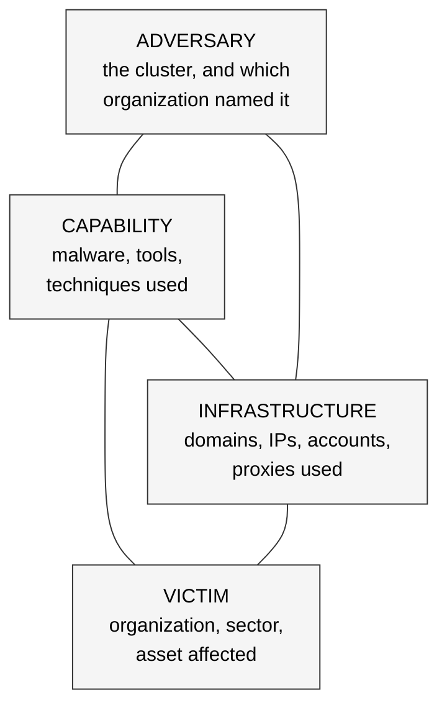
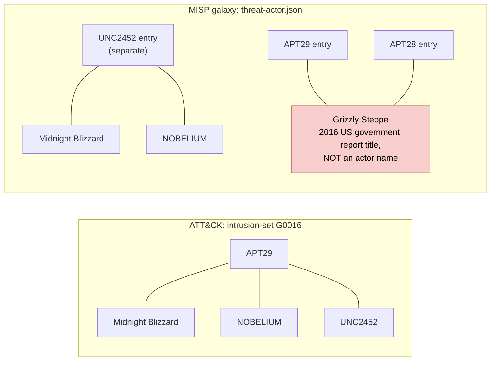

# Day 37: What a threat actor profile contains

Phase: 3. Cyber Threat Intelligence · Track goal: Build a sourced actor profile where every field shows who claimed it, instead of a collage of vendor nicknames.

## Concept
A threat actor profile is a structured summary of what published reporting says about an activity cluster. The unit being profiled is almost always a cluster of observed activity that analysts group together because of shared tooling, infrastructure and behavior. It is rarely a known set of people. Keep that distinction in mind whenever a profile says who is behind the activity.

A working profile has these fields:

| Field | What goes in it | Common failure |
|---|---|---|
| Names and aliases | Every name, with the organization that uses it | Treating aliases as exact equivalents |
| Suspected sponsor or affiliation | The claim and who made it (government, vendor) | Stating a vendor's assessment as fact |
| Motivation | Espionage, financial, disruption, influence | Guessing from the target list |
| Targeting | Sectors, regions, types of organization, over time | Listing every sector ever reported |
| TTPs | ATT&CK techniques with evidence (Day 36) | Copying the group layer without dates |
| Tooling | Malware families and tools; whether each is exclusive or shared | Treating Mimikatz as a fingerprint |
| Infrastructure patterns | Registrar habits, hosting, certificate and naming patterns | Listing raw IOCs that expired years ago |
| Timeline | First reported, major campaigns, changes in behavior | No dates at all |
| Sources and confidence | Each claim tied to a source, with a reliability grade | One "References" dump at the bottom |

Every vendor names actors its own way. Microsoft uses weather families by origin (Blizzard for Russia, Typhoon for China, Sandstorm for Iran, Sleet for North Korea, Tempest for financially motivated actors) and `Storm-####` for clusters still in development. CrowdStrike uses animals (Bear, Panda, Kitten, Chollima, and Spider for eCrime). Mandiant uses `APT##` and `FIN##` for established groups and `UNC####` for uncategorized clusters, which it later merges or promotes.

These names are not interchangeable. Two vendors see different telemetry, so "APT29" and "Midnight Blizzard" may cover overlapping but different sets of activity. The Diamond Model (Caltagirone, Pendergast and Betz, 2013) gives a check: every intrusion event has an adversary, a capability, an infrastructure and a victim. A profile that cannot fill all four corners for its major campaigns is thin.



Each corner of one intrusion event holds a claim and the source that made it. Step 4 of the practical fills one diamond for a real event.

## Resources
- [ATT&CK group G0016, APT29](https://attack.mitre.org/groups/G0016/): MITRE's alias list, with a citation for each alias.
- [MISP galaxy repository](https://github.com/MISP/misp-galaxy): the open `threat-actor.json` cluster, a community-maintained alias and metadata set.
- [Malpedia](https://malpedia.caad.fkie.fraunhofer.de/): actor-to-malware-family references with links to the original reports.
- [ETDA Threat Group Cards](https://apt.etda.or.th/cgi-bin/listgroups.cgi): a large, cross-referenced alias encyclopedia.
- [Microsoft threat actor naming](https://learn.microsoft.com/en-us/unified-secops/microsoft-threat-actor-naming): the weather taxonomy and a published mapping to other vendors' names.
- [The Diamond Model of Intrusion Analysis](https://www.activeresponse.org/wp-content/uploads/2013/07/diamond.pdf): the original paper. Sections 3 and 4 are enough for today.
- Seed reports for the profile: [CISA and partners, AA24-057A, "SVR Cyber Actors Adapt Tactics for Initial Cloud Access"](https://www.cisa.gov/news-events/cybersecurity-advisories/aa24-057a) (February 2024), [Microsoft MSRC on the Midnight Blizzard intrusion](https://msrc.microsoft.com/blog/2024/01/microsoft-actions-following-attack-by-nation-state-actor-midnight-blizzard/) (January 2024), and [Mandiant, "APT29 Uses WINELOADER to Target German Political Parties"](https://cloud.google.com/blog/topics/threat-intelligence/apt29-wineloader-german-political-parties) (March 2024).

## Practical: jq, the MISP galaxy and a Diamond Model sheet (a completed actor profile with an alias crosswalk)
The profile subject is APT29 because it has years of public government and vendor reporting. You are profiling a publicly reported activity cluster from published sources. Do not research named individuals, including people named in indictments.

### 1. Pull aliases from two structured sources
```bash
mkdir -p ~/cti-lab/day37 && cd ~/cti-lab/day37
curl -sL https://raw.githubusercontent.com/MISP/misp-galaxy/main/clusters/threat-actor.json -o misp-threat-actor.json

# MISP's view of APT29
jq -c '.values[] | select(.value=="APT29") | {value, synonyms: .meta.synonyms, country: .meta.country, confidence: .meta["attribution-confidence"]}' misp-threat-actor.json

# ATT&CK's view (reuse the Day 35 dataset)
jq -r '.objects[] | select(.type=="intrusion-set" and .name=="APT29") | .aliases | join("; ")' ../day35/enterprise-attack.json
```
Run these yourself and compare the lists. When checked in September 2026, they disagreed in ways that make good exercises:

- ATT&CK lists Midnight Blizzard, NOBELIUM and UNC2452 as APT29 aliases. MISP keeps a separate `UNC2452` entry and puts Midnight Blizzard and NOBELIUM there. Find out why with this query:
  ```bash
  jq -r '.values[] | select((.meta.synonyms // []) | index("Midnight Blizzard")) | .value' misp-threat-actor.json
  ```
- MISP lists "Grizzly Steppe" as a synonym under both APT28 and APT29. Grizzly Steppe was the name of a 2016 US government report covering Russian civilian and military intelligence activity. It is a report title, not an alias for either group. Check it:
  ```bash
  jq -r '.values[] | select((.meta.synonyms // []) | index("Grizzly Steppe")) | .value' misp-threat-actor.json
  ```

The two sources group the same names differently. As observed in September 2026 (rerun the queries; either source can change):



### 2. Build the alias crosswalk
One row per name. The "asserted by" column is the point of the exercise:

| Name | Naming organization | Asserted equivalent to APT29 by | Scope note |
|---|---|---|---|
| Midnight Blizzard | Microsoft | ATT&CK G0016 (citing Microsoft's naming page) | Microsoft renamed NOBELIUM in 2023 |
| UNC2452 | Mandiant | ATT&CK G0016; Mandiant merged UNC2452 into APT29 in 2022 | Originally the SolarWinds supply-chain cluster |
| Cozy Bear | CrowdStrike | ATT&CK G0016; MISP | |
| Grizzly Steppe | US government report title | MISP (under both APT28 and APT29) | Not an actor name. Flag it, do not adopt it |

Verify each row against the cited source before you keep it. The table above is a starting shape. Its cells are not facts you can copy.

### 3. Fill the profile from the three seed reports
Use this template (copy it into your notes):

```markdown
# Actor profile: APT29
ATT&CK version: 19.x | Profile date: YYYY-MM-DD | Analyst: you

## Summary (3 sentences max)
## Aliases -> see crosswalk table
## Suspected sponsor
- Claim: ... | Source: AA24-057A (joint government advisory) | Reliability: B
## Motivation
## Targeting (dated)
| Period | Sectors / regions | Source |
## TTPs (dated, ATT&CK IDs)
| Technique | Evidence quote | Source | Date of activity |
## Tooling
| Family / tool | Exclusive or shared? | Source |
## Infrastructure patterns
## Timeline
## Open questions
## Sources (with Admiralty grade A-F / 1-6)
```

Grade each source with the Admiralty system: reliability of the source from A (completely reliable) to F (cannot be judged), and credibility of the information from 1 (confirmed by other sources) to 6 (cannot be judged). A joint advisory from several governments and a vendor blog post should not carry the same grade automatically. Write down why you graded each one as you did.

For the TTP table, AA24-057A describes cloud-focused initial access. Look for behaviors such as password spraying (T1110.003) and use of service or dormant accounts (T1078 and its sub-techniques), and map only what the advisory states.

### 4. Draw the Diamond
For the January 2024 Microsoft intrusion described by MSRC, fill a single Diamond:

```
            Adversary
     (Midnight Blizzard, as named by Microsoft)
              /        \
   Capability            Infrastructure
 (password spray,        (what MSRC says about
  OAuth app abuse)        source IPs / proxies)
              \        /
              Victim
   (Microsoft corporate email, per MSRC)
```
Draw it in any diagram tool, or keep it as text. Each corner holds a claim and its source. Leave a corner marked "not stated in source" rather than filling it from other reporting.

### What you have when you finish
- An alias crosswalk with at least eight names, each with a naming organization and an "asserted by" citation, and at least one row flagged as a false equivalence.
- A completed profile in the template above, with a source and an Admiralty grade on every claim.
- One Diamond Model sheet for a single dated event.

## Checkpoint
- Take any sentence in your profile. Can you name the document it came from and the date of the activity it describes? If not, cut it.
- Your "Tooling" table marks at least one entry as shared or commercially available, and your profile does not treat that entry as identifying.
- Your crosswalk explains the MISP and ATT&CK disagreement over Midnight Blizzard in one or two sentences.
- The profile contains no personal information about any individual.
