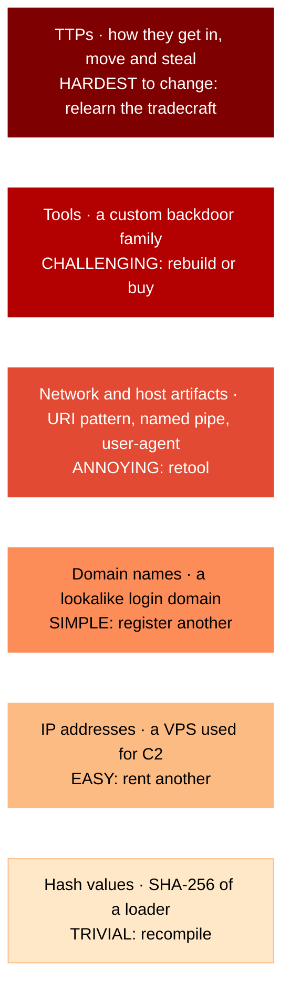
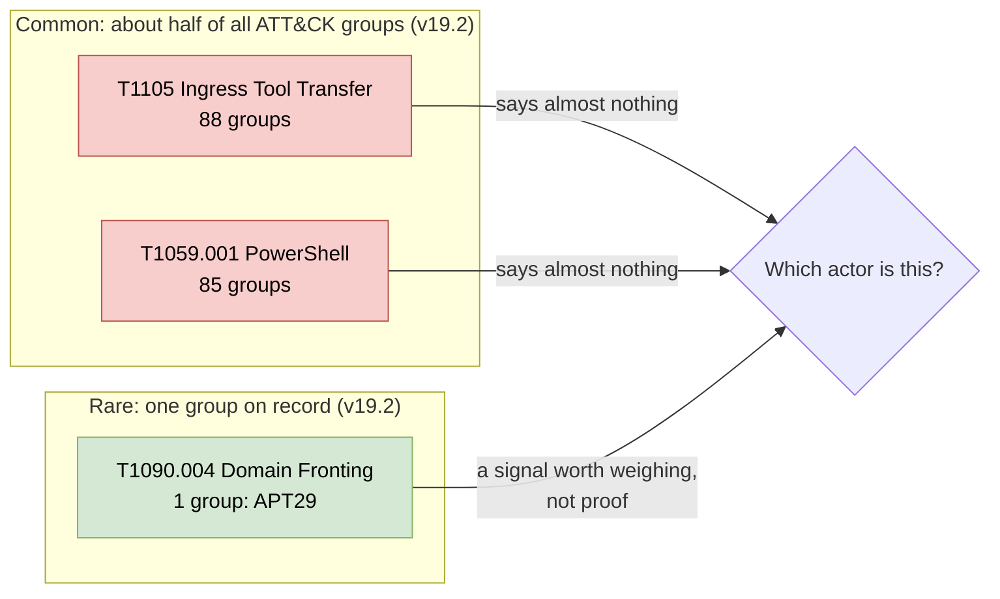
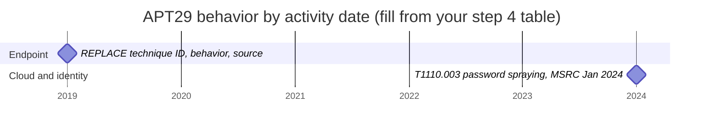

# Day 38: Tracking actors by what is distinctive about them

Phase: 3. Cyber Threat Intelligence · Track goal: Separate the techniques that tell one actor apart from the techniques every intruder uses, and show that difference on a heatmap.

## Concept
Analysts track an actor by watching for the parts of its behavior that are costly for it to change and uncommon among other actors. David Bianco's Pyramid of Pain (2013) orders indicators by how much it hurts an adversary when defenders detect them:

| Level (bottom to top) | Example | Cost to the adversary to change |
|---|---|---|
| Hash values | SHA-256 of a loader | Trivial: recompile |
| IP addresses | A VPS used for command and control | Easy: rent another |
| Domain names | A lookalike login domain | Simple: register another |
| Network and host artifacts | A distinctive URI pattern, a named pipe, a user-agent string | Annoying: retool |
| Tools | A custom backdoor family | Challenging: rebuild or buy |
| TTPs | How they get in, move and steal | Hardest: relearn the tradecraft |

The same six levels as a stack. Detection near the top costs the adversary the most; the bottom layers are what most IOC feeds contain:



Tracking means knowing which of these you are relying on. A cluster defined only by IPs from one report disappears when the actor rotates hosting.

The second idea is base rates. Behavior that most actors share tells you nothing about which actor you are looking at. In ATT&CK v19.2, 88 groups have a "uses" relationship to T1105 Ingress Tool Transfer and 85 to T1059.001 PowerShell. That is about half of all groups in the dataset for each technique. Seeing PowerShell in an intrusion does not point toward any particular actor. At the other end, only one group in ATT&CK has a recorded use of T1090.004 Domain Fronting, and that group is APT29.



ATT&CK coverage reflects what has been published and reviewed. It is not a census of what actors do. A technique that appears rare in ATT&CK may simply be under-reported, so treat these counts as a rough prior, not a measurement.

Actors also change. Reporting on APT29 before 2021 centers on phishing and custom malware on endpoints. Reporting from 2023 and 2024 centers on cloud identity: password spraying, OAuth applications and token abuse. A profile that does not record when each behavior was seen will keep matching an actor to tradecraft it gave up years ago.

## Resources
- [David Bianco, "The Pyramid of Pain"](https://detect-respond.blogspot.com/2013/03/the-pyramid-of-pain.html): the original post, still the clearest explanation.
- [ATT&CK Navigator](https://mitre-attack.github.io/attack-navigator/): layer operations ("Create Layer from other layers") do the comparison.
- [ATT&CK group pages for APT29 (G0016)](https://attack.mitre.org/groups/G0016/) and [APT28 (G0007)](https://attack.mitre.org/groups/G0007/): both have downloadable layers.
- [MITRE ATT&CK CTI training](https://attack.mitre.org/resources/learn-more-about-attack/training/cti/): the module on comparing layers covers the same workflow.

## Practical: jq and ATT&CK Navigator (a base-rate heatmap and a two-actor comparison)
Everything today is computed from MITRE's published dataset and group layers. Reuse `enterprise-attack.json` from Day 35.

### 1. Generate a base-rate layer for one actor
Save as `baserate.jq`:

```jq
# Usage: jq --arg g "APT29" -f baserate.jq enterprise-attack.json > layer.json
(.objects | map(select(.type=="attack-pattern")) | map({key: .id, value: .external_references[0].external_id}) | from_entries) as $tid
| ([.objects[] | select(.type=="intrusion-set" and .name==$g) | .id][0]) as $gid
| [.objects[] | select(.type=="relationship" and .relationship_type=="uses" and .revoked!=true
      and (.source_ref|startswith("intrusion-set")) and (.target_ref|startswith("attack-pattern")))
    | {g: .source_ref, t: $tid[.target_ref]}] | unique as $uses
| ($uses | group_by(.t) | map({key: .[0].t, value: length}) | from_entries) as $freq
| ($uses | map(select(.g==$gid) | .t) | unique) as $mine
| {
    name: "\($g): how many ATT&CK groups share each technique",
    versions: {layer: "4.5", attack: "19", navigator: "5.3.2"},
    domain: "enterprise-attack",
    description: "Score = number of groups in ATT&CK with a uses relationship to the technique. Low = more distinctive.",
    techniques: [ $mine[] | {techniqueID: ., score: $freq[.], comment: "\($freq[.]) groups use this"} ],
    gradient: {colors: ["#1a9850", "#fee08b", "#d73027"], minValue: 1, maxValue: 60}
  }
```
```bash
mkdir -p ~/cti-lab/day38 && cd ~/cti-lab/day38
jq --arg g "APT29" -f baserate.jq ../day35/enterprise-attack.json > apt29-baserate.json
jq -r '.techniques | sort_by(.score) | .[0:6][] | "\(.score)\t\(.techniqueID)"' apt29-baserate.json
```
Output observed on v19.2 (the six rarest APT29 techniques, each recorded for only one group):
```
1   T1027.006
1   T1090.004
1   T1098.005
1   T1556.007
1   T1649
1   T1685.002
```
Look each one up by name (HTML Smuggling, Domain Fronting, Device Registration, Hybrid Identity, Steal or Forge Authentication Certificates, Disable or Modify Cloud Log). Most are identity and cloud techniques, which matches the change in APT29 reporting since 2021.

Load the layer in Navigator. Green cells are distinctive and red cells are common. This is your base-rate heatmap.

### 2. Compare two actors with a layer expression
Download the two group layers:
```bash
curl -sL https://attack.mitre.org/groups/G0016/G0016-enterprise-layer.json -o G0016.json
curl -sL https://attack.mitre.org/groups/G0007/G0007-enterprise-layer.json -o G0007.json
```
Open both in Navigator (APT29 becomes `a`, APT28 becomes `b`), then "Create New Layer", then "Create Layer from other layers", with the expression:
```
a + 2*b
```
Score 1 means only APT29, 2 means only APT28, 3 means both. Count the overlap yourself without Navigator:

```bash
jq -r '.techniques[] | select(.score==1) | .techniqueID' G0016.json | sort -u > a.txt
jq -r '.techniques[] | select(.score==1) | .techniqueID' G0007.json | sort -u > b.txt
comm -12 a.txt b.txt | wc -l
```
The two numbers you can get here are different, and the reason matters. Group layers also include techniques from campaigns attributed to the group (the red and purple cells in MITRE's legend). When checked on v19.2, the downloaded layers overlapped on 47 techniques, but counting only direct group-to-technique relationships in the dataset gave 29. Write down which definition you used whenever you quote an overlap figure.

### 3. Annotate the overlap
For each technique scoring 3 (shared), look up its base rate from step 1. Build a short table:

| Technique | Shared by APT29 and APT28 | Groups in ATT&CK using it | Distinguishes the two? |
|---|---|---|---|
| T1059.001 PowerShell | yes | 85 | no |
| (fill in) | | | |

Then answer in two or three sentences: if an incident showed only the shared techniques, what could you say about which of the two groups was involved? (The honest answer is "nothing".)

### 4. Build a behavior-change timeline
Using the three seed reports from Day 37 plus any older APT29 report you can find on the ATT&CK group page references, list dated observations:

| Activity date | Behavior (ATT&CK ID) | Source | Pyramid level |
|---|---|---|---|
| 2024-01 | Password spraying against a legacy tenant (T1110.003) | MSRC, Jan 2024 | TTP |

Aim for at least eight rows across at least four years. Plot them on a simple timeline (a spreadsheet chart or a hand-drawn line is fine) with endpoint techniques above the line and cloud or identity techniques below it.

If you would rather keep the timeline as text next to your table, this Mermaid gantt template gives you the two lanes. Paste it into [mermaid.live](https://mermaid.live/) to edit and preview, or into any Markdown file on GitHub. Only the 2024-01 row comes from a named source. The endpoint row is a placeholder: replace it, and add one `milestone` line per row of your table, in the lane that matches the technique. When a source gives only a month, use that month.



With all eight rows in, look for the point where rows stop appearing in one lane and start appearing in the other. The last dated row in a lane that goes quiet is the end of the date range the checkpoint asks for.

### What you have when you finish
- `apt29-baserate.json` and its SVG export: a heatmap shading every APT29 technique by how common it is across ATT&CK groups.
- A comparison layer (APT29 vs APT28, `a + 2*b`) with a legend.
- An overlap table with base rates and a two-sentence conclusion.
- A dated timeline of at least eight APT29 behaviors, labeled by Pyramid of Pain level.

## Checkpoint
- Name three techniques from your base-rate heatmap that you would never cite as evidence that APT29 was involved, and give the group count for each.
- Name one technique you would treat as a meaningful (not conclusive) signal, and say what else you would need to see before raising your confidence.
- Your timeline shows at least one behavior that appears in older reporting and not in recent reporting. State the date range in which it was reported.
- Everything in your artifacts traces back to MITRE's dataset or a named public report.
