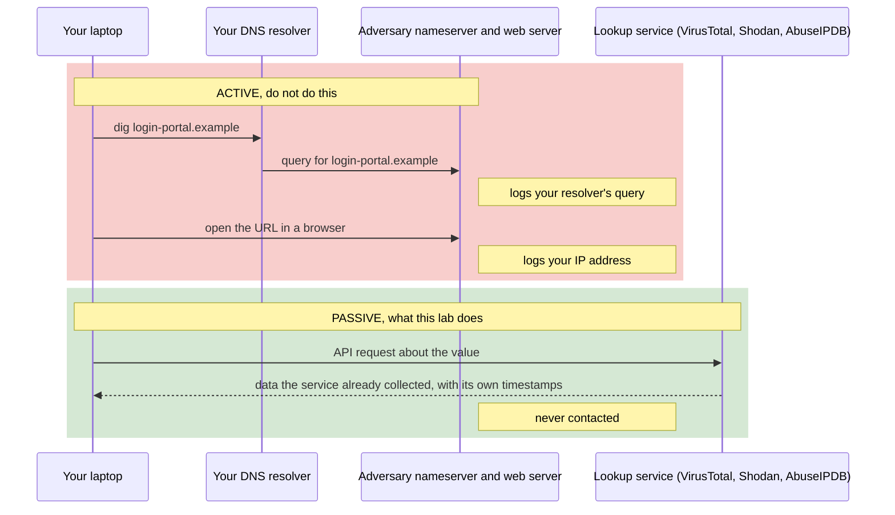
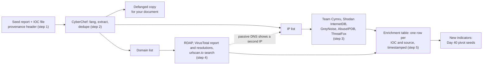

# Day 39: Collecting and enriching IOCs without touching the adversary

Phase: 3. Cyber Threat Intelligence · Track goal: Take the raw indicator list from a published report and turn it into an enrichment table where every value has a source and a timestamp, collected only through passive, third-party lookups.

## Concept
An indicator of compromise (IOC) is an observable left by malicious activity: a file hash, an IP address, a domain, a URL, an email address, a registry key. By themselves, IOCs are the bottom of the Pyramid of Pain from Day 38. They are cheap for an adversary to change and they go stale quickly. Their value to an investigator comes from enrichment (what else is known about this value?) and from pivoting (what else shares a property with it?), which is Day 40.

Three rules govern enrichment work.

Stay passive. Resolving a malicious domain with `dig`, loading its URL in a browser, or pinging its IP sends traffic from your network to infrastructure the adversary may watch. Their nameserver sees your resolver's query and their web server logs your IP. Use services that have already collected the data: passive DNS, internet scan databases, reputation feeds and public scan archives. If you need a live view, it happens in an authorized sandbox under an employer's process. It does not happen from your laptop.

The difference between the two approaches, traced request by request:



Timestamp everything. An IP that hosted a phishing kit in March may belong to a dental clinic's website by September. Every enrichment value needs the time you retrieved it and, where the source provides it, the time the source observed it.

Keep IOCs defanged in documents. Write `hxxps://login-portal[.]example/` and `203.0.113[.]7` so nobody clicks them and so mail filters do not quarantine your report. Refang only inside tools that need the real value.

The documentation address ranges (192.0.2.0/24, 198.51.100.0/24, 203.0.113.0/24) and the `.example` domain used below are reserved for examples. Your real values come from the seed report.

## Resources
- [ESET malware-ioc](https://github.com/eset/malware-ioc), [Unit 42 timely threat intel](https://github.com/PaloAltoNetworks/Unit42-timely-threat-intel) and [Volexity threat-intel](https://github.com/volexity/threat-intel): IOC files published alongside real vendor reports. Pick your seed here.
- [CyberChef](https://gchq.github.io/CyberChef/): extraction, defanging and refanging in the browser.
- [VirusTotal API docs](https://docs.virustotal.com/reference/public-vs-premium-api): the free public API is rate limited and for non-commercial use.
- [AbuseIPDB API](https://docs.abuseipdb.com/), [GreyNoise docs](https://docs.greynoise.io/) and [Shodan InternetDB](https://internetdb.shodan.io/): free IP context.
- [abuse.ch authentication portal](https://auth.abuse.ch/): ThreatFox, URLhaus and MalwareBazaar now reject API calls without an `Auth-Key`. Get a free key here.
- [urlscan.io search docs](https://urlscan.io/docs/search/): search existing public scans. Searching does not scan anything.
- [iocextract](https://github.com/InQuest/iocextract): a Python library for pulling defanged IOCs out of report text.

## Practical: CyberChef, curl and jq (an IOC enrichment table)
The whole lab in one picture. The two enrichment boxes are third-party services, and the dotted edge is how one enrichment turns up the next indicator:



### 1. Choose the seed and record provenance
Choose one IOC file from ESET, Unit 42 or Volexity that belongs to a report published in the last 12 months, and read the matching blog post. At the top of your notes, record:

```
Seed report: <title>, <vendor>, <publication date>, <URL>
IOC file:    <repo path and commit hash>
Retrieved:   2026-09-30T14:05Z
```
If the report does not state when the indicators were active, write "activity dates not stated" and treat every IOC as possibly stale.

### 2. Extract and normalize with CyberChef
Paste the report's IOC section (or the raw file) into CyberChef and build this recipe:

1. `Fang URL` (turns `hxxp` and `[.]` back into real values for processing)
2. `Extract domains`, then separately `Extract IP addresses`, `Extract URLs` and `Extract hashes`, with "Display total" and "Unique" enabled
3. Save each list, then run `Defang URL` or `Defang IP Addresses` on the copy that goes into your document

Deduplicate and sort each list in the shell:
```bash
mkdir -p ~/cti-lab/day39 && cd ~/cti-lab/day39
sort -u domains.txt -o domains.txt; sort -u ips.txt -o ips.txt
wc -l domains.txt ips.txt
```
Pick 10 indicators to enrich, with at least 3 IPs and 3 domains.

### 3. Enrich IPs
Put API keys in environment variables, not in scripts you will share.

```bash
IP=203.0.113.7   # replace with a real IP from your seed

# Routing and ownership (Team Cymru, no key)
whois -h whois.cymru.com " -v $IP"

# Open ports and hostnames Shodan has seen (no key)
curl -s https://internetdb.shodan.io/$IP | jq .

# Is this IP mass-scanning the internet, or a known benign service? (key optional)
curl -s https://api.greynoise.io/v3/community/$IP | jq .

# Community abuse reports over the last 90 days
curl -sG https://api.abuseipdb.com/api/v2/check \
  --data-urlencode "ipAddress=$IP" -d maxAgeInDays=90 \
  -H "Key: $ABUSEIPDB_KEY" -H "Accept: application/json" \
  | jq '.data | {abuseConfidenceScore, countryCode, isp, usageType, totalReports, lastReportedAt}'

# Has abuse.ch tracked it as malware infrastructure?
curl -s -X POST https://threatfox-api.abuse.ch/api/v1/ \
  -H "Auth-Key: $ABUSECH_KEY" \
  -d "{\"query\":\"search_ioc\",\"search_term\":\"$IP\"}" \
  | jq '.data[]? | {ioc, threat_type, malware_printable, first_seen, last_seen, confidence_level}'
```
Sample output (illustrative, not a real lookup):
```
AS      | IP           | BGP Prefix      | CC | Registry | Allocated  | AS Name
64500   | 203.0.113.7  | 203.0.113.0/24  | NL | ripencc  | 2019-04-02 | EXAMPLE-VPS-HOSTING, NL

{"cpes":[],"hostnames":[],"ip":"203.0.113.7","ports":[22,443,8443],"tags":["self-signed"],"vulns":[]}
```
Read the output as context, not as a verdict. A GreyNoise result of `"noise": false` means the IP was not seen mass-scanning. It says nothing about whether the IP ran command and control.

### 4. Enrich domains
```bash
D=login-portal.example   # replace with a real domain from your seed

# Registration data via RDAP (replaces most WHOIS use)
curl -sL https://rdap.org/domain/$D | jq '{handle, events: [.events[] | {eventAction, eventDate}], nameservers: [.nameservers[]?.ldhName]}'

# VirusTotal domain report and passive DNS resolutions (free key)
curl -s -H "x-apikey: $VT_API_KEY" https://www.virustotal.com/api/v3/domains/$D \
  | jq '.data.attributes | {creation_date, registrar, last_analysis_stats, categories}'
curl -s -H "x-apikey: $VT_API_KEY" "https://www.virustotal.com/api/v3/domains/$D/resolutions?limit=10" \
  | jq -r '.data[].attributes | "\(.date | todate)\t\(.ip_address)"'

# Past public scans on urlscan.io (search only; no key needed for light use)
curl -s "https://urlscan.io/api/v1/search/?q=page.domain:$D&size=10" \
  | jq -r '.results[] | "\(.task.time)\t\(.page.ip)\t\(.page.asnname)\t\(.page.title)"'
```
The VirusTotal `resolutions` call is passive DNS: a history of which IPs the domain pointed to and when, collected by VirusTotal. It is the safe replacement for running `dig` yourself.

Sample output (illustrative):
```
2026-06-14T09:12:40Z   198.51.100.23
2026-07-02T17:45:03Z   203.0.113.7
```
A domain that moved from 198.51.100.23 to 203.0.113.7 gives you a second IP to enrich and a date on which the actor (or a new owner) changed hosting.

### 5. Build the enrichment table
One row per indicator and source pair:

| IOC (defanged) | Type | In seed report as | Source queried | Field | Value | Source's observation time | Retrieved (UTC) | Notes |
|---|---|---|---|---|---|---|---|---|
| 203.0.113[.]7 | ipv4 | C2 server | Team Cymru | ASN / org | AS64500 EXAMPLE-VPS-HOSTING | n/a | 2026-09-30T14:10Z | VPS provider, not a residential ISP |
| 203.0.113[.]7 | ipv4 | C2 server | VT resolutions | domain seen | login-portal[.]example | 2026-07-02 | 2026-09-30T14:12Z | Links IP to domain D |
| login-portal[.]example | domain | phishing page | RDAP | registration | 2026-06-12 | n/a | 2026-09-30T14:15Z | Registered 2 days before first resolution |

Add a final column, "Still useful for detection?", with yes, no or unknown, and one line of reasoning. A shared-hosting IP with hundreds of benign domains on it is a "no" even if the report listed it.

### What you have when you finish
- A provenance header naming the seed report, IOC file commit and retrieval time.
- An enrichment table with at least 10 indicators and at least 30 rows, every row timestamped and sourced.
- A short list of new indicators that enrichment surfaced (such as the second IP above). These are tomorrow's pivot seeds.

## Checkpoint
- No command in your notes contacts an indicator directly. Search your shell history for `dig`, `ping` and `nslookup` on indicator values, and for any `curl` whose target host is the indicator itself rather than a lookup service.
- Every IOC written in your document is defanged.
- At least one row is marked "not useful for detection", with the reason.
- For one IP, you can say in a sentence what GreyNoise's answer means and what it does not mean.
