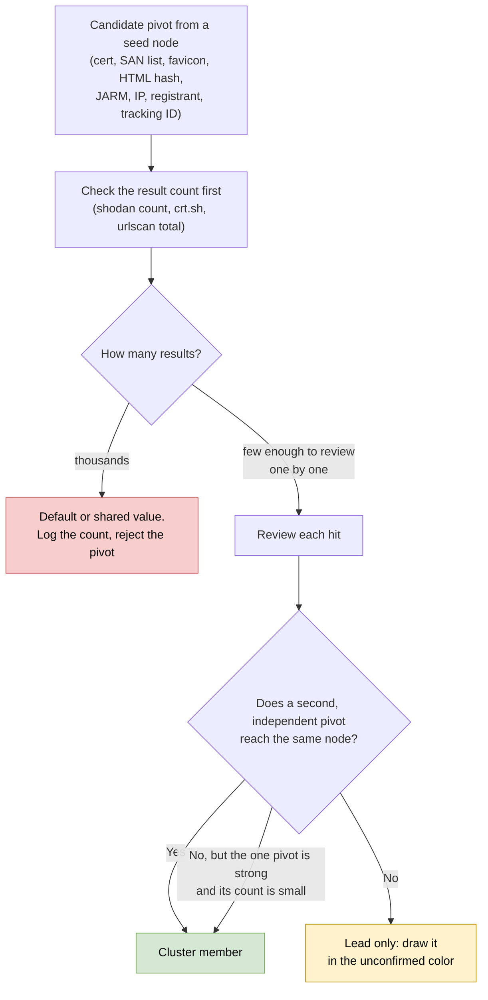
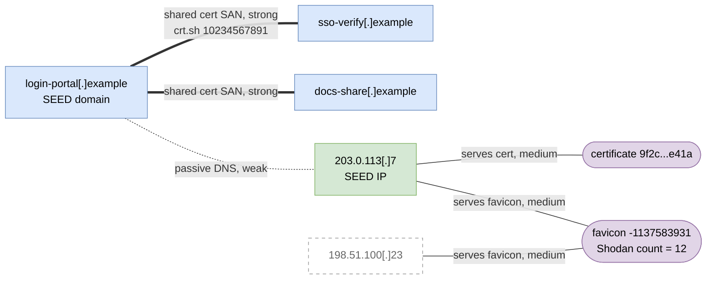

# Day 40: Pivoting threat infrastructure into a graph

Phase: 3. Cyber Threat Intelligence · Track goal: Expand one published indicator into a map of related infrastructure, where every edge names the pivot that produced it and weak links are visibly weak.

## Concept
Attackers reuse infrastructure because building fresh servers, certificates and phishing kits for every campaign costs time and money. That reuse is what lets an analyst start from one indicator in a report and find related infrastructure the report did not list, sometimes before it is used.

A pivot is a property two pieces of infrastructure share. Pivots differ widely in how much they prove:

| Pivot | Where you query it | Strength | Main false-positive source |
|---|---|---|---|
| Same TLS certificate (SHA-256 fingerprint) | crt.sh, Shodan `ssl.cert.fingerprint`, Censys | Strong when the cert is self-signed or lists unusual SANs | Shared CDN or hosting certificates |
| Shared SAN list or subject pattern on a certificate | crt.sh | Strong | Multi-tenant certificates from hosting providers |
| Same favicon hash | Shodan `http.favicon.hash`, Censys, urlscan `hash:` | Strong if the icon is custom and the result count is small | Default icons (nginx, Apache, cPanel, router login pages) |
| Same HTML body hash or page title | Shodan `http.html_hash`, `http.title`; urlscan `page.title` | Medium to strong | Parked pages, default server pages, kit templates used by many unrelated operators |
| Same JARM TLS fingerprint | Shodan `ssl.jarm` | Weak alone | Every server running the same TLS stack and configuration |
| Same IP (passive DNS) | VirusTotal resolutions, urlscan `page.ip` | Weak alone | Shared hosting, CDNs, sinkholes |
| Same registrant email or name | RDAP, historical WHOIS | Strong when present, rare since privacy redaction | Privacy-proxy placeholders |
| Same analytics or tracking ID | urlscan page content, historical page captures | Strong | Copied templates |

A single pivot is a lead. A cluster becomes a finding when several independent pivots converge on the same nodes. "Independent" matters: a certificate and an IP from the same passive DNS record are one observation seen twice.

Result counts tell you how much a pivot is worth. A favicon hash that returns 14 hosts is worth reviewing one by one. One that returns 40,000 is a default icon, and a graph built on it would connect you to half the internet.

Every pivot you try goes through the same test before it earns an edge:



## Resources
- [crt.sh](https://crt.sh/): certificate transparency search, with JSON output.
- [Shodan search filters](https://www.shodan.io/search/filters): the full filter reference. Several filters used here need at least a paid membership, and API searches spend query credits.
- [Censys Query Language](https://docs.censys.com/docs/censys-query-language): field syntax for the current Censys Platform, which replaced the older search syntax you will see in blog posts.
- [urlscan.io search docs](https://urlscan.io/docs/search/): fields for searching existing public scans.
- [Gephi](https://gephi.org/): free graph tool used for the artifact. [Maltego CE](https://www.maltego.com/pricing/) is the alternative if you already have it from Day 22.
- Seed reports with published infrastructure: the IOC repositories from Day 39 ([ESET](https://github.com/eset/malware-ioc), [Unit 42](https://github.com/PaloAltoNetworks/Unit42-timely-threat-intel), [Volexity](https://github.com/volexity/threat-intel)).

## Practical: crt.sh, Shodan, urlscan.io and Gephi (an infrastructure pivot graph with labeled edges)
Start from one domain and one IP from your Day 39 seed report. Every lookup below goes to a third-party dataset. Do not request anything from the seed infrastructure, not even its favicon.

### 1. Certificate transparency (crt.sh)
Certificate transparency logs record every certificate a public CA issues, so an actor who gets certificates for a batch of domains leaves a public trail.

```bash
mkdir -p ~/cti-lab/day40 && cd ~/cti-lab/day40
D=login-portal.example   # your seed domain

# Every certificate that names the domain or its subdomains (%25 is a URL-encoded %)
curl -s "https://crt.sh/?q=%25.$D&output=json" > crt-$D.json
jq -r '.[] | [.id, .not_before, .issuer_name, .common_name, (.name_value | gsub("\n"; ","))] | @tsv' crt-$D.json | sort -u -k5
```
Sample output (illustrative):
```
10234567891  2026-06-12T00:00:00  C=US, O=Let's Encrypt, CN=R11  login-portal.example  login-portal.example,sso-verify.example,docs-share.example
```
A certificate whose SAN list names your seed domain alongside `sso-verify.example` and `docs-share.example` is a strong pivot. One certificate request covered all three names. Add both as nodes, with an edge labeled `shared cert SAN (crt.sh id 10234567891)`.

crt.sh also accepts `%` inside a name, for example `?q=%25sso-verify%25&output=json`, to find other domains with the same naming pattern. Broad patterns are slow and often time out. A match on a naming pattern alone is a weak lead. Mark any such edge `name pattern` and do not count it toward convergence.

crt.sh is a free community service and is often overloaded. If you get an HTML error page instead of JSON, wait and retry rather than hammering it.

### 2. Scan data (Shodan)
Look at what Shodan already recorded for the seed IP. This reads Shodan's database and does not scan anything:

```bash
IP=203.0.113.7
curl -s "https://api.shodan.io/shodan/host/$IP?key=$SHODAN_API_KEY" \
  | jq -r '.data[] | [.port, (.http.favicon.hash // "-"), (.http.title // "-"), (.ssl.cert.fingerprint.sha256 // "-"), (.ssl.jarm // "-")] | @tsv'
```
Sample output (illustrative):
```
443   -1137583931   Sign in to your account   9f2c...e41a   2ad2ad16d2ad2ad22c42d42d00000069...
```
Each non-empty column is a pivot you can search. Always run `count` before `search`, so you see how big a result set is before you pay for it:

```bash
shodan count 'http.favicon.hash:-1137583931'
shodan count 'ssl.cert.fingerprint:9f2c...e41a'
shodan search --fields ip_str,port,hostnames,http.title 'http.favicon.hash:-1137583931'
```
If the favicon hash returns 12 hosts, review all 12. If it returns 30,000, it is a default or widely cloned icon. Record the count on your notes and stop.

If Shodan has no favicon hash but a urlscan.io scan captured the page, you can compute the hash from urlscan's stored copy of the file, so you never fetch it from the live server. Shodan's hash is MurmurHash3 over the base64 encoding of the icon, with line breaks every 76 characters:

```python
import base64, mmh3
data = open("favicon.ico", "rb").read()   # the file saved from the urlscan result, not the live site
print(mmh3.hash(base64.encodebytes(data)))
```
Censys indexes MD5 and SHA-256 favicon hashes instead of the Shodan-style integer. In Censys Platform syntax:
```
host.services.endpoints.http.favicons.hash_md5 = "<md5 of the icon>"
host.services.cert.fingerprint_sha256 = "<sha256 of the certificate>"
```

### 3. Page and resource pivots (urlscan.io)
urlscan.io keeps public scans that other people already submitted. Search them. Do not submit your seed URL for a new scan: that sends urlscan's scanner to the adversary's server and publishes your interest.

```bash
# Other public scans that loaded pages from the same IP
curl -s "https://urlscan.io/api/v1/search/?q=page.ip:%22$IP%22&size=50" \
  | jq -r '.results[] | "\(.task.time)\t\(.page.domain)\t\(.page.title)"' | sort -u -k2

# Pages that loaded an identical resource (a kit's JavaScript file, a logo), by the resource's SHA-256
curl -s "https://urlscan.io/api/v1/search/?q=hash:<sha256-of-resource>&size=50" \
  | jq -r '.results[] | "\(.task.time)\t\(.page.domain)\t\(.page.ip)"'
```
Get resource hashes from the "HTTP transactions" list on a urlscan result page for one of your seed domains. Pick a file specific to the kit, such as a custom script or logo. Common libraries (jQuery, Bootstrap) match millions of unrelated sites.

There is one hash you should recognize on sight: `e3b0c44298fc1c149afbf4c8996fb92427ae41e4649b934ca495991b7852b855` is the SHA-256 of an empty file. Searching it on urlscan returns thousands of unrelated sites. An edge built on it is always false.

### 4. Build the node and edge tables
`nodes.csv`:
```csv
Id,Label,Type
login-portal.example,login-portal[.]example,domain
sso-verify.example,sso-verify[.]example,domain
docs-share.example,docs-share[.]example,domain
203.0.113.7,203.0.113[.]7,ip
198.51.100.23,198.51.100[.]23,ip
cert-9f2c,cert 9f2c...e41a,certificate
fav--1137583931,favicon -1137583931,favicon
```
`edges.csv` (in Gephi, the `Type` column means directed or undirected, so the pivot name goes in `Label`):
```csv
Source,Target,Type,Label,Strength,Evidence,Retrieved
login-portal.example,sso-verify.example,Undirected,shared cert SAN,strong,crt.sh id 10234567891,2026-09-30T15:02Z
login-portal.example,203.0.113.7,Undirected,passive DNS,weak,VT resolutions 2026-07-02,2026-09-30T14:12Z
203.0.113.7,cert-9f2c,Undirected,serves cert,medium,Shodan host 443/tcp,2026-09-30T15:10Z
203.0.113.7,fav--1137583931,Undirected,serves favicon,medium,Shodan host 443/tcp (count=12),2026-09-30T15:11Z
198.51.100.23,fav--1137583931,Undirected,serves favicon,medium,Shodan favicon search,2026-09-30T15:14Z
```
Treat the certificate and the favicon as nodes rather than edges. That way the graph shows the shared property as a hub, and you can see at a glance how many hosts hang off it.

This is what those two tables describe, drawn before you open Gephi. Thick lines are strong pivots, thin lines medium, dotted lines weak. The second SAN edge (to `docs-share`) is the one step 1 told you to add and the sample `edges.csv` leaves out:



`198.51.100.23` hangs off a single pivot, the favicon, which `edges.csv` grades medium. Under the checkpoint rule it stays in the unconfirmed style until a second independent pivot reaches it. Day 43 gives it a lower STIX confidence for the same reason.

### 5. Lay it out in Gephi
1. File, then Import spreadsheet: load `nodes.csv` as a nodes table, then `edges.csv` as an edges table, appending to the same workspace.
2. Layout: ForceAtlas 2 with "Prevent Overlap" on.
3. Appearance: color nodes by the `Type` partition. Set edge color or thickness from `Strength`.
4. Turn on edge labels (the `Label` column) in the preview settings, then export PNG or SVG.

### 6. Map infrastructure behavior to ATT&CK
Add a small Navigator layer for what your graph shows about how the actor acquired infrastructure. For example: T1583.001 Domains (registered domains), T1583.003 Virtual Private Server, T1588.004 Digital Certificates (obtained from a CA) or T1587.003 (self-signed), and T1608.003 Install Digital Certificate. Put the graph evidence in each technique's comment. Only mark a technique your graph supports.

### What you have when you finish
- A Gephi graph export with at least 8 nodes, grown from one seed, with node types colored and every edge labeled with its pivot and strength.
- `nodes.csv` and `edges.csv`, with evidence and retrieval time on every edge.
- A pivot log listing each search you ran, its result count, and whether you used it or rejected it (and why).
- A small ATT&CK layer for Resource Development techniques backed by the graph.

## Checkpoint
- Every edge names a specific pivot. An edge labeled "related" is not allowed.
- Any node you call part of the actor's cluster is connected by at least two independent pivots, or by one strong pivot with a small result count.
- Nodes that do not qualify are drawn in a separate "unconfirmed" color.
- Your pivot log includes at least one rejected pivot with its result count (a default favicon, a CDN IP, or the empty-file hash).
- Nothing in your shell history or browser history touched the seed infrastructure directly.
- Without notes, explain why you run `shodan count` before `shodan search` on a pivot.
