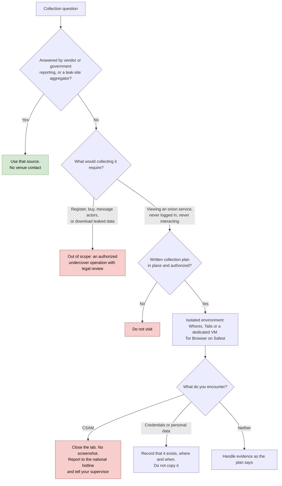

# Day 41: Dark web monitoring, what is realistic, and a safe Tor setup

Phase: 3. Cyber Threat Intelligence · Track goal: Know which dark web collection is feasible and lawful at your level, set up Tor Browser in a way that protects you, and write the collection plan that has to exist before anyone looks at a criminal venue.

## Concept
"Dark web" usually means services reachable only through an anonymity network, mostly Tor onion services. For threat intelligence the venues that matter are cybercrime forums, marketplaces, ransomware data leak sites, and increasingly Telegram channels and clearnet forums. Many criminal services now advertise on Telegram as well as on onion sites, so a Tor-only view of "the dark web" misses a lot.

Professional dark web monitoring depends mostly on access and archives. Commercial providers (Flashpoint, Intel 471, KELA, Recorded Future and others) keep vetted accounts on closed forums, archive posts over years, translate Russian and other languages, and let analysts search that archive without touching the venues. Getting into closed forums usually requires vouching, reputation or payment, and doing that as an individual means deception and possibly interacting with criminals. That is undercover work. It needs an employer's authorization, legal review and a documented operation plan, and it is outside this roadmap.

What a beginner can do without paid access, lawfully and safely:

| Activity | Feasible free? | Notes |
|---|---|---|
| Read vendor and government reporting that quotes forum and leak-site activity | Yes | Most of what you need, already translated and contextualized |
| Use public aggregators of ransomware leak-site postings (Day 42) | Yes | Someone else collects; you analyze patterns |
| Search onion services from the clearnet with Ahmia | Yes | Ahmia filters known abuse material; results are still unvetted |
| Visit an onion service in Tor Browser to confirm it exists, view only | Sometimes | Only with a written plan, never logged in, never interacting |
| Register on a criminal forum, buy access, message actors | No | Deception and possible offenses. Requires an authorized operation |
| Download leaked data from a leak site | No | You would be handling stolen personal data. Legal exposure in most jurisdictions |

Two hard stop rules apply in every jurisdiction. If you encounter child sexual abuse material, close the tab immediately. Do not screenshot, download or "document" it. Report the URL to the national hotline (NCMEC's CyberTipline in the US, Cybertip.ca in Canada, the IWF in the UK) and tell your supervisor. Second, if you see credentials or personal data belonging to identifiable people, do not copy them into your notes. Record that the data exists, where, and when you saw it.

The table and the two stop rules combine into one decision path. Most questions exit at the first diamond:



## Resources
- [Tor Browser download](https://www.torproject.org/download/) and [signature verification guide](https://support.torproject.org/tbb/how-to-verify-signature/): the only place to get the browser.
- [Whonix](https://www.whonix.org/): a two-VM setup (Gateway and Workstation) that forces all Workstation traffic through Tor.
- [Tails](https://tails.net/): a live USB operating system that routes everything through Tor and forgets the session on shutdown.
- [Ahmia](https://ahmia.fi/): clearnet search for onion services, with abuse filtering.
- CSAM reporting: [NCMEC CyberTipline](https://report.cybertip.org/) (US), [Cybertip.ca](https://www.cybertip.ca/) (Canada).

## Practical: Tor Browser in an isolated VM (a verified install log, a collection plan and a source-risk heatmap)
### 1. Build an isolated environment
Choose one:

- Whonix on VirtualBox or KVM. Take a snapshot of the Workstation right after first boot so you can roll back after every session.
- Tails on a dedicated USB stick. Nothing persists unless you configure persistent storage, which you should not do for this lab.
- At minimum, a dedicated VM used for nothing else, with shared folders and shared clipboard turned off.

Do not use your everyday browser profile or your work laptop's host OS.

### 2. Download and verify Tor Browser
Inside the VM (Whonix and Tails ship Tor Browser already; if you are on a plain VM, do this step there):

```bash
# Import the Tor Browser Developers signing key over WKD
gpg --auto-key-locate nodefault,wkd --locate-keys torbrowser@torproject.org

# Export it to a keyring file, identified by its full fingerprint
gpg --output ./tor.keyring --export 0xEF6E286DDA85EA2A4BA7DE684E2C6E8793298290

# Verify the package you downloaded against its .asc signature
gpgv --keyring ./tor.keyring tor-browser-linux-x86_64-<version>.tar.xz.asc tor-browser-linux-x86_64-<version>.tar.xz
```
The fingerprint above is the one the Tor Project published on its verification page when this was written. Compare it character by character with that page before you trust it. A good result contains `Good signature from "Tor Browser Developers (signing key) <torbrowser@torproject.org>"`. Paste the full `gpgv` output into your install log.

### 3. Configure the browser
- Open the shield icon, then Settings, and set Security Level to Safest. JavaScript is disabled on all sites and many media types are blocked.
- Leave the window at the size it opens with. Tor Browser adds letterboxing so your window size does not fingerprint you, and maximizing works against it.
- Install no add-ons, and do not log in to any personal account in this browser.
- Never open downloaded documents while the VM is online. PDFs and Office files can fetch remote resources and reveal your real IP outside Tor.

### 4. Practice verification on a benign onion service
Criminal onion sites are cloned constantly to phish researchers and buyers, so you need to know how to confirm an onion address belongs to who it claims.

1. In Tor Browser, open `https://www.torproject.org/`.
2. The address bar shows a ".onion available" button. It appears because the site sends an `Onion-Location` header. Click it.
3. Record the onion address it takes you to and the date.
4. Confirm the address a second way: find it published by the same organization on a page you reached independently.

Do the same with one news organization that publishes an onion service. Record both in your install log. Do not visit any criminal venue in this lab.

### 5. Write the collection plan
No one should open a criminal venue without a plan like this. Fill it in for a hypothetical task: "monitor public ransomware leak-site activity affecting the healthcare sector in your country."

```markdown
# Dark web collection plan
Requirement (what question are we answering?):
Authorized by / date:
Legal basis and jurisdiction notes:
Sources in scope (type, access method):
Sources explicitly out of scope:
Actions permitted: view-only | screenshot of non-personal content | ...
Actions prohibited: registering, messaging, purchasing, downloading leaked data
Environment: Whonix snapshot <id> / Tails; no personal accounts
Handling of personal data encountered:
Stop conditions and escalation (CSAM, threats to life, active intrusion):
Evidence handling: screenshots stored where, hashed how, retained how long:
Review date:
```
For this requirement the correct answer to "sources in scope" is mostly the aggregators you will use tomorrow. Write down why that is the better choice than visiting leak sites yourself.

### 6. Build the source-risk heatmap
In a spreadsheet, rate each source type from 1 (low) to 5 (high) on four columns, then apply a color scale:

| Source type | Legal risk | OPSEC risk | Access cost | Value to a beginner |
|---|---|---|---|---|
| Vendor and government reports | 1 | 1 | 1 | 4 |
| Leak-site aggregators (ransomware.live, RansomLook) | 1 | 1 | 1 | 4 |
| Ransomware leak sites directly (view only) | | | | |
| Open cybercrime forums (view only, no account) | | | | |
| Closed or vetted forums | | | | |
| Telegram channels | | | | |
| Markets | | | | |

Fill the empty rows and give one sentence of reasoning per rating.

### What you have when you finish
- An install log: VM or Tails details, the full `gpgv` output, Security Level setting, and two verified onion addresses with dates and the second source that confirmed each.
- A completed collection plan for the healthcare leak-site requirement.
- A color-scaled source-risk heatmap with reasoning for every cell.

## Checkpoint
- Your install log names the environment you used (Whonix, Tails or a dedicated VM) with its details.
- Your install log contains the full `gpgv` output, including the `Good signature from` line.
- Your install log records the Security Level setting.
- Your install log records two onion addresses, each with a date and the second source that confirmed it.
- Your collection plan names at least three prohibited actions.
- Your collection plan names at least two stop conditions.
- One of those stop conditions is the CSAM rule.
- Your heatmap's reasoning for closed or vetted forums explains why that access is out of reach for this roadmap in terms of legality.
- The same reasoning also explains it in terms of deception.
- You visited no criminal venue.
- Without notes, say how you confirm that an onion address belongs to the organization that claims it.
