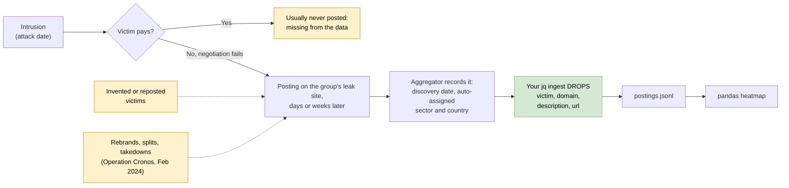

# Day 42: Measuring ransomware leak-site activity without collecting victims

Phase: 3. Cyber Threat Intelligence · Track goal: Analyze dark web leak-site activity safely through a public aggregator, and produce a heatmap that shows group and sector trends while keeping victim names out of your work.

## Concept
Most ransomware groups run a data leak site, usually an onion service, where they post organizations that refused to pay and threaten to publish stolen data. Several public projects watch these sites and record each new posting: the group, the claimed victim, the date the posting appeared and often a sector and country. For an analyst without vetted access, this aggregated data is the most practical dark web dataset available. Someone else has already done the risky collection.

Treat every posting as a claim by a criminal group. Several things distort the data:

- Groups post organizations they never breached, or repost victims taken from other groups' leaks, to look bigger. ransomware.live flags some groups for this. One entry in its group list reads "The group appears unreliable. Most, if not all, of its alleged victims cannot be verified and appear to be randomly selected organizations."
- Groups rebrand and split. A drop in one group's postings followed by a rise in a new name may be the same operators.
- Law enforcement disrupts leak sites. When the UK National Crime Agency and partners took over LockBit's leak site in Operation Cronos (February 2024), postings under that name stopped and later resumed on new infrastructure.
- The posting date is not the attack date. Victims typically appear days or weeks after the intrusion, and usually only if negotiation fails, so organizations that paid are mostly missing.
- Sector and country are assigned by the aggregator, often automatically, and are sometimes wrong or empty.

Where each of those distortions enters the pipeline that ends in your heatmap:



The people in this dataset are victims. You can study groups, sectors, regions and timing without writing down a single victim name, and you should. Nothing in today's lab needs one.

## Resources
- [ransomware.live](https://www.ransomware.live/) and its [API](https://api.ransomware.live/): a public tracker of leak-site postings. The API is rate limited. Read its usage terms before scripting against it, and cache what you download.
- [RansomLook](https://www.ransomlook.io/): an open-source tracker you can use to cross-check counts.
- [NCA announcement of Operation Cronos](https://www.nationalcrimeagency.gov.uk/the-nca-announces-the-disruption-of-lockbit-with-operation-cronos): the primary source for the February 2024 LockBit disruption.
- [CISA #StopRansomware advisories](https://www.cisa.gov/stopransomware/resources): government write-ups on specific groups, useful to put a heatmap spike into context.

## Practical: ransomware.live API, jq and pandas (a group-by-month leak-site heatmap with annotated caveats)
### 1. Choose groups and pull their postings
List the group names the aggregator uses:
```bash
mkdir -p ~/cti-lab/day42 && cd ~/cti-lab/day42
curl -s https://api.ransomware.live/v2/groups -o groups.json
jq -r '.[].name' groups.json | sort | head -50
```
Group names are the tracker's slugs, so one brand can appear several times (in September 2026 the list contained `lockbit`, `lockbit2`, `lockbit3`, `lockbit3_fs` and `lockbit5`). Pick three or four groups, including at least one LockBit slug so you can see the Operation Cronos effect.

Pull each group's history and drop the victim fields as you ingest it. The `victim`, `domain`, `description` and `url` fields never reach your disk:

```bash
for g in akira qilin play lockbit3; do
  curl -s "https://api.ransomware.live/v2/groupvictims/$g" \
  | jq -c --arg g "$g" '.[] | {group: $g, month: (.discovered[0:7]), attack_month: ((.attackdate // "")[0:7]), sector: (.activity // "Unknown"), country: (.country // "")}'
  sleep 5   # be polite; the API rate limits aggressive clients
done > postings.jsonl
wc -l postings.jsonl
head -2 postings.jsonl
```
Sample lines (the structure is real; your values will differ):
```
{"group":"akira","month":"2026-09","attack_month":"","sector":"Technology","country":""}
{"group":"qilin","month":"2026-09","attack_month":"2026-08","sector":"Manufacturing","country":"US"}
```

### 2. Build the heatmaps
Save as `heat.py`:
```python
import pandas as pd
import matplotlib
matplotlib.use("Agg")
import matplotlib.pyplot as plt

df = pd.read_json("postings.jsonl", lines=True)
df = df[df["month"] >= "2023-01"]

def heatmap(pivot, title, path, width=16):
    fig, ax = plt.subplots(figsize=(width, 0.6 * len(pivot.index) + 1.5))
    im = ax.imshow(pivot.values, aspect="auto", cmap="Reds")
    ax.set_yticks(range(len(pivot.index)), pivot.index)
    ax.set_xticks(range(len(pivot.columns)), pivot.columns, rotation=90)
    for (i, j), v in pd.DataFrame(pivot.values).stack().items():
        ax.text(j, i, int(v), ha="center", va="center", fontsize=6)
    fig.colorbar(im, ax=ax, label="postings")
    ax.set_title(title)
    fig.tight_layout()
    fig.savefig(path, dpi=150)

by_month = df.pivot_table(index="group", columns="month", values="sector", aggfunc="count", fill_value=0)
heatmap(by_month, "Leak-site postings per month by group (discovery date, source: ransomware.live)", "group-by-month.png")

top_sectors = df["sector"].value_counts().head(10).index
by_sector = df[df["sector"].isin(top_sectors)].pivot_table(index="sector", columns="group", values="month", aggfunc="count", fill_value=0)
heatmap(by_sector, "Postings by sector and group (aggregator-assigned sectors)", "sector-by-group.png", width=8)

print(by_month.iloc[:, -6:])
```
```bash
pip install pandas matplotlib
python heat.py
```
The printed table shows the last six months per group so you can sanity-check the image against numbers.

### 3. Annotate what the heatmap cannot tell you
Open `group-by-month.png` and mark it up (any image editor, or rebuild it in a spreadsheet with comments):

- Mark February 2024 on the LockBit row and describe what happened in the following months, citing the NCA announcement.
- Mark the month with the highest count for each group. Look for a public report from that period (a CISA advisory or a vendor blog) that explains the spike, such as a mass exploitation campaign. If you cannot find one, write "unexplained".
- For each group, calculate the share of postings with no attack date. A high share means the "month" axis reflects when the tracker noticed a posting, and nothing more:
  ```bash
  jq -rs 'group_by(.group)[] | "\(.[0].group)\t\(map(select(.attack_month=="")) | length)/\(length) postings without an attack date"' postings.jsonl
  ```

### 4. Cross-check one number
Pick one group and one month. Compare the count with RansomLook's figure for the same group and period. Record both numbers and the difference. Two trackers watching the same sites rarely agree exactly, because of reposts, deletions and different scraping times.

### What you have when you finish
- `group-by-month.png`: a heatmap of three or four groups over at least 24 months, annotated with the Cronos disruption and each group's peak month.
- `sector-by-group.png`: the top ten aggregator-assigned sectors against those groups.
- A caveats box on the same page listing the missing-attack-date shares, the cross-check result and at least three biases from the Concept section that apply to your chart.
- `postings.jsonl` that contains no victim names, domains or URLs.

## Checkpoint
- Run `grep -c victim postings.jsonl`. It should print 0.
- Your chart title or caption says "postings" or "claimed victims", never "attacks" or "breaches".
- You can explain in two sentences why a sector at the top of your chart is not necessarily the sector ransomware groups target most.
- Every annotation on the chart cites a public source or is marked as your own inference.
